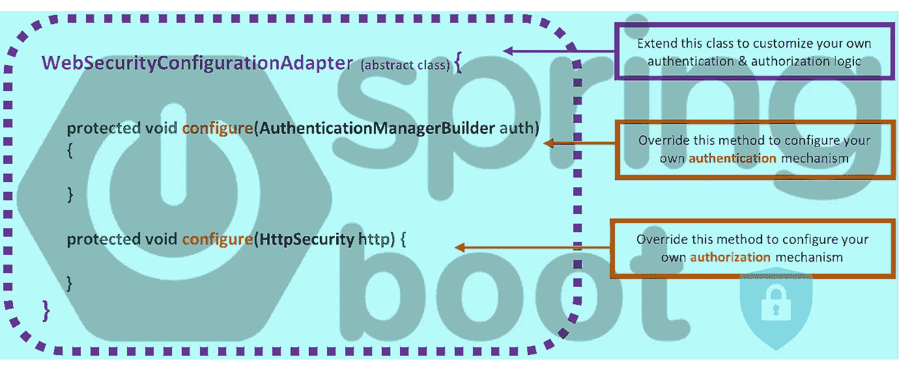
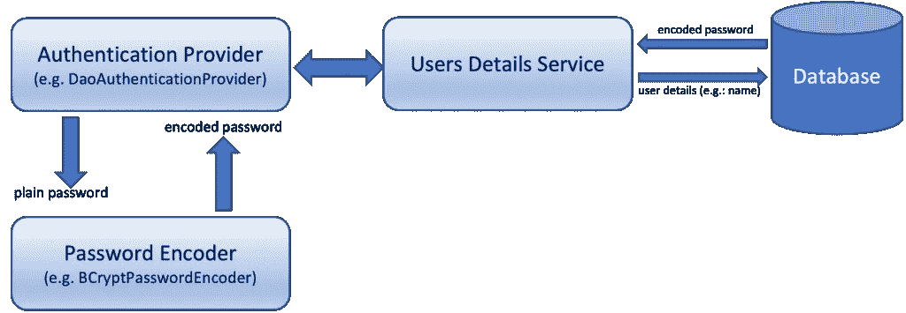
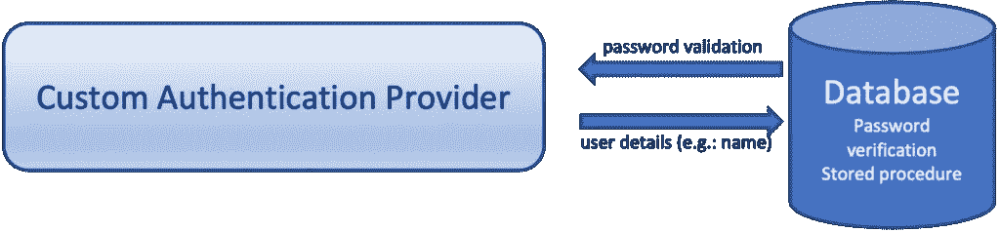
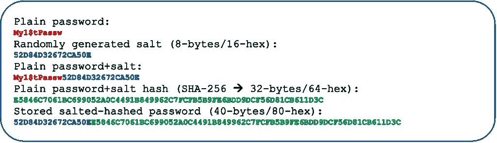

# Spring Boot 安全配置实用说明第 4 部分:通过存储过程进行密码验证的自定义身份验证提供程序

> 原文：<https://blog.devgenius.io/spring-boot-security-configuration-practically-explained-part4-custom-authentication-provider-7666bea0e13e?source=collection_archive---------0----------------------->



# 摘要

这是关于 Spring 安全定制的系列文章的第 4 篇，它基于著名的抽象类的实现。你可以在这篇文章的末尾找到以前的文章。

在这里，您将看到创建自己的自定义身份验证管理器是多么简单。实际上，我们将创建并使用一个**CustomAuthenticationManager**实现类，它将允许我们使用我们自己的数据库存储函数进行密码验证来对用户进行身份验证和授权(通过 HTTP 基本身份验证凭证)。

因此，您还将看到我们如何初始化我们的数据库，不仅使用一些演示表和数据(通过 **schema.sql** 和 **data.sql** ，而且我们如何定义和使用 SQL **块 separato** r，这允许我们将其他数据库对象，如**触发器**和**存储过程/函数**包含到 **schema.sql** 文件中。

# 介绍

Spring Boot 框架提供了许多现成的身份验证提供者的实现，在我前面提到的文章中，我们已经看到了其中的几个:DaoAuthenticationProvider 和 LDAPAuthenticationProvider。其他一些众所周知的实现还有[JwtAuthenticationProvider](https://docs.spring.io/spring-security/site/docs/6.0.0/api/org/springframework/security/oauth2/server/resource/authentication/JwtAuthenticationProvider.html)、[activedirectoryldaphauthenticationprovider](https://docs.spring.io/spring-security/site/docs/6.0.0/api/org/springframework/security/ldap/authentication/ad/ActiveDirectoryLdapAuthenticationProvider.html)和[oauth 2 loginauthenticationprovider](https://docs.spring.io/spring-security/site/docs/6.0.0/api/org/springframework/security/oauth2/client/authentication/OAuth2LoginAuthenticationProvider.html)提供程序。这些实现中的大多数也使用了一个 [UserDetailsService](https://docs.spring.io/spring-security/site/docs/6.0.0/api/org/springframework/security/core/userdetails/UserDetailsService.html) 实现，以及一个 [PasswordEncoder](https://docs.spring.io/spring-security/site/docs/current/api/org/springframework/security/crypto/password/PasswordEncoder.html) 实现。

在我之前提到的帖子中，我们使用了 UsersDetailsService 的类似实现，并且我们还依赖于 [BCryptPasswordEncoder](https://docs.spring.io/spring-security/site/docs/current/api/org/springframework/security/crypto/bcrypt/BCryptPasswordEncoder.html) 实现来进行 [bcrypt](https://en.wikipedia.org/wiki/Bcrypt) 密码编码和验证。

使用 **BCryptPasswordEncoder** 允许我们的 Spring Boot 应用程序获取用户提供的凭证(用户名和普通密码)(例如，通过 HTTP 基本认证),通过 **bcrypt** 算法对普通密码进行编码，最后将编码后的密码与存储在数据库层并由 UsersDetailsService 获取的密码进行比较。



当然，整个过程是通过正在使用的身份验证管理器进行的。

# 问题是

通常，对于 Spring Boot 框架提供的任何其他加盐和散列算法实现，逻辑保持不变，其中一些列举如下:

[pbk df 2 password encoder](https://docs.spring.io/spring-security/site/docs/current/api/org/springframework/security/crypto/password/Pbkdf2PasswordEncoder.html)
MD 4 password encoder
[argon 2 password encoder](https://docs.spring.io/spring-security/site/docs/current/api/org/springframework/security/crypto/argon2/Argon2PasswordEncoder.html)
[scryptpassword encoder](https://docs.spring.io/spring-security/site/docs/current/api/org/springframework/security/crypto/scrypt/SCryptPasswordEncoder.html)

这些实现被广泛使用，它们涵盖了大多数真实的案例。然而，有人可能不得不考虑的一个缺点是，编码和验证过程发生在后端应用程序(中间件)中，在我们的例子中是一个 Spring Boot 应用程序。

另一种选择是在数据库内部完成这项工作。所有主要的数据库都为我们提供了这种实现所必需的能力。通常，只需使用适当的数据库对象，如触发器和/或存储过程/函数。

这种方法被认为更安全，甚至更灵活。下面列出了一些人们认为有益的原因:

*   您可以实现任何您希望的算法和 salting 模式
*   两者，加盐的细节(例如，盐的长度，盐如何被添加到编码密码中，等等。)，以及正在使用的特定算法，都不会暴露在数据库之外。
*   您可以针对特定情况使用不同的模式
*   除了用户名之外，您还可以添加更多的用户数据来检查和检索用户
*   您可以更改正在使用的后端应用程序和/或框架

# 解决方案实施

我们要做的包括:

1.  准备我们的数据库并创建必要的数据库对象(密码触发和验证存储过程/函数)
2.  实现一个自定义的 AuthenticationProvider，并将其与我们的 WebSecurityConfigurerAdapter 自定义实现一起使用。



为了您的方便，作为编码和实现方法的起点，我们可以使用本系列文章的[第 2 部分:JDBC 认证](/spring-boot-security-configuration-practically-explained-part2-jdbc-authentication-6c0c7bd8d53e)中的最终存储库，因此您可以在这里找到并获取它[。](https://github.com/zzpzaf/restapidemo_mysql_jdbc-DaoAuthenticationProvider-Bean-with-custom-UserDetailsService_security)

简而言之，这个报告展示了一个带有受保护端点的 REST API 实现的示例代码，以及如何使用 DaoAuthenticationProvider 和 UsersDetailsService 通过基本身份验证来处理用户请求。

让我们开始研究它们吧。

## 1.使用数据库

我们将使用的基本概念是**加盐** & **密码** **散列**、**触发器**和**存储过程/函数**。作为我们的示例数据库，我们将使用 MariaDB/MySQL。然而，你可以使用任何主要的数据库，参考我在我的以下帖子中提供的所有相关信息:

*   [所有数据库的 Salts 和 UUIDs】(介绍性)](https://medium.com/@zzpzaf.se/salts-and-uuids-for-your-databases-intro-41cc58fe100a)
*   [Maria db/MySQL 数据库的 Salts 和 UUIDs】](/salts-and-uuids-for-your-mariadb-mysql-databases-470dbcf23a5)
*   [您的 Oracle 数据库的 Salts 和 UUIDs】](/salts-and-uuids-for-your-oracle-database-990af1e361a1)
*   [MS SQL Server 数据库的 Salts 和 UUIDs】](/salts-and-uuids-for-your-ms-sql-server-database-5f8d34b85265)
*   【PostgreSQL 数据库的 Salts 和 UUIDs】

## **表格**

出于演示目的，我们将使用一个名为“items1”的数据库/模式，其中包含 3 个简单的表:users、authorities(用于用户角色)和 items。下面给出了创建这些表的 SQL 脚本:

请注意，我们使用 80 个字符的字段作为用户密码。这实际上也是我们在 MariaDB/MySQL 数据库的[salt 和 UUIDs 中使用的内容](/salts-and-uuids-for-your-mariadb-mysql-databases-470dbcf23a5)

贴吧。这是因为我们存储在该列中的加盐和哈希密码有 80 个字符长。

存储的密码基本上由一个随机生成的 8 字节(16 个十六进制字符)的 salt 值组成，后跟一个实际的 SHA-256 哈希值，其长度始终为 32 字节(64 个十六进制字符)。

salt 也用于计算 SHA-256 哈希值。它通常被添加到普通密码中(之前或之后)。这与我们将 salt 添加到计算出的哈希值中以创建要存储在“密码”列中的整个值的方式无关。这里，我们将把盐的 16 个字符放在计算出的散列值的前面，但是人们总是可以使用其他方法，例如:在末尾，分成两半或不同的部分，等等。



## 使用触发器

正如我们已经说过的，我们不打算通过 PasswordEncoder 使用我们的 Spring Boot 应用程序对发送到数据库的普通密码进行编码。对于插入或更新到用户表中的每个新记录，这应该由数据库本身自动完成。

为此，我们必须使用一个**触发器**。这里，我们将使用以下脚本来创建我们需要的两个触发器:一个用于插入新用户记录，另一个用于用户密码被更改(更新)时:

如您所见，首先我们使用了 [RAND()](https://mariadb.com/kb/en/rand/) 函数，这是 MariaDB/MySQL 数据库提供的数学函数之一，它返回一个随机的浮点值。我们用它来制造随机盐。接下来，我们使用 [SHA2()](https://mariadb.com/kb/en/sha2/) 函数，同时使用 [CONCAT()](https://mariadb.com/kb/en/concat/) 和 [SUBSTR()](https://mariadb.com/kb/en/substring/) 函数。

## 密码验证的存储功能

使用数据库的最后一步是创建一个用于密码验证的存储函数。稍后，我们将看到如何通过 CustomAuthenticationProvider 从我们的 Spring Boot 应用程序中调用/使用这个密码验证函数。

下面给出了创建这样一个函数的 SQL 脚本:

该函数接受用户名和普通密码两个参数。首先，它使用提供的用户名获得现有的存储散列密码。(我们已经将用户名列定义为唯一的**，因此只有一个用户可以使用提供的用户名进行检索)。**

**当然，除了用户名，您还可以在自己的验证功能实现中使用任何其他用户数据(例如:电子邮件)。**

**然后，函数提取盐，盐实际上是密码的前 16 个字符的字符串。接下来，使用相同的算法重新计算新的哈希值。最后将新计算的散列值与现有散列值进行比较，现有散列值是现有密码串的最后一部分(从第 17 个字符直到末尾)。它返回一个整数值(实际上这里我们使用的是 MariaDB/MySQL **tinyint** (1)类型)。返回值为 1(真)，仅当存在匹配时，否则返回 0(假)。**

## **Spring Boot 数据初始化**

**我们对数据库的基本工作到此结束。缺少的只是一些演示数据，这些数据可以提供给数据库数据初始化。**

**您可能已经知道，Spring Boot 允许我们通过多种方法初始化数据库，比如使用 command line runner/application runner 组件和@PostConstruct 拦截器。然而，这里我们将遵循一种非常常见的方法，即对模式和数据使用两个不同的 SQL 脚本文件。**

**因此，我们可以将所有的 SQL DDL 脚本放在 **schema.sql** 文件中，并将所有的演示数据插入 SQL 命令放在 **data.sql** 文件中。你可以在下面找到他们两个。**

**👉这里重要的是，您应该注意的是，除了创建表的脚本之外，我们还将创建触发器的脚本以及用于密码验证的存储函数的 SQL 脚本放在了 **schema.sql** 文件中。**

**实际上，这是因为我们使用了一个特殊的 SQL 脚本**块分隔符**，正如你所看到的，在我们的例子中是&符号 **@** 。**

**这两个文件都应该放在我们项目的 resource 文件夹中(其中也存在 **application.properties** 文件)。**

## **应用程序.属性设置**

**我们使用与前面提到的[第 2 部分:JDBC 认证](/spring-boot-security-configuration-practically-explained-part2-jdbc-authentication-6c0c7bd8d53e)回购中几乎相同的设置。然而，这里前 3 个未注释的行与数据初始化有关。**

**正如您所理解的，我们使用前 3 行进行以下操作:**

*   **数据初始化过程将始终发生，即每次应用程序启动时**
*   **当出现任何数据初始化错误时，即由于 SQL 脚本失败，应用程序初始化过程将停止**
*   **&符号 **@** 被设置为 SQL 脚本**块分隔符****

****最后一个通知**:如您所见，在您的 MariaDB/MySQL 运行实例中，应该已经创建了一个名为‘items 1’的模式/数据库，以及一个用户名为‘user 1’和密码为‘up ass w1’的用户。此外，对数据库/模式“items1”的所有权限都应授予“user1”。因此，如果您还没有这样做，您可以作为“root”用户登录到正在运行的数据库实例，然后使用以下命令:**

```
CREATE DATABASE `items1`
USE `items1`
GRANT ALL PRIVILEGES ON items1.* TO 'user1'@'%' IDENTIFIED BY 'upassw1';
FLUSH PRIVILEGES;
```

**现在，我们准备开始处理我们的回购中的代码。**

# **2.使用代码**

**正如我们已经说过的，我们将使用这个回购[作为我们的起始代码库。这个 repo 实现了一个 REST API，只公开 GET '/api/items '受保护的端点。只有角色为“ADMIN”的经过身份验证的用户才能访问该端点，请求存储在“items”表中的所有项目。repo 分别为项目和用户使用两个存储库，以便与数据库层和数据库对象(表、存储函数等)进行通信。).ItemsRepo 和 UsersRepo。这两个存储库都位于项目的文件夹(包)中:“repositories”。](https://github.com/zzpzaf/restapidemo_mysql_jdbc-DaoAuthenticationProvider-Bean-with-custom-UserDetailsService_security)**

## **UsersRepo —通过调用存储函数来创建密码验证方法**

**如您所知，UsersRepo 存储库通过 [JdbcTemplate](https://docs.spring.io/spring-framework/docs/current/javadoc-api/org/springframework/jdbc/core/JdbcTemplate.html) 使用纯(原始)SQL 查询。根据我们在 application.properties 文件中提供的设置，Spring Boot 已经自动创建了 JdbcTemplate 的实例 bean。因此，我们在 UsersRepo 中所做的是通过使用 [@Autowire](https://docs.spring.io/spring-framework/docs/current/javadoc-api/org/springframework/beans/factory/annotation/Autowired.html) 注释将其“自动连接”到 UsersRepo 中。**

**到目前为止，UsersRepo 由 3 个方法组成:“findById()”、“findByName()”和“getUserRoles()”。**

**因此，首先应该做的是，通过添加必要的方法来调用用于密码验证的存储函数，对 UsersRepo 存储库进行一点修改。让我们给它起一个与要调用的存储函数相同的名字“isUserPasswordValid”。类似地，这个函数接受两个字符串参数作为用户名和密码。这里我们分别把它们命名为“uname”和“uppassw”。该函数返回一个布尔值，仅当存储函数返回 1(一个整数值)时，该值才为真，这意味着提供的密码对应于经过加盐和哈希处理并存储在数据库中的密码。**

**调用存储过程或函数有几个选项。其中一些列举如下:**

**[SimpleJdbcTemplate](https://docs.spring.io/spring-framework/docs/4.1.0.RC1/javadoc-api/org/springframework/jdbc/core/simple/SimpleJdbcTemplate.html) (自 Spring 3.1 起弃用，支持 JDBC template)
[simple JDBC call](https://docs.spring.io/spring-framework/docs/current/javadoc-api/org/springframework/jdbc/core/simple/SimpleJdbcCall.html)
[callable statement creator](https://docs.spring.io/spring-framework/docs/current/javadoc-api/org/springframework/jdbc/core/CallableStatementCreator.html)
[callable statement](https://docs.oracle.com/en/java/javase/17/docs/api/java.sql/java/sql/CallableStatement.html)**

**这里，我们更喜欢使用一个**可调用语句**。它允许我们使用标准化的 SQL 字符串来调用存储过程或函数，并在执行之前设置传入参数和输出(返回)对象。**

**请注意，它在数据源连接级别上工作，但是，我们可以通过 JdbcTemplate 实例获得数据源，从而获得连接对象。**

**这是您应该添加到 UsersRepo 中的“isUserPasswordValid()”的完整示例代码:**

## **自定义身份验证提供程序实现**

**如果您查看一下**CustomSecurityConfiguration**类(进入项目的配置文件夹/包)，您将会看到，它使用了一个“标准的”DaoAuthentication bean，带有一个自定义实现 UserDetailsService 和 BCryptPassword 编码器。**

**但是，这里我们的目的是使用我们的存储函数来执行自定义身份验证。因此，我们实际需要的(在相应地修改 CustomSecurityConfiguration 类之前)是定义/创建一个新的@Component 注释类来实现 [AuthenticationProvider](https://docs.spring.io/spring-security/site/docs/6.0.0/api/org/springframework/security/authentication/AuthenticationProvider.html) 接口。**

**所提供的任何身份验证提供者都应该实现 [AuthenticationProvider](https://docs.spring.io/spring-security/site/docs/6.0.0/api/org/springframework/security/authentication/AuthenticationProvider.html) 接口。对于我们的 CustomAuthenticationProvider 也是如此。因此，所有需要的工作都必须通过覆盖该接口中定义的两个方法来完成。这两种方法是:“验证(…)”和“支持(…)”。**

**第二个“supports(…)”通常是这样的方法，如果这个自定义 AuthenticationProvider 支持指定的身份验证对象，即:标准的已验证令牌对象([usernamepasswordtauthenticationtoken](https://docs.spring.io/spring-security/site/docs/4.0.x/apidocs/org/springframework/security/authentication/UsernamePasswordAuthenticationToken.html))，它实际上是从第一个返回的内容:“authenticate(…)”。所以，通常，我们可以只返回这个类。**

**第一个是“authenticate(…)”是最重要的部分，它执行身份验证，实现与[authenticationmanager . authenticate(Authentication)](https://docs.spring.io/spring-security/site/docs/6.0.0/api/org/springframework/security/authentication/AuthenticationManager.html#authenticate(org.springframework.security.core.Authentication))相同的契约。所以，我们实际上必须关注它。**

**在继续之前，我们必须“自动连接”我们的 UsersRepo，以便访问和调用它的方法，更准确地说，是我们之前创建的“isUserPasswordValid()”方法。**

**现在，我们要做的是重写第一个“authenticate(authenticate authentic ation)”方法。**

**首先，我们必须从用户请求中获取通过基本身份验证提供的用户名和普通密码，然后我们必须调用 repo 的“isUserPasswordValid()”并将这些值作为参数传递给它。**

**这样，我们的 CustomAuthenticationProvider 类应该如下所示:**

**请注意，在这里，我们实现了自己的 AuthenticationProvider，不需要像我们使用 DaoAuthenticationProvider 和 LdapAuthenticationProvider 那样，也实现或使用 UserDetailsService。**

**UserDetailsService 通常用于提供一个标准的 DAO 来加载必要的用户信息。在这种情况下，为了对用户进行身份验证(使用她的/他的用户名和密码)，必须实例化 DaoAuthenticationProvider 并在其中注入 UserDetailsService(以及 BCryptPassword 编码器 Bean)。**

**因为这里我们不需要它，我们可以从我们的项目中完全删除 UsersDetailsService 类，它实际上位于项目的“Services”文件夹/包中。我们也可以删除包文件夹本身，因为那里没有其他文件。**

**现在是时候对我们的 CustomSecurityConfiguration 类进行必要的调整了，以反映我们所做的更改。**

## **修改我们的 CustomSecurityConfiguration 类。**

**首先，我们可以删除关于 PasswordEncoder 和 DaoAuthenticationProvider 的 Bean 的代码。**

**接下来，我们可以稍微调整一下受保护端点/api **/items** 的 antMatcher 的 http.configurer，只允许只有角色“ROLE_ADMIN”的用户访问它。**

**到目前为止，上述变更对于我们的项目来说已经足够了。Spring 足够“智能”来跟踪我们的类，并发现我们的应用程序中唯一的身份验证提供者是 CustomAuthenticationProvider。因此，它可以自动将其作为 bean 提供，然后可以用于我们的 CustomSecurityConfiguration 类。所以，我们的代码到目前为止是完全可以运行的。**

**然而，为了动摇我们的代码完整性和代码可读性，我们可以为 CustomAuthenticationProvider 添加一个 Bean。然后，我们可以覆盖 AuthenticationManagerBuilder 配置器，或者更好地为 AuthenticationManager 添加一个 bean，将 CustomAuthenticationProvider 的实例传递给它。**

**因此，CustomSecurityConfiguration 类的整个代码如下所示:**

**就是这样！你做到了！**

**👉**在这里** **找到本帖** [**的最终结局回购。**](https://github.com/zzpzaf/restapi_jdbc_CustomAuthenticationProvider_demo_mysql)**

**此外，在我下面的帖子中，您可以看到如何通过 **SecurityFilterChain** bean 开始使用自定义安全配置:**

**[](/spring-boot-security-configuration-practically-explained-part5-from-bfb87adc1a58) [## Spring Boot 安全配置，实用讲解—第五部分:来自…

### 从废弃的 WebSecurityConfigurerAdapter 传递到新的基于组件(基于 bean)的安全配置，在…

blog.devgenius.io](/spring-boot-security-configuration-practically-explained-part5-from-bfb87adc1a58) 

👉👉**在这里** **找到上述最终结果回购** [**的基于 SecurityFilterChain 的版本。**](https://github.com/zzpzaf/restapidemo_mysql_jdbc-CustomAuthenticationProvider_FilterChain_demo_mysql_start)

暂时就这样吧！我希望你喜欢它！感谢您的阅读👏！敬请关注！

附:在下面找到这个系列中关于 Spring Boot 安全的部分:

[](/spring-boot-security-configuration-practically-explained-part1-starting-with-spring-boot-35667265f498) [## Spring Boot 安全配置，实用讲解—第一部分:从 Spring Boot 开始…

### 这是关于 Spring 安全定制的系列文章的第一篇，基于一个定制的实现…

blog.devgenius.io](/spring-boot-security-configuration-practically-explained-part1-starting-with-spring-boot-35667265f498) [](/spring-boot-security-configuration-practically-explained-part2-jdbc-authentication-6c0c7bd8d53e) [## Spring Boot 安全配置实用讲解第二部分:JDBC 认证

### 本系列的第二篇文章是关于基于 WebSecurityConfigurerAdapter 的 Spring 安全定制的

blog.devgenius.io](/spring-boot-security-configuration-practically-explained-part2-jdbc-authentication-6c0c7bd8d53e) [](/spring-boot-security-configuration-practically-explained-part3-ldap-bind-authentication-5fc318a09aeb) [## Spring Boot 安全配置实用讲解—第 3 部分:LDAP 绑定认证

### 自定义安全配置类，基于旧的、流行的和广泛使用的 WebSecurityConfigurerAdapter。

blog.devgenius.io](/spring-boot-security-configuration-practically-explained-part3-ldap-bind-authentication-5fc318a09aeb)**