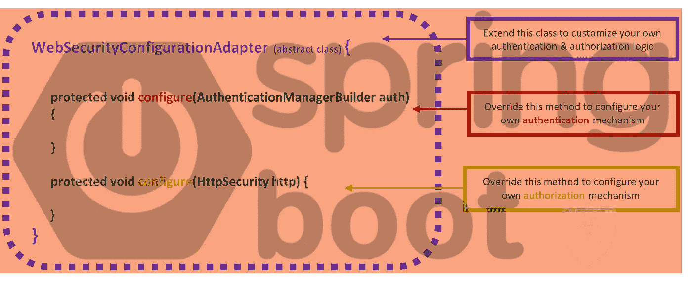
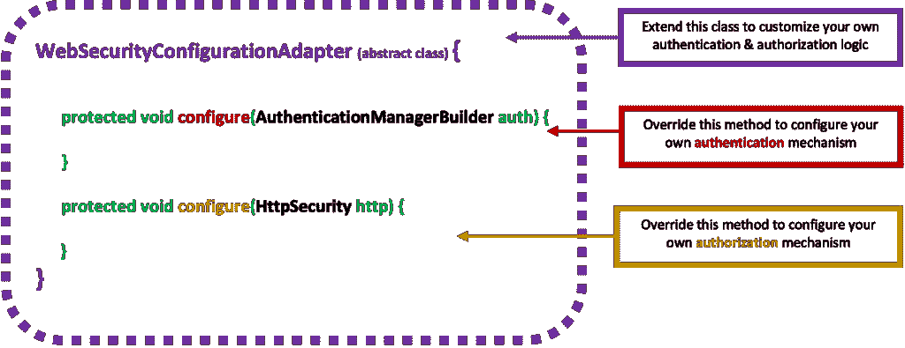
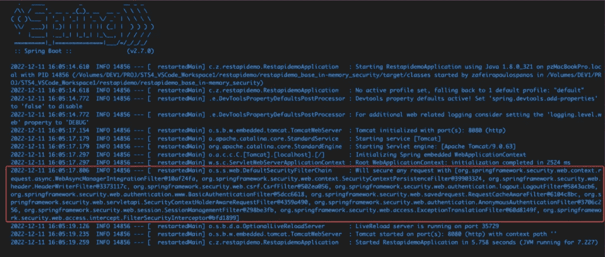
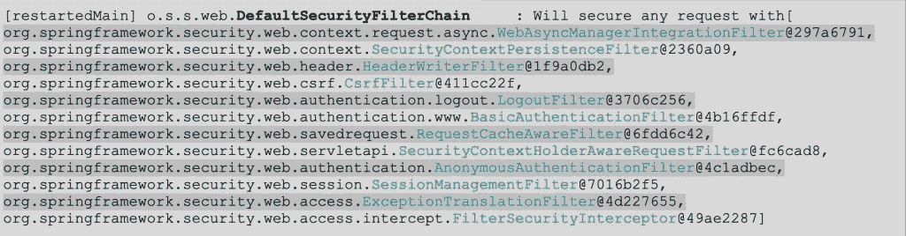
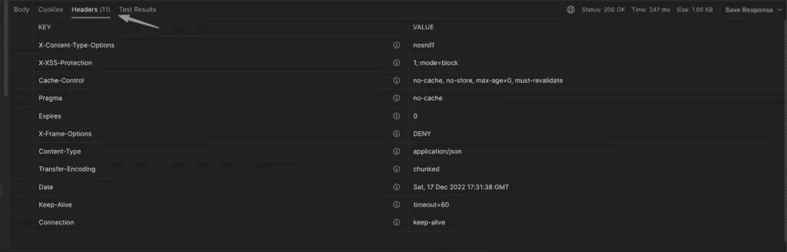
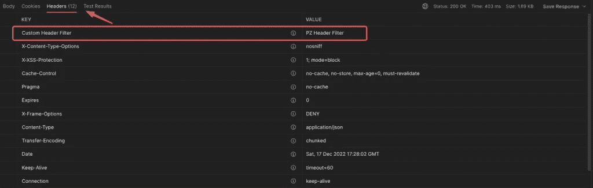

# Spring Boot 安全配置实用讲解第五部分:从 WebSecurityConfigurerAdapter 到 SecurityFilterChain

> 原文：<https://blog.devgenius.io/spring-boot-security-configuration-practically-explained-part5-from-bfb87adc1a58?source=collection_archive---------0----------------------->

以一种简单易懂的方式，从过时的 WebSecurityConfigurerAdapter 传递到新的基于组件(基于 bean)的安全配置。



这是我关于春季安全系列文章的第五篇。所有以前的帖子都讨论了基于扩展 WebSecurityConfigurerAdapter 的自定义类实现的示例自定义。然而，自从 Spring Security 5 . 7 . 0-M2 之后，广泛使用的 WebSecurityConfigurerAdapter 就不再是这样了，它已经被弃用了。

因此，在本文中，我们将看到如何在不使用 WebSecurityConfigurerAdapter 的情况下进行这样的安全定制。大多数情况下，我们将通过一个 **SecurityFilterChain** bean 来讨论**定制安全配置**，以及进一步的定制，例如添加一个**过滤器**和使用一个**基于 DSL 的配置器**。

> 注意:由于 WebSecurityConfigurerAdapter 被广泛使用，即使没有恼人的警告(黄色下划线),仍然有人可以依赖它。阅读下面关于如何应对的帖子。

[](https://medium.com/@zzpzaf.se/spring-boot-security-the-websecurityconfigureradapter-is-not-the-case-anymore-e8af5cceef7e) [## Spring Boot 安全:WebSecurityConfigurerAdapter 不再是这样了

### 当您想要使用最新版本的 Spring Boot 自定义您的安全配置时，请务必小心。

medium.com](https://medium.com/@zzpzaf.se/spring-boot-security-the-websecurityconfigureradapter-is-not-the-case-anymore-e8af5cceef7e) 

# 从 WebSecurityConfigurerAdapter 到 SecurityFilterChain

回到基于**WebSecurityConfigurerAdapter 的抽象类的实现，**回想一下，必须创建一个扩展它的自定义类，因此他/她必须通过覆盖它的两个重要契约方法来工作:



这两种方法只不过是允许我们定制适合我们项目需求的 Spring Boot 安全性的“**配置器”。**

下面是一个非常简单的定制示例，用于在 HTTP 基本身份验证的基础上保护 REST API，并且只使用内存中的身份验证提供程序。

WebSecurityConfigurerAdapter 的两个被覆盖的方法都用于在 Spring 安全上下文中形成必要的**bean**。

现在，注意当我们使用 WebSecurityConfigurerAdapter 时，只有 HttpSecurity 配置器必须被覆盖。另一个是 AuthenticationManager 的配置器(它实际上用于配置 AuthenticationManagerBuilder 以构建和返回 AuthenticationManager)，可以作为 bean (通过@Bean 注释的方法)实现**，即使我们使用 WebSecurityConfigurerAdapter。结果绝对是一样的。因此，在前面代码示例的基础上，我们可以这样做:**

HttpSecurity 配置器负责保护我们的应用程序的 URL 路径和端点。在上面的例子中，我们保护“api/items”端点，我们这样做的方式是使用 HTTP 基本认证标准(通过一对用户名和密码)。

请注意，以@Bean 的形式提供 AuthenticationManager，使其对整个应用程序和任何通过 http 安全性保护的端点都是全局可用的。所以，上面例子中的认证管理器是一个**全局**认证管理器。然而，我们可以使它特定于我们的受保护端点，在这种情况下，它被认为是一个**本地**身份验证管理器。在这种情况下，我们只需“通知”HttpSecurity 配置器使用 bean 方法。为此，我们可以取消上面例子中注释行的注释。我们也可以从 authManager()方法中注释掉@Bean 注释。

## 过滤器链

Spring 实际处理 HttpSecurity 的方式是通过许多安全过滤器。实际上，它创建了一个安全过滤器链。运行应用程序时，仔细查看调试控制台中的输出:



正如您所看到的，Spring 框架接受了我们定制的安全配置中的设置，并将它们放入许多预定义的(默认)安全过滤器中。这些过滤器的列表实际上是由 Spring 管理的过滤器的有序列表，所有这些过滤器组成了一个[DefaultSecurityFilterChain](https://docs.spring.io/spring-security/site/docs/current/api/org/springframework/security/web/DefaultSecurityFilterChain.html)。(你可以在这里找到默认的过滤顺序[)。](https://docs.spring.io/spring-security/site/docs/current/api/org/springframework/security/config/annotation/web/builders/HttpSecurity.html#addFilter(jakarta.servlet.Filter))



因此，Spring 支持的“新”安全方式是使用我们的自定义 http 安全过滤器(在安全过滤器链中)，而不是通过必须扩展 WebSecurityConfigurerAdapter 的类来配置它们。本质上，Spring 允许我们使用 bean 方法配置我们的 HttpSecurity，该方法构建并返回我们自定义的 [SecurityFilterChain](https://docs.spring.io/spring-security/site/docs/current/api/org/springframework/security/web/SecurityFilterChain.html) 接口的实现。

实际上，使用 SecurityFilterChain bean 并不是一种新方法。它从 Spring Security 的 3.1 版本开始就存在了，并被用来配置一个 [FilterChainProxy](https://docs.spring.io/spring-security/reference/servlet/architecture.html#servlet-filterchainproxy) bean。(可以更深入的[这里](https://www.javadevjournal.com/spring-security/spring-security-filters/)和[这里](https://docs.spring.io/spring-security/reference/servlet/architecture.html))。因此，人们甚至可以在 WebSecurityConfigurerAdapter 被弃用之前实现它。然而，现在似乎使用 SecurityFilterChain bean 成为官方推荐和支持的唯一方法。

[注意:由于我们将不再使用废弃的 WebSecurityConfigurerAdapter，您可以删除我们项目的 pom.xml 文件中任何以前版本的“spring-boot-starter-security”依赖项。而且我们可以把“spring-boot-starter-parent”升级到 2.7.6 版本(不是 3.0.0。还没)]。

您可以在官方文档[这里](https://docs.spring.io/spring-security/site/docs/current/api/org/springframework/security/config/annotation/web/builders/HttpSecurity.html#authenticationManager%25org.springframework.security.authentication.AuthenticationManager%29)中找到实现这种安全过滤链 bean 的简单示例。该示例仅包含两个必需的 beans，一个用于 SecurityFilterChain，另一个提供内存中的 InMemoryUserDetailsManager/UserDetailsService。

但是，根据上面的最后一个示例，我们可以创建一个类似于下面的 CustomeSecurityConfiguration 类，这与我们之前所做的没有太大区别:

请注意，除了使用单独的 AuthenticationManager 方法作为@Bean 使其全局可用之外，它还允许我们在将来添加更多的身份验证提供者。

# 将 AuthenticationProvider 与 UserDetailsService 和 PasswordEncoder 一起使用。

正如您可能已经注意到的，我们没有使用 [inMemoryAuthentication](https://docs.spring.io/spring-security/reference/servlet/authentication/passwords/in-memory.html) ()给出任何用户详细信息，因此，我们还必须使用 UserDetailsService。这避免了我们遇到任何由 Spring Boot 默认设置引起的问题。例如，默认情况下，Spring Security(没有任何安全定制)创建一个 UserDetailsService bean，用户名为“user ”,随机生成的密码记录到控制台。因此，最小定制应该包括一个定制的 UserDetailsService。

因此，更好的方法是设置一个[用户详细信息服务](https://docs.spring.io/spring-security/site/docs/current/api/org/springframework/security/core/userdetails/UserDetailsService.html)，以及一个[密码编码](https://docs.spring.io/spring-security/site/docs/current/api/org/springframework/security/crypto/password/PasswordEncoder.html)。下面，你可以找到这样一个例子，它使用了一个非常简单的**内存** UserDetailsService。

我们还使用一个与[DelegatingPasswordEncoder](https://docs.spring.io/spring-security/site/docs/current/api/org/springframework/security/crypto/password/DelegatingPasswordEncoder.html)一起工作的 PasswordEncoder。

这里我们使用了已弃用的 [NoOpPasswordEncoder](https://docs.spring.io/spring-security/site/docs/current/api/org/springframework/security/crypto/password/NoOpPasswordEncoder.html) ，只是为了**演示**的目的，所以您可以使用注释@SuppressWarnings("deprecated ")来取消警告。

此外，虽然可以使用任何 [AuthenticationProvider](https://docs.spring.io/spring-security/site/docs/6.0.0/api/org/springframework/security/authentication/AuthenticationProvider.html) ，但下面的示例使用了广泛使用的[DaoAuthenticationProvider](https://docs.spring.io/spring-security/site/docs/6.0.0/api/org/springframework/security/authentication/dao/DaoAuthenticationProvider.html)，它接受并可用于 UserdetailsService 和任何 PasswordEncoder 的任何实现。综上所述，下面是整个例子:

由于最近的 Spring 安全版本提倡开发人员使用 lambdas(实际上是 [DSL lambdas](https://spring.io/blog/2019/11/21/spring-security-lambda-dsl) )，下面的示例显示了如何使用 lambdas 重写上述 SecurityFilterChain bean 的 http 授权请求:

```
. . .
        @Bean
        public SecurityFilterChain filterChain(HttpSecurity http) throws Exception {
                http.authorizeRequests((athReqs) -> athReqs.antMatchers("/api/items").hasRole("USER"))
             .httpBasic()
             //.and().authenticationManager(authManager(http))
             ;    
             return http.build();
        }
. . .
```

到目前为止，一切顺利。我希望您已经理解了如何以“新的方式”开始实现 Spring Security。
在此找到最终回购[。](https://github.com/zzpzaf/restapidemo_in-memory_security_FilterChain_bean)

## 本地身份验证管理器版本

之前，我们已经讨论了全局和本地身份验证提供者。因此，如果有人想要实现一个**本地**身份验证管理器，下面的代码显示了先前的“CustomSecurityConfiguration”类的更新版本，其中我们将身份验证管理器用作本地身份验证管理器:

## 附加代码:使用 CustomAuthebticationProvider 的安全配置“新方式”

在我下面的前一篇文章中，我们使用了 CustomSecurityConfiguration 类来扩展 WebSecurityConfigurerAdapter。

[](/spring-boot-security-configuration-practically-explained-part4-custom-authentication-provider-7666bea0e13e) [## Spring Boot 安全配置，实用讲解—第 4 部分:自定义身份验证提供者…

### 摘要

blog.devgenius.io](/spring-boot-security-configuration-practically-explained-part4-custom-authentication-provider-7666bea0e13e) 

因此，这里的“额外代码”是 CustomSecurityConfiguration 类的更新版本，它遵循 SecurityFilterChain 和 been-only 方法，并且也使用仅带有 lambdas 的函数样式。在下面找到它:

# 使用基于 DSL 的定制

在这篇文章中，最后但同样重要的一点是关于 [DSL](https://en.wikipedia.org/wiki/Domain-specific_language) (特定领域语言)以及我们如何使用基于 DSL 的配置器。

## DSL——带 Java 的特定领域语言

很可能，一个主要可以处理 DSL 和 Java 的领域是 [Spring Integration](https://docs.spring.io/spring-integration/docs/current/reference/html/index.html) (例如消息传递)。尽管如此，基于 DSL 的定制似乎也获得了 Spring Security 的一些推广。

一般来说，您应该知道，到目前为止，我们在安全性定制中遇到的 HTTPSecurity 配置器和构建器都是基于遵循 DSL 原则的实现类的。这种基于 DSL 的类通常使用函数式编程风格来调用，使得配置过程更加用户友好，并且更接近人类语言。此外，基于 DSL 的类/配置器允许我们执行的每个定制，通常会导致该配置器的更新实例，从而允许进一步的定制。

深入 DSL 概念超出了本文的目标。任何人都可以在网上搜索，找到几十个相关的帖子。只是，为了您的方便，我选择了一些不错的文章，提供实际的例子来开始这个主题。这些是链接:

*   [https://medium . zenika . com/builder-pattern-a-first-step-to-DSL-1f 5645 d3c 84](https://medium.zenika.com/builder-pattern-a-first-step-to-dsl-1f5645d3ec84)
*   [https://medium . com/the-kot Lin-primer/domain-specific-languages-867 f 2790 a700](https://medium.com/the-kotlin-primer/domain-specific-languages-867f2790a700)
*   [https://www . infoworld . com/article/2077891/scripting-JVM-languages-creating-dsls-in-Java-part-3-internal-and-external-dsls . html](https://www.infoworld.com/article/2077891/scripting-jvm-languages-creating-dsls-in-java-part-3-internal-and-external-dsls.html)
*   [https://www . javacodegeeks . com/2013/06/creating-internal-DSL-in-Java-Java-8-adopting-Martin-fowlers-approach . html](https://www.javacodegeeks.com/2013/06/creating-internal-dsls-in-java-java-8-adopting-martin-fowlers-approach.html)

在同一主题上，我还想提到一本非常有趣的书“ [Modern Java in Action Lambdas，streams，functional and reactive programming](https://www.manning.com/books/modern-java-in-action)2018 年第二版， [Manning](https://www.manning.com/) publications”，特别是第十章:“使用 Lambdas 的特定领域语言”。

但是，我认为在下面提供一些示例代码是一个好主意。

## 我们要做什么

基本上，按照官方示例[这里](https://docs.spring.io/spring-security/reference/servlet/configuration/java.html#jc-custom-dsls)或[这里](https://spring.io/blog/2022/02/21/spring-security-without-the-websecurityconfigureradapter)，我们将把我们的自定义配置器(=我们的自定义 DSL 类)应用到 SecurityFilterChain 的 HttpSecurity。作为一个基础，让我们使用我前面提到的帖子的更新回购，基于以前的“奖金代码”。在这里找到回购[。](https://github.com/zzpzaf/restapidemo_mysql_jdbc-CustomAuthenticationProvider_FilterChain_demo_mysql_start)

在继续定制 DSL 类之前，让我们首先制作一个定制的头过滤器。

## 自定义标题过滤器

正如我们已经说过的，Spring 实际上处理 HttpSecurity 的方式是通过许多安全过滤器。这意味着我们也可以添加自己的过滤器。例如，我们将使用一个定制的过滤器，它将一个定制的头添加到请求的返回响应中，允许我们通过返回的头提供更多的信息。

运行一个像我们开始的 repo 这样的项目，您可以在终端或调试控制台中看到 DefaultSecurityFilterChain 中应用的所有过滤器，并且您可能会注意到 BasicAuthenticationFilter。

```
o.s.s.web.DefaultSecurityFilterChain     : Will secure any request with [ 
org.springframework.security.web.context.request.async.WebAsyncManagerIntegrationFilter@501760bd, 
org.springframework.security.web.context.SecurityContextPersistenceFilter@55a1effd, 
org.springframework.security.web.header.HeaderWriterFilter@468057f5, 
org.springframework.security.web.csrf.CsrfFilter@2b1cf627, 
org.springframework.security.web.authentication.logout.LogoutFilter@330be2b0, 
org.springframework.security.web.authentication.www.BasicAuthenticationFilter@2af908d9, <---
org.springframework.security.web.savedrequest.RequestCacheAwareFilter@3050b83d, 
org.springframework.security.web.servletapi.SecurityContextHolderAwareRequestFilter@74ab6e3d, 
org.springframework.security.web.authentication.AnonymousAuthenticationFilter@5c1a251d, 
org.springframework.security.web.session.SessionManagementFilter@19c08f2c, 
org.springframework.security.web.access.ExceptionTranslationFilter@2819b1ad, 
org.springframework.security.web.access.intercept.FilterSecurityInterceptor@5504d510]
```

此外，使用 Postman，您可以查看带有响应的邮件头。在下面的例子中，您可以看到头的数量是 11:



基本上，可以通过实现基本的 [Filter](https://jakarta.ee/specifications/platform/9/apidocs/jakarta/servlet/filter) 接口或者扩展 Spring 提供的一个“现成的”实现类来定制过滤器。在我们的例子中，我们将扩展 [GenericFilterBean](https://docs.spring.io/spring-framework/docs/current/javadoc-api/org/springframework/web/filter/GenericFilterBean.html) 类(它当然实现了过滤器接口)。

主要工作是通过**覆盖**的 [doFilter()](https://jakarta.ee/specifications/platform/9/apidocs/jakarta/servlet/filter#doFilter(jakarta.servlet.ServletRequest,jakarta.servlet.ServletResponse,jakarta.servlet.FilterChain)) 方法来完成的，在该方法中，我们可以访问[请求](https://jakarta.ee/specifications/platform/9/apidocs/jakarta/servlet/servletrequest)和[响应](https://jakarta.ee/specifications/platform/9/apidocs/jakarta/servlet/servletresponse) servlet 对象，以及[过滤器链](https://jakarta.ee/specifications/platform/9/apidocs/jakarta/servlet/filterchain)对象。因此，这个方法是设置自定义标题的合适位置。让我们将自定义过滤器的类命名为“CustomResponseHeaderFilter”。下面给出了示例代码:

下一步是在我们的“CustomSecurityConfiguration”类的 SecurityFilterChain bean 中添加/应用它。我们可以将它添加到与 BasicAuthenticationFilter 相同的排序位置。因此，bean 的代码变成了:

运行项目后，您可以在终端或调试控制台中检查输出:

```
 o.s.s.web.DefaultSecurityFilterChain     : Will secure any request with [
org.springframework.security.web.context.request.async.WebAsyncManagerIntegrationFilter@38524eae, 
org.springframework.security.web.context.SecurityContextPersistenceFilter@53eb7394, 
org.springframework.security.web.header.HeaderWriterFilter@31adeeb1, 
org.springframework.security.web.csrf.CsrfFilter@13708c79, 
org.springframework.security.web.authentication.logout.LogoutFilter@12941fd0, 
com.zzpzaf.restapidemo.Configuration.CustomResponseHeaderFilter@62729f4c, <--------
org.springframework.security.web.authentication.www.BasicAuthenticationFilter@7759829b, <---
org.springframework.security.web.savedrequest.RequestCacheAwareFilter@795e0fe5, 
org.springframework.security.web.servletapi.SecurityContextHolderAwareRequestFilter@2758be19, 
org.springframework.security.web.authentication.AnonymousAuthenticationFilter@4d6b8bf4, 
org.springframework.security.web.session.SessionManagementFilter@446f2c24, 
org.springframework.security.web.access.ExceptionTranslationFilter@c94d175, 
org.springframework.security.web.access.intercept.FilterSecurityInterceptor@cc46e58]
```

同样，使用 Postman，您还可以检查我们的自定义标头现在是否已经添加到返回的标头中(现在数量是 12):



好的。我们做到了。现在让我们更进一步，看看我们如何使用一个定制的 DSL 类来做到这一点。

我们可以将自定义 DSL 类命名为“cuctomdslslhttpsecurityconfiguration”。这将是我们自己的定制**配置器**，它应该应用于 SecurityFilterChain bean 中的 HttpSecurity 配置，因此它应该扩展 [AbstractHttpConfigurer](https://docs.spring.io/spring-security/site/docs/4.2.x/apidocs/org/springframework/security/config/annotation/web/configurers/AbstractHttpConfigurer.html) 。

按照官方示例[这里的](https://docs.spring.io/spring-security/reference/servlet/configuration/java.html#jc-custom-dsls)，我们的定制 DSL 示例代码可以类似于下面的代码:

主要工作是在 configure()方法中完成的，我们在其中设置并添加了一个过滤器，即 CustomResponseHeaderFilter 类。另外，请注意，我们使用了一个 setter 方法，该方法允许我们向下传递到 CustomResponseHeader 并设置头名称和头值。此外，正如您所看到的，我们使用了另一个 httpSecurity 配置，在 init()方法中使 HTTP 会话无状态。因此，没有必要在 SecurityFilterChain bean 的配置中这样做(就像我们之前所做的那样)。

现在，我们准备将 cuctomdslslhttpsecurityconfigure 类应用于 SecurityFilterChain bean。我们通过简单地“应用”它来做到这一点:

暂时就这样吧！
你可以在这里找到最终回购[。](https://github.com/zzpzaf/restapidemo_mysql_jdbc-CustomAuthenticationProvider_FilterChain_demo_mysql_final)

我希望我能够让您对从 WebSecurityConfigurerAdapter 迁移到 SecurityFilterChain 有所了解，并体验如何使用自定义过滤器和基于 DSL 的自定义配置器。

感谢阅读👏！敬请关注！