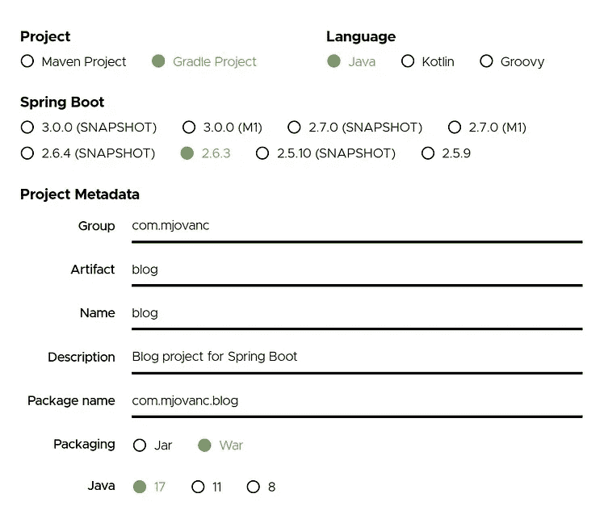

# 使用 PostgreSQL 和 Hibernate 的 Spring Boot—第 1 部分

> 原文：<https://blog.devgenius.io/spring-boot-with-postgresql-and-hibernate-26dc00de27e?source=collection_archive---------4----------------------->


在本教程中，我们将介绍如何使用 PostgreSQL 关系数据库和 Hibernate 来设置 Spring Boot 应用程序，以处理数据库事务，而不是编写自己的 SQL 查询。我们还将使用 Gradle 作为构建工具。

我们将构建的是一个 REST API，它将能够存储博客文章、类别和标签。

首先，我们需要使用 Spring Initializr 获得一个. zip 文件，其中包含我们需要的所有必要文件，我们在这里找到页面[https://start.spring.io/](https://start.spring.io/)。我们将选择以下内容:



这些设置是我们将在这个项目中使用的，但是用 Maven 或另一个 Java 版本来设置这个项目不是问题。

现在我们按页面底部的**生成**来获得。zip 文件，并将该文件解压缩到我们计算机上的一个所需位置。然后我们最好在 **IntelliJ** 开放它，因为它得到了很多对 Spring Boot 的支持。当打开我们在 Intellij 中获得的目录 **blog** 时，它开始将我们运行应用程序所需的依赖项下载到我们的计算机上。

现在我们需要在我们的电脑上安装 PostgreSQL，如果我们还没有安装，我们可以从:[https://www.postgresql.org/download/](https://www.postgresql.org/download/)下载并安装最新版本。当我们安装 PostgreSQL 时，我们将有一个名为 **postgres** 的默认用户名，它没有密码，因此我们需要打开我们的 shell 并进行查询来设置密码。这个帐户不应该在生产中使用，但是因为我们只在本地使用它，所以完全可以使用。要设置密码，我们打开终端并运行(我使用的是 Ubuntu，因此可能会因操作系统而异):

```
sudo -u postgres psql
```

这是用 **postgres** 用户登录到 **psql** CLI，这样我们就可以与数据库交互并进行查询。 **postgres** 用户拥有全部权限。系统会提示我们使用操作系统上当前用户的密码。因此，当我们登录后，我们运行 SQL 查询来设置新密码:

```
ALTER USER postgres WITH PASSWORD 'new_password';
```

接下来，我们需要添加一个新的数据库，因此我们运行以下命令:

```
CREATE DATABASE blog;
```

现在我们完成了数据库部分。我们可以使用 GUI 客户机，这样当我们要在新创建的数据库中设置新表时，可以更容易地浏览。我个人使用的是 **pgAdmin 4** ，但是你可以下载任何 PostgreSQL GUI 客户端。

现在是时候从我们项目中的 Java 代码开始了。首先，我们需要定义我们的项目需要什么模型(实体)。在这个项目中，我们将这样做:

BlogPost (id，title，text，created，updated)
BlogCategory (id，name)
BlogTag (id，name)

关系还没有定义，但是我们需要添加它，我们将在第二个教程中讨论，我将在 Medium 上发布。

因此，我们将首先在路径 **com.mjovanc.blog** 下创建一个名为 **model** 的新包，然后我们将创建一个名为**BlogPost.java**的新 Java 类，并添加以下内容:

```
package com.mjovanc.blog.model;

import javax.persistence.Entity;
import javax.persistence.GeneratedValue;
import javax.persistence.GenerationType;
import javax.persistence.Id;

@Entity
public class BlogPost {

    @Id
    @GeneratedValue(strategy = GenerationType.AUTO)
    private Long id;
    private String title;
    private String text;
    private String created;
    private String updated; public BlogPost() {

    } public BlogPost(String title, String text, String created, String updated) {
        this.title = title;
        this.text = text;
        this.created = created;
        this.updated = updated;
    }

    public String getTitle() {
        return title;
    }

    public void setTitle(String title) {
        this.title = title;
    }

    public String getText() {
        return text;
    }

    public void setText(String text) {
        this.text = text;
    }

    public String getCreated() {
        return created;
    }

    public void setCreated(String created) {
        this.created = created;
    }

    public String getUpdated() {
        return updated;
    }

    public void setUpdated(String updated) {
        this.updated = updated;
    }
}
```

因此，我们在 BlogPost 类上添加注释**实体**，然后添加我们之前定义的必要字段。id 不是我们将手动添加的东西，所以我们需要添加两个注释 **Id** 和 **GeneratedValue** ，并选择 Id 生成的策略为 AUTO 类型。除了 id，我们需要所有字段的 getters 和 setters。我们可以使用 [lombok](https://projectlombok.org/) 来避免这种情况，但是在这个例子中我们将使用 getters 和 setters。

因此，接下来我们将添加其他模型(实体)。

**BlogCategory.java:**

```
package com.mjovanc.blog.model;

import javax.persistence.Entity;
import javax.persistence.GeneratedValue;
import javax.persistence.GenerationType;
import javax.persistence.Id;

@Entity
public class BlogCategory {

    @Id
    @GeneratedValue(strategy = GenerationType.AUTO)
    private Long id;
    private String name; public BlogCategory() {

    } public BlogCategory(String name) {
        this.name = name;
    }

    public String getName() {
        return name;
    }

    public void setName(String name) {
        this.name = name;
    }
}
```

**BlogTag.java:**

```
package com.mjovanc.blog.model;

import javax.persistence.Entity;
import javax.persistence.GeneratedValue;
import javax.persistence.GenerationType;
import javax.persistence.Id;

@Entity
public class BlogTag {

    @Id
    @GeneratedValue(strategy = GenerationType.AUTO)
    private Long id;
    private String name; public BlogTag() {

    } public BlogTag(String name) {
        this.name = name;
    }

    public String getName() {
        return name;
    }

    public void setName(String name) {
        this.name = name;
    }
}
```

现在，当我们创建了所有的模型(实体)后，我们将继续创建存储库。我们首先在 **com.mjovanc.blog** 路径中创建一个名为 **repository** 的新包，就像我们之前创建 **model** 包一样。然后我们开始创建一个名为**BlogPostRepository.java**的存储库文件，但这次是作为一个接口:

```
package com.mjovanc.blog.repository;

import com.mjovanc.blog.model.BlogPost;
import org.springframework.data.jpa.repository.JpaRepository;
import org.springframework.stereotype.Repository;

@Repository
public interface BlogPostRepository extends JpaRepository<BlogPost, Long> {
}
```

这里我们添加了另一个名为 **Repository** 的注释，并且我们扩展了 **JpaRepository** ，这样我们就可以使用内置的处理常见查询的功能，Hibernate 会为我们处理这些查询。正如我们所见，这非常容易设置！所以基本上我们会为 BlogCategory 和 BlogTask 做同样的事情。所以我不会在这里为它们粘贴代码(你可以在我的 GitHub 账户上看到完整的代码)。

现在我们有了两个包模型和存储库，所以我们暂时完成了我们的业务逻辑。现在我们需要像以前一样创建另一个包，但我们将把它命名为**控制器**。因此，在控制器包中创建一个名为**BlogPostController.java**的文件，并将以下内容放入其中:

```
package com.mjovanc.blog.controller;

import com.mjovanc.blog.model.BlogPost;
import com.mjovanc.blog.repository.BlogPostRepository;
import org.springframework.beans.factory.annotation.Autowired;
import org.springframework.http.HttpStatus;
import org.springframework.http.ResponseEntity;
import org.springframework.web.bind.annotation.*;

import java.util.List;
import java.util.Optional;

@RestController
@RequestMapping("v1/posts")
public class BlogPostController {

    @Autowired
    private BlogPostRepository blogPostRepository;

    @GetMapping
    public ResponseEntity<List<BlogPost>> getAllBlogPosts() {
        List<BlogPost> returnBlogPosts = blogPostRepository.findAll();
        return new ResponseEntity<>(returnBlogPosts, HttpStatus.OK);
    }

    @GetMapping("{id}")
    public ResponseEntity<BlogPost> getBlogPostById(@PathVariable Long id) {
        if (blogPostRepository.existsById(id)) {
            BlogPost blogPost = blogPostRepository.findById(id).get();
            return new ResponseEntity<>(blogPost, HttpStatus.OK);
        }

        return new ResponseEntity<>(HttpStatus.BAD_REQUEST);
    }

    @PostMapping
    public ResponseEntity<BlogPost> createBlogPost(@RequestBody BlogPost blogPost) {
        blogPostRepository.save(blogPost);
        return new ResponseEntity<>(HttpStatus.CREATED);
    }

    @PutMapping("{id}")
    public ResponseEntity<BlogPost> updateBlogPostById(@PathVariable Long id, @RequestBody BlogPost blogPost) {
        Optional<BlogPost> blogPostToFind = blogPostRepository.findById(id);

        if (blogPostToFind.isPresent()) {
            BlogPost blogPostToUpdate = blogPostToFind.get();
            blogPostToUpdate.setTitle(blogPost.getTitle());
            blogPostToUpdate.setText(blogPost.getText());
            blogPostToUpdate.setCreated(blogPost.getCreated());
            blogPostToUpdate.setUpdated(blogPost.getUpdated());

            blogPostRepository.save(blogPostToUpdate);
            return new ResponseEntity<>(HttpStatus.OK);
        } else {
            blogPostRepository.save(blogPost);
            return new ResponseEntity<>(HttpStatus.CREATED);
        }
    }

    @DeleteMapping("{id}")
    public ResponseEntity<BlogPost> deleteBlogPostById(@PathVariable Long id) {
        if (blogPostRepository.existsById(id)) {
            blogPostRepository.deleteById(id);
            return new ResponseEntity<>(HttpStatus.OK);
        } else {
            return new ResponseEntity<>(HttpStatus.NOT_FOUND);
        }
    }
}
```

和以前一样，我不会发布其他文件，它们可以在我的 GitHub 存储库中看到。但是它们基本上是相同的，只是使用了不同的模型和存储库。我们需要稍微分解一下，因为这里有很多东西。

```
@RestController
@RequestMapping("v1/posts")
```

第一个注释 **RestController** 用于将该类标记为 REST 控制器，这样我们可以定义将要使用的端点，而 **RequestMapping** 定义所有端点应该从哪个相对 URI 路径开始。

```
@Autowired
private BlogPostRepository blogPostRepository;
```

这个注释自动连接存储库，因此我们可以通过我们创建的接口调用方法。

```
@GetMapping
```

这定义了我们应该如何处理对我们定义的 URI 路径的 GET 请求，比如 GET */v1/posts*

```
@GetMapping("{id}")
```

如果我们改为这样指定，我们将追加字符串 */v1/posts/1* 作为参数，这样我们就可以获取具有特定 ID 的所需对象。

```
public ResponseEntity<List<BlogPost>> getAllBlogPosts()
```

这里我们定义了实际的端点。我们将返回一个带有博客帖子列表的 ResponseEntity。然后我们返回一个带有列表的 ResponseEntity 和一个 HTTP 状态代码 OK (200 ),让用户知道它成功了。

这个文件中的其他端点是类似的，我们有一个 POST、PUT 和 DELETE 端点，因此我们可以通过 REST API 操作存储的数据。PUT 端点的工作原理是，如果您发送一个已经存在于数据库中的对象，它将完全覆盖它，如果它不存在，它将创建一个新行。

所以现在我们已经为它的使用编写了所有必要的代码。但是我们还有一个重要的部分需要定义。让我们打开我们的**资源**目录中的文件 **application.properties** ，并将代码放入:

```
spring.datasource.url=jdbc:postgresql://localhost:5432/blog
spring.datasource.username=postgres
spring.datasource.password=<your postgres user password>
spring.jpa.hibernate.ddl-auto=update
```

这些属性定义了该应用程序如何通过 url(包括数据库主机、端口和数据库名称)、用户名和密码与我们的 PostgreSQL 数据库进行通信。它还定义 Hibernate 自动创建表(如果它们不存在),并在模型(实体)发生变化时更新。

所以是时候让我们测试这个应用程序来处理所有的 HTTP 请求了。所以运行**BlogApplication.java**(右击并选择在 Intellij 中运行)。

然后我们打开 Postman (cURL 也是一个不错的工具),我们首先尝试创建一个带有 HTTP POST 请求的博客帖子:


然后，我们尝试通过获取所有博客文章来执行 HTTP GET 请求:


HTTP GET 请求一篇博文的特定 ID:


最后，我们用一个特定的 ID 做一个 HTTP 删除请求:


一切都很完美。这就是你如何用 Hibernate 和 PostgreSQL 设置 Spring Boot 的一切。在我的下一个教程中，我将重复我们之前的代码，但是这次我将引入关系，这样我们就可以将一篇博客文章与类别和标签联系起来。请在 Medium 或 Twitter 上关注我:[https://twitter.com/mjovanc](https://twitter.com/mjovanc)

GitHub 对该部分的存储库提交:[https://GitHub . com/mjovanc/spring-boot-PostgreSQL-hibernate/tree/F8 AE 8 E0 cdccaef 9 a5 A0 ff 92 b 7896 FAE 558 C1 af 71](https://github.com/mjovanc/spring-boot-postgresql-hibernate/tree/f8ae8e0cdccaef9a5a0ff92b7896fae558c1af71)