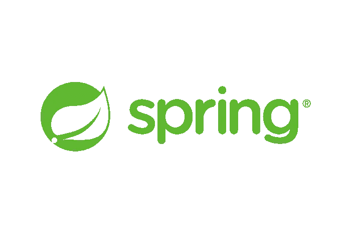
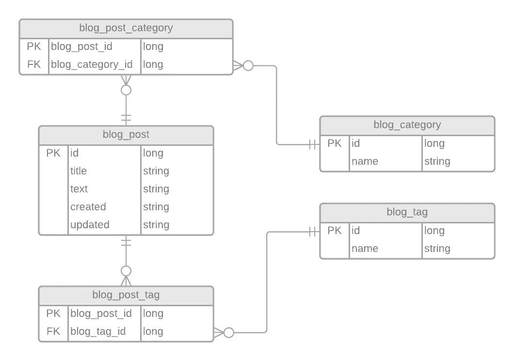

# 使用 PostgreSQL 和 Hibernate 的 Spring Boot—第 2 部分

> 原文：<https://blog.devgenius.io/spring-boot-with-postgresql-and-hibernate-part-2-5406f3c93665?source=collection_archive---------10----------------------->



在上一个教程中，我们使用 Spring Boot 设置了一个非常基本的 REST API。在本教程中，我们将进一步探索我们能做些什么，同时也改进我们现有的代码。我们将添加服务，还将添加实体之间的关系，以便我们可以将对象绑定在一起。例如，一篇博文应该能够附加博客类别或/和博客标签。当我们需要列出某个类别/标签中的所有博客文章时，这让我们更容易。

首先，我们将改进现有的代码。我们将创建一个名为 **service** 的新包，其中将存储我们的服务，这些服务将为我们执行业务逻辑。让我们的控制器端点远离过多的代码是一个很好的实践，通常过一段时间就会这样。

现在我们将在新的包**服务**中创建以下文件:【BlogPostService.java】****BlogTagService.java**。这些文件将有非常相似的代码，所以我将只演示一下**BlogPostService.java**的样子，其余的你可以查看我的 **GitHub** 库(文章底部的链接)。**

**所以现在我们将把下面的代码添加到我们的**BlogPostService.java**(稍后我会试着分解它):**

```
package com.mjovanc.blog.service;

import com.mjovanc.blog.model.BlogPost;
import com.mjovanc.blog.repository.BlogPostRepository;
import org.springframework.beans.factory.annotation.Autowired;
import org.springframework.http.HttpStatus;
import org.springframework.stereotype.Service;

import java.util.List;
import java.util.Optional;

@Service
public class BlogPostService {

    private final BlogPostRepository blogPostRepository;

    @Autowired
    public BlogPostService(BlogPostRepository blogPostRepository) {
        this.blogPostRepository = blogPostRepository;
    }

    public List<BlogPost> getAllBlogPosts() {
        return blogPostRepository.findAll();
    }

    public BlogPost getBlogPostById(Long id) {
        if (blogPostRepository.existsById(id)) {
            BlogPost blogPost = blogPostRepository.findById(id).get();
            return blogPost;
        }

        return null;
    }

    public HttpStatus createBlogPost(BlogPost blogPost) {
        blogPostRepository.save(blogPost);
        return HttpStatus.CREATED;
    }

    public HttpStatus updateBlogPostById(Long id, BlogPost blogPost) {
        Optional<BlogPost> blogPostToFind = blogPostRepository.findById(id);

        if (blogPostToFind.isPresent()) {
            BlogPost blogPostToUpdate = blogPostToFind.get();
            blogPostToUpdate.setTitle(blogPost.getTitle());
            blogPostToUpdate.setText(blogPost.getText());
            blogPostToUpdate.setCreated(blogPost.getCreated());
            blogPostToUpdate.setUpdated(blogPost.getUpdated());

            blogPostRepository.save(blogPostToUpdate);
            return HttpStatus.OK;
        } else {
            blogPostRepository.save(blogPost);
            return HttpStatus.CREATED;
        }
    }

    public HttpStatus deletePostById(Long id) {
        if (blogPostRepository.existsById(id)) {
            blogPostRepository.deleteById(id);
            return HttpStatus.OK;
        }

        return HttpStatus.NOT_FOUND;
    }
}
```

**所以这里我们将向我们的类添加另一个装饰器。这将使类充当服务对象:**

```
@Service
public class BlogPostService
```

**这一次我们将做一些改变，因为更好的做法是将我们的 Autowired 装饰器直接放在构造函数上。这将使我们的代码更容易测试:**

```
@Service
public class BlogPostService {

    private final BlogPostRepository blogPostRepository;

    @Autowired
    public BlogPostService(BlogPostRepository blogPostRepository) {
        this.blogPostRepository = blogPostRepository;
    }
```

**我们将使用的方法与我们在上一个教程中创建的初始控制器方法非常相似，但这里我们将返回从数据库中获取的对象本身(或多个)或 **HttpStatus** 。**

**那么为什么我们把 **HttpStatus** 作为一些方法的返回类型呢？这是因为我们可以检查，例如，如果我们试图通过 **id** 更新一篇博客文章，如果根据 HTTP 请求 **PUT** 没有找到，我们将创建该对象。因此，我们将根据情况向用户发送不同的 HTTP 请求，在我们的服务中直接处理这些请求要容易得多，在我们的控制器方法中看起来也干净得多。**

**所以现在我们将更新我们创建的初始 BlogPostController，如下所示:**

```
package com.mjovanc.blog.controller;

import com.mjovanc.blog.model.BlogPost;
import com.mjovanc.blog.service.BlogPostService;
import org.springframework.beans.factory.annotation.Autowired;
import org.springframework.http.HttpStatus;
import org.springframework.http.ResponseEntity;
import org.springframework.web.bind.annotation.*;

import java.util.List;

@RestController
@RequestMapping("v1/posts")
public class BlogPostController {

    private final BlogPostService blogPostService;

    @Autowired
    public BlogPostController(BlogPostService blogPostService) {
        this.blogPostService = blogPostService;
    }

    @GetMapping
    public ResponseEntity<List<BlogPost>> getAllBlogPosts() {
        return new ResponseEntity<>(blogPostService.getAllBlogPosts(), HttpStatus.OK);
    }

    @GetMapping("{id}")
    public ResponseEntity<BlogPost> getBlogPostById(@PathVariable Long id) {
        BlogPost blogPost = blogPostService.getBlogPostById(id);
        if (blogPost != null) {
            return new ResponseEntity<>(blogPost, HttpStatus.OK);
        }

        return new ResponseEntity<>(HttpStatus.BAD_REQUEST);
    }

    @PostMapping
    public ResponseEntity<BlogPost> createBlogPost(@RequestBody BlogPost blogPost) {
        return new ResponseEntity<>(blogPostService.createBlogPost(blogPost));
    }

    @PutMapping("{id}")
    public ResponseEntity<BlogPost> updateBlogPostById(@PathVariable Long id, @RequestBody BlogPost blogPost) {
        return new ResponseEntity<>(blogPostService.updateBlogPostById(id, blogPost));
    }

    @DeleteMapping("{id}")
    public ResponseEntity<BlogPost> deleteBlogPostById(@PathVariable Long id) {
        return new ResponseEntity<>(blogPostService.deletePostById(id));
    }
}
```

**所以在这里，我们也将 Autowire 装饰器改为在构造函数上，而不是直接在字段上。正如你在控制器方法上看到的，如果我们需要添加更多的端点，它会更加简洁和易于维护。使用**服务**的目的也是为了能够在不同的控制器中使用，因此我们也增加了我们的模块化。**

**好了，现在当用 cURL/Postman 进行 API 调用时，它应该完全像以前一样工作了。现在，我们将完全按照之前的操作来操作，但不包括其他控制器。**

**现在我们将了解如何为我们的实体添加关系。所以我们需要考虑他们之间会有什么样的关系。**

****博客发布- >博客标签**(多对多)
**博客发布- >博客类别**(多对多)**

*   **一篇博客文章可以有许多博客标签，许多博客标签可以有许多博客文章。**
*   **一篇博客文章也可以有许多博客类别，而博客类别可以有许多博客文章。**

**因此，我们将数据库图表定义如下，以了解需要存储哪些数据:**

****

**实体之间的关系**

**因此，我们现在需要做的第一件事是在所有实体(模型)中添加一个新的 getter 方法，并将其放在构造函数下:**

```
public Long getId() {
    return id;
}
```

**然后转到我们的 BlogPost 类，在字段下添加以下内容:**

```
@ManyToMany(cascade = CascadeType.ALL)
@JoinTable(
        name = "blog_post_category",
        joinColumns = {@JoinColumn(name = "blog_post_id")},
        inverseJoinColumns = {@JoinColumn(name = "blog_post_category_id")}
)
@JsonProperty("blog_categories")
public List<BlogCategory> blogCategories;

@ManyToMany(cascade = CascadeType.ALL)
@JoinTable(
        name = "blog_post_tag",
        joinColumns = {@JoinColumn(name = "blog_post_id")},
        inverseJoinColumns = {@JoinColumn(name = "blog_post_tag_id")}
)
@JsonProperty("blog_tags")
public List<BlogTag> blogTags;

@JsonGetter("blog_categories")
public List<String> getAllWalletPlatforms() {
    if(blogCategories != null) {
        return blogCategories.stream()
                .map(bc -> {
                    return "/v1/categories/" + bc.getId();
                }).collect(Collectors.toList());
    }
    return null;
}

@JsonGetter("blog_tags")
public List<String> getAllWalletStorages() {
    if(blogTags != null) {
        return blogTags.stream()
                .map(bt -> {
                    return "/v1/tags/" + bt.getId();
                }).collect(Collectors.toList());
    }
    return null;
}
```

**在这里，我们实现了之前在数据库图表中设计的关系。我们正在添加一个名为 **ManyToMany** 的新装饰器和一个 **JoinTable** 。我们有参数 *name* 、 *joinColumns* 和 *inverseJoinColumns* 。第一个参数是我们的表的名称，在 *joinColumns* 中我们描述了第一列应该被称为什么，在 *inverseJoinColumns* 中描述了第二列应该被称为什么。**

**然后我们将一个 **JsonProperty** decorator 添加到一个**blog category**/**blog tag**的列表中，当我们在**服务**中访问这个列表时，它将被用来生成 JSON 数据。使用我们在 **JsonProperty** 下创建的字段名，我们将使用它通过**流**遍历对象，并生成相对 URL 路径的列表。我们不想获取完整的对象并显示它们，因为当有大量数据时，这可能非常昂贵。**

**因此，接下来我们将向我们的 **BlogCategory** 和 **BlogTag** 添加一些代码，这样当对每个类别或标签的端点进行 API 调用时，我们将获得哪些博客文章被连接:**

```
@ManyToMany(mappedBy="blogCategories")
List<BlogPost> blogPosts;

@JsonGetter("blogPosts")
public List<String> getAllBlogPosts() {
    if (blogPosts != null) {
        return blogPosts.stream()
                .map(bp -> {
                    return "/v1/posts/" + bp.getId();
                }).collect(Collectors.toList());
    }
    return null;
}
```

**这里我们映射了我们在 BlogPost 实体中定义的 *blogCategories* 字段。因此，在**博客标签**实体中，我们将添加**博客标签**作为 **mappedBy** 参数。我们基本上是在这里生成一个博客帖子的相对 URL 路径列表，就像我们在 BlogPost 实体中所做的那样。**

**所以现在我们已经完成了实体的关系部分。让我们添加一些数据并检查结果。**

****发布/v1/标签****

```
{
  "name": "Kryptokrona"
}
```

****岗位/v1/类别****

```
{
  "name": "Crypto"
}
```

****岗位/v1/岗位****

```
{
  "title": "A Spring Boot Tutorial Part 2",
  "text": "Possimus sunt et provident molestiae id aut omnis. Et minus praesentium repellendus porro non. Eos et fugit doloribus.",
  "created": "2015-03-25T12:00:00-06:30",
  "updated": "2015-03-25T12:00:00-06:30",
  "blog_categories": [
    "2"
  ],
  "blog_tags": [
    "13"
  ]
}
```

**在这里，我们做了一个 POST 请求，并将 id 作为字符串添加到一个类别和标签的数组中，我们希望将博文与这些类别和标签相关联。**

****GET /v1/posts****

```
[
  {
    "id": 1,
    "title": "A Spring Boot Tutorial Part 2",
    "text": "Possimus sunt et provident molestiae id aut omnis. Et minus praesentium repellendus porro non. Eos et fugit doloribus.",
    "created": "2015-03-25T12:00:00-06:30",
    "updated": "2015-03-25T12:00:00-06:30",
    "blog_categories": [
      "/v1/categories/16"
    ],
    "blog_tags": [
      "/v1/tags/17"
    ]
  }
]
```

**现在，当执行 GET 请求时，我们看到它已经与博客文章相关联。**

**就是这样！我们现在有了一个可以处理关系和使用服务的 REST API。**

**要查看这个小系列教程的最终代码，请查看我的 GitHub 库:[https://github.com/mjovanc/spring-boot-postgresql-hibernate](https://github.com/mjovanc/spring-boot-postgresql-hibernate)**

**关注我的 Twitter 账户，询问关于你想让我做的其他教程的问题，或者如果你想讨论别的事情:[https://twitter.com/mjovanc](https://twitter.com/mjovanc)**