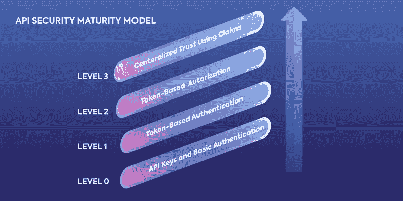
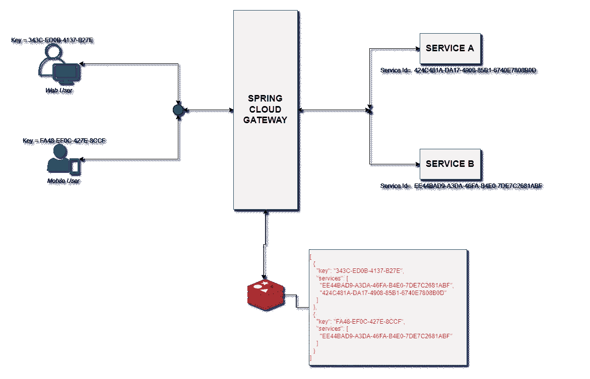
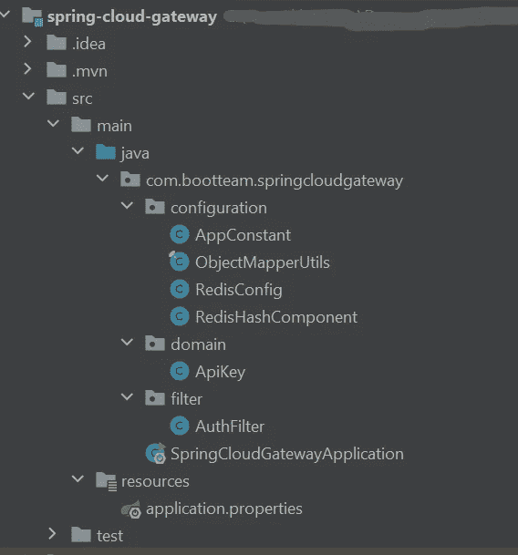
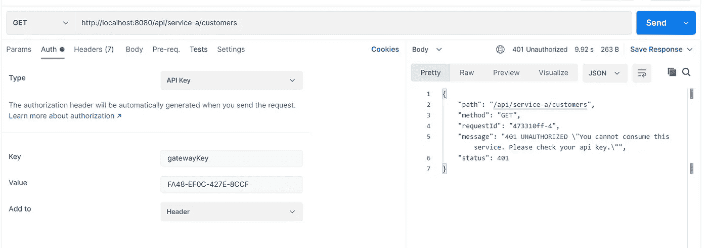
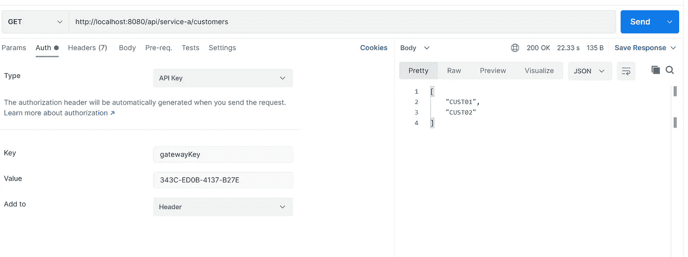

# Spring 云网关——使用 API 密钥保护服务

> 原文：<https://blog.devgenius.io/spring-cloud-gateway-securing-services-with-api-key-9c39836fc097?source=collection_archive---------0----------------------->

在这个故事中，我将探索如何使用 Spring Cloud Gateway 用 API 密钥实现 API 安全性。

尼古拉斯·皮卡德在 [Unsplash](https://unsplash.com?utm_source=medium&utm_medium=referral) 上拍摄的照片

# 概观

在微服务架构中，不同 API 服务之间数据传递的安全性变得至关重要。因此，为了提高这些服务之间不同交换的安全性，设置几个级别是很重要的。

这就是为什么基于[理查森成熟度模型](https://martinfowler.com/articles/richardsonMaturityModel.html)的 API 安全模型，描述了安全级别不断增加的 API 安全性。

API 安全成熟度模型

在这个模型中，每一级的安全性和信任度都在不断提高。它有四个级别:

*   0 级: **API 密钥和基本认证**
*   第 1 级:**基于令牌的认证**
*   第 2 级:**基于令牌的授权**
*   第三级:**集中信托使用债权**

在这个故事中，我们将关注通过 Spring Cloud Gateway 实现的 0 级(API Keys)。

Spring Cloud Gateway 为在 Spring 和 Java 之上构建 API 网关提供了一个库。它提供了一种基于大量标准的灵活的请求路由方式，并关注安全性、弹性和监控等跨领域问题。

根据上面的体系结构，对服务(A 或 B)的访问将取决于对密钥的验证，该密钥将在请求的报头中发送。

# 项目设置

从 [start.spring.io](https://start.spring.io/) 创建一个简单的 Spring Boot 项目，包含以下依赖项:Lombok、spring cloud gateway、spring data redis。

## 项目结构

我们的架构包含三个主要的包:c *配置*，*过滤器*，*域*

为 API 网关中定义的每个路由执行全局过滤器。在我们的例子中，我们将创建一个定制的预过滤器。这个过滤器代码在 Spring Cloud Gateway 将请求路由到目的地 web 服务端点之前执行。

对于客户端发出的每个调用，redis 都会进行检查，以确认客户端有权使用所请求的服务。

现在，我们有了一个自定义路由配置。

# 测试

我们可以运行我们的网关和服务。

*   当客户端未被授权使用其 api 密钥消费服务时

*   当客户被授权消费服务时

# 摘要

在大型解决方案中使用时，有必要使用现有的 API 网关解决方案，这些解决方案提供已经实现的安全服务，如[孔 API 网关](https://github.com/Kong/kong)、 [Tyk](https://github.com/TykTechnologies/tyk) 等。

所有源代码都可以在 [GitHub](https://github.com/anicetkeric/gateway-api-key.git) 上获得。

参考

*   [https://curity . io/resources/learn/the-API-security-maturity-model/](https://curity.io/resources/learn/the-api-security-maturity-model/)
*   [https://nordicapis . com/introducing-the-API-security-maturity-model/](https://nordicapis.com/introducing-the-api-security-maturity-model/)