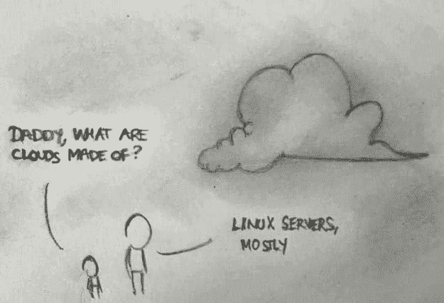
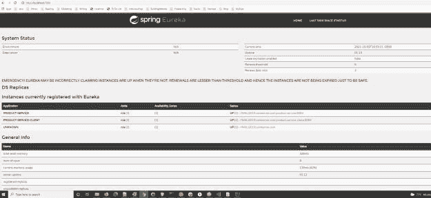
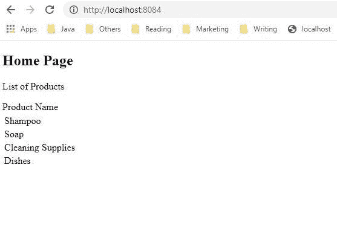

# 初学春云教程

> 原文：<https://blog.devgenius.io/spring-cloud-tutorial-for-beginners-20c8f6d82c2d?source=collection_archive---------2----------------------->

什么是春云？在这篇文章中，我将介绍面向初学者的 Spring Cloud 教程。如果你是 Spring 框架的新手，我会建议你从 [Spring Boot 和微服务](https://betterjavacode.com/core-java/spring-boot-and-microservices)和[简化 Spring 安全](https://betterjavacode.com/programming/simplifying-spring-security)开始。

正如 [Spring](https://spring.io/projects/spring-cloud) 网站上的官方文档所说:

" *Spring Cloud 为开发人员提供了在分布式系统中快速构建通用模式的工具——配置管理、服务发现、断路器、智能路由、微代理、控制总线、一次性令牌*"



*   什么是春云？
*   春季云特征
*   Spring Cloud 示例正在运行
*   结论

# 什么是春云？

Spring Cloud 提供现成的模式来开发分布式系统应用程序。在构建这样的应用程序时，大多数模式都很常见。

一个例子是当有多个微服务并且它们相互交互时。您必须保护每个服务。每个服务都与其他服务安全地通信。今后，如何保护这些服务？他们如何安全地通信？它们是如何无缝部署的？用于不同需求的其他自动化任务是什么？

使用 Spring Cloud，开发人员可以快速构建实现这些设计模式的应用程序，并在云平台(如 Heroku 或 Cloud Foundry)上部署应用程序。

# 春季云特征

Spring 框架是构建 Spring 云应用程序的基础。那么春云增加了哪些不同的功能呢？

# 服务注册和发现

Spring Boot 开始流行微服务架构。当您有多个服务相互交互时，您需要一个服务来注册每个服务，这主要是配置服务。然后，您需要一个发现服务来查找其他服务。

# 分发消息

基本上，spring cloud 提供了不同的工具来使我们基于微服务的架构取得成功。Spring Boot 有助于这些应用的快速发展。Spring Cloud 帮助协调和部署这些应用程序。Spring Cloud 的一个特性就是分布式消息传递。

微服务同步或异步通信。总的来说，Spring Cloud Bus 提供了一个链接分布式系统节点的消息代理。同样，Spring Cloud Stream 提供了一个框架来构建事件驱动的微服务。尽管如此，这个特性对于像 Kafka 或 ActiveMQ 这样的消息服务来说工作得很好。

# 服务对服务通信

Spring Cloud 提供了一个服务对服务的通信特性。通常，流程是这样的

*   注册服务
*   获取注册表
*   找到目标下游服务
*   调用该服务的 REST 端点

# 分布式配置

特别是，spring cloud config server 允许在客户端对分布式系统进行外部化配置。

除了这些特性之外，Spring Cloud 还提供了构建弹性和健壮服务的工具。一个这样的工具是[断路器](https://betterjavacode.com/spring-boot/how-to-use-circuit-breaker-in-spring-boot-application)。

举例来说，我们将创建两个微服务，一个微服务将调用另一个。我们将使用注册表服务(来自 Spring Cloud)的特性来注册这些微服务。

# Spring Cloud 示例正在运行

# 为注册服务构建 Eureka 服务器

首先，我们将创建一个使用 Eureka 服务并充当注册服务的服务。因此，在新的 Spring Boot 应用程序中添加以下依赖项:

```
plugins {
	id 'org.springframework.boot' version '2.5.5'
	id 'io.spring.dependency-management' version '1.0.11.RELEASE'
	id 'java'
}

group = 'com.betterjavacode'
version = '0.0.1-SNAPSHOT'
sourceCompatibility = '1.8'

repositories {
	mavenCentral()
}

ext {
	set('springCloudVersion', "2020.0.4")
}

dependencies {
	implementation 'org.springframework.cloud:spring-cloud-starter-netflix-eureka-server'
	testImplementation 'org.springframework.boot:spring-boot-starter-test'
}

dependencyManagement {
	imports {
		mavenBom "org.springframework.cloud:spring-cloud-dependencies:${springCloudVersion}"
	}
}

test {
	useJUnitPlatform()
}
```

一旦我们有了这种依赖性，我们就可以在我们的主类中启用 eureka 服务器。

```
package com.betterjavacode.eurekaserver;

import org.springframework.boot.SpringApplication;
import org.springframework.boot.autoconfigure.SpringBootApplication;
import org.springframework.cloud.netflix.eureka.server.EnableEurekaServer;

@SpringBootApplication
@EnableEurekaServer
public class EurekaserverApplication {

	public static void main(String[] args) {
		SpringApplication.run(EurekaserverApplication.class, args);
	}

}
```

将以下属性添加到`application.yml`

```
server:
  port: 7000

# Discovery Server Access
eureka:
  instance:
    hostname: localhost
  client:
    registerWithEureka: false
    fetchRegistry: false
  serviceUrl:
    defaultZone: http://${eureka.instance.hostname}:${server.port}/eureka/
```

属性`eureka.instance.client.register-with-eureka=false`和`eureka.instance.client.fetch-registry=false`表明这是一个注册服务器，不会使用自身进行注册。

# 退回产品的微服务

为了展示我们将如何使用注册表服务作为整个 Spring 云集成的一部分，我们将创建一个新的微服务。这个基于 REST 的微服务将返回一个产品列表。

```
plugins {
	id 'org.springframework.boot' version '2.5.5'
	id 'io.spring.dependency-management' version '1.0.11.RELEASE'
	id 'java'
}

group = 'com.betterjavacode'
version = '0.0.1-SNAPSHOT'
sourceCompatibility = '1.8'

repositories {
	mavenCentral()
}

ext {
	set('springCloudVersion', "2020.0.4")
}

dependencies {
	implementation 'org.springframework.boot:spring-boot-starter-web'
	implementation 'org.springframework.cloud:spring-cloud-starter-netflix-eureka-client'
	testImplementation 'org.springframework.boot:spring-boot-starter-test'
}

dependencyManagement {
	imports {
		mavenBom "org.springframework.cloud:spring-cloud-dependencies:${springCloudVersion}"
	}
}

test {
	useJUnitPlatform()
}
```

考虑到这一点，该服务的 RESTController 将如下所示:

```
package com.betterjavacode.productservice.controllers;

import org.springframework.web.bind.annotation.GetMapping;
import org.springframework.web.bind.annotation.RestController;

import java.util.ArrayList;
import java.util.List;

@RestController
public class ProductController
{
    @GetMapping("/products")
    public List getAllProducts ()
    {
        List products = new ArrayList<>();
        products.add("Shampoo");
        products.add("Soap");
        products.add("Cleaning Supplies");
        products.add("Dishes");

        return products;
    }
}
```

这个应用程序的 application.yml 文件如下所示

```
spring:
  application:
    name: product-service

server:
  port: 8083

eureka:
  client:
    registerWithEureka: true
    fetchRegistry: true
    serviceUrl:
      defaultZone: http://localhost:7000/eureka/
  instance:
    hostname: localhost
```

这里我们有 `eureka.client.registerWithEureka=true`和 `eureka.client.fetchRegistry=true`，因为我们希望我们的服务注册到运行注册服务的 Eureka 服务器。随后，我们这个服务的主类将有一个注释`@EnableDiscoveryClient`，它将允许这个服务被 Eureka 服务器发现。

# 客户服务呼叫产品服务

现在，让我们创建另一个服务，它将是产品服务的客户端服务。它将非常类似于产品服务，除了它将基于 MVC，所以我们将使用百里香叶模板来调用这个服务。

```
package com.betterjavacode.productserviceclient.controllers;

import org.springframework.beans.factory.annotation.Autowired;
import org.springframework.cloud.client.ServiceInstance;
import org.springframework.cloud.client.discovery.DiscoveryClient;
import org.springframework.stereotype.Controller;
import org.springframework.ui.Model;
import org.springframework.web.bind.annotation.GetMapping;
import org.springframework.web.client.RestTemplate;

import java.util.List;

@Controller
public class ProductController
{
    @Autowired
    private DiscoveryClient discoveryClient;

    @GetMapping("/")
    public String home(Model model)
    {
        List serviceInstances = discoveryClient.getInstances("product" +
                "-service");

        if(serviceInstances != null && !serviceInstances.isEmpty())
        {
            ServiceInstance serviceInstance = serviceInstances.get(0);
            String url = serviceInstance.getUri().toString();
            url = url + "/products";
            RestTemplate restTemplate = new RestTemplate();
            List products = restTemplate.getForObject(url, List.class);
            model.addAttribute("products", products);
        }

        return "home";
    }
}
```

`application.yml`该服务将如下所示:

```
spring:
  application:
    name: product-service-client

server:
  port: 8084

eureka:
  client:
    registerWithEureka: true
    fetchRegistry: true
    serviceUrl:
      defaultZone: http://localhost:7000/eureka/
  instance:
    hostname: localhost
```

百里香模板家庭基本上会列出一个表格形式的产品。

# 运行服务

简而言之，运行所有的服务——从 Eureka 服务器、产品服务和产品服务客户端开始。现在，如果我们访问 eureka server，我们将看到向其注册的服务列表，如下所示:



您可以看到两个服务都已注册。如果我们在`http://localhost:8084/`访问我们的产品服务客户端应用程序，我们将看到产品列表



最后，我们看到了一个使用 Eureka server 作为 Spring Cloud 注册服务的简单演示。如果你想了解更多关于 Spring Cloud Config 的知识，我强烈推荐 udemy 的[分布式配置 Spring Cloud Config](https://click.linksynergy.com/link?id=OXUmh7z7NGI&offerid=507388.1307900&type=2&murl=https%3A%2F%2Fwww.udemy.com%2Fcourse%2Fdistributed-configuration-with-spring-cloud-config%2F) 课程。

# 结论

在这篇文章中，我们了解了春云。Spring Cloud 中有许多功能需要评估。我只介绍了大多数开发人员在使用 Spring Cloud 时必须使用的一个特性。如果你还想了解春天的安全，你可以在这里查阅我的书[。](https://gum.co/VgSdH)

*原载于 2021 年 10 月 11 日*[](https://betterjavacode.com/spring-boot/spring-cloud-tutorial-for-beginners)**。**