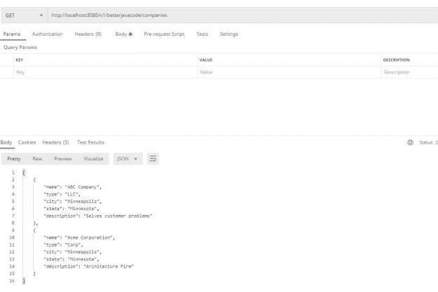
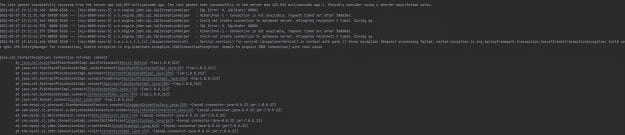
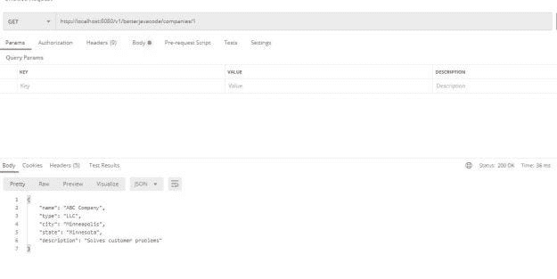
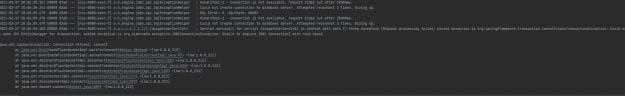
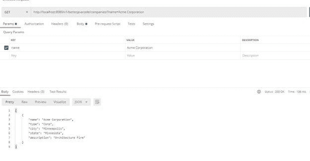
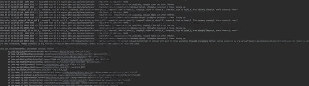

# Spring 重试与 Resilience4j 重试

> 原文：<https://blog.devgenius.io/spring-retry-vs-resilience4j-retry-ac92606bd795?source=collection_archive---------1----------------------->

在这篇文章中，我将展示两种重试的比较——Spring 重试与 Resilience4j 重试。通常，您可以在实现时将重试与断路器结合使用，以使您的应用程序更加健壮。我已经报道了[断路器演示](https://betterjavacode.com/spring-boot/how-to-use-circuit-breaker-in-spring-boot-application)。另外，如果你有兴趣了解更多关于 Spring 安全的知识，我已经用 Okta Demo 更新了我的书[简化 Spring 安全](https://gumroad.com/l/VgSdH)。

# Spring 重试与 Resilience4j 重试

[弹簧重试](https://docs.spring.io/spring-batch/docs/current/reference/html/retry.html)允许应用程序自动重试失败的操作。在大多数情况下，如果您的服务正在调用另一个服务，而另一个服务由于某种原因没有响应，您可以使用 Spring Retry 来重试相同的操作。这提供了另一种使您的服务更加可用的方法。

重试使您的应用程序更健壮，更不容易失败。您可以在您认为可能失败的方法上配置 Spring Retry，也可以配置一个`RetryTemplate`。易于配置使得 Spring Retry 成为编写代码时更容易的选择。

另一方面，Resilience4j Retry 模块提供了同样简单的配置——通过代码或通过属性。

在这篇文章中，我将展示如何在调用任何方法或服务时使用 Spring Retry 和 Resilience4j Retry 模块。

# 何时使用重试？

通常，在某些情况下，您应该考虑重试操作。

1.  对 REST 端点的 HTTP 调用
2.  从 SQS 发送或检索消息
3.  远程过程调用或 web 服务
4.  从数据库获取或存储数据

在这种情况下，如果操作失败，我们可以返回一个错误。但是随着应用程序的可用性变得越来越重要，大多数时候，这些错误是微不足道的，大多数服务在几毫秒到几秒内就可以恢复在线。

因此，应用重试是有意义的。您必须注意，您正在应用重试的操作必须是幂等的。假设，您的应用程序发送了一个请求，目标服务收到了请求，但是在此期间发生了一些事情，您的目标服务无法及时响应。然后，使用重试，目标服务不应该将重试尝试视为单独的或新的请求。

# 弹簧重试

在这一节中，我将展示使用 Spring Retry 的各种方法。首先，我们将有一个简单的 Spring Boot REST 应用程序来从数据库中检索公司列表。像往常一样，我不会展示如何构建 Spring Boot 应用程序。你可以访问我的其他博客。

# 梯度依赖性

要使用 Spring Retry，我们的配置中需要两个依赖项。

```
implementation 'org.springframework.retry:spring-retry:1.3.1' implementation 'org.springframework:spring-aspects:5.3.5'
```

# 启用重试批注

一旦我们有了`spring-retry`依赖，我们将能够用注释`@EnableRetry`注释我们的主类，如下所示:

```
package com.betterjavacode.retrydemo;

import org.springframework.boot.SpringApplication;
import org.springframework.boot.autoconfigure.SpringBootApplication;
import org.springframework.context.annotation.Bean;
import org.springframework.data.jpa.repository.config.EnableJpaRepositories;
import org.springframework.retry.annotation.EnableRetry;
import org.springframework.retry.backoff.FixedBackOffPolicy;
import org.springframework.retry.policy.SimpleRetryPolicy;
import org.springframework.retry.support.RetryTemplate;

@SpringBootApplication
@EnableRetry
@EnableJpaRepositories(basePackages = "com.betterjavacode.retrydemo.daos")
public class RetrydemoApplication {

	public static void main(String[] args) {
		SpringApplication.run(RetrydemoApplication.class, args);
	}

	@Bean
	public RetryTemplate retryTemplate()
	{
		RetryTemplate retryTemplate = new RetryTemplate();

		FixedBackOffPolicy backOffPolicy = new FixedBackOffPolicy();
		backOffPolicy.setBackOffPeriod(100);

		SimpleRetryPolicy simpleRetryPolicy = new SimpleRetryPolicy();
		simpleRetryPolicy.setMaxAttempts(2);

		retryTemplate.setRetryPolicy(simpleRetryPolicy);
		retryTemplate.setBackOffPolicy(backOffPolicy);
		return retryTemplate;
	}

}
```

我会在后面解释剩下的代码，但是请注意这里的注释`@EnableRetry`。这将在我们的应用程序中启用重试。

# 休息控制器

我们将以两种不同的方式展示 Spring Retry。

1.  使用`@Retryable`注释
2.  使用`RetryTemplate`

我们的 REST 控制器将为我们获取一个公司列表，一个按 id 的公司，或者一个按名称的公司列表。它看起来会像下面这样:

```
package com.betterjavacode.retrydemo.controllers;

import com.betterjavacode.retrydemo.dtos.CompanyDto;
import com.betterjavacode.retrydemo.service.CompanyService;
import org.springframework.beans.factory.annotation.Autowired;
import org.springframework.http.HttpStatus;
import org.springframework.http.ResponseEntity;
import org.springframework.web.bind.annotation.*;

import java.util.List;

@RestController
@RequestMapping("/v1/betterjavacode/companies")
public class CompanyController
{
    @Autowired
    CompanyService companyService;

    @GetMapping
    public ResponseEntity<List> getAllCompanies()
    {
        List companyDtos = companyService.getAllCompanies();

        if(companyDtos.isEmpty())
        {
            return new ResponseEntity<>(HttpStatus.NO_CONTENT);
        }

        return new ResponseEntity<>(companyDtos, HttpStatus.OK);
    }

    @GetMapping("/{id}")
    public ResponseEntity getCompanyById(@PathVariable("id") long id)
    {
        CompanyDto companyDto = companyService.getCompany(id);
        if(companyDto == null)
        {
            return new ResponseEntity<>(HttpStatus.NO_CONTENT);
        }
        return new ResponseEntity<>(companyDto, HttpStatus.OK);
    }

    @GetMapping("/")
    public ResponseEntity<List> searchCompanies(@RequestParam("name") String companyName)
    {
        List companyDtos = companyService.searchCompanyByName(companyName);
        if(companyDtos.isEmpty())
        {
            return new ResponseEntity<>(HttpStatus.NO_CONTENT);
        }

        return new ResponseEntity<>(companyDtos, HttpStatus.OK);
    }
}
```

在我们的控制器中，我们使用了一个名为`CompanyService`的`@Service`对象。这个服务对象为我们提供了一种实现获取公司数据的方法的方式。

# 具有各种重试配置的服务

因此，我们将看看如何使用注释`@Retryable`:

```
@Retryable(value = SQLException.class, maxAttempts = 2, backoff =    @Backoff(delay = 100))
    public List getAllCompanies()
    {
        List companies =  companyRepository.findAll();
        List companyDtos = new ArrayList<>();
        for(Company company : companies)
        {
            CompanyDto companyDto = new CompanyDto(company.getName(), company.getType(),
                    company.getCity(), company.getState(), company.getDescription());
            companyDtos.add(companyDto);
        }

        return companyDtos;
    }
```

在上面的代码中，我们获取了一个公司列表。如果该方法未能获取结果，并出现与`SQLException`相关的任何异常，我们将重试获取。我们将按照`maxAttempts`的配置重试两次。在每次尝试之间，会有 100 毫秒的延迟。现在，如果我们运行我们的应用程序并调用这个方法，我们将看到这个重试是如何工作的。

为了模拟该错误，我将从 Windows 服务中停止 SQL 服务。我将在下面显示成功响应和重试响应:



正如你在上面的截图中看到的，有两次重试的尝试。在每次重试中，它会尝试连接 MySQL 服务器三次。

# 重试模板

类似地，我们也可以使用 Spring-Retry 提供的重试模板。在下面的代码中，我展示了一个我在`CompanyService`中添加的方法来获取 id 的公司数据。

```
public CompanyDto getCompany(long id)
{
        CompanyDto companyDto = retryTemplate.execute(rt -> {
           Company company = companyRepository.findById(id).get();
           CompanyDto localCompanyDto = new CompanyDto(company.getName(), company.getType(),
                   company.getCity(),
                   company.getState(), company.getDescription());
           return localCompanyDto;
        });

        return companyDto;
}
```

这个 retryTemplate bean 用`simpleRetryPolicy`配置，有两次尝试，每次尝试之间有 100 毫秒的延迟。然而，如果我尝试以与对`@Retryable`相同的方式执行该方法，我们将看到下面的输出:



如上所述，我所做的就是从 windows 服务中停止我的 MySQL 服务，并允许我的方法重试。

# Resilience4j 重试

使用`resilience4j-retry`库时，您可以向`RetryRegistry`构建器注册一个自定义全局`RetryConfig`。使用此注册表建立重试。在获取公司数据的演示中，我们添加了一个新的方法来按名称检索公司。

这个方法将如下所示:

```
public List searchCompanyByName(String name)
    {
        LOGGER.info("Search for company = {}", name);

        RetryConfig retryConfig =
                RetryConfig.custom().maxAttempts(4).waitDuration(Duration.of(2, SECONDS)).build();         

        RetryRegistry retryRegistry = RetryRegistry.of(retryConfig);

        Retry retryConfiguration = retryRegistry.retry("companySearchService", retryConfig);

        Supplier<List> companiesSupplier = () -> companyRepository.findAllByName(name);

        Supplier<List> retryingCompaniesSearch =
                Retry.decorateSupplier(retryConfiguration, companiesSupplier);

        List companyDtos = new ArrayList<>();
        List companies = retryingCompaniesSearch.get();
        LOGGER.info("Retrying..");
        for(Company company : companies)
        {
            CompanyDto companyDto = new CompanyDto(company.getName(), company.getType(),
                    company.getCity(), company.getState(), company.getDescription());
            companyDtos.add(companyDto);
        }

        return companyDtos;
    }
```

在上面的方法中，我们首先创建`RetryConfig`。我们创建一个`RetryRegistry`并在注册表中添加`RetryConfig`。然后当我们创建获取公司列表的调用时。我们用`retryConfiguration`来修饰这个调用。

# 具有 Resilience4j 的自定义-重试

`RetryConfig`提供不同的定制:

1.  max attempts-3 是默认的重试次数。
2.  waitDuration —每次重试之间的固定等待时间。
3.  intervalFunction —修改故障后等待间隔的功能。
4.  retryOnResultPredicate 配置一个谓词，用于评估是否应该重试结果。
5.  retryExceptions 配置用于重试的可抛出类的列表
6.  ignoreExceptions 配置被忽略的可抛出类的列表
7.  failAfterMaxRetries 一个布尔值，用于在重试次数达到配置的最大尝试次数时启用或禁用引发 maxretriesexceededededexception

# 演示

现在，让我们看看用`resilience4j-retry`执行这个方法会发生什么。以下屏幕截图显示了 SQL 服务仍在运行时的成功响应。



如果我停止 SQL 服务，我们将看到重试尝试 4 次，因为我们已将其配置为 4 次。



# 密码

这个演示的代码可以在我的 [github 库](https://github.com/yogsma/betterjavacode/tree/main/retrydemo)中找到。

# 结论

在这篇文章中，我展示了 Spring Retry 和 Resilience4j Retry 之间的比较。何时使用这些库取决于您的场景。通常，如果您还计划 Resilience4j 断路器模块，resilience4j 重试会很顺利。使用`RetryTemplate`，弹簧重试对于各种配置都很方便。

如果你喜欢这篇文章，请在这里订阅我的博客。

*原载于 2021 年 3 月 28 日 https://betterjavacode.com*[](https://betterjavacode.com/programming/spring-retry-vs-resilience4j-retry)**。**