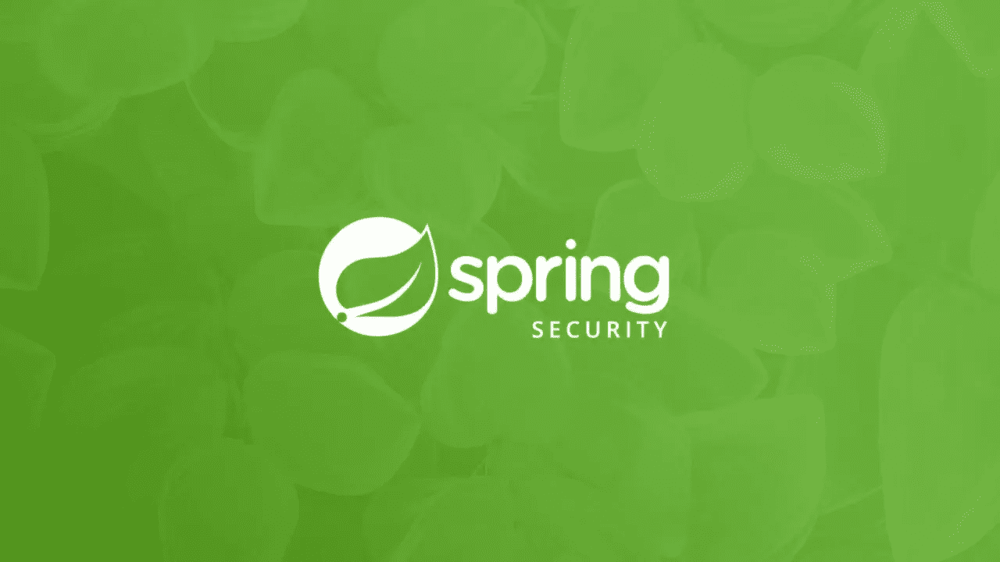
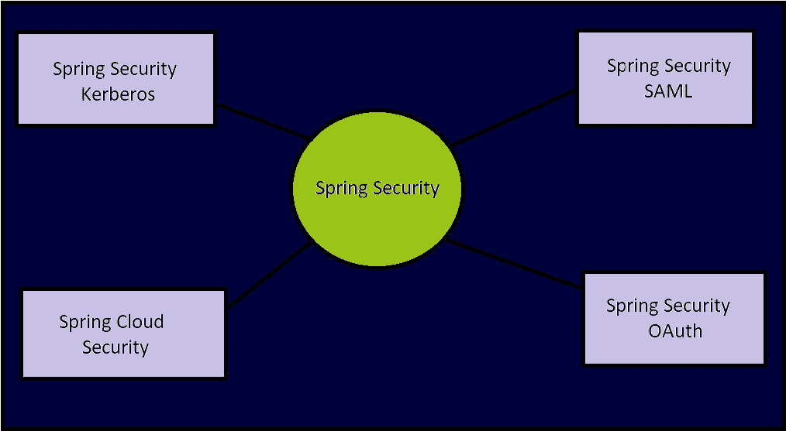
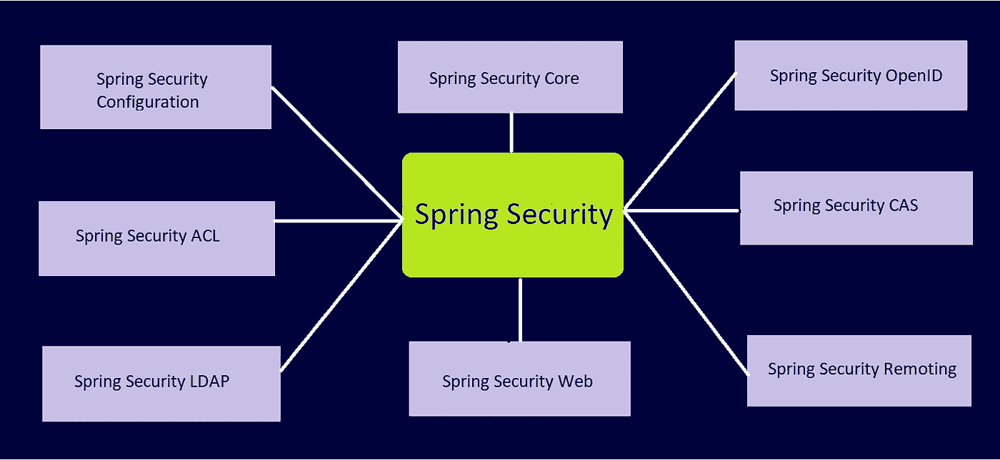

# Spring Security——Spring Security 简介(第 1 部分)

> 原文：<https://blog.devgenius.io/spring-security-introduction-to-spring-security-part-1-80312e556d00?source=collection_archive---------6----------------------->

最近，我一直在研究 Spring 安全的各个方面。因此，我开始了一系列的 **Spring Security** 来涵盖 Spring 应用程序中 Spring Security &实现的各个组件。希望这个系列能帮助你获得更多的春季安全知识。我建议你在阅读博客的同时或者刚刚阅读完博客之后，亲自实践在你的应用程序中实现代码。

在这篇文章中，我将从理论上解释 Spring 安全&包括以下内容:

1.  **什么是春安**
2.  **春安的特色**
3.  **弹簧安全核心部件**
4.  **弹簧安全模块**

# **什么是春安？**

在转向 Spring Security 之前，让我们先指出在任何应用程序中使用安全性的目的是什么。

> 为了保护应用程序及其敏感信息免受未经授权的访问，我们需要在应用程序中实现安全性。

pring Security 是一个强大的高度可定制的框架，为我们的应用程序提供安全性。我说的安全性，不是指 JVM 级别的安全性，我指的是企业应用的**应用层/Web 层/方法层**安全性。Spring security 帮助我们在**认证**以及**授权** & 方面保护我们的应用程序，当我说它帮助我们时，并不意味着 Spring security 会自动处理我们的应用程序。在创建我们的项目时，我们需要第一次在我们的应用程序中配置它。

# Spring Security 的特性

*   认证和授权功能。
*   灵活，易于开发和单元测试的应用程序。
*   登录和注销功能。
*   使用 Spring Web 服务提供 Web 套接字安全性。
*   对认证和授权的全面和可扩展的支持。
*   Servlet API 集成&与 Spring Web MVC 的可选集成。
*   基于角色允许/阻止登录用户访问 URL。
*   防范诸如会话固定、点击劫持、跨站点请求伪造等攻击。
*   以最少的 XML 配置支持 XML，并支持注释。
*   支持各种第三方集成，以增强安全功能。

# **弹簧安全核心部件**

Spring Security 有各种各样的组件，我们将讨论一些最常用的重要组件&在我们的应用程序中实现 Spring Security 时，我们也会用到它们。在本文中，我只是解释了每个组件的基本细节&将在我以后的文章中详细解释实现。

*   **认证**:根据凭证识别想要访问应用程序的用户的过程。
*   **授权:**授权是在访问任何数据之前检查用户权限的过程。或者简单地说，它将检查想要访问应用程序任何模块的用户的权限。
*   **主体:**主体*是*当前登录的用户。但是，您通过绑定到当前线程的安全上下文来检索它，因此它也绑定到当前请求及其会话。
*   **授予权限:**查看用户的权限
*   **角色:**角色是指一组权限/权限。
*   **认证管理器:**认证管理器是认证提供者&的容器，负责管理 spring security 中的认证配置。它验证用户并请求*。*
*   **认证管理器构建器:**用于创建认证管理器。它允许我们轻松地内置内存认证、LDAP 认证、基于 JDBC 的认证等。
*   **身份验证提供者:**身份验证提供者是包含身份验证方法的接口，我们可以在其中编写自定义代码来进行用户身份验证。
*   **用户详情服务:**是 Spring Security 的核心接口之一。任何请求的身份验证主要依赖于 UserDetailsService 接口的实现。
*   **密码编码器:**用于对密码进行编码的接口。这是一种单向转换，意味着你只能对密码进行编码，但没有办法将密码解码回**明文**形式。

# **弹簧安全模块**

Spring 框架主要提供了以下五个模块来保护基于 Spring 的应用程序。Spring Security 是其所有模块的基础模块。

*   春天的安全:`spring-security-core.jar`
*   Spring Security SAML: `spring-security-saml2-core.jar`
*   春天安全 OAuth: `spring-security-oauth2-core.jar`
*   Spring 安全 Kerberos: `spring-security-kerberos-core.jar`
*   春云安全:`spring-cloud-security.jar`

所有的安全模块都用它们的 jar 文件分成单独的子模块，这样我们可以根据我们的需求集成每个安全模块。以下是一些子模块及其 jar 文件:

*   弹簧安全核心:`spring-security-core.jar`
*   Spring 安全配置:`spring-security-config.jar`
*   春天安全网:`spring-security-web.jar`
*   Spring 安全 ACL: `spring-security-acl.jar`
*   Spring 安全 LDAP: `spring-security-ldap.jar`
*   Spring Security OpenID: `spring-security-openid.jar`
*   春季安全 CAS: `spring-security-cas.jar`
*   Spring 安全远程处理:`spring-security-remoting.jar`

# **春安与 JWT**

Spring Security 附带了基于会话的认证，这对于保护 MVC web 应用程序非常有用，但是在某些情况下，当我们需要无状态认证时，Spring 允许我们为 REST APIs 配置基于 JWT 的认证和授权。在下一篇文章中，我将通过实现详细介绍这一点。

> 资源

 [## 春天安全

### 如果您准备开始保护应用程序，请参阅 servlet 和 reactive 的入门部分。这些…

docs.spring.io](https://docs.spring.io/spring-security/reference/index.html) 

# #结论

在本文中，我试图解释 Spring 安全的基础。如果您是 Spring security 的新手，需要以正确的方式进行一些练习。但是一旦你理解了它的内部结构并设法设置了初始配置，它的使用就变得相对简单了&你会觉得用 **Spring Framework 处理安全性更舒服。**

在我的 **Spring Security 系列**的后续文章中，我将展示每个安全模块及其实现。

我希望这是有用的。一声‘拍手’一定会鼓励我多写文章，多分享我的知识。

你可以 [**在 LinkedIn**](https://www.linkedin.com/in/pritam-kumar-85b64316b) 上联系我，讨论更多。所以请随意连接。