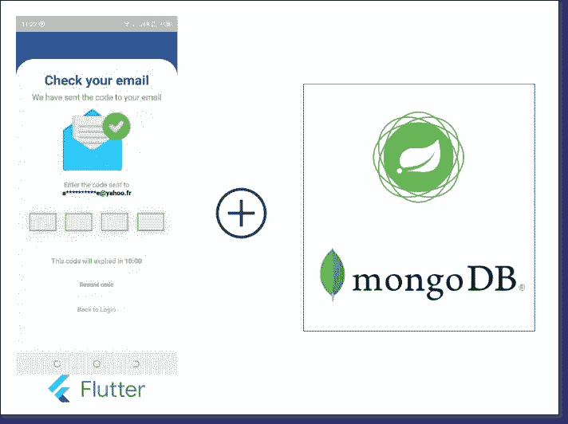
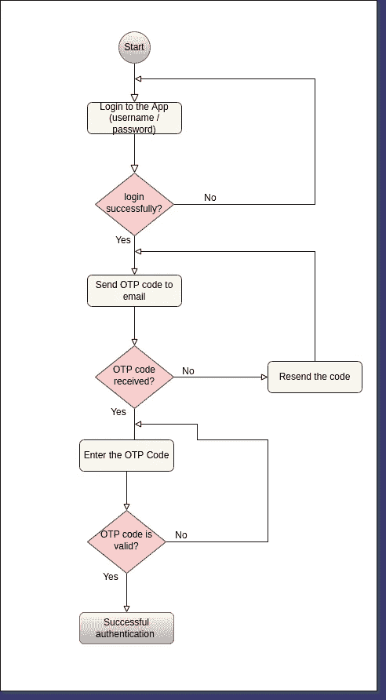
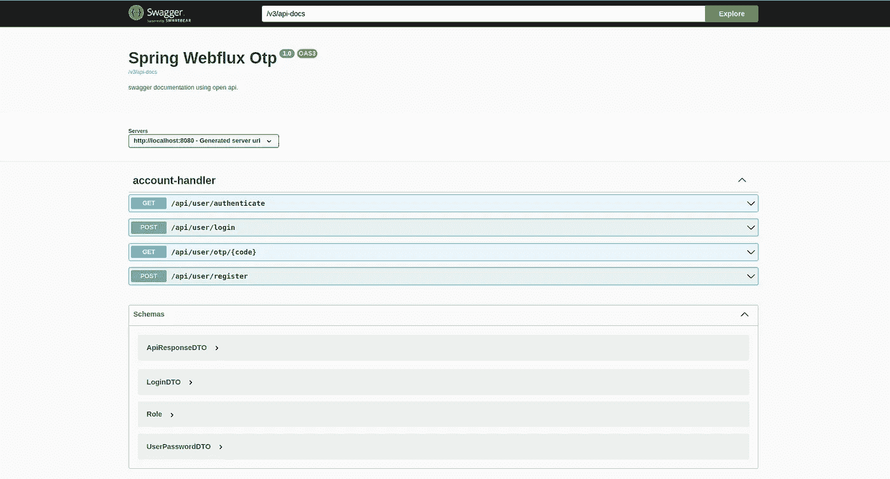
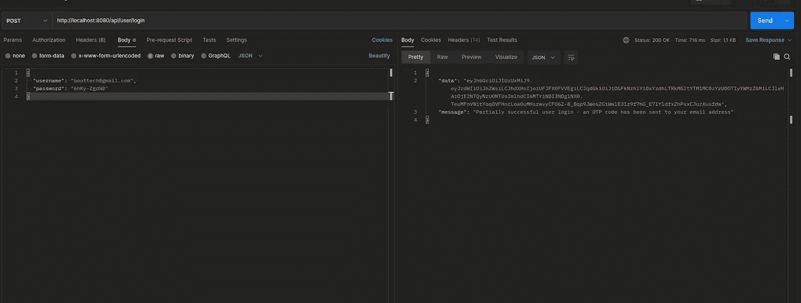
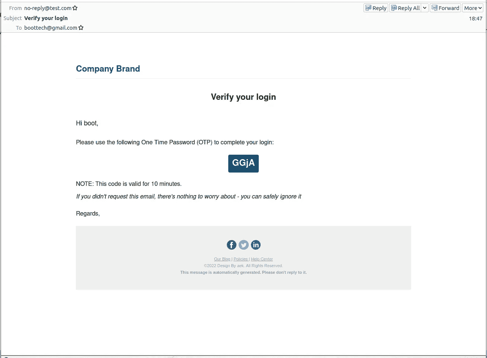

# Spring WebFlux 安全 OTP 电子邮件与 MongoDB 和 Flutter 1/2

> 原文：<https://blog.devgenius.io/spring-webflux-security-otp-email-with-mongodb-and-flutter-1-2-f73e1d94ec7a?source=collection_archive---------1----------------------->

在这个故事中，我们将看到如何在一个反应式 Spring Webflux 中使用 MongoDB 和 Flutter 来集成 Spring 安全性。

# 先决条件

这是遵循第 1 部分的所有先决条件的列表:

*   Java 17
*   Spring Boot /入门网站流量 2.6.7
*   [龙目岛](https://mvnrepository.com/artifact/org.projectlombok/lombok) 1.18
*   Maven 3.6.3
*   邮递员
*   Mongo 4.4。

# 概观

## 什么是一次性密码(OTP)？

**一次性密码** ( **OTP** )，也称为**一次性 PIN 码**、**一次性授权码** ( **OTAC** )或**动态密码**，是在计算机系统或其他数字设备上仅对一次登录会话或交易有效的密码。—[https://en.wikipedia.org/wiki/One-time_password](https://en.wikipedia.org/wiki/One-time_password)

## 使用 OTP 有什么好处？

与静态密码相比，OTPs 最重要的优点是它们不易受到重放攻击。这意味着试图记录已经用于登录服务或进行交易的 OTP 的潜在入侵者将不能使用它，因为它将不再有效。

# 入门指南

我们将使用具有 Spring WebFlux 安全性的 JSON Web Token (JWT)提供者来实现基于令牌的认证和授权。

下图描述了身份验证流程:

我们将从从 [start.spring.io](http://start.spring.io/) 创建一个简单的 Spring Boot 项目开始，它具有以下依赖项: *Spring Reactive Web、Spring Security、Spring Data Reactive MongoDB NoSQL、Java Mail Sender、百里香、Lombok 和验证*。

以下是 maven 项目的依赖关系:

首先，让我们创建一个实现 UserDetails 的用户 POJO 类。我们使用注释 [@Document](https://docs.spring.io/spring-data/data-mongodb/docs/current/api/org/springframework/data/mongodb/core/mapping/Document.html) 来设置模型将使用的集合名称。

我们的用户类包含管理 OTP 代码和用户权限的嵌入式模型`OtpRequest` et `Role` 。

# 实现 ReactiveUserDetailsService

`ReactiveUserDetailsService`定义了一种方法，Spring Security 使用该方法通过返回`Mono<UserDetails>.`的用户名来检索用户

我们将创建一个名为 UserDetailsService 的类，它覆盖 ReactiveUserDetailsService 接口的方法`findByUsername()`。
在这个方法中，我们使用 UserRepository 检索用户对象，如果它存在的话。

# 配置 Spring 安全性

在*配置*包中，创建将管理所有安全方面的`SecurityConfiguration` 类。

我来解释一下上面的代码。

–`@EnableWebFluxSecurity`允许 Spring Security 中的 WebFlux 支持。

–`@EnableReactiveMethodSecurity`允许在反应式应用程序中提供方法安全性支持，然后使用方法级注释，比如@PreAuthorize("isAuthenticated()")

–`passwordEncoder()`bean 编码密码的方法

–`reactiveauthenticationManager()`bean 方法，使用 ReactiveUserDetailsService 来验证所提供的用户名和密码。

–`springSecurityFilterChain(ServerHttpSecurity http)` 以 ServerHttpSecurity 为参数的 bean 方法。ServerHttpSecurity 类似于 Spring Security 的 HttpSecurity，只是针对 WebFlux。它允许为特定的 HTTP 请求配置基于 web 的安全性。

# WebFlux 处理器和路由器功能

现在，让我们实现路由器和管理器功能。首先，我们将创建包含`login(), register(), otpCheckCode(), otpResendCode()`方法的 AccountHandler 类。

`handle`函数方法接受`ServerRequest`并返回`Mono<ServerResponse>`。

传入的请求被路由到一个带有`RouterFunction.`的处理函数

# 运行和测试

运行应用程序。

在 web 浏览器中打开[http://localhost:8080/web jars/swagger-ui/index . html](http://localhost:8080/webjars/swagger-ui/index.html#/)URL。

swagger 文档页面

到目前为止，它是有效的👌

第一步是创建一个新用户。

我们使用之前创建的用户的用户名和密码登录。

信息正确后，我们将创建一个包含以下消息的临时令牌(10 分钟): ***部分成功的用户登录—一个 OTP 代码已发送到您的电子邮件地址***

邮件的内容如下:

# 继续阅读

在《T21》第二部中，我们用一个使用 Flutter 和 Dart 的移动应用程序实现了整个过程。

完整的后端源代码可以在我的 [GitHub 仓库中找到。](https://github.com/anicetkeric/webflux-otp/tree/main/spring-security-webflux-otp)

如果你喜欢这篇文章，请给它一些掌声支持。

快乐编码🙂。

# 参考

*   http://nilhcem.com/FakeSMTP/
*   【https://www.viralpatel.net/java-create-validate-jwt-token/ 
*   [https://docs . spring . io/spring-security/site/docs/5 . 2 . 0 . release/reference/html/JC-web flux . html](https://docs.spring.io/spring-security/site/docs/5.2.0.RELEASE/reference/html/jc-webflux.html)