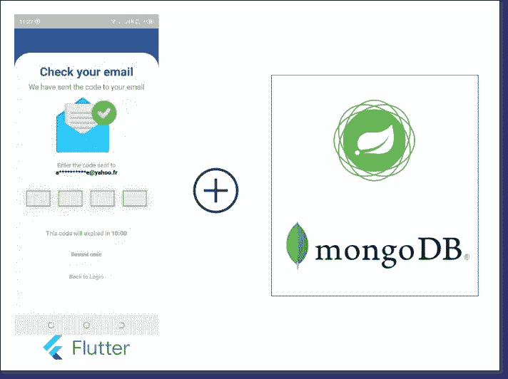
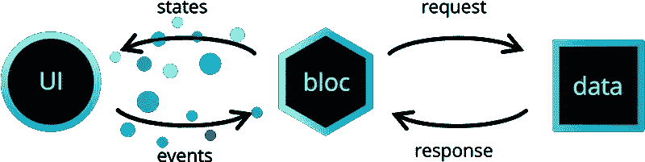
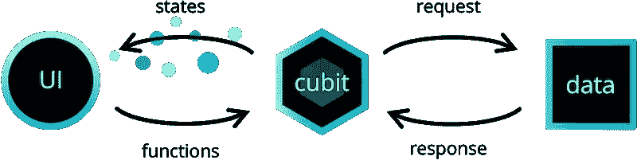
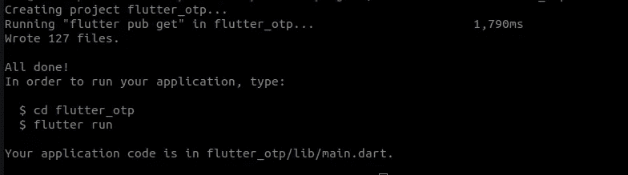
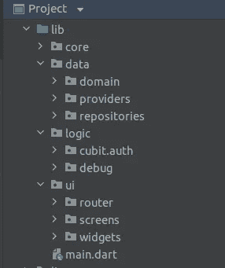
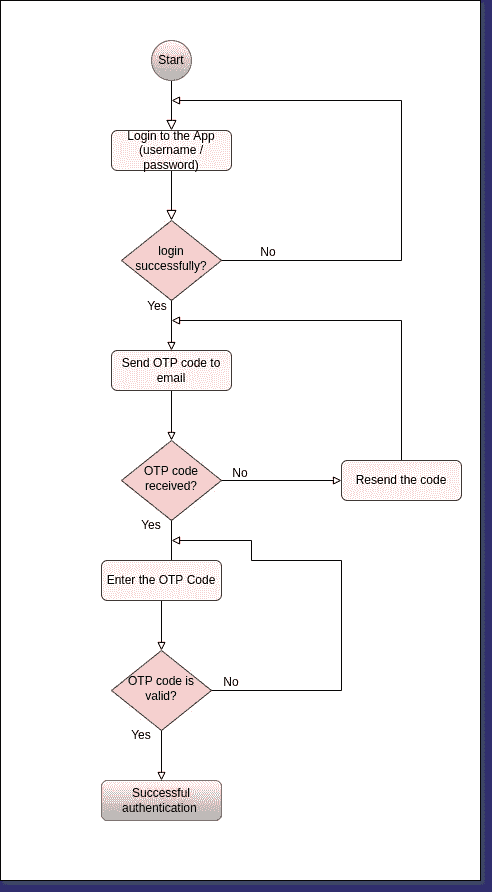
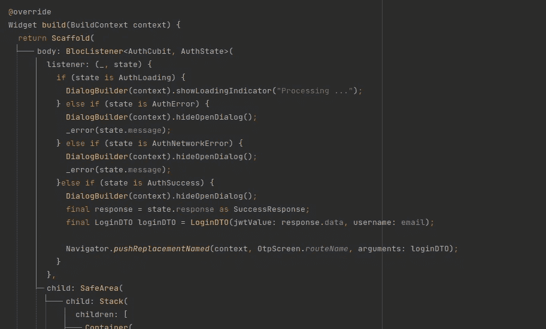

# Spring WebFlux 安全 OTP 电子邮件与 MongoDB 和 Flutter 2/2

> 原文：<https://blog.devgenius.io/spring-webflux-security-otp-email-with-mongodb-and-flutter-2-2-6be473576f16?source=collection_archive---------9----------------------->

在[之前的故事](/spring-webflux-security-otp-email-with-mongodb-and-flutter-1-2-f73e1d94ec7a)中，我们用 Spring Security Webflux 覆盖了 OTP 代码。我们在用户登录时向其发送了 OTP 代码。在这个故事中，我们将使用 Flutter 实现移动应用程序的登录过程。



# 先决条件

这是遵循第 2 部分的所有先决条件的列表:

*   颤动 3.0.0
*   Dart 2.17.0
*   Android Studio 或 Visual Studio 代码
*   运行第 1 部分的后端

# 概观

我们将使用 Cubit/Bloc 来使用我们的后端 API，以及如何在 Flutter 应用程序中使用它。

## 什么是阻塞？

> 业务逻辑组件(BLoC)允许您将业务逻辑与 UI 分离开来。以块的形式编写代码使得编写和重用测试更加容易。

## 集团架构



bloclibrary.dev

使用 bloc 库允许我们将应用程序分成三层:

*   介绍会；展示会
*   业务逻辑
*   数据(存储库、数据提供者)

## 肘

`**Cubit**`是一个扩展了`**BlocBase**`的类，可以扩展到管理任何类型的状态。



bloclibrary.dev

正如你在上面的图表中看到的，在 Cubit 中，我们不再有事件，取而代之的是函数。这些函数将触发一个更新 UI 的状态变化。

# 入门指南

现在我们开始创建一个新的 flutter 项目。在终端中键入以下命令:

```
flutter create flutter_otp
```



## 添加依赖关系

首先，您需要将以下依赖项添加到`pubspec.yaml`文件中:

*   **http** 包从 web 服务中获取数据。
*   **flutter_bloc** 用于使块和肘易于集成
*   **等价的**能够比较`Dart`中的对象

## 项目结构

我们的项目结构将如下所示:



项目结构

*   核心包:管理所有项目层共享的所有工具类和组件
*   **数据**包:它包含领域包(负责创建数据模型类、枚举和 dto)，存储库(负责创建和操作数据。存储库层是一个包装器，包装一个或多个数据提供者(Bloc 层与之通信)和提供者(负责提供数据)。数据提供者必须是通用的。
*   **逻辑**包:负责管理业务逻辑。这一层可以依赖一个或多个存储库来检索构建应用程序状态所需的数据。
*   **ui** 包:负责 ui 设计。它应该处理用户输入和应用程序生命周期事件。

我们将从数据层开始，这是最低级别的层，我们的工作方式到表示层。

还记得我们在本故事的第 1 部分中描述的认证流程吗？



## 数据提供者

让我们创建我们的第一个提供者类`AuthProvider`。这个类与 HTTP 请求交互，以使用我们的 REST API。

## 贮藏室ˌ仓库

转换是在该层中由数据提供者返回的原始数据上完成的。

## 业务逻辑层

现在让我们使用 Bloc/Cubit 将数据发送到 UI。我们需要创建保存我们的`AuthCubit`和`AuthState`类的文件。

*   **认证状态**

UI 将根据它从 Bloc 收到的状态进行更新。

> auth initial—*S*state 将指示用户尚未采取任何操作，我们应该显示初始 UI
> AuthLoading —将显示进度指示器
> AuthNetworkError —将显示网络错误消息
> AuthError—将显示出错的错误消息
> auth success—将显示成功的数据加载指示器
> AuthSubmit — 将显示成功提交消息

*   **AuthCubit**

让我们实现 AuthCubit，它将运行 AuthRepository 逻辑并发出状态。

## **演讲**

现在是完成表示层的时候了。我们首先需要为 router 类中的 AuthCubit 提供一个`BlocProvider`。

**login_screen.dart**



我们将使用 BlocListener，它是一个 Flutter 小部件，接受一个 BlocWidgetListener 和一个可选的块，并在块的状态改变时调用侦听器。

# 决赛成绩


如果你喜欢这篇文章，请给它一些掌声支持。

这个项目的代码上传到 Github [这里](https://github.com/anicetkeric/webflux-otp/tree/main/flutter_otp)。

# 参考

*   [https://bloclibrary.dev/#/](https://bloclibrary.dev/#/)
*   [https://resocoder . com/2020/08/04/flutter-bloc-cubit-tutorial/](https://resocoder.com/2020/08/04/flutter-bloc-cubit-tutorial/)