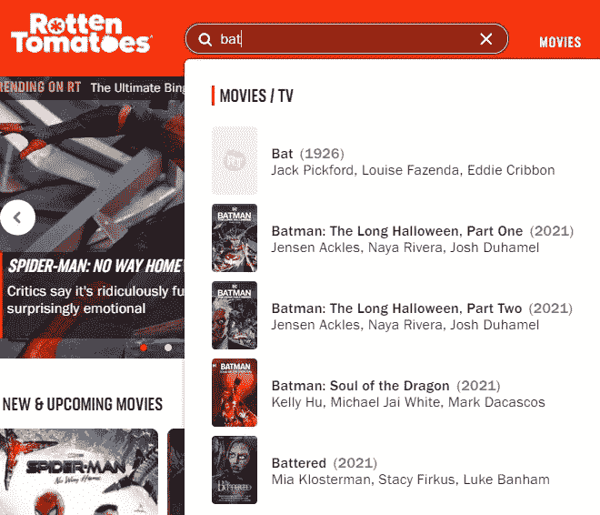
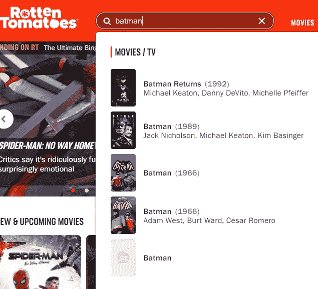
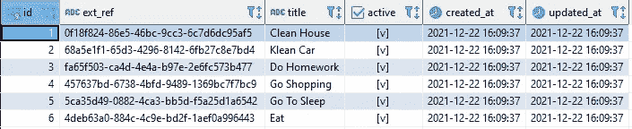
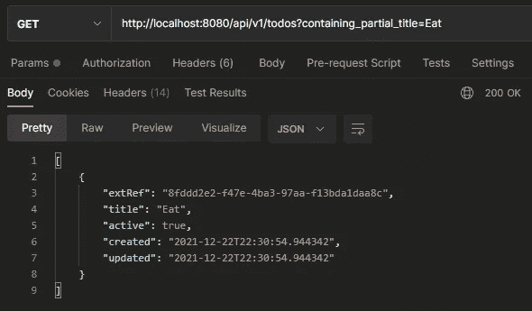
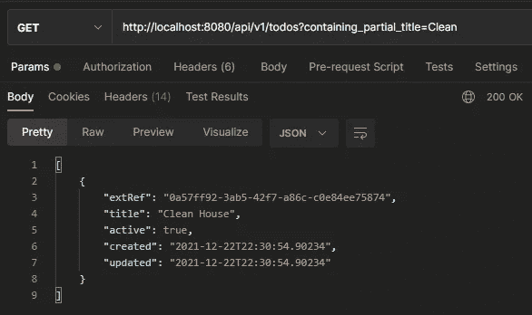
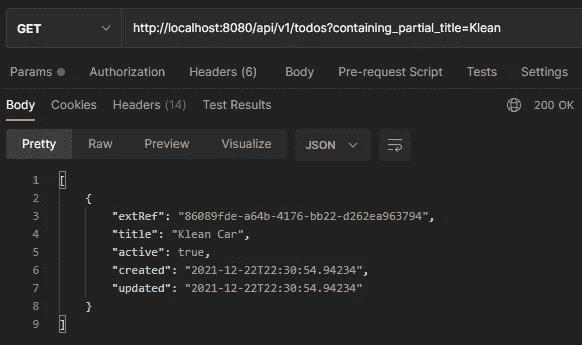
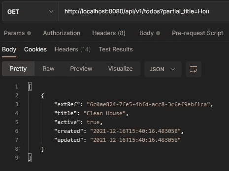
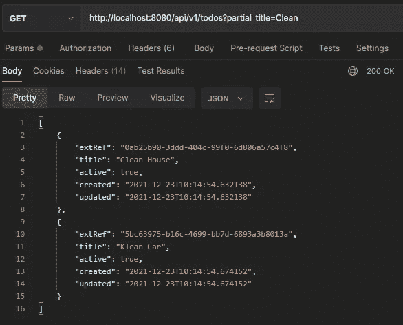
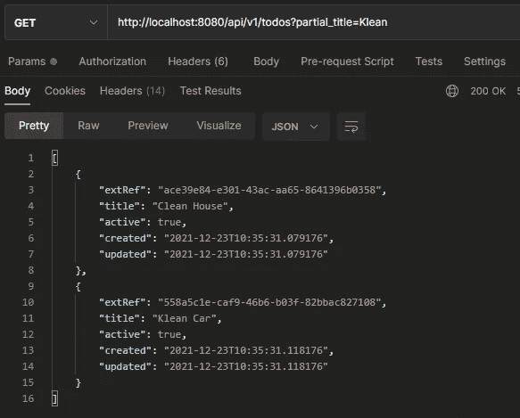

# SpringBoot:与 Postgres 模糊匹配

> 原文：<https://blog.devgenius.io/springboot-fuzzy-match-with-postgres-8eb6bfd17b58?source=collection_archive---------1----------------------->

在今天的文章中，我将讨论如何使用 Postgres 的模糊匹配支持，以便使用 REST API 进行部分搜索。

*免责声明:本文的目的是给你一个使用模糊匹配的实际例子，而不是详细解释所有的概念。*

[摄粘土堤](https://unsplash.com/@claybanks?utm_source=medium&utm_medium=referral)上[的 Unsplash](https://unsplash.com?utm_source=medium&utm_medium=referral)

在我们开始之前，你可以在这里找到完整的 [**代码**](https://github.com/georgeberar/medium/tree/main/fuzzy-match-postgresql) 。

# 背景

星期天晚上，你想看一部朋友推荐的电影，但你不记得电影的全名，只记得它与“蝙蝠”有关。因此，你打开 IMDB 或烂番茄，在搜索输入中键入“bat ”,你会看到一个已经出现的电影列表，如下所示:

在烂番茄搜索“bat”的示例

现在你知道了！你要找的电影:《蝙蝠侠》。搜索输入背后发生的事情被称为模糊匹配，它是许多搜索引擎框架的基石。

但是什么是模糊匹配呢？

> 这是一种识别文本、字符串或条目中两个近似相似但不完全相同的元素的技术。

如果你仔细观察，你会看到其他电影也因为这种“近似”的匹配而出现(如《受虐者》或《蝙蝠》)。键入更多的字符会给我们带来更准确的结果:

在烂番茄搜索“蝙蝠侠”的例子

# 问题是

假设我们构建了一个 TODO API(使用 Postgres 数据库)来管理日常任务，并且我们有一些持久化的 TODO:

待办事项示例

*注意:第二个 TODO 记录在“title”中有一个错别字(Klean 而不是 Clean)，但我是故意这样做的，稍后我们会看到原因。*

现在，我们希望我们的 API 提供一个端点，允许用户根据他们的头衔搜索 TODOs。使用 JPA，我们可以利用众所周知的`LIKE`语法在数据库中实现简单快速的搜索:

使用 LIKE“% %”方法搜索 TODO 的 JPA 存储库

这类似于 SQL 语句:`SELECT * FROM t_todo WHERE title LIKE '%partialTitle%'`。

在 Postman 中使用“Eat”作为搜索字符串进行请求，得到了预期的输出:

使用“吃”搜索待办事项

现在让我们看看当我们尝试使用“Clean”进行搜索时会发生什么:

使用“清理”搜索待办事项

正如你所看到的，它把*清理门户* TODO 还给我，并按预期工作，对吗？嗯……不尽然。想象一下，当你没有足够注意创建一个新的 TODO，并且你打错了一个错别字， *Klean* 而不是 *Clean。*对于我们来说，取回 *Klean Car* TODO 也是有意义的，因为唯一的错误字符是‘K’而不是‘C ’,并且搜索字符串的其余部分匹配。那为什么不工作呢？让我们看看，当我们做同样的请求，但他使用“Klean”而不是“Clean”时会发生什么:

使用“Klean”搜索待办事项

我们得到的仅仅是包含错别字的 TODO，而我们又一次期望两个都有。

事实是，`LIKE`语法对精确匹配有效，但在处理错别字时却完全失败了。即使只有一个字符不同，其余的都相同，对于`LIKE`来说，这也是一个不匹配。在现实生活中，这是一个问题，因为这是一个众所周知的事实——人们经常会打错字；我们不能指望我们的用户每次都记得他们打错了字或给出了准确的搜索字符串，以便提供有意义的回应。

# 解决方案

模糊匹配！这是一个非常明显的答案，我同意:)但是让我们看看如何使用 Postgres 通过两个简单的步骤来实现它。

## 第一步。pg_trgm

Postgres 提供了一个名为`pg_trgm`的模块，它提供了不同的函数来处理三元模型匹配。三元模型是从字符串中提取的一组三个连续的字符。基于此，我们可以通过计算两个字符串共享的三元模型的数量来衡量它们的相似性，并估计它们在 0 到 1 之间的相似程度。例如，字符串“hello”将由以下三元组表示:

*   " h "，" he "，" hel "，" ell "，" llo "，" lo "

为了使用这个模块，我们需要使用下面的语句来启用它:

启用 PostgreSQL 的三元模型模块支持

## 第二步。JPA 查询

接下来，我们使用`%`操作符来比较数组的元素，这样我们就可以匹配标题的任何部分:

使用%运算符的示例 SQL 查询

该查询使用 Postgres 的`STRING_TO_ARRAY`函数将 TODO 的标题分割成单独字符串的数组。

调整 JPA 的原生查询会给我们带来:

现在我们可以正确地通过部分标题搜索待办事项了。以下是一些工作示例:

“后”值的模糊匹配

“干净”值的模糊匹配

如你所见，对于“干净的”搜索字符串，我们现在得到了它们。尝试使用“Klean”会给我们同样的结果:

“Klean”值的模糊匹配

还有一件事……`%`操作符使用默认的相似性阈值 0.3，但是如果我们需要调整它(例如 0.5)，我们可以使用`SIMILARITY`函数:

使用相似性函数的示例 SQL 查询

就是这样！

# 结论

请始终记住，这种方法可能适合也可能不适合您的项目环境或需求，我不能说没有其他方法可以做得不同或更好。我真的希望你喜欢它，并从中获得乐趣。

注意安全，记住你可以在这里 找到 [**代码！**](https://github.com/georgeberar/medium/tree/main/fuzzy-match-postgresql)