# SpringBoot 还是 Quarkus:哪个框架最适合你的项目？

> 原文：<https://blog.devgenius.io/springboot-or-quarkus-which-framework-is-best-for-your-project-2e448f9e9515?source=collection_archive---------1----------------------->

## 跳羚队对夸库斯队

Spring Boot Vs 夸库斯

市面上有这么多微服务框架，像***【Spring Boot】******【夸尔库斯】******Vertx******micron aut******heli don****(那些都是 Java)***GoMicro****(Go)**

**在本文中，我们将讨论 Quarkus 和 Spring Boot 的几个特性，比如核心能力、内存消耗、易于开发和性能，以帮助开发人员决定选择哪一个来构建他们的应用程序。**

## ****概述****

****Quarkus** 是一个用于开发小型工件的 ***Kubernetes 原生 Java 框架*** ，是**和* ***云原生环境*** 的有效平台。它旨在与流行的 Java 框架、库和环境一起工作，如 Eclipse Microprofile、Spring、Apache Kafka、Hibernate、Camel 等等。***

**要开始使用 Quarkus，您需要安装 Java 8 或 Java 11 以及 Maven。**

## ****创建新项目****

**Quarkus 应用程序开始于[代码 Quarkus](https://code.quarkus.io/) 。项目生成器可以直接从网站上使用，如下所示。**

**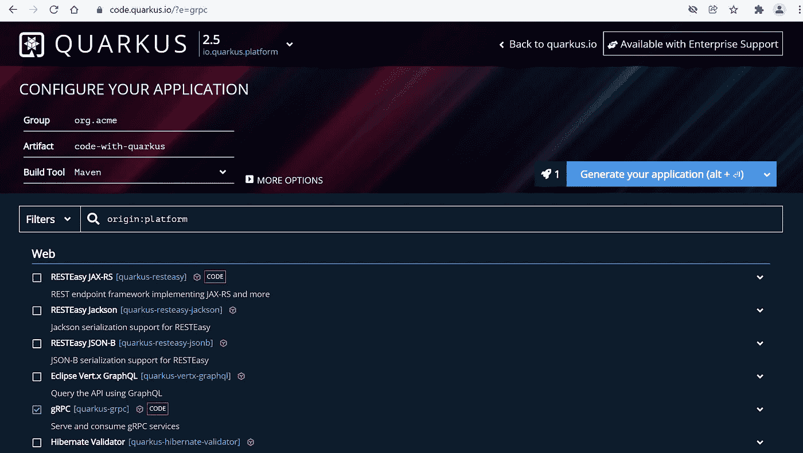**

**Spring 开发者的起点是 [Spring Initializr](https://start.spring.io/) ，可以直接从网站上使用，如下所示。**

**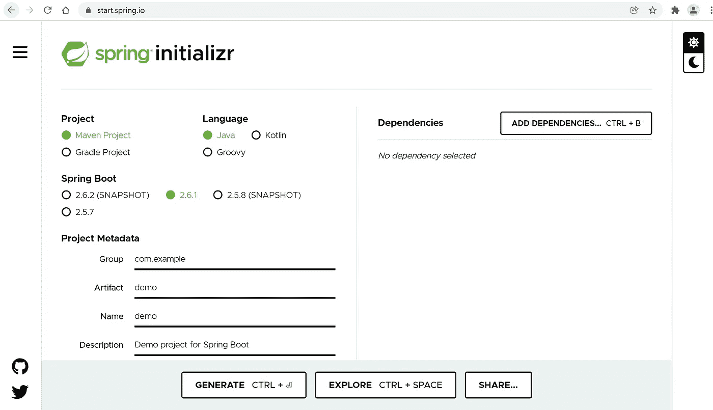**

## ****构建时间与运行时间****

**让我们在这里比较一下 Spring Boot 和夸尔库斯的编译和运行时间。**

**应用服务器承担了大量的日常工作，准备 beans、加载类、准备 java 反射的上下文、准备线程池等等。所以在那个时候，一个应用服务器做一次，做所有。这是应用服务器变得更大更慢的主要原因。实际上，这不是问题，但是对于作为一个长期运行阶段的公共平台和为应用程序提供大量资源来说，这是很好的。**

**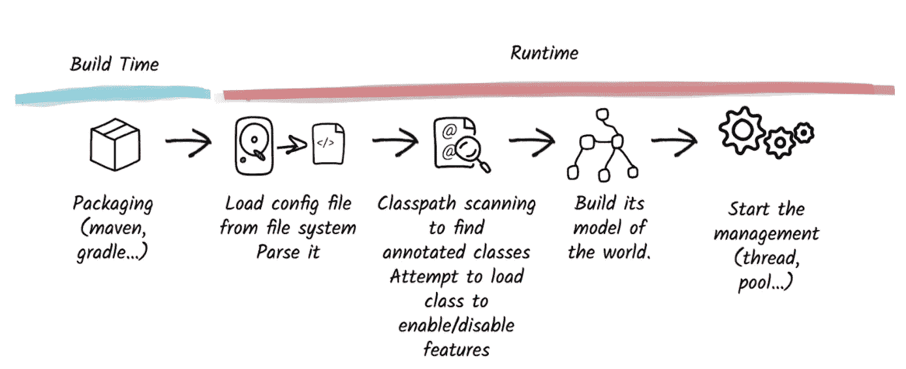**

**Spring Boot 的构建与运行时间**

**但是如果你把它和它的邻居如 nodejs 框架或 golang 框架相比，它仍然很慢。Spring Boot 风格的应用程序至少需要 2 秒多的时间来启动，如果算上第一次响应的时间，大约需要 4 秒。**

> **Quarkus 采用容器优先的方法。这种方法针对构建时元数据处理和减少反射使用等领域的低内存使用量和快速启动时间进行了优化。**

**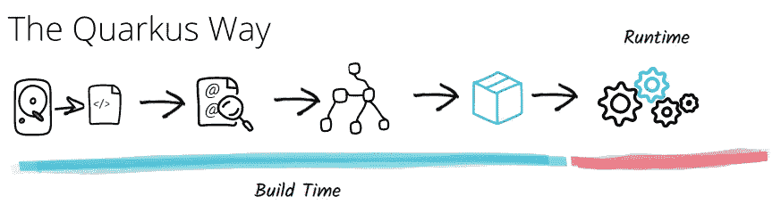**

**Quarkus 中的构建与运行时间**

**普通框架只在打包时使用构建时间，大多数工作都是在运行时处理，比如类路径扫描。每次重新启动应用程序时，所有的步骤都要重复一遍，**增加启动**和**加载时间**。但是在 Quarkus 中，通过使用它的扩展将这些步骤转移到构建时间。很多 Java 框架都有扩展，比如 RESTeasy、Hibernate、数据库驱动，还有 spring 特性。这些扩展有助于只加载需要的内容，避免不必要的类、方法和永远不会到达的代码行。所有的工作都是一次性完成的，而不是在每次启动时完成，也不是所有的引导类都被加载。**

## **启动时间**

**随着项目中添加更多的端点和依赖项，启动时间差可能会增加。我只在 Spring Boot 和 Quarkus 应用程序中添加了 spring web dependency 来比较启动时间。**

**Spring Boot 用了 2.117 秒**

**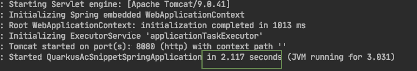**

**Spring Boot 创业公司**

**夸库斯用了 1.573 秒**

**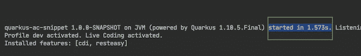**

**Quarkus 启动**

## ****对比****

**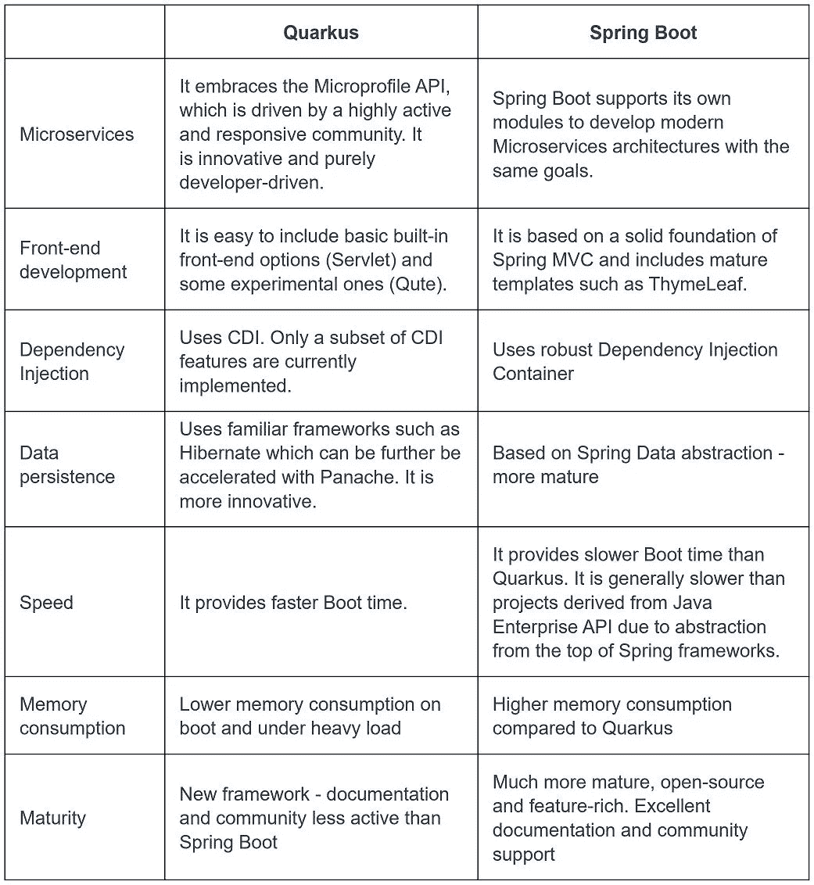****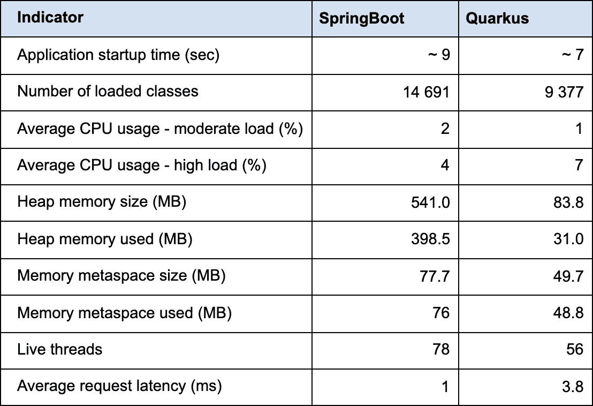**

## ****指标****

**让我们看看这里的一些指标。**

**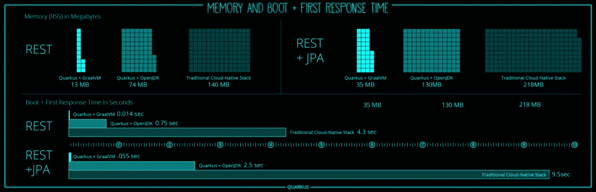**

**夸库斯统计**

**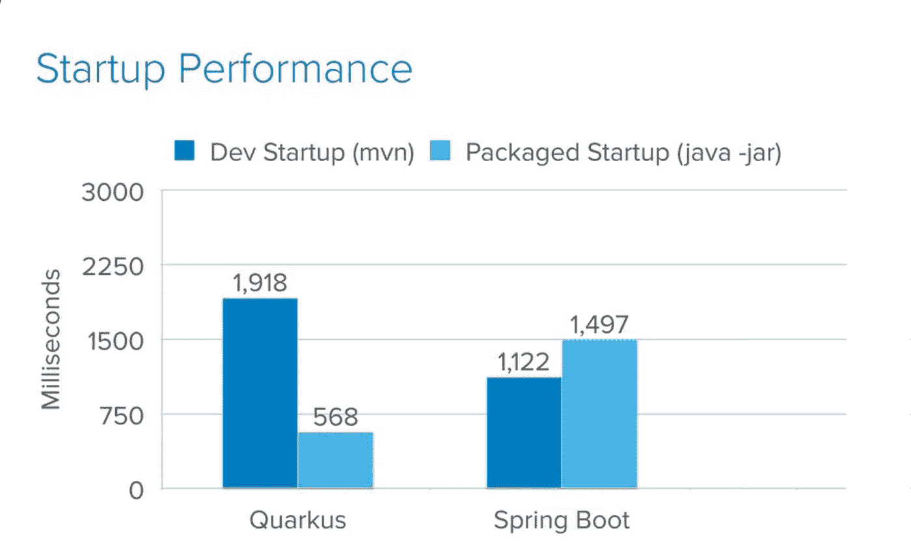****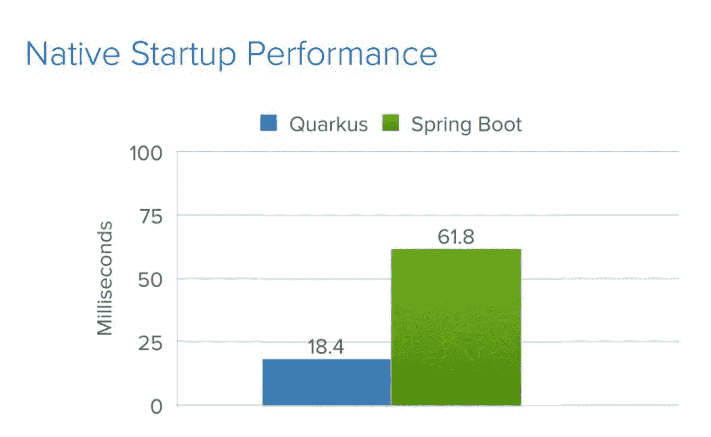****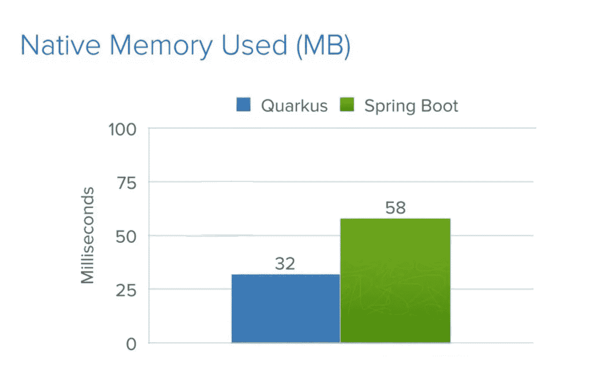**

## ****扩展****

**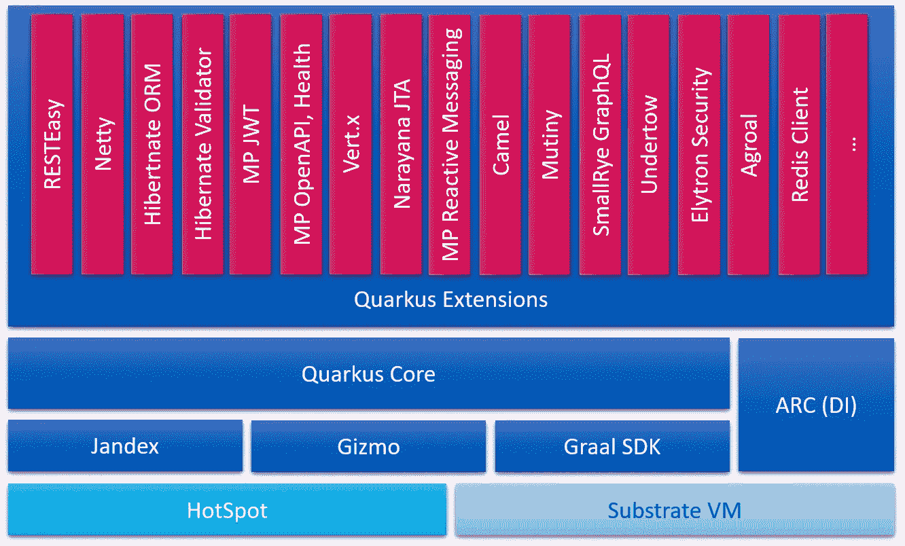**

**Quarkus 扩展只是一个可以在 Quarkus 应用程序上运行的模块。Quarkus 应用程序本身是一个核心模块，带有一组其他扩展。**

**这种扩展最常见的用例是在 Quarkus 应用程序上运行第三方框架。持久性、事务、容错、安全性都是外部扩展，只有在需要时才能添加到应用程序中。**

## ****结论****

**Quarkus 和 Spring Boot 都是开发和部署基于 Java 的企业应用程序的扩展框架。**

****Quarkus** 是新的框架，是 ***无服务器应用、* FaaS** 环境的最佳选择，如 ***AWS Lambda、Azure 函数、Google Cloud 函数*** *和* ***Knative*** 。服务器启动性能和内存效率非常好。原生应用程序显示速度快，资源消耗非常低。对于构建高可伸缩性的应用程序来说，它是一个很好的选择，同时比其他 Java 框架使用更少的 CPU 和内存资源。主要问题是社区支持减少。**

****Spring Boot** 知名而稳定。它有广泛的功能，模板设计模式，是高度安全的。它还拥有优秀的文档和社区支持，可以帮助解决开发过程中面临的大多数问题。这对于 ***长时间运行*** 应用程序来说很有好处。与 Quarkus 相比，Spring Boot 的主要缺点是性能差和内存消耗高。**