# 精灵动画

> 原文：<https://blog.devgenius.io/sprite-animations-fb8fe6ffffb5?source=collection_archive---------1----------------------->

## 使用混合树和层

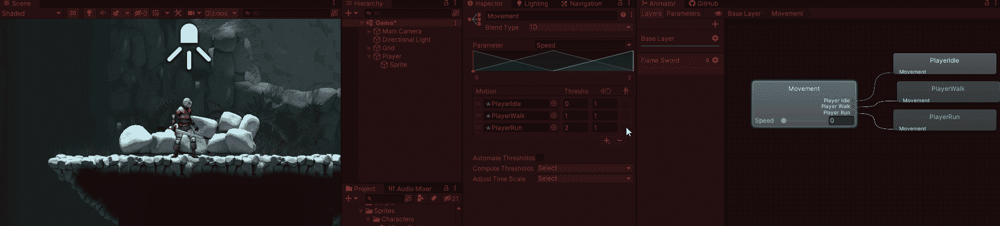

我为我的播放器准备了不同动画的精灵表。我已经将它们切片并制作了动画。

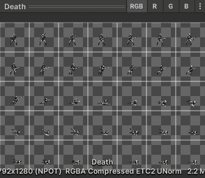

# 使用混合树在空闲、行走和跑步动画之间切换。

首先，我将添加基本运动动画空闲、行走和跑步的逻辑。为了在这些状态之间转换，我将使用一个叫做 Speed 的浮点数。我将使用 [**融合树**](https://docs.unity3d.com/2021.1/Documentation/Manual/class-BlendTree.html) **。**

 [## 混合树木

### 你如何在整个工作流程中使用文档？请参加本次调查，与我们分享您的体验。一个普通的…

docs.unity3d.com](https://docs.unity3d.com/2021.1/Documentation/Manual/class-BlendTree.html) 

特别是我将使用一个 [**1D 混合树**](https://docs.unity3d.com/2021.1/Documentation/Manual/BlendTree-1DBlending.html) 。

 [## 1D 混合

### 你如何在整个工作流程中使用文档？请参加本次调查，与我们分享您的体验。第一个…

docs.unity3d.com](https://docs.unity3d.com/2021.1/Documentation/Manual/BlendTree-1DBlending.html) 

我添加了一个混合树，命名为运动。在混合树中，我添加了 3 个运动场。我关闭了自动阈值。我将阈值设置为 0，1，2(如果我使用的是 3D，我会离开这里，只在运动方向上通过)。我添加我的 3 个动画。

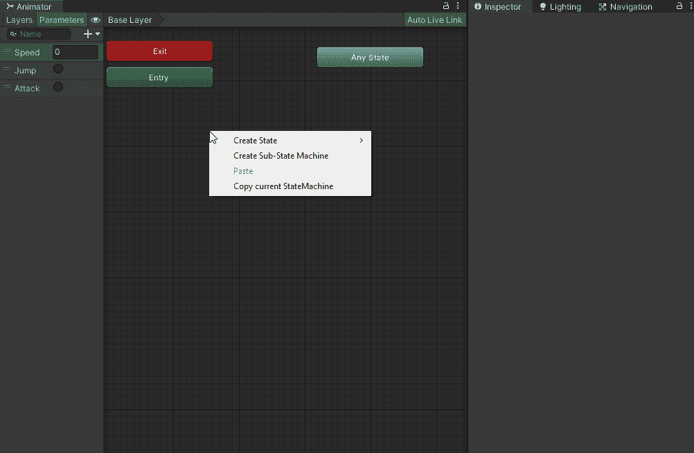

因为我正在制作精灵动画，所以不会有任何实际的混合发生，但是当它混合到下一个动画中时，它会在两个动画之间切换。速度 0–0.5 表示空转，速度> 0.5–1.5 表示步行，速度> 1.5 表示跑步。

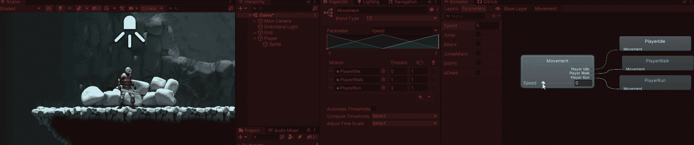

当我创建控制器时，我会在到达状态时将 0、1 或 2 传递给动画师。

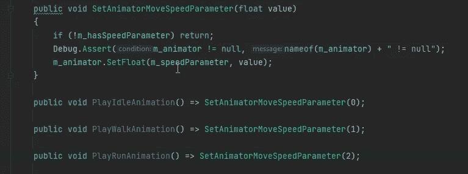

# 动画层

我有两种不同的挥杆类型。我经常挥剑和挥剑。

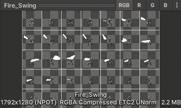

我可以为剑的类型添加另一个动画参数，并将附加的动画添加到我的动画控制器中。当我添加更多的剑类型或者我添加不同的武器时会发生什么？如果我想改变进入和退出攻击状态的条件，我的控制器会很快变得混乱，也很难维护。也就是说可以用 [**动画层**](https://docs.unity3d.com/2021.1/Documentation/Manual/AnimationLayers.html) **统一拯救。**

 [## 动画层

### 你如何在整个工作流程中使用文档？请参加本次调查，与我们分享您的体验。Unity 使用…

docs.unity3d.com](https://docs.unity3d.com/2021.1/Documentation/Manual/AnimationLayers.html) 

## 同步还是不同步？

要添加一个层，我需要做的就是点击层标签，并添加一个新的层。我给这个层一个名字。我添加了火焰剑动画，并创建了一个新的状态，但没有指定动画。我将空状态设置为层的默认状态。然后我设置我的过渡。

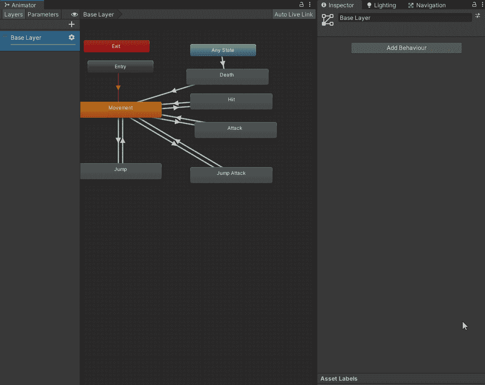

现在，当玩家拥有火焰剑时，我所要做的就是将火焰剑层权重设置为 1，火焰剑攻击动画就会被使用。

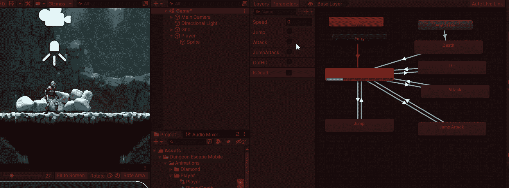

这样做就像从任何状态。为了使层尊重其他动画状态，我必须将它与基础层同步。如果我必须手动完成，这将是一项繁重的工作。Unity to the rescue 再次与**动画层同步**。我点击设置轮齿，选择同步复选框，并告诉它什么是源层。现在我设置我想要覆盖的动画。

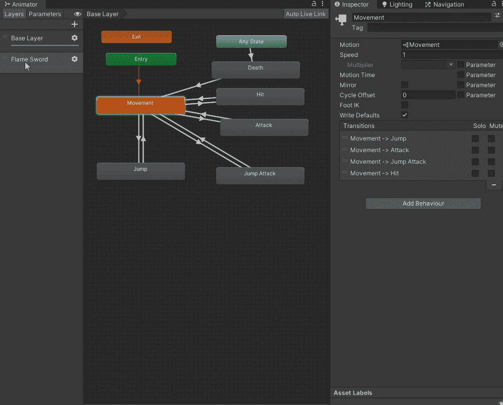

现在我的新图层尊重我已经设置的内容。

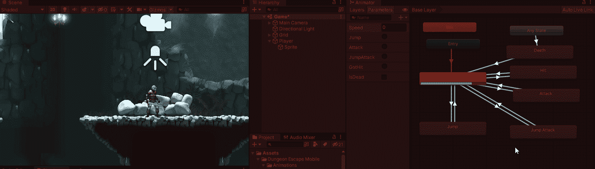

要使用它，我所要做的就是将图层的权重设置为 1。为了取消激活它，我将图层权重设置回 0。

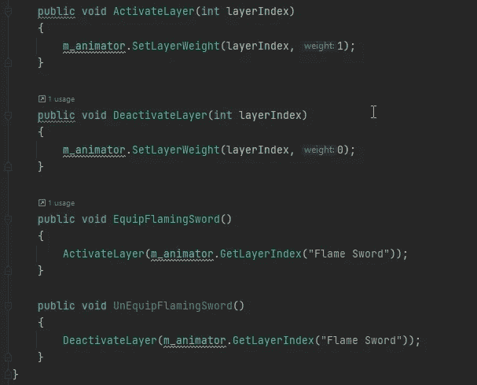