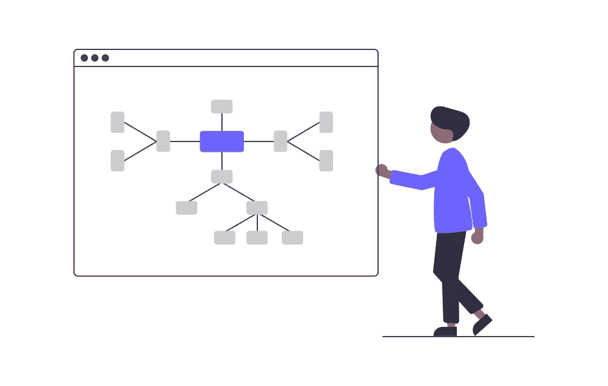

# SQL 101:对 SQL 世界的全面介绍

> 原文：<https://blog.devgenius.io/sql-101-a-comprehensive-introduction-to-the-world-of-sql-747cc5864c03?source=collection_archive---------19----------------------->

SQL(结构化查询语言)是一种用于管理和操作存储在数据库中的数据的编程语言。它是一种功能强大的通用语言，允许用户查询、插入、更新和删除数据，以及创建和管理数据库对象，如表、索引和视图。



在我们开始讨论 SQL 之前，您需要了解什么是数据库。

# 什么是数据库？

数据库是以电子方式存储和访问的有组织的数据集合。数据库用于存储、管理和检索数据，并且它们被用于广泛的应用中，包括在线购物、财务记录保存和数据分析。数据库通常使用结构化查询语言(SQL)来管理和操作它们包含的数据。一些常见的数据库类型包括关系数据库，它将数据存储在具有行和列的表中，以及 NoSQL 数据库，它以更灵活的非关系格式存储数据。


# SQL 学习计划

1.  首先学习 SQL 的基本概念和术语，如表、行、列和数据类型。
2.  接下来，学习 SQL 查询的基本语法，包括 SELECT、FROM 和 WHERE 子句，以及 SUM 和 AVG 等聚合函数。
3.  练习使用 MySQL 或 PostgreSQL 编写基本的 SQL 查询。您可以下载数据库并将其安装在您的计算机上，或者您可以使用 SQL Fiddle 等在线工具来练习您的查询。
4.  一旦熟悉了基础知识，就可以继续学习更高级的概念，比如子查询、连接和索引。
5.  练习使用您的 DBMS 编写更复杂的 SQL 查询，并尝试将您学到的概念应用到现实世界的问题中。
6.  随着经验的积累，可以考虑参加认证考试来验证您的 SQL 技能。如果你想提升自己的职业生涯，或者想向潜在雇主展示你的专业技能，这可能会有所帮助。
7.  继续学习并跟上 SQL 的最新发展和最佳实践。有许多在线资源，如博客、论坛和在线课程，您可以在那里向经验丰富的 SQL 开发人员学习，并了解该领域的最新趋势。

就 SQL 命令和顺序来说， 下面是一个常用的方法:
**SELECT** —用于从数据库中选择数据
**—指定从中选择数据
**的表，其中** —指定选择哪些行的条件
**GROUP BY** —将具有相同值
**和**的行分组在一起—指定**之后的数据的条件 GROUP BY**
**ORDER BY**—排序 按特定顺序
**插入** —向表中添加新行
**更新** —修改表中的现有行
**删除** —从表中删除行
**创建** —创建新的数据库对象，如表和索引等
**更改** —修改现有数据库对象
**删除** —删除数据库对象。**

**现在让我们按顺序复习一下学习计划。**

****

## **基本概念**

**计划学习 SQL 的第一点是学习 SQL 的基本概念和术语。这包括理解关系数据库的结构以及表、行和列在组织和存储数据中的作用。它还包括学习不同的数据类型，如字符串、数字和日期，以及如何用它们来表示数据库中不同类型的数据。学习这些基本概念是学习 SQL 的重要的第一步，因为它将为理解更高级的概念和技术提供基础。通过对这些基础知识的扎实理解，您将能够更好地编写有效的 SQL 查询和处理关系数据库中的数据。**

**链接:[https://www.w3schools.com/](https://www.w3schools.com/sql/sql_intro.asp)**

## **基本语法**

**计划学习 SQL 的第二点是学习 SQL 查询的基本语法。这包括学习如何使用 SELECT、FROM 和 WHERE 子句从数据库中检索数据，以及如何使用 SUM 和 AVG 等聚合函数对数据执行计算。学习 SQL 的基本语法很重要，因为它是所有其他 SQL 查询和操作的基础。通过掌握该语言的语法，您将能够编写基本的查询来检索和操作数据，并且您将很快成为一名熟练的 SQL 开发人员。
除了学习基本语法之外，理解 SQL 中可用的不同选项和子句也很重要，例如用于结果排序的 ORDER BY 子句和用于数据分组的 GROUP BY 子句。这将使您能够编写更加复杂和强大的查询，并帮助您充分利用 SQL 的功能。**

**链接:[https://www.dofactory.com/](https://www.dofactory.com/sql/syntax)，[https://www.freecodecamp.org/](https://www.freecodecamp.org/news/basic-sql-commands/)**

## **练习编写基本 SQL**

**计划学习 SQL 的第三点是练习使用 MySQL 或 Postgres 编写基本的 SQL 查询。通过使用数据库练习查询，您将能够看到查询的结果，并更好地理解 SQL 是如何工作的。
在练习查询时，您应该从从单个表中检索数据的简单查询开始，然后转移到涉及多个表的更复杂的查询。这将帮助你逐步建立你的技能和信心，并使你能够将你所学的概念应用到现实世界中。
除了练习查询，你还应该花时间尝试不同的选项和子句，尝试不同的方法来解决问题。这将有助于您加深对 SQL 的理解，也有助于您在使用该语言时变得更有创造性和灵活性。**

**链接:[https://www.hackerrank.com/](https://www.hackerrank.com/domains/sql?badge_type=sql&filters%5Bskills%5D%5B%5D=SQL%20%28Basic%29)**

## **高级概念**

**计划学习 SQL 的第四点是学习更高级的概念，如子查询、连接和索引。子查询允许您编写嵌套在其他查询中的查询，这对于解决复杂问题或对数据执行复杂计算非常有用。联接允许您组合多个表中的数据，这对于处理大型复杂数据集来说是必不可少的。通过允许数据库快速定位您需要的数据，索引可以提高查询的性能。通过学习这些高级概念，您将能够编写更加复杂和高效的 SQL 查询，并且能够处理更具挑战性的问题。这也将使你成为一个更有价值和更全面的开发者，因为你将能够处理更广泛的任务和项目。**

**链接:[https://learnsql.com/](https://learnsql.com/blog/what-is-advanced-sql/)，[https://www.kaggle.com/](https://www.kaggle.com/learn/advanced-sql)**

## **练习复杂的 SQL**

**学习 SQL 计划的第五点是练习使用数据库编写更复杂的 SQL 查询，并将所学的概念应用到现实世界的问题中。这将有助于巩固您对该语言的理解，也将让您有机会了解如何使用 SQL 来解决实际问题。在练习查询时，你应该尝试解决各种各样的问题，你应该挑战自己，想出有创意且高效的解决方案。这将帮助您发展一套全面的技能，也将帮助您更加自信和熟练地使用 SQL。
除了练习查询，您还应该花时间熟悉所选 DBMS 的功能，并学习如何使用其功能和工具来管理和操作数据。这将使您能够充分利用 SQL 的强大功能，也将使您成为一名更高效的开发人员。**

**链接:【https://www.hackerrank.com/ **

## **证书**

**计划学习 SQL 的第六点是考虑参加认证考试来验证您的 SQL 技能。虽然认证并不是成为 SQL 开发人员的必要条件，但它是向潜在雇主或客户展示您专业知识的一种有用方式。这也是一个有用的方法来衡量你自己的进步，并找出你需要改进的地方。
SQL 有许多不同的认证计划和考试，这些考试的具体要求和内容可能会有所不同。有些项目可能要求你完成一个实践项目或评估。
在决定认证计划之前，您应该研究不同的选项，比较考试的要求和内容，以确定哪个计划适合您。你还应该考虑项目的成本和时间投入，以及它是否符合你的职业目标和兴趣。**

**链接:[https://www.hackerrank.com/](https://www.hackerrank.com/skills-verification/sql_intermediate)，[https://www.w3schools.com](https://www.w3schools.com/sql/sql_exam.asp)**

## **继续学习**

**计划学习 SQL 的第七点是继续学习并跟上该领域的新发展和最佳实践。通过紧跟潮流，你可以保持你的技能新鲜和相关，你也可以在新技术方面保持领先。有许多不同的方式来了解 SQL 的最新信息，包括参加会议和研讨会、阅读博客和文章、加入在线论坛和社区，以及参加在线课程或教程。您还可以在社交媒体上关注行业领袖和专家，并参加在线挑战和黑客马拉松，以测试您的技能并向他人学习。
通过参与 SQL 社区并了解最新发展，您可以作为一名开发人员继续成长和提高，还可以为自己的职业生涯带来新的机遇和挑战。**

****

**由于这是一个全面的介绍，我们需要考虑 SQL 本身。**

# **结构化查询语言**

## **挑选**

**SELECT 用于指定表中应该在查询结果中返回的列。例如，以下查询从“学生”表中选择“姓名”和“年龄”列:**

```
SELECT name, age FROM students;
```

## **从**

**FROM 用于指定应该从中检索数据的一个或多个表。例如，以下查询从“学生”和“课程”表中选择数据:**

```
SELECT * FROM students, courses;
```

## **在哪里**

**其中用于指定查询结果中包含的记录必须满足的条件。例如，以下查询仅选择 18 岁以上的学生:**

```
SELECT * FROM students WHERE age > 18;
```

## **分组依据**

**GROUP BY 用于按一列或多列对查询结果进行分组。例如，以下查询按年龄对学生进行分组:**

```
SELECT age, COUNT(*) FROM students GROUP BY age;
```

## **拥有**

**HAVING 用于指定一个条件，一组记录必须满足该条件才能包含在查询结果中。例如，以下查询仅选择 18 岁以上的学生，并按年龄对他们进行分组:**

```
SELECT age, COUNT(*) FROM students GROUP BY age HAVING age > 18;
```

## **加入**

**SQL JOIN 是一种基于两个或多个表之间的相关列来组合它们的数据的方法。例如，如果我们有一个学生表和一个课程表，我们可以使用一个连接来获取每个学生注册的所有课程。**

```
SELECT s.name, c.name
FROM students s
JOIN enrollment e ON s.id = e.student_id
JOIN courses c ON c.id = e.course_id
```

## **以...排序**

**ORDER BY 用于按一列或多列对查询结果进行排序。例如，以下查询按年龄升序对学生进行排序:**

```
SELECT * FROM students ORDER BY age ASC;
```

## **插入**

**INSERT 用于将数据插入数据库。例如，以下查询在“学生”表中插入一条新记录:**

```
INSERT INTO students (id, name, age) VALUES (1, 'John', 20);
```

## **更新**

**UPDATE 用于更新数据库中的现有数据。例如，以下查询更新 ID 为 1 的学生的“年龄”字段:**

```
UPDATE students SET age = 21 WHERE id = 1;
```

## **删除**

**DELETE 用于从数据库中删除数据。例如，以下查询删除 ID 为 1 的学生:**

```
DELETE FROM students WHERE id = 1;
```

****

**总之，学习 SQL 对任何从事 IT 工作的人来说都是必不可少的。通过遵循这些步骤，您可以开始使用 SQL，并开始掌握处理数据的基本命令和技术。通过奉献和实践，你可以成为 SQL 专家。**