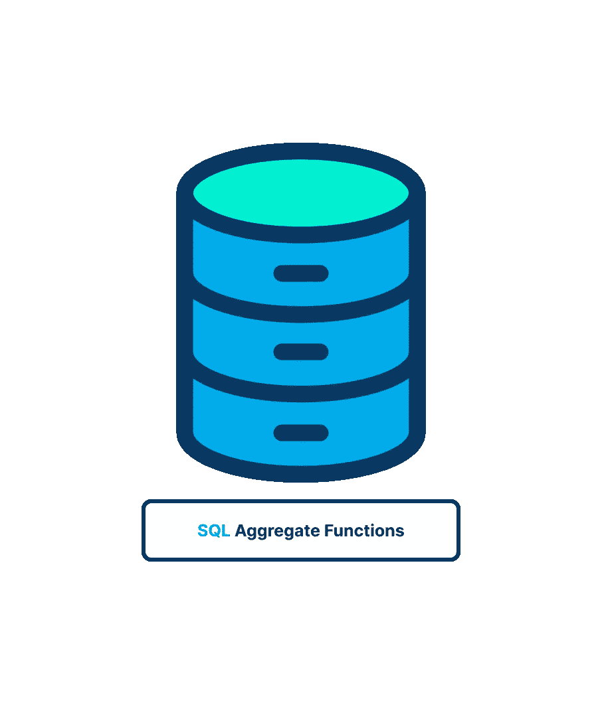
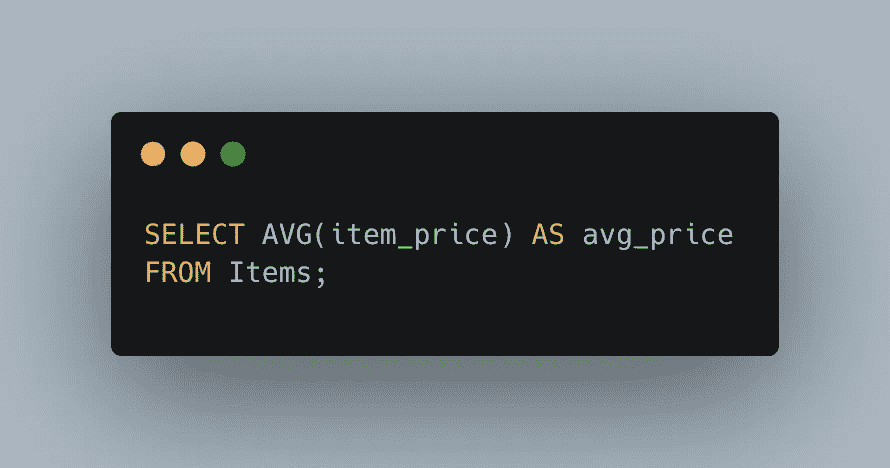
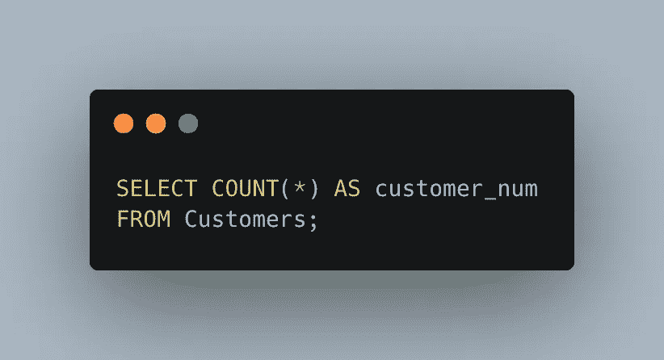
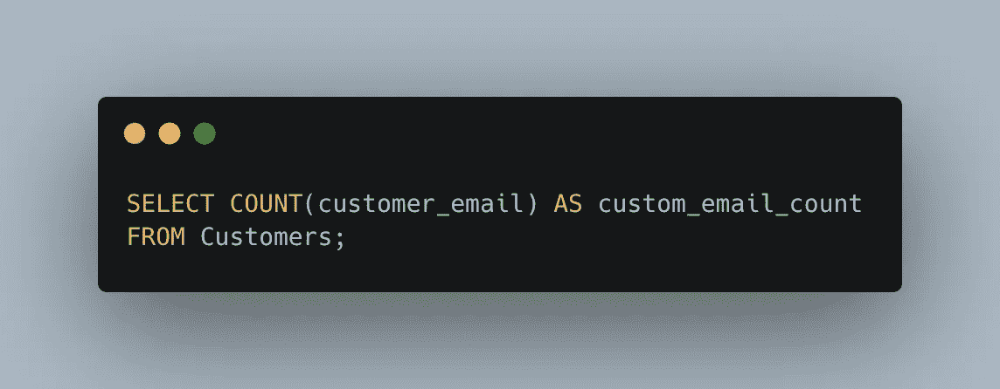
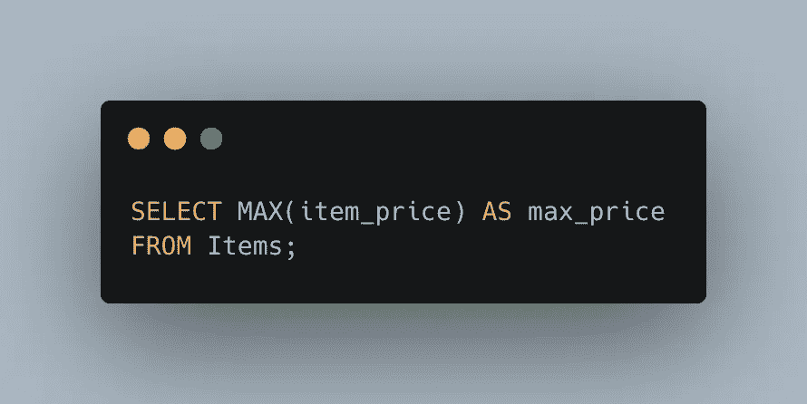
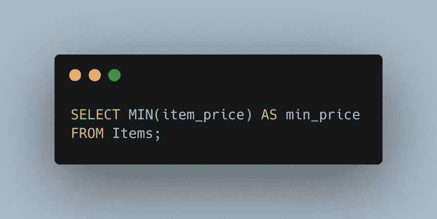
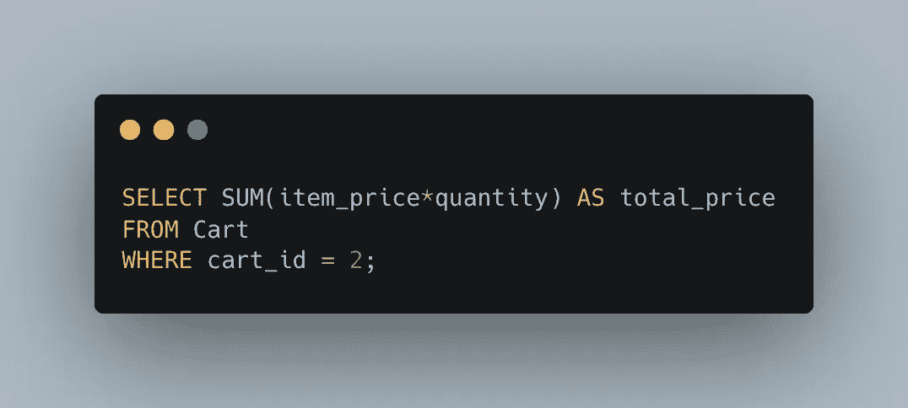
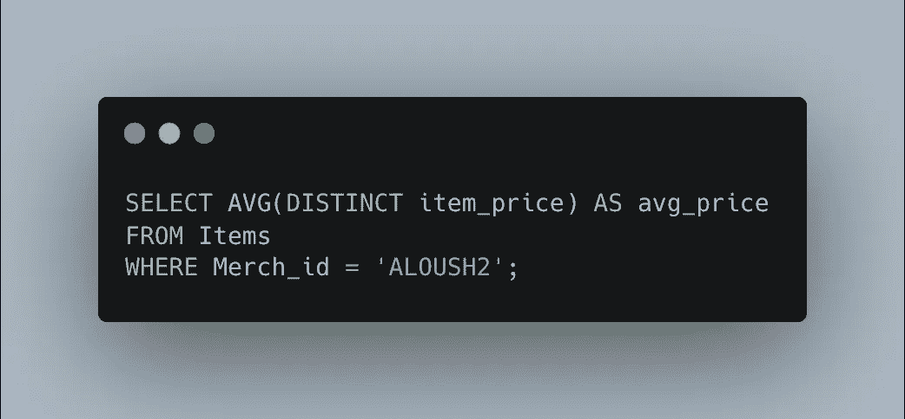
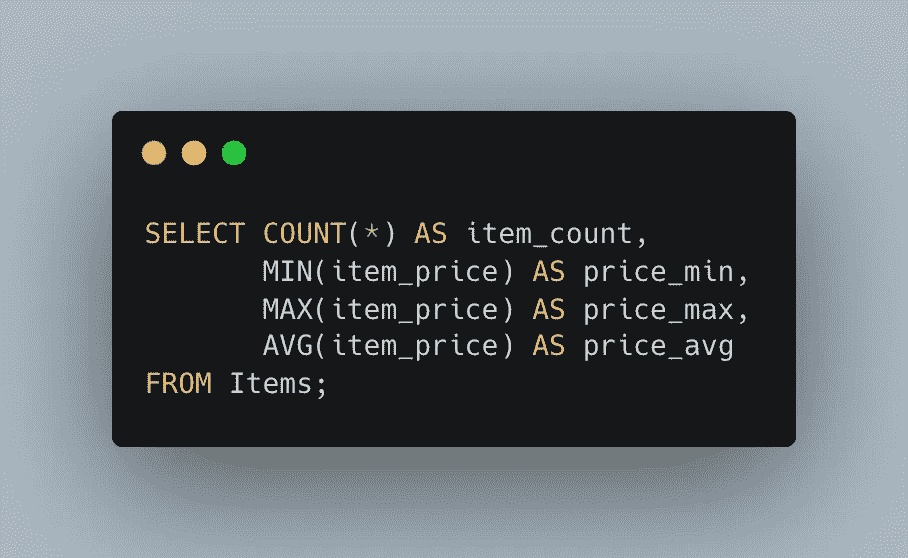

# SQL 聚合函数探究

> 原文：<https://blog.devgenius.io/sql-aggregate-functions-22b2b6206b85?source=collection_archive---------16----------------------->

本文将解释什么是集合函数以及如何使用它们。

## 什么是**聚合函数**

它们是对一组行进行操作以计算并返回单个值的函数，我们在这里看到聚合函数:

1.  **AVG()** : *返回一列的平均值*。
2.  **COUNT()** : *返回一列中的行数*。
3.  **MAX()** : *返回一列的最高值*。
4.  **MIN()** : *返回一列的最小值*。
5.  **SUM()** : *返回一列值的总和*。

## **使用聚合函数**

SQL 提供了特殊的函数来汇总数据，而无需检索整个集合。这是一个普遍的要求。使用这些函数，SQL 查询经常用于检索数据以进行报告和分析。

**注意**:所有的聚合函数都可以使用标准的数学运算符对多列进行计算，例如:`AVG(prod_price*quantity)`。

## **`**AVG()**`**功能****

**`AVG()`该函数通过计算行数及其值的总和来返回一列的平均值。AVG()可用于返回特定列或行的平均值。**

****注意**:包含`NULL`值的列行被`AVG()`函数忽略。**

**示例:**

****

## ****`**COUNT()**`**功能******

****从本质上来说，它是算数的。可以使用 COUNT()函数确定表格中的行数或满足特定条件的行数。****

****`COUNT()`可用于 2 种方式:****

1.  ****使用`COUNT(*)`计算表格中的行数，无论列包含值还是`NULL`值。****
2.  ****使用`COUNT(column)`计算特定列中有值的行数，忽略`NULL`值。****

******注意**:包含`NULL`值的列行将被`COUNT()`函数忽略，但如果使用星号(*)则不会。****

****示例:****

********

****示例:****

********

## ******`**MAX()**`**功能********

****`MAX()`返回指定列中的最大值。MAX()函数要求指定列名。****

******注意** : MAX()通常用于查找最高的数值或日期值，但是许多 DBMSs(但不是全部)允许它返回任何列中的最高值，包括文本列。MAX()返回文本数据按指定列排序时的最后一行。****

******注意**:带有`NULL`值的列行被`MAX()`函数忽略。****

****示例:****

********

## ******`**MIN()**`**功能********

****`MIN()`与`MAX()`正好相反——它返回指定列中的最小值。Like `MAX(), MIN()`要求指定列名。****

******注意**:许多(但不是所有)DBMSs 允许 MIN()函数返回任何列中的最小值，包括文本列。MIN()返回文本数据按该列排序时最先出现的行。****

******注意**:带有`NULL`值的列行被`MIN()`函数忽略。****

****示例:****

********

******`**SUM()**`**功能********

******`SUM()`用于返回特定列中值的总和。******

********注意**:带有`NULL`值的列行被`SUM()`函数忽略。******

******示例:******

************

## ********不同值上的聚合********

******这五个集合函数都有两种用法:******

1.  ******若要对所有行执行计算，请指定 all 参数或根本不指定任何参数(因为 ALL 是默认行为)，但不使用 COUNT(*)的 DISTINCT，DISTINCT 只能在指定了列名的情况下与 COUNT()一起使用。DISTINCT 不能与 COUNT(*)一起使用。同样，DISTINCT 必须与列名一起使用，而不能与计算或表达式一起使用。******
2.  ******要仅包含唯一值，请指定`DISTINCT`参数。******

********注意**:除了这里显示的 DISTINCT 和 ALL 参数之外，一些 DBMSs 还支持 TOP 和 TOP PERCENT 参数，这允许您对查询结果的子集执行计算。请查阅 DBMS 的文档以确定哪些参数可用。******

******示例:******

************

## ********组合聚合函数********

******示例:******

************

# ********总结********

******今天，我们学习了聚合函数，并了解了它们有多简单，为了扩展您的知识，我鼓励您检查分组。******

******我希望你喜欢这篇文章！******