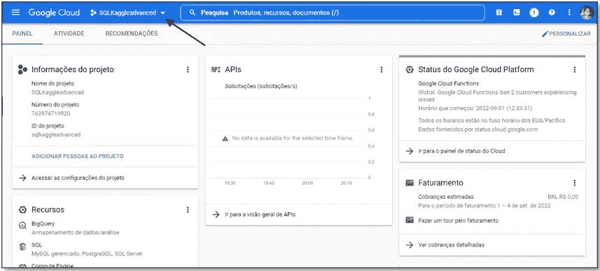

# 面向初学者的 SQL 和大查询

> 原文：<https://blog.devgenius.io/sql-and-big-query-for-beginners-66a31a041fb9?source=collection_archive---------10----------------------->

## ka ggle SQL 课程简评

> “Kaggle 不仅仅是由竞争构成的”

带着这句话，我开始了参加和评估 Kaggle 平台提供的免费课程的旅程。Kaggle 的课程非常实用，使用优秀的数据集，所有课程在结束时都会提供证书(如果你通过了每个模块结束时的测试)，并且全部免费！

首先，我上了两门**机器学习**课程，入门和中级，在享受了体验之后，我决定开始学习平台上提供的 SQL 课程，也是一分为二:**SQL 入门和高级 SQL** 。Kaggle 的 SQL 课程的一大优势是使用了 **BigQuery** ，这是谷歌的云计算平台，允许你将 SQL 应用于庞大的数据集。

> 如果你有兴趣了解更多关于机器学习课程的知识，我的 Github 中有一个资源库，里面有这些课程、所学代码、概念和笔记的摘要，我认为它们会对你的学习有很大的帮助:
> 
> [*github.com/robsoncserafim/datascience_study_room*](https://github.com/robsoncserafim/datascience_study_room)

1.  **大查询入门**

这两个课程都使用 BigQuery 在所研究的数据集中执行 SQL 查询和操作，然而，我写这篇文章的动机之一是很难找到解释我们可以将 IDE(我使用 Google colab)与 Big Query 连接起来的最佳方式的教程。这门课没有很好地解释这个开始学习的要点。所以，如下:

> **1.1 在您的 Google 云计算平台上设置 BigQuery 格式:**

首先，登录 [**谷歌云平台**](https://console.cloud.google.com/) **。**当您访问平台上的控制台时，您需要在 google cloud 中创建一个新项目，此时您应该会看到如下图所示的屏幕:

创建新项目后(您可以使用自己选择的任何名称)，您将被引导到项目的仪表板区域。然后，进入左上角的菜单，进入**“IAM&Admin”**标签。

当您进入此选项卡时，您将被引导至**“项目权限”，**找到您的项目并单击**编辑**，您将进入您的项目的权限菜单，要通过 Google Colab 直接访问该菜单，您需要根据下图进行编辑:

> **1.2 通过 Google Colab 访问项目:**

通过 API 和 Big Query 使用 Google Colab(或您选择的任何 IDE)的优势之一是可以同时使用 SQL 和 Python 执行数据分析和探索，正如课程在其整个轨迹中所展示的那样，在 [**市场** e](https://console.cloud.google.com/marketplace/browse?filter=solution-type:dataset) 导入和使用 Big Query 平台中的任何数据集都很方便。是的，有很多！

完成上一主题中所述的设置后，只需在笔记本中直接输入以下代码:

如果你不知道你的项目的 ID，只要回到你最初创建它的页面，在它旁边你会有你的 ID。完成以上所有设置后，直接在你的 Google Colab 中开始课程。

**2。复习 Kaggle 课程:SQL 简介**

为了更好地使用这门课程，使用一些可以统一使用 Python 和 SQL 的 IDE，以及允许访问 Big Query 是很重要的，所以我之前进行了简短的教程，以便更好地利用这门课程。

该课程非常适合那些很少或没有接触过 SQL 语言的人。它很好地解释了数据分析的能力和重要性。该计划分为六个模块:

*1。SQL 和大型查询入门*

*2。从&中选择，其中*

*3。分组依据，有&计数*

*4。排序依据*

*5。如&与*

*6。加入数据*

教授的所有命令都是使用 SQL 语言启动查询的基本命令(但功能强大)。本课程的一个优点是使用了几个数据集，在例子和活动中至少使用了五个不同的数据集。

作为一个缺点，我可以提到它缺乏对关系数据库概念的更深入的解释，并且 JOIN 概念的深度很小，这可能使理解有点困难，因为当我开始高级课程时，我觉得它没有对一些重要的概念进行更多的解释，例如:外键和表基数。但因为这是一个短期课程，所以可以理解。不管怎样，很棒的课程！值得去做。

作为一门速成课程，强烈建议将它作为指南，并在整个课程中搜索关于所教主题、新活动或课程的教程。如果你好奇的话，我在课程中这样做了，用我认为可以作为很好补充的其他教程中教授的代码、解释图像、概念和参考，它发表在我的 github:[github.com/robsoncserafim/Intro_SQL_Kaggle](https://github.com/robsoncserafim/datascience_study_room/tree/main/Intro_SQL_Kaggle)

**3。复习 Kaggle 课程:高级 SQL**

高级 SQL 课程带来了关于连接和联合的更强大的教学，带来了更困难和复杂的例子。许多练习迫使学生更深入地研究主题，在我看来，这是这门课的积极之处，因为它比入门课更能挑战你。

该计划分为四个模块:

1.  *加入的和联合的*
2.  *解析函数*
3.  *嵌套重复数据*
4.  *编写效率查询*

在提到的模块中，特别是对第三个模块的补充，不是每个教程都可以如此全面和详细地涵盖如何使用**“嵌套和重复数据”**以及本课程，有实际例子和很好的解释，当然，总是使用 **Google BigQuery** 。

使用 bigquery 工具的另一个好例子是第四个模块，它教您如何优化查询。该模块分为四个不同的策略，以一种非常说教的方式编写高效的查询，总是显示实际的例子。

作为一个负面的观点，我可以再次提到，该课程在 JOIN's 中留下了许多不尽人意的地方，但因为它是几门课程或教程中非常全面的主题，所以用新的研究来完成 Kaggle 课程的教学就足够了。

正如我在《SQL 简介》中所做的那样，我在《高级》中也做了同样的事情，并写了一个笔记本，上面记录了整个课程中提到的例子和概念，并总是用其他材料对它们进行补充。

关注链接:[github.com/robsoncserafim/Kaggle_Advanced_SQL](https://github.com/robsoncserafim/Kaggle_Advanced_SQL)

我可以再一次有把握地说，Kaggle 的 SQL 课程是你开始学习的绝佳起点。它们是快速、免费的课程，有很好的教学方法，有时还有挑战性的练习。该课程的竞争优势:谷歌大查询的使用。

享受你的学习！

> 电子邮箱:robson.castro.serafim@gmail
> 
> 领英:[linkedin.com/in/robson-castro-serafim/](https://www.linkedin.com/in/robson-castro-serafim/)
> 
> github:[github.com/robsoncserafim](https://github.com/robsoncserafim)