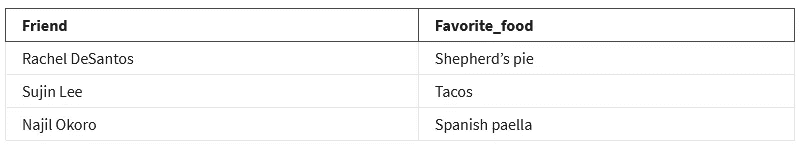
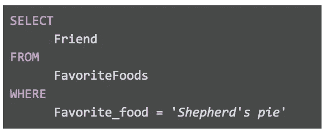
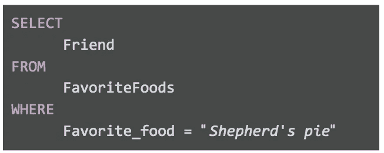
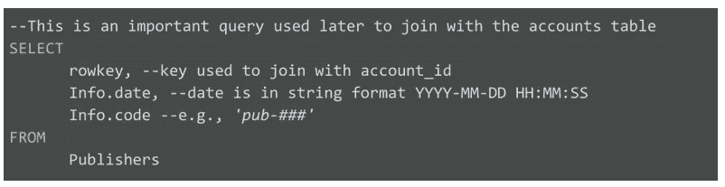
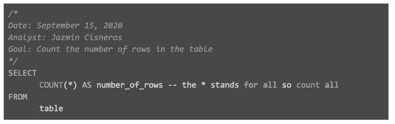
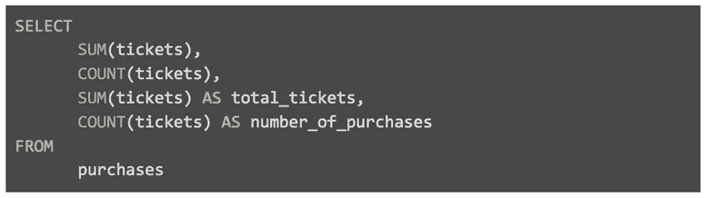
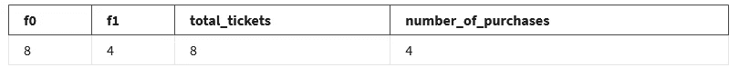
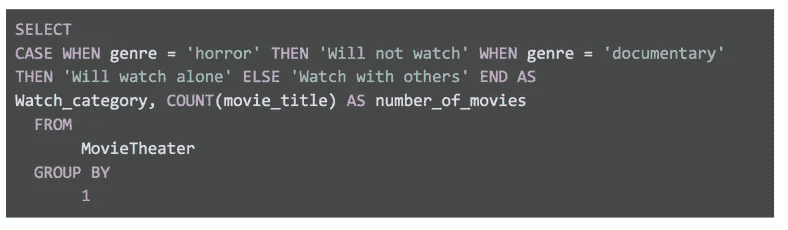
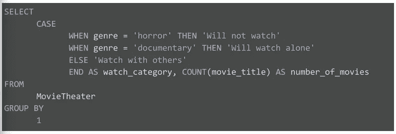

# SQL 中不要做的事情！

> 原文：<https://blog.devgenius.io/sql-best-practices-61d048b53619?source=collection_archive---------8----------------------->

穆罕默德·诺哈西在 [Unsplash](https://unsplash.com?utm_source=medium&utm_medium=referral) 上的照片

这些最佳实践包括编写 SQL 查询、开发文档的指南，以及演示这些实践的示例。当您自己使用 SQL 时，这是一个有用的资源，因为您可以通过转到适当的部分来快速回顾这些原则。
把它想象成 SQL 的现场指南！

# 大写和区分大小写

通常，在使用 SQL**时，大写是无关紧要的。**选择**也可以写成**选择**或者**选择**。他们都工作！然而，如果你坚持使用大写字母，你的问题会显得更专业。**

使用所有大写字母作为子句开头，像专家一样编写 **SQL** 查询(例如 **SELECT、FROM、WHERE** 等)。).

函数要全部大写，比如 **SUM()。**(参见本文后面关于蛇案的部分。)列名应该都是小写的。**驼峰式**应用于表名(参见本指南后面的**驼峰式**一节)。这保持了查询的一致性，使查询更容易理解，同时对运行查询时检索的数据没有影响。大写唯一重要的时候是在引号里面(更多关于引号的内容在下面)。

## SQL 方言

不同的 **SQL** 数据库供应商使用 SQL 的方式可能略有不同。方言是这些差异的名称。一些 SQL 语言区分大小写。 **BigQuery** 就是其中之一。另一个是 **Vertica** 。
然而，大多数——包括 **MySQL** 、 **PostgreSQL** 和**SQL Server**——都不关心大小写。

这意味着，如果您搜索 country code = "us "，将返回所有带有" us "、" us "、" Us "和" uS "的条目。 **BigQuery** 不以这种方式运行。由于 **BigQuery** 区分大小写，相同的搜索只会产生国家代码与“us”完全匹配的条目的结果。如果国家代码是“美国”，BigQuery 不会在结果中包含这些条目

# 单引号或双引号:“”或“”

当提到字符串时，使用单引号“”还是双引号“”通常并不重要。例如， **SELECT** 是一个子句起始符。
**SQL** 会把**选择**当作一个文本字符串，如果你用引号把它括起来，比如'**选择**或者'**选择**。您的查询需要一个 SELECT 子句，因此会产生错误。

但是，在两种情况下，您选择使用的报价类型很重要:

*   当您需要字符串在任何 SQL 方言中都可以被识别时
*   当字符串包含撇号或引号时

在每种 SQL 语言中，什么是可接受的，什么是不可接受的，这是有标准的。

> 但是对字符串使用单引号是一种惯例，几乎适用于所有的 SQL 方言。

这有助于消除很多困惑。因此，如果我们想在 WHERE 子句中引用美国这个国家(例如，country_code = 'US ')，那么在字符串' US '两边使用单引号。

第二种情况是当你的字符串包含引号。
考虑一个有两列的表格——每个朋友一列——和一个名为 FavoriteFoods 的喜爱食物列。

有报价数据的字段

你可能会注意到雷切尔最喜欢的食物中有一个撇号。如果您在 WHERE 子句中使用单引号来查找喜欢这种食物的朋友，它看起来会像这样:

**这将失败。**
如果执行此查询，您将收到一条错误消息。因为以一个引号开始并以另一个引号结束的文本字符串被 **SQL** 识别，所以情况就是这样。因此， **SQL** 认为在上面的错误查询中，您正在寻找的最喜欢的食物是“Shepherd”。由于 Shepherd 中的撇号，字符串只有“Shepherd”

> 一般来说，在这种特殊情况下，您应该只使用双引号来代替单引号。

在这种情况下，您的查询将如下所示:

使用双引号

**SQL** 将单引号或双引号作为文本字符串的第一个字符。因为这个字符串以双引号开始， **SQL** 将会预测这个字符串将以另一个双引号结束。因为撇号受到保护，所以结果将是“牧羊人馅饼”而不是“牧羊人”

# 作为提醒的注释

随着你对 SQL 的熟练掌握，你将能够快速阅读和理解查询。然而，在查询中添加注释可以提醒您的目标。此外，如果你分享你的问题，它有助于其他人理解你的问题。例如:

注释示例 SQL

在上面的查询中，您可以使用 **#** 来代替两个破折号，-，但是请记住#在所有的 **SQL** 方言中都不被识别( **MySQL** 不识别 **#** )。所以最好使用——并与之保持一致。当使用-向查询添加注释时，数据库查询引擎将忽略-后同一行中的所有内容。它将从下一行开始继续处理查询。这是一个单行注释的例子，你也可以创建一个多行注释，以/*开始，以*/结束。

多行注释

# 列的 Snake_case 名称

务必确保查询的输出具有易于理解的名称。如果您创建了一个新列(比如通过计算或连接新字段)，新列将获得一个通用的默认名称(例如 f0)。例如:

已创建列的通用默认名称

结果是:

创建的新列的结果

因为在前面提到的查询中没有标识它们，所以前两列被称为 f0 和 f1。 **SQL** 的默认值为 f0、f1、f2 等。为了确保最后两列的名称出现在查询结果中，我们将它们命名为 total tickets 和 number of purchases。这就是为什么给你的列起一个相关的名字总是一个聪明的主意，尤其是在使用函数的时候。您希望能够在运行查询后快速理解您的结果，就像我们在示例中提到的最后两列。

> 您可能还注意到，列名中的每个单词之间都有一个下划线。名称中不应该使用空格。

如果“total_tickets”包含一个空格并且类似于“total tickets”，SUM(tickets)将被 SQL**重命名为“total”**

> 由于空间的原因，SQL 会将名称视为“total”，不会理解您所说的“tickets”是什么意思因此，SQL 名称中的空格是有害的。永远不要省略空格。建议使用蛇皮箱。

换句话说，不要写“total tickets”，它在两个单词之间包含一个空格，而要写“total_tickets”，用下划线代替空格。同样，这可能因不同的 **SQL** 方言而异。例如，Zoho analytics 中的 SQL 编辑器可以识别列名中的空格。如前所述，避免空格是最佳实践。

# 表的茶色名称

命名表时，也可以使用 **CamelCase** 大写。
**驼色**大写是指每个单词以大写字母开头，看起来像一只双峰(双峰)骆驼。因此，TicketsByOccasion 表中使用了 **CamelCase** 大写。请注意，也使用了**茶色**，第一个单词不需要大写。有些人使用术语 **CamelCase** 和 **PascalCase** 来区分这两种类型，CamelCase 只在首字母不大写时使用，比如单峰骆驼，ticketsByOccasion 就是这种情况。

驼色最终只是一种时尚选择。还有其他选项来命名您的表，例如:

*   全部大写或全部小写，例如 TICKETSBYOCCASION
*   与蛇 _ 情况下，像门票 _ 由 _ 场合

对于专业用途，不建议使用全部小写或大写字母的选项，因为阅读您的表名会很困难。

从技术上来说，第二种选择，蛇案，是可以接受的。当单词由下划线分隔时，表名很容易阅读，但是因为还要添加下划线，所以表名可能会变得很长。写作也需要更多的时间。如果你经常使用这张桌子，它会变得令人厌烦。

> 总之，在命名表时，您可以自由选择 snake case 或 camelCase。确保您的表名一致且易于阅读。了解您的组织是否也有特定的表命名方法。如果他们这样做了，为了一致起见，总是使用他们的命名约定。

# 刻痕

一般来说，您希望查询中每一行的长度保持在 100 个字符:

这个查询很难阅读，也很难进行故障诊断或编辑。现在，这里有一个查询，我们坚持使用<= 100 character rule:

Indentation of SQL query

Now it is much easier to understand what you are trying to do in the **SELECT** 子句。当然，两个查询运行起来都不会有问题，因为缩进在 **SQL** 中无关紧要。但是适当的缩进对于保持行短仍然很重要。任何阅读你的问题的人都会重视它，包括你自己！

> 这些编写 SQL 查询的最佳实践将作为 SQL 领域指南来帮助您！

[—感谢您的阅读并随时联系我](https://www.linkedin.com/in/anmolpanna/)
[—想成为会员阅读更多](https://medium.com/membership/@anmolpanna)