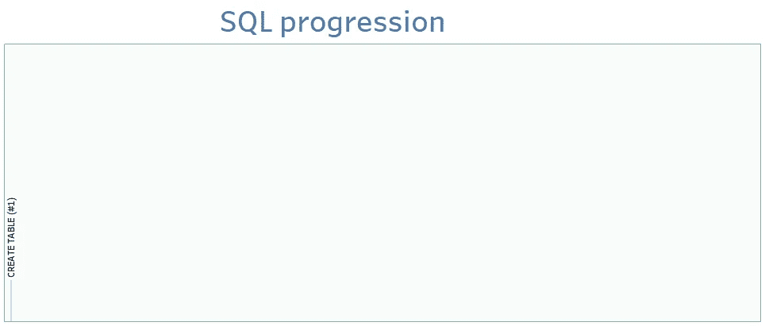
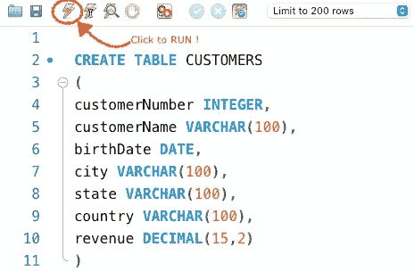
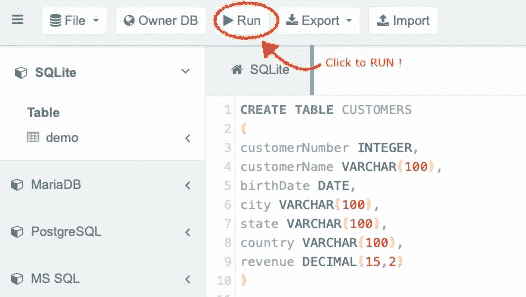
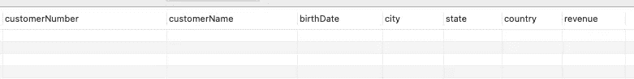
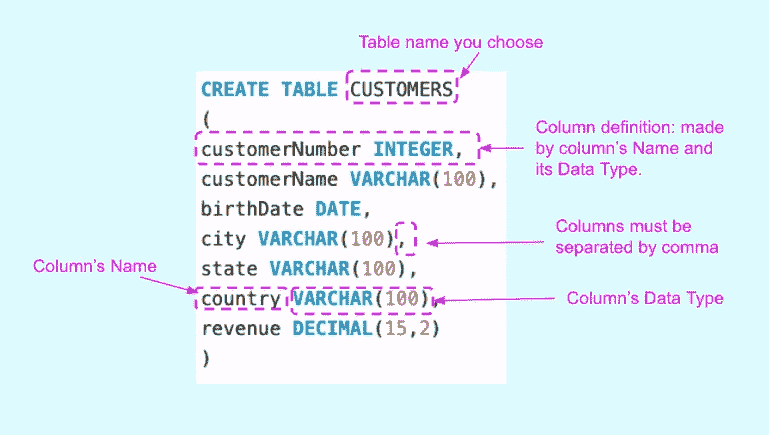

# SQL 的步骤#1:创建表

> 原文：<https://blog.devgenius.io/sql-by-steps-1-create-table-8b0dad9b9e89?source=collection_archive---------11----------------------->



作者图片

学习 SQL 的最好方法是..使用它。本系列的目标是在实践中逐步探索 SQL。级别:针对 SQL 初学者。

# 介绍

SQL 对于数据领域的任何工作都是必不可少的。本系列侧重于业务，而不是学术:它以渐进的方式解释 SQL，不是基于命令的复杂性(像书籍那样)，而是基于它们解决实际业务问题的效用。

我建议首先运行建议的查询，这样你就能感觉到它发生了什么，然后我们解释要记住的主要概念。

每个职位的方法都是一样的:

```
· [1\. Running the proposed SQL query (5'–10')](#77ba)
· [2\. Understanding (10'–20')](#df12)
· [3\. Practising (20'- 40')](#0f44)
```

# **1。运行建议的 SQL 查询(5 '–10 ')**

让我们运行代码，即使你不知道它是做什么的。

只需将下面的 SQL 脚本复制并粘贴到任何在线数据库(如 https://sqliteonline.com/的[)或本地数据库(如 MySQL)上，然后运行它。](https://sqliteonline.com/)

```
CREATE TABLE CUSTOMERS (
    customerNumber INTEGER,
    customerName VARCHAR(100),
    birthDate DATE,
    city VARCHAR(100),
    state VARCHAR(100),
    country VARCHAR(100),
    revenue DECIMAL(15,2)
);
```

例如，您可以使用 MySQL Workbench 查询编辑器来运行 SQL MySQL 数据库:



作者图片

这是在 https://sqliteonline.com/的[如何做到的](https://sqliteonline.com/)



作者图片

# 2.理解(10 英尺–20 英尺)

您刚刚在数据库中从头开始创建了一个表！这将是您存储客户信息的地方。

> *通过****CREATE TABLE****语句，你刚刚定义了你的表的结构，它是一个* ***列*** *的集合，没有行。下面是该查询所做的:*



作者图片

> 要制作任何一张桌子，你至少需要两种材料:
> 
> -选择一个表的名称
> 
> -决定哪些列及其数据类型

让我们详细检查一下 SQL 代码:



作者图片

注意:我们将在本系列的另一篇文章中讨论数据类型。它们现在还不是最基本的。

# 3.练习(20 英尺- 40 英尺)

为了吸收您刚刚学习的 SQL 语法，尝试创建新的表，更改列名和列号。目前，我们还没有讨论数据类型，所以只使用我们在脚本中使用的数据类型。

感谢阅读。

[随时订阅我的**【分享数据知识】**简讯**。**](http://eepurl.com/humfIH)


如果你想订阅《灵媒》,请随意使用我的推荐链接[https://medium.com/@maw-ferrari/membership](https://medium.com/@maw-ferrari/membership):对你来说，费用是一样的，但它间接有助于我的故事。