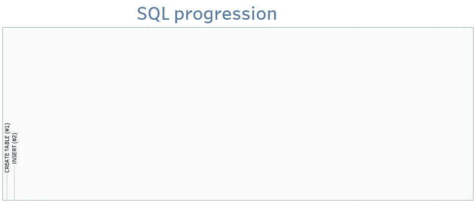
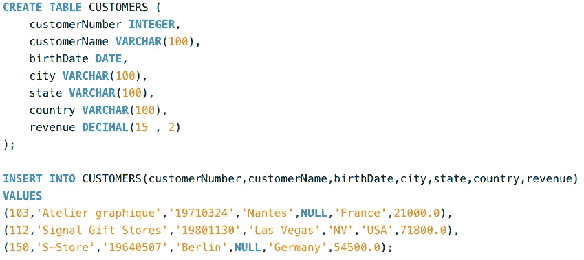
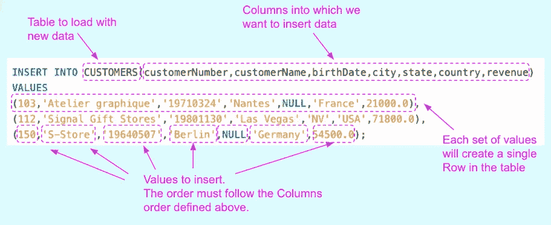

# SQL 第二步:插入

> 原文：<https://blog.devgenius.io/sql-by-steps-2-insert-ba57c972c7b7?source=collection_archive---------14----------------------->



作者图片

学习 SQL 的最好方法是..利用它。本系列的目标是在实践中逐步探索 SQL。级别:针对 SQL 初学者。

# 介绍

SQL 对于数据领域的任何工作都是必不可少的。本系列侧重于业务，而不是学术:它以渐进的方式解释 SQL，不是基于命令的复杂性(像书籍那样)，而是基于它们解决实际业务问题的效用。

我建议首先运行建议的查询，这样你就能感觉到它发生了什么，然后我们解释要记住的主要概念。

每个职位的方法都是一样的:

```
**·** [**1\. Running the proposed SQL query (5'–10')**](#77ba) **·** [**2\. Understanding (10'–20')**](#df12) **·** [**3\. Practising (20'-40')**](#0f44)
```

# 1.运行建议的 SQL 查询(5 英尺–10 英尺)

让我们运行代码，即使你不知道它是做什么的。

只需将下面的 SQL 脚本复制并粘贴到任何在线数据库(如[https://sqliteonline.com/](https://sqliteonline.com/))，或者本地数据库(如 MySQL)，然后运行它。关于如何开始运行查询的更多细节，请看我的帖子[“**SQL 第一步**”](https://medium.com/p/8b0dad9b9e89/edit)

```
CREATE TABLE CUSTOMERS (
    customerNumber INTEGER,
    customerName VARCHAR(100),
    birthDate DATE,
    city VARCHAR(100),
    state VARCHAR(100),
    country VARCHAR(100),
    revenue DECIMAL(15 , 2)
);INSERT INTO CUSTOMERS(customerNumber,customerName,birthDate,city,state,country,revenue)
VALUES 
(103,'Atelier graphique','19710324','Nantes',NULL,'France',21000.0),
(112,'Signal Gift Stores','19801130','Las Vegas','NV','USA',71800.0),
(150,'S-Store','19640507','Berlin',NULL,'Germany',54500.0);
```

可读性更强的版本:



作者图片

# 2.理解(10 英尺–20 英尺)

您刚刚在数据库中从头开始向一个表中插入了 3 行！

在这个脚本中有两个查询:第一个(“CREATE TABLE ..”)构建一个空的客户表，如我的帖子 [**SQL 步骤#1**](https://medium.com/p/8b0dad9b9e89/edit) 中所讨论的

第二个查询(" **INSERT** ")实际上是将数据插入到表中。

> *通过* ***插入*** *语句，可以向表中添加新的数据行。*



我们刚刚学习的 INSERT 语句需要指出我们要插入数据的列名。也支持它的简化版本，其中我们省略了列名，假设您为所有可能的列插入了一个值。我不推荐使用这种语法，因为它提供的控制较少，尤其是当表结构改变时。如果你想试试:

```
INSERT INTO CUSTOMERS
VALUES 
(103,’Atelier graphique’,’19710324',’Nantes’,NULL,’France’,21000.0),
(112,’Signal Gift Stores’,’19801130',’Las Vegas’,’NV’,’USA’,71800.0),
(150,’S-Store’,’19640507',’Berlin’,NULL,’Germany’,54500.0);
```

# 3.练习(20 英尺-40 英尺)

要理解您刚刚学习的 SQL 语法，请尝试:

*   创建新行
*   创建新行以仅加载表中列的子集

感谢阅读。

[随时订阅我的**【分享数据知识】**简讯**。**](http://eepurl.com/humfIH)


如果你想订阅《灵媒》,请随意使用我的推荐链接[https://medium.com/@maw-ferrari/membership](https://medium.com/@maw-ferrari/membership):对你来说，费用是一样的，但它间接有助于我的故事。

*更多内容尽在*[*blog . dev genius . io*](http://blog.devgenius.io)*。*