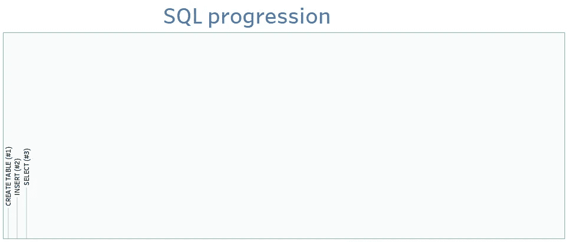
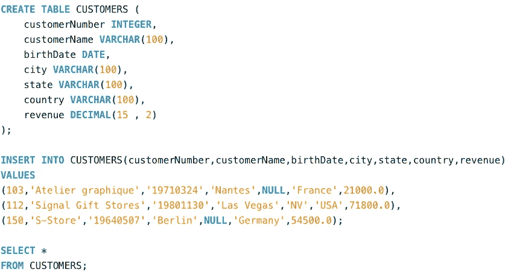
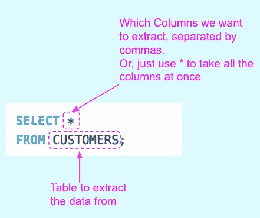

# SQL 的步骤#3:选择

> 原文：<https://blog.devgenius.io/sql-by-steps-3-select-920a97e30574?source=collection_archive---------6----------------------->



作者图片

学习 SQL 的最好方法是..使用它。本系列的目标是在实践中逐步探索 SQL。级别:针对 SQL 初学者。

# 介绍

SQL 对于数据领域的任何工作都是必不可少的。本系列侧重于业务，而不是学术:它以渐进的方式解释 SQL，不是基于命令的复杂性(像书籍那样)，而是基于它们解决实际业务问题的效用。

我建议首先运行建议的查询，这样你就能感觉到它发生了什么，然后我们解释要记住的主要概念。

每个职位的方法都是一样的:

```
· [1\. Running the proposed SQL query (5'–10')](#77ba)
· [2\. Understanding (10'–20')](#df12)
· [3\. Practising (20'-40')](#0f44)
```

# 1.运行建议的 SQL 查询(5 英尺–10 英尺)

让我们运行代码，即使你不知道它是做什么的。

只需将下面的 SQL 脚本复制并粘贴到任何在线数据库(如[https://sqliteonline.com/](https://sqliteonline.com/))，或者本地数据库(如 MySQL)，然后运行它。

```
CREATE TABLE CUSTOMERS (
    customerNumber INTEGER,
    customerName VARCHAR(100),
    birthDate DATE,
    city VARCHAR(100),
    state VARCHAR(100),
    country VARCHAR(100),
    revenue DECIMAL(15 , 2)
);INSERT INTO CUSTOMERS(customerNumber,customerName,birthDate,city,state,country,revenue)
VALUES 
(103,'Atelier graphique','19710324','Nantes',NULL,'France',21000.0),
(112,'Signal Gift Stores','19801130','Las Vegas','NV','USA',71800.0),
(150,'S-Store','19640507','Berlin',NULL,'Germany',54500.0);SELECT *
FROM CUSTOMERS;
```

可读性更强的版本:



作者图片

# 2.理解(10 英尺–20 英尺)

在这个脚本中，您有 3 个查询:“创建表”和“插入”只是准备一个包含数据的表(请参考我的帖子 [**SQL 步骤#1**](https://medium.com/p/8b0dad9b9e89/edit) 和 [**SQL 步骤#2**](https://medium.com/p/ba57c972c7b7/edit) 了解更多关于它们的详细信息)。

我们现在的目标是引入“选择”部分。

> ****SELECT****语句从表中检索所有行，只保留您指定的列。*表示“所有列”。**

*也有一些方法告诉 SELECT 语句删除行。我们将在另一篇文章中对此进行探讨。现在我们只考虑 SELECT 语句的最简单形式:*

**

*作者图片*

# *3.练习(20 英尺-40 英尺)*

*要理解您刚刚学习的 SQL 语法，请尝试:*

*   *用心编写一个查询，从表中提取所有列*
*   *仅提取前 4 列*

*感谢阅读。*

*[随时订阅我的**【分享数据知识】**简讯**。**](http://eepurl.com/humfIH)*

**

*如果你想订阅《灵媒》,请随意使用我的推荐链接[https://medium.com/@maw-ferrari/membership](https://medium.com/@maw-ferrari/membership):对你来说，费用是一样的，但它间接有助于我的故事。*