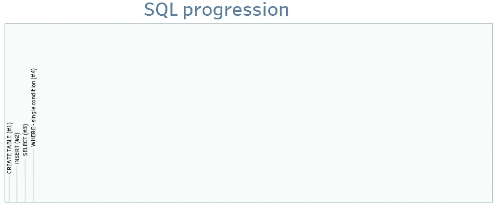
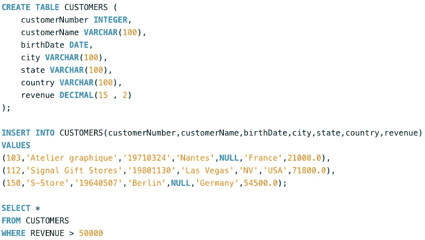
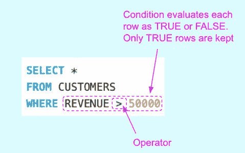
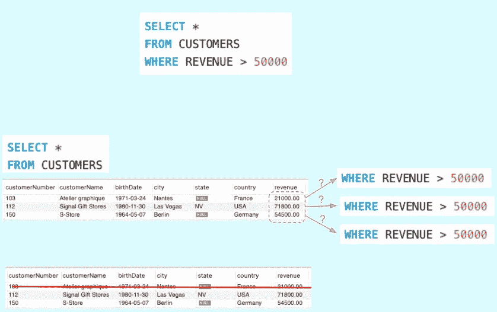

# SQL by steps #4 : WHERE(单一条件)

> 原文：<https://blog.devgenius.io/sql-by-steps-4-where-single-condition-791b68cf1bb?source=collection_archive---------4----------------------->



学习 SQL 的最好方法是..使用它。本系列的目标是在实践中逐步探索 SQL。级别:针对 SQL 初学者。

# 介绍

SQL 对于数据领域的任何工作都是必不可少的。本系列侧重于业务，而不是学术:它以渐进的方式解释 SQL，不是基于命令的复杂性(像书籍那样)，而是基于它们解决实际业务问题的效用。

我建议首先运行建议的查询，这样你就能感觉到它发生了什么，然后我们解释要记住的主要概念。

每个职位的方法都是一样的:

```
· [1\. Running the proposed SQL query (5'–10')](#77ba)
· [2\. Understanding (10'–20')](#df12)
· [3\. Practising (20'-40')](#0f44)
```

# 1.运行建议的 SQL 查询(5 英尺–10 英尺)

让我们运行代码，即使你不知道它是做什么的。

只需将下面的 SQL 脚本复制并粘贴到任何在线数据库(如[https://sqliteonline.com/](https://sqliteonline.com/))，或者本地数据库(如 MySQL)，然后运行它。

```
CREATE TABLE CUSTOMERS (
    customerNumber INTEGER,
    customerName VARCHAR(100),
    birthDate DATE,
    city VARCHAR(100),
    state VARCHAR(100),
    country VARCHAR(100),
    revenue DECIMAL(15 , 2)
);INSERT INTO CUSTOMERS(customerNumber,customerName,birthDate,city,state,country,revenue)
VALUES 
(103,'Atelier graphique','19710324','Nantes',NULL,'France',21000.0),
(112,'Signal Gift Stores','19801130','Las Vegas','NV','USA',71800.0),
(150,'S-Store','19640507','Berlin',NULL,'Germany',54500.0);SELECT *
FROM CUSTOMERS
WHERE REVENUE > 50000
```

可读性更强的版本:



# 2.理解(10 英尺–20 英尺)

让我们关注上面脚本中带有“ **WHERE** ”子句的查询。我们已经在我以前的帖子 [**中讨论了其他 3 个查询:SQL 步骤#1**](https://medium.com/p/8b0dad9b9e89/edit) 、 [**SQL 步骤#2**](https://medium.com/p/ba57c972c7b7/edit) 和 [SQL 步骤#3](https://medium.com/p/920a97e30574/edit)

> ****其中*** *子句* *删除不满足一个或多个条件的行**

*在这篇文章中，我们考虑单一条件的情况，因为现在的目标是理解在哪里的基础知识。实际上，你会在另一篇文章中看到，我们通常在 WHERE 子句中组合几个条件，对数据进行复杂的过滤。*

**

*工作的方式是:*

*   *由 FROM 提取的每一行都由条件进行评估*
*   *查询结果中只保留满足条件的行*

**

*条件使用特殊运算符来比较相同类型的元素(数值与数值、日期与日期以及字符串与字符串):*

> ***算术运算符**:*

```
*<         >        =          <>    
+         —        /           *         % (modulus)*
```

> ***其他“必须知道”的操作员**:*

```
***IN** : compares a column value, or any attribute, to a list of constants, separated by commas**BETWEEN** value1 **AND** value2 : looks at values in the range from value1 to value 2**NOT**: keeps the rows that do not satisfy the condition**IS NULL** : keeps the null values only. Useful also its variation IS NOT NULL, to keep non null values only**LIKE** : searches string patterns, in conjunction with the operators ”%" (matches any string) and ”_” (matches any single character in a string)*
```

*这个列表可能不是 100%详尽的，因为一些数据库支持更多的操作符。但是，如果你掌握了我们列出的那些，你将会涵盖绝大多数真实世界的案例。*

# *3.练习(20 英尺-40 英尺)*

*为了理解您刚刚学习的 SQL 语法，为“2。理解”部分，定义 CUSTOMERS 表中以下列的 WHERE 条件:*

*   *税收*
*   *客户名称。提示:字符序列(也称为“字符串”)是在单个配额中创建的。示例:*

```
*SELECT * FROM CUSTOMERS WHERE customerName = 'S-Store'*
```

*您将面临一些关于在条件中处理不同类型数据的问题，因为我们还没有谈到数据类型。关于这一点，我会另发一个帖子。*

*感谢阅读。*

*[随时订阅我的**《分享数据知识》**简讯**。**](http://eepurl.com/humfIH)*

**

*如果你想订阅《灵媒》,请随意使用我的推荐链接[https://medium.com/@maw-ferrari/membership](https://medium.com/@maw-ferrari/membership):对你来说，费用是一样的，但它间接有助于我的故事。*