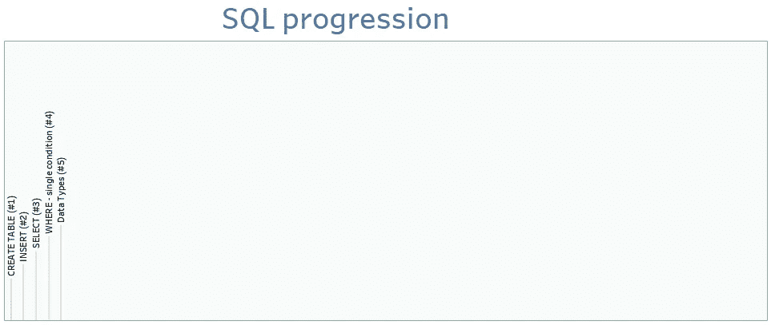
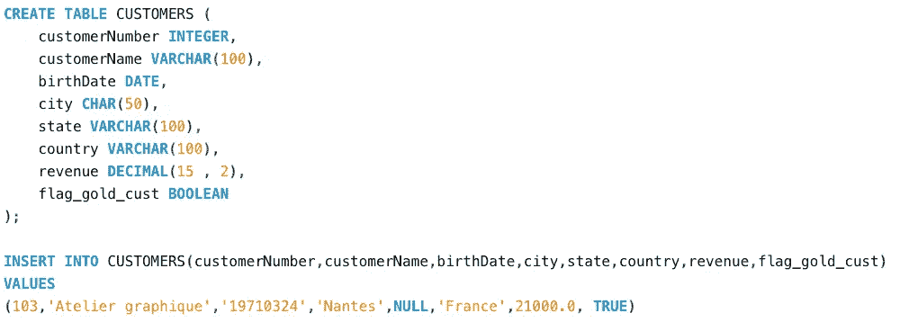

# SQL by steps #5:基本数据类型

> 原文：<https://blog.devgenius.io/sql-by-steps-5-essential-data-types-9ff72cab0628?source=collection_archive---------14----------------------->



学习 SQL 的最好方法是..使用它。本系列的目标是在实践中逐步探索 SQL。级别:针对 SQL 初学者。

# 介绍

SQL 对于数据领域的任何工作都是必不可少的。本系列侧重于业务，而不是学术:它以渐进的方式解释 SQL，不是基于命令的复杂性(像书籍那样)，而是基于它们解决实际业务问题的效用。

我建议首先运行建议的查询，这样你就能感觉到它发生了什么，然后我们解释要记住的主要概念。

每个职位的方法都是一样的:

```
· [1\. Running the proposed SQL query (5'–10')](#77ba)
· [2\. Understanding (10'–20')](#df12)
· [3\. Practising (20'-40')](#0f44)
```

# 1.运行建议的 SQL 查询(5 英尺–10 英尺)

让我们运行代码，即使你不知道它是做什么的。

只需将下面的 SQL 脚本复制并粘贴到任何在线数据库(如[https://sqliteonline.com/](https://sqliteonline.com/))，或者本地数据库(如 MySQL)，然后运行它。

```
CREATE TABLE CUSTOMERS (
    customerNumber INTEGER,
    customerName VARCHAR(100),
    birthDate DATE,
    city CHAR(50),
    state VARCHAR(100),
    country VARCHAR(100),
    revenue DECIMAL(15 , 2),
    flag_gold_cust BOOLEAN    
);INSERT INTO CUSTOMERS(customerNumber,customerName,birthDate,city,state,country,revenue,flag_gold_cust)
VALUES 
(103,'Atelier graphique','19710324','Nantes',NULL,'France',21000.0, TRUE);
```

可读性更强的版本:



作者图片

# 2.理解(10 英尺–20 英尺)

每个列都必须有一个数据类型，以指示它存储哪种类型的值。数据库以不同的方式处理它们，并根据数据类型为用户提供不同的功能。

数据类型有很多种，但在实践中，仅用其中的 8 种**，我们就可以完成 99.9%的数据分析、设计和创建。这 8 个将是我们这里的重点。**

> **数字**

```
**1\. INTEGER**
stores a numeric value with no decimals.
Example: *customerNumber INTEGER***2\. DECIMAL(p,s)**
stores a numeric value with decimal digits. 
"p" is the Precision: total number of digits (e.g. 7)
"s" is the Scale: number of digits after the decimal (e.g. 2).
Example: *revenue DECIMAL(15,2)*
```

> **文本(字符串)**

```
**3\. CHAR(n)**
stores a fixed number "n" nof characters.
Example: *personSex CHAR(1)***4\. VARCHAR(n)**
stores a variable number nof characters, "n" at maximum.
Example: *customerName VARCHAR(100)*
```

> **日期**

```
**5\. DATE**
stores a date (e.g. '2024-01-01')**6\. TIME**
stores a time (e.g. '05:54:45')**7\. TIMESTAMP**
stores a combination of DATE and TIME (e.g. '2024-01-01 05:54:45')
```

> **其他**

```
**8\. BOOLEAN**
stores two possible logical values : TRUE and FALSE
```

> 当我们将数据插入到表中，或者编写 WHERE 条件时，我们需要日期和文本数据类型的配额(单精度或双精度)。对于数字或布尔值，我们不使用配额。

要查看 INSERT 和 WHERE 语法，请参考 [SQL 步骤#2](https://medium.com/p/ba57c972c7b7/edit) 和 [SQL 步骤#3](https://maw-ferrari.medium.com/sql-by-steps-4-where-single-condition-791b68cf1bb)

关于数据类型需要记住的另一个非常重要的概念是什么是空值。NULL 不是一种数据类型，但是在这里引入它是有意义的，因为任何数据类型的列都可以包含 NULL 值。

> NULL 表示“缺少值”。

# 3.练习(20 英尺-40 英尺)

为了理解您刚刚学习的 SQL 语法，

*   编写一个新的查询来创建至少 8 列，上述 8 种基本数据类型各有一列。
*   在表中插入 3 行，加载每一列
*   至少编写 8 个 WHERE 条件，每列一个(如果需要，在此查看 WHERE 语法 [SQL 步骤#4](https://maw-ferrari.medium.com/sql-by-steps-4-where-single-condition-791b68cf1bb) )

感谢阅读。

[随时订阅我的**【分享数据知识】**简讯**。**](http://eepurl.com/humfIH)


如果你想订阅《灵媒》,请随意使用我的推荐链接[https://medium.com/@maw-ferrari/membership](https://medium.com/@maw-ferrari/membership):对你来说，费用是一样的，但它间接有助于我的故事。