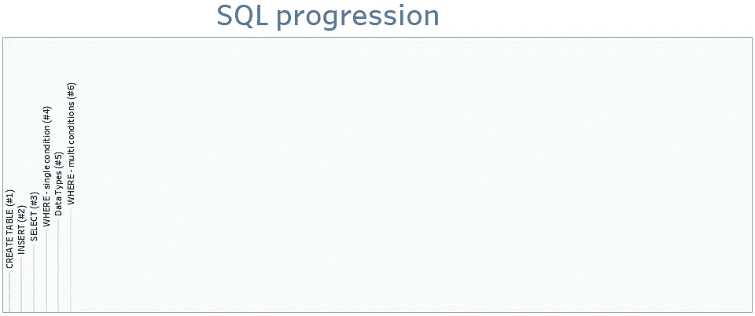

# SQL by steps #6 : WHERE(多条件)

> 原文：<https://blog.devgenius.io/sql-by-steps-6-where-multi-conditions-f15f178db562?source=collection_archive---------12----------------------->



学习 SQL 的最好方法是..利用它。本系列的目标是在实践中逐步探索 SQL。级别:针对 SQL 初学者。

# 介绍

SQL 对于数据领域的任何工作都是必不可少的。本系列侧重于业务，而不是学术:它以渐进的方式解释 SQL，不是基于命令的复杂性(像书籍那样)，而是基于它们解决实际业务问题的效用。

我建议首先运行建议的查询，这样你就能感觉到它发生了什么，然后我们解释要记住的主要概念。

每个职位的方法都是一样的:

```
· [1\. Running the proposed SQL query (5'–10')](#77ba)
· [2\. Understanding (10'–20')](#df12)
· [3\. Practising (20'-40')](#0f44)
```

链接到 SQL by Steps 系列以前的故事:

*   [**SQL by steps #1:创建表**](/sql-by-steps-1-create-table-8b0dad9b9e89?source=your_stories_page----------------------------------------)
*   [**SQL by steps # 2:INSERT**](/sql-by-steps-2-insert-ba57c972c7b7?source=your_stories_page----------------------------------------)
*   [**SQL by steps #3:选择**](/sql-by-steps-3-select-920a97e30574?source=your_stories_page----------------------------------------)
*   [**SQL by steps #4 : WHERE(单条件)**](/sql-by-steps-4-where-single-condition-791b68cf1bb?source=your_stories_page----------------------------------------)
*   [**SQL by steps #5:基本数据类型**](/sql-by-steps-5-essential-data-types-9ff72cab0628?source=your_stories_page----------------------------------------)

# 1.运行建议的 SQL 查询(5 英尺–10 英尺)

让我们运行代码，即使你不知道它是做什么的。

只需将下面的 SQL 脚本复制并粘贴到任何在线数据库(如[https://sqliteonline.com/](https://sqliteonline.com/)，或本地数据库(如 MySQL)，然后运行它。

```
CREATE TABLE CUSTOMERS (
    customerNumber INTEGER,
    customerName VARCHAR(100),
    birthDate DATE,
    city VARCHAR(100),
    state VARCHAR(100),
    country VARCHAR(100),
    revenue DECIMAL(15 , 2)
);
INSERT INTO CUSTOMERS(customerNumber,customerName,birthDate,city,state,country,revenue)
VALUES 
(103,'Atelier graphique','19710324','Nantes',NULL,'France',21000.0),
(112,'Signal Gift Stores','19801130','Las Vegas','NV','USA',71800.0),
(150,'S-Store','19640507','Berlin',NULL,'Germany',54500.0);SELECT *
FROM CUSTOMERS AS C
WHERE 
(REVENUE > 50000 OR REVENUE IS NULL)
AND COUNTRY NOT IN ('USA')
AND EXISTS 
(SELECT 'doesnt matter' FROM CUSTOMERS AS C1 
 WHERE C1.customerNumber = C.customerNumber
 AND COUNTRY NOT IN ('USA') 
 )
```

可读性更强的版本:


# 2.理解(10 英尺–20 英尺)

在实践中，用于数据分析的 SQL 查询的 WHERE 子句需要应用多个条件。典型的场景需要多达 10 个条件，这只是给你一个概念。

在 post [SQL 步骤 4](https://maw-ferrari.medium.com/sql-by-steps-4-where-single-condition-791b68cf1bb) 中，我们构建了单条件 WHERE 子句，那么我们如何组合多个条件呢？由 4 个逻辑运算符**与，或，存在，不:**

> **和**:查询结果包含满足 AND 中所有条件的行
> 
> **或**:查询结果包含满足 OR 中任一条件的行
> 
> **EXISTS** ( **子查询)**:查询结果只包含关键字存在于子查询中的行
> 
> **非**:查询结果包含不满足条件的行

我们必须使用括号来建立逻辑运算符的求值顺序。默认情况下，AND 的优先级高于 OR(记住，在算术运算中，您可以将 AND /OR 与乘法/Sum 进行比较)。

在您刚刚运行的脚本中，我们使用所有 4 个运算符应用了 4 个条件，让我们来理解它们:


条件#1 和#2 在 OR 中:只保留其中任何一个有效的行。

条件#3 和#4 进行完全相同的过滤:它们只保留与“美国”不同的国家。条件#4 在这个例子中没有用，但是我想展示它，因为它在处理跨多个表的条件时非常有用和有效。

注意到**存在(..)**只保留标识符 **customerNumber** 与 EXISTS 查询**(..)**。这是由条款规定的:


特别是，该行:


建立主查询(C 表)和 EXISTS 查询(C1 表)之间的链接。

另外，请注意 EXISTS 查询中的 SELECT 子句:该查询没有从主查询中检索到任何列，事实上我只是选择了一个虚拟的“无关紧要”列，但它可能是任何列。EXISTS 查询唯一重要的部分是它的 WHERE 子句。

# 3.练习(20 英尺-40 英尺)

为了理解您刚刚学习的 SQL 语法，使用带有所有操作符的 CUSTOMERS 表，编写 5 个具有不同 WHERE 条件的查询

*   和
*   运筹学
*   不
*   存在

感谢阅读。

[随时订阅我的**【分享数据知识】**简讯**。**](http://eepurl.com/humfIH)


如果你想订阅《灵媒》,请随意使用我的推荐链接[https://medium.com/@maw-ferrari/membership](https://medium.com/@maw-ferrari/membership):对你来说，费用是一样的，但它间接有助于我的故事。