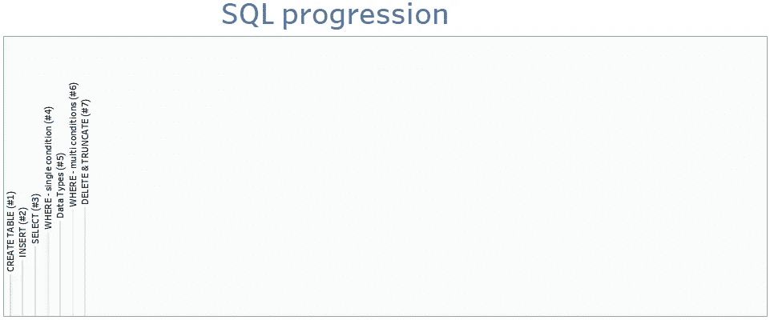
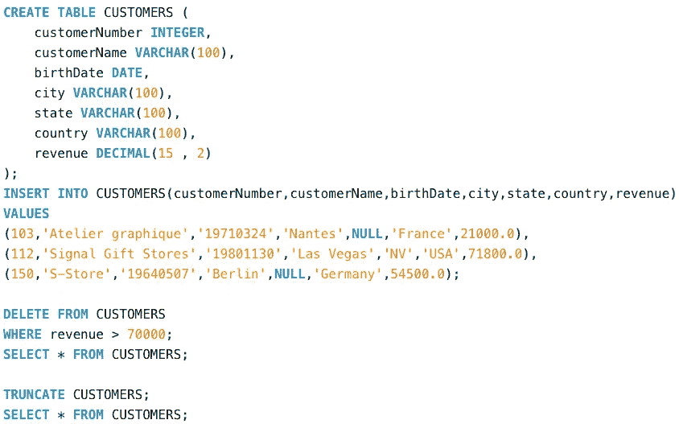
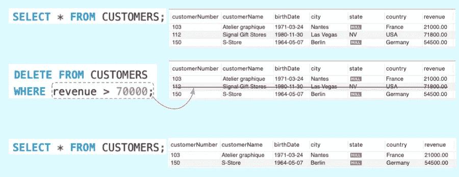
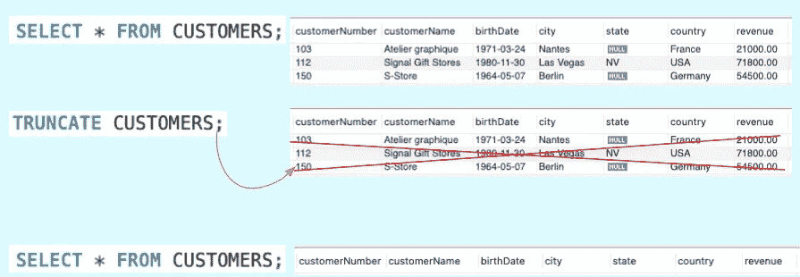

# SQL by steps #7:删除和截断—删除数据

> 原文：<https://blog.devgenius.io/sql-by-steps-7-delete-truncate-removing-data-82ee8d0e65b9?source=collection_archive---------7----------------------->



学习 SQL 的最好方法是..利用它。本系列的目标是在实践中逐步探索 SQL。级别:针对 SQL 初学者。

# 介绍

SQL 对于数据领域的任何工作都是必不可少的。本系列侧重于业务，而不是学术:它以一种渐进的方式解释 SQL，不是基于命令的复杂性(像书籍那样)，而是基于它们解决实际业务问题的效用。

我建议首先运行建议的查询，这样你就能感觉到它发生了什么，然后我们解释要记住的主要概念。

每个职位的方法都是一样的:

```
· [1\. Running the proposed SQL query (5'–10')](/sql-by-steps-6-where-multi-conditions-f15f178db562#77ba)
· [2\. Understanding (10'–20')](/sql-by-steps-6-where-multi-conditions-f15f178db562#df12)
· [3\. Practising (20'-40')](/sql-by-steps-6-where-multi-conditions-f15f178db562#0f44)
```

链接到 SQL by Steps 系列以前的故事:

*   [**SQL by steps #1:创建表**](/sql-by-steps-1-create-table-8b0dad9b9e89?source=your_stories_page----------------------------------------)
*   [**SQL by steps # 2:INSERT**](/sql-by-steps-2-insert-ba57c972c7b7?source=your_stories_page----------------------------------------)
*   [**SQL by steps #3:选择**](/sql-by-steps-3-select-920a97e30574?source=your_stories_page----------------------------------------)
*   [**SQL by steps #4 : WHERE(单条件)**](/sql-by-steps-4-where-single-condition-791b68cf1bb?source=your_stories_page----------------------------------------)
*   [**SQL by steps #5:基本数据类型**](/sql-by-steps-5-essential-data-types-9ff72cab0628?source=your_stories_page----------------------------------------)
*   [**SQL by steps #6 : WHERE(多条件)**](/sql-by-steps-6-where-multi-conditions-f15f178db562)

# 1.运行建议的 SQL 查询(5 英尺–10 英尺)

让我们运行代码，即使你不知道它是做什么的。

只需将下面的 SQL 脚本复制并粘贴到任何在线数据库(如[https://sqliteonline.com/](https://sqliteonline.com/))，或者本地数据库(如 MySQL)，然后运行它。

```
CREATE TABLE CUSTOMERS (
    customerNumber INTEGER,
    customerName VARCHAR(100),
    birthDate DATE,
    city VARCHAR(100),
    state VARCHAR(100),
    country VARCHAR(100),
    revenue DECIMAL(15 , 2)
);
INSERT INTO CUSTOMERS(customerNumber,customerName,birthDate,city,state,country,revenue)
VALUES 
(103,'Atelier graphique','19710324','Nantes',NULL,'France',21000.0),
(112,'Signal Gift Stores','19801130','Las Vegas','NV','USA',71800.0),
(150,'S-Store','19640507','Berlin',NULL,'Germany',54500.0);DELETE FROM CUSTOMERS
WHERE revenue > 70000;
SELECT * FROM CUSTOMERS;TRUNCATE CUSTOMERS;
SELECT * FROM CUSTOMERS;
```

可读性更强的版本:



# 2.理解(10 英尺–20 英尺)

DELETE 和 TRUNCATE 是两个不同的语句，目标相同:从表中删除记录。

> *删除从表格中删除一行或一组行，可以根据条件选择。事实上，它支持 WHERE 子句和子查询。*
> 
> TRUNCATE *一次删除所有行，而且是无条件的。*

另一个重要的区别是关于性能，截断比删除快得多。如果您想知道为什么:DELETE 通过扫描表并在数据库事务日志中记录每个删除的行来工作(它列出了 DML 事务和每个事务发生的数据修改)。TRUNCATE 只是为表的数据释放数据库空间，而不进行日志记录或扫描(因为它是 DML 而不是 DDL 命令)。

在现实世界的数据项目中，我们通常使用 DELETE 来删除不需要的行，比如重复的行，或者不遵守某些业务规则的行，而 TRUNCATE 只是为了清空一个表。

这两条语句在列的数量和类型方面保留了表的结构。

*   **删除**



*   **截断**



# 3.练习(20 英尺-40 英尺)

为了理解您刚刚学习的 SQL 语法，在 CUSTOMERS 表上编写 3 个查询

*   通过删除删除所有表格行
*   通过 TRUNCATE 删除所有表行
*   删除在 1960.01.01 之前没有“州”或“出生日期”的行

感谢阅读。

[随时订阅我的**【分享数据知识】**简讯**。**](http://eepurl.com/humfIH)


如果你想订阅《灵媒》,请随意使用我的推荐链接[https://medium.com/@maw-ferrari/membership](https://medium.com/@maw-ferrari/membership):对你来说，费用是一样的，但它间接有助于我的故事。