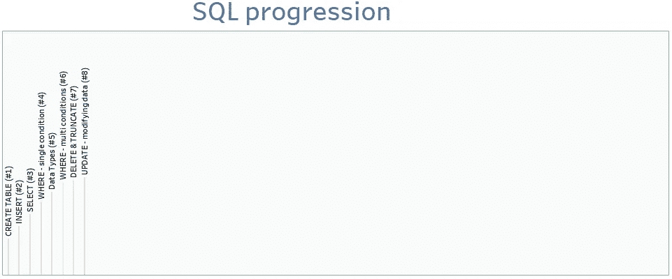
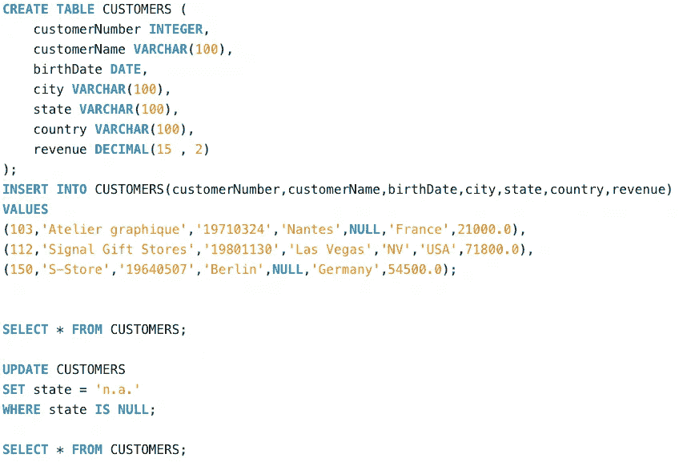
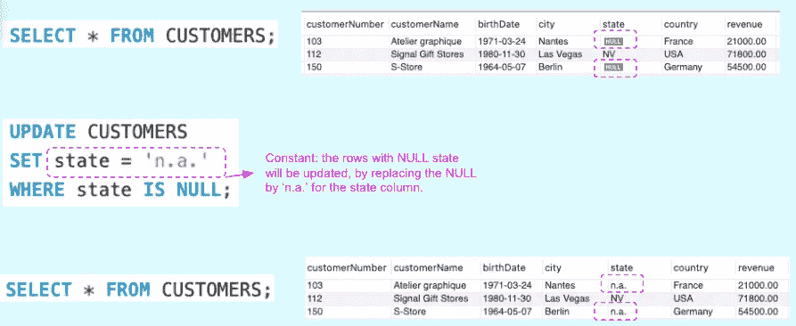
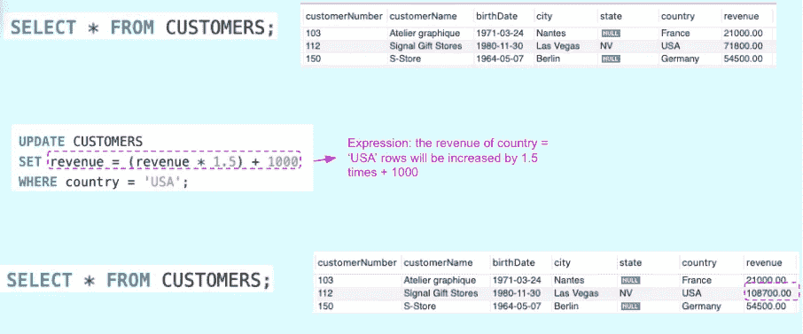
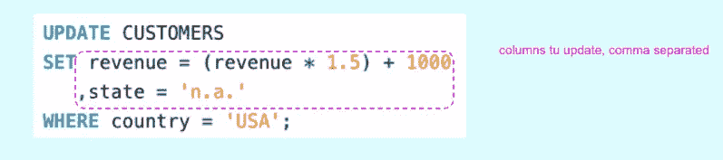

# SQL by steps #8:更新-修改数据

> 原文：<https://blog.devgenius.io/sql-by-steps-8-update-modifying-data-d6606a810b05?source=collection_archive---------9----------------------->



学习 SQL 的最好方法是..利用它。本系列的目标是在实践中逐步探索 SQL。级别:针对 SQL 初学者。6

# 介绍

SQL 对于数据领域的任何工作都是必不可少的。本系列侧重于业务，而不是学术:它以渐进的方式解释 SQL，不是基于命令的复杂性(像书籍那样)，而是基于它们解决实际业务问题的效用。

我建议首先运行建议的查询，这样你就能感觉到它发生了什么，然后我们解释要记住的主要概念。

每个职位的方法都是一样的:

```
· [1\. Running the proposed SQL query (5'–10')](/sql-by-steps-6-where-multi-conditions-f15f178db562#77ba)
· [2\. Understanding (10'–20')](/sql-by-steps-6-where-multi-conditions-f15f178db562#df12)
· [3\. Practising (20'-40')](/sql-by-steps-6-where-multi-conditions-f15f178db562#0f44)
```

链接到 SQL by Steps 系列以前的故事:

*   [**SQL by steps #1:创建表**](/sql-by-steps-1-create-table-8b0dad9b9e89?source=your_stories_page----------------------------------------)
*   [**SQL by steps # 2:INSERT**](/sql-by-steps-2-insert-ba57c972c7b7?source=your_stories_page----------------------------------------)
*   [**SQL by steps #3:选择**](/sql-by-steps-3-select-920a97e30574?source=your_stories_page----------------------------------------)
*   [**SQL by steps #4 : WHERE(单条件)**](/sql-by-steps-4-where-single-condition-791b68cf1bb?source=your_stories_page----------------------------------------)
*   [**SQL by steps #5:基本数据类型**](/sql-by-steps-5-essential-data-types-9ff72cab0628?source=your_stories_page----------------------------------------)
*   [**SQL by steps #6 : WHERE(多条件)**](/sql-by-steps-6-where-multi-conditions-f15f178db562)
*   [**SQL by steps #7:删除&截断—删除数据**](https://medium.com/p/82ee8d0e65b9/edit)

# 1.运行建议的 SQL 查询(5 英尺–10 英尺)

让我们运行代码，即使你不知道它是做什么的。

只需将下面的 SQL 脚本复制并粘贴到任何在线数据库(如[https://sqliteonline.com/](https://sqliteonline.com/))，或者本地数据库(如 MySQL)，然后运行它。

```
CREATE TABLE CUSTOMERS (
    customerNumber INTEGER,
    customerName VARCHAR(100),
    birthDate DATE,
    city VARCHAR(100),
    state VARCHAR(100),
    country VARCHAR(100),
    revenue DECIMAL(15 , 2)
);INSERT INTO CUSTOMERS(customerNumber,customerName,birthDate,city,state,country,revenue)
VALUES 
(103,'Atelier graphique','19710324','Nantes',NULL,'France',21000.0),
(112,'Signal Gift Stores','19801130','Las Vegas','NV','USA',71800.0),
(150,'S-Store','19640507','Berlin',NULL,'Germany',54500.0);SELECT * FROM CUSTOMERS;UPDATE CUSTOMERS
SET state = 'n.a.'
WHERE state IS NULL;SELECT * FROM CUSTOMERS;
```

可读性更强的版本:



# 2.理解(10 英尺–20 英尺)

UPDATE 语句用于修改表中的现有数据。为此，我们为需要更新的每一列指明要分配的新值。

通过在 UPDATE 语句中使用 WHERE 子句，我们可以将修改应用于所有的表行，或者只应用于其中的一些行。

为了给更新赋值，我们可以以两种不同的方式使用 update 语句的 SET 子句

*   通过指定一个常数



*   通过使用表达式:从其他列派生，通过公式、函数等计算



我们经常需要基于相同的业务规则或条件来更新多个列。我们可以通过在 SET 子句中列出所有相关的列，在一条 UPDATE 语句中完成这项工作。



# 3.练习(20 英尺-40 英尺)

为了理解您刚刚学习的 SQL 语法，在 CUSTOMERS 表上编写两个查询

*   在单个语句中更新所有行的“城市”和“出生日期”列，将其设置为 NULL
*   更新所有行的“state”列，以复制“country”列的值

感谢阅读。

[随时订阅我的**《分享数据知识》**简讯**。**](http://eepurl.com/humfIH)


如果你想订阅《灵媒》,请随意使用我的推荐链接[https://medium.com/@maw-ferrari/membership](https://medium.com/@maw-ferrari/membership):对你来说，费用是一样的，但它间接有助于我的故事。