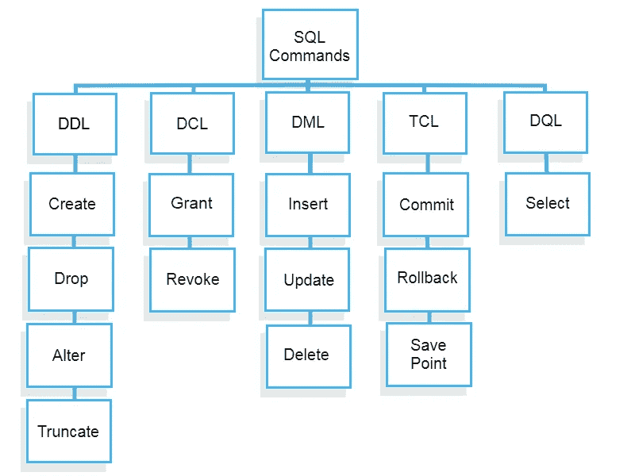
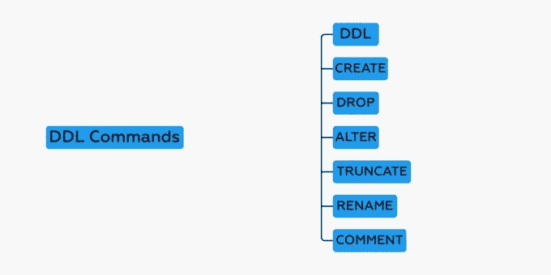
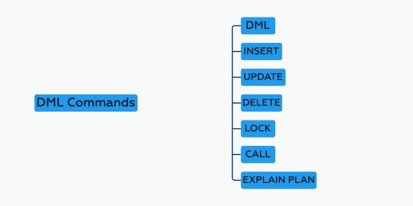
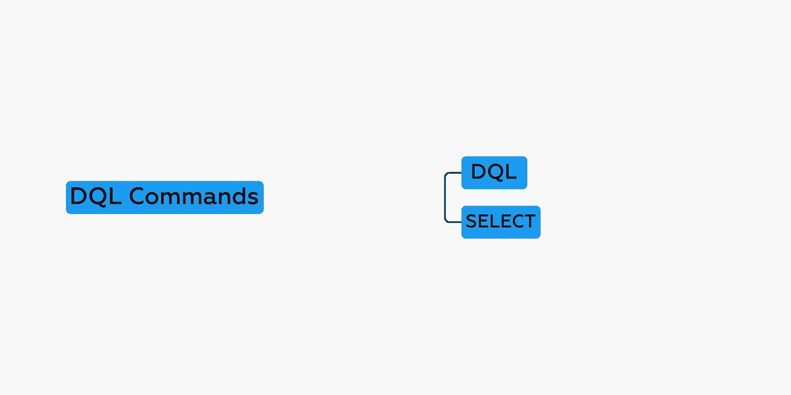
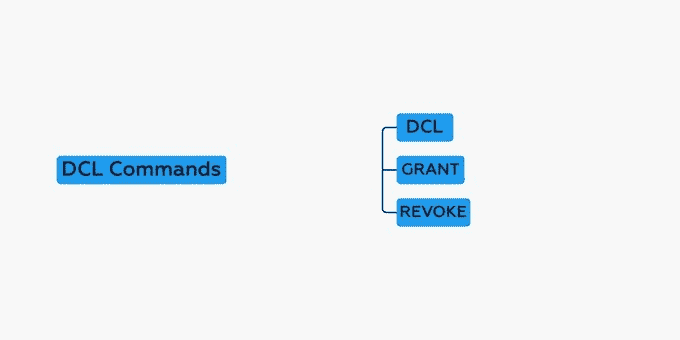
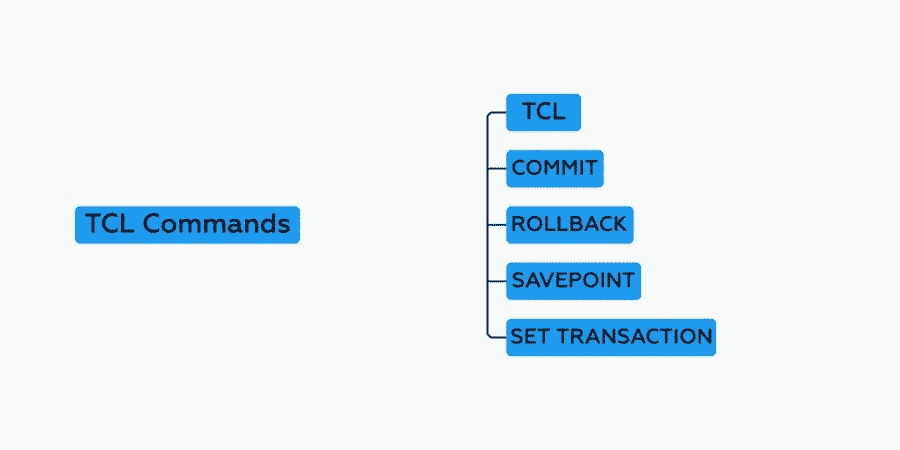

# SQL 命令解释

> 原文：<https://blog.devgenius.io/sql-commands-explained-7c651647fbf?source=collection_archive---------7----------------------->



在本文中，我将深入讨论 sql 命令及其示例，这也有助于如何用 sql 编写查询。

在 sql 中，有五个 SQL 命令，它们是:-

*   数据定义语言
*   DoctorofModernLanguages 现代语言博士
*   DQL
*   民法博士
*   TCL 集团股份有限公司（TCL Corporation 的缩写）

告诉 go 深入讨论每个命令及其示例

# 数据定义语言

*   DDL 代表数据定义语言。这些命令用于定义数据库模式
*   DDL 是一组 sql 命令，用于创建、修改和删除数据库结构，而不是数据。
*   DDL 命令列表



1.  创建:-用于创建数据库或其对象(如表、视图、存储、索引等。)

语法:-

```
CREATE TABLE *table_name* (
 *column1 datatype*,
 *column2 datatype*,
 *column3 datatype*,
   ....
);
```

示例:-

```
CREATE TABLE Persons (
    PersonID int,
    LastName varchar(255),
    FirstName varchar(255),
    Address varchar(255),
    City varchar(255)
);
```

2.DROP :-用于从数据库中删除对象

语法:-

```
DROP TABLE table_name;
```

示例:-

```
DROP TABLE Persons;
```

3.ALTER :-用于改变数据库的结构。您可以使用此命令添加列、删除列、更改/修改列。

语法:-

```
ALTER TABLE *table_name*
ADD *column_name datatype*;
```

示例:-

```
ALTER TABLE Customers
ADD Email varchar(255);
```

4.TRUNCATE :-用于从表中删除所有记录，包括为记录分配的所有空间

语法:-

```
TRUNCATE TABLE table_name;
```

示例:-

```
TRUNCATE TABLE Categories;
```

5.重命名:-用于重命名数据库中已存在的对象。

语法:-

```
RENAME old_table _name To new_table_name ;
```

示例:-

```
RENAME Persons To Citizens;
```

6.注释:-用于向数据字典添加注释。

# DoctorofModernLanguages 现代语言博士

*   DML 代表数据操作语言。DML 命令用于操作数据库中的数据。
*   DML 命令列表:-



1.  INSERT :-用于将数据插入表中

语法:-

```
INSERT INTO *table_name* (*column1*, *column2*, *column3*, ...)
VALUES (*value1*, *value2*, *value3*, ...);
```

示例:-

```
INSERT INTO Persons (PersonID,LastName,FirstName, City)
VALUES (10 , 'Cardinal' , 'Markets' , 'Stavanger');
```

2.更新:-用于更新表中的现有数据

语法:-

```
UPDATE *table_name*
SET *column1* = *value1*, *column2* = *value2*, ...
WHERE *condition*;
```

示例:-

```
UPDATE Customers
SET ContactName = 'Alfred Schmidt', City= 'Frankfurt'
WHERE CustomerID = 1;
```

3.DELETE :-用于从数据库表中删除记录。

语法:-

```
DELETE FROM *table_name* WHERE *condition*;
```

示例:-

```
DELETE FROM Customers WHERE CustomerName='Alfreds Futterkiste';
```

4.LOCK :-用于控制表上的并发性。

5.调用:-用于调用 PL/SQL 代码。

6.解释计划:-描述数据的访问路径。

# DQL

*   DQL 代表数据查询语言，用于对模式对象中的数据执行查询。
*   DQL 命令列表



1.  选择:-用于从数据库中检索数据。

语法:-

```
SELECT *column1*, *column2, ...*
FROM *table_name*;SELECT * FROM *table_name*; //to get all column of table
```

示例:-

```
SELECT CustomerName, City FROM Customers;
```

# 民法博士

*   DCL 代表数据控制语言。该命令主要处理数据库系统的权限、许可和其他控制。
*   DCL 命令列表



1.  GRANT :-授予用户访问数据库的权限。

```
GRANT privileges_names ON object TO user; //syntaxGRANT SELECT ON Users TO 'Amit'@'localhost; //example
```

*   **privileges_name** :这些是授予用户的访问权限或特权。
*   **对象:**它是被授予权限的数据库对象的名称。在对表授予特权的情况下，这将是表名。
*   **用户:**这是将被授予权限的用户的名称。

2.撤销:-撤销用户的访问权限。

```
REVOKE privileges ON object FROM user; //syntaxREVOKE SELECT ON  users FROM 'Amit'@localhost'; //example
```

# TCL 集团股份有限公司（TCL Corporation 的缩写）

*   TCL 代表事务控制语言。这个命令处理数据库中的事务。
*   TCL 命令列表



1.  提交:-用于提交事务。

```
DELETE from Customer where State = 'Texas';
```

如果我们在不使用 COMMIT 的情况下编写查询，那么如果会话被关闭，那么由于 DELETE 命令所做的更改将会丢失。

带提交的新查询:-

```
DELETE from Customer where State = 'Texas';
COMMIT;
```

2.回滚:-用于在发生任何错误时回滚事务。

```
DELETE from Customer where State = 'Texas';
ROLLBACK;
```

3.保存点:-用于标记表中的事务。

4.设置交易:-用于指定交易的特征。

恭喜你，如果你现在来这里，你已经知道了很多关于 sql 和 sql 命令的知识，这将对你下一次技术面试有所帮助。