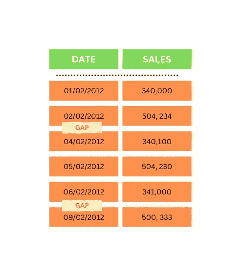
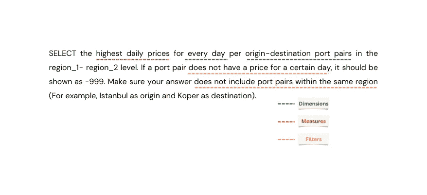
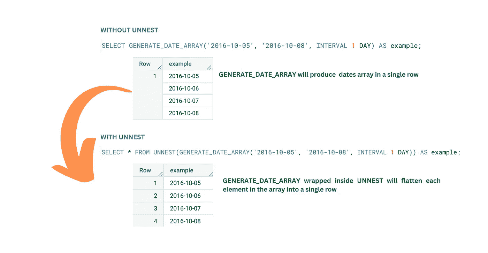

# SQL 练习:解决时间序列差距

> 原文：<https://blog.devgenius.io/sql-exercise-solving-time-series-gap-8946113e35b8?source=collection_archive---------19----------------------->

## 使用 BigQuery UNNEST 和 GENERATE_DATE_ARRAY 函数


卡斯帕·卡米尔·鲁宾的图片来自 Unsplash。

时间序列数据，如销售交易和用户注册，可能并不总是清晰明了。一些交易日之间可能会有间隙。此问题可能是由自然事件(无业务事件)或异常情况(缺少数据)引起的。我们需要正确地处理这个问题，这样我就不会在我们的下游任务上引起另一个问题，比如在我们的仪表板和报告上。无论是由于自然现象还是异常现象，我们仍然需要在仪表板和报告中报告这些差距，以便向利益相关者提供正在发生的事情的完整视图。我们不能跳过它们。

本文将演示如何处理这样的问题。我将分享一个有类似问题的案例研究的例子，以及如何使用带有 BigQuery 的`UNNEST`和`GENERATE_DATE_ARRAY`函数的 SQL 来处理它。



按作者分类的图像-时间序列数据中的缺口示例。

## 数据集。

本次演示的数据集是为教学目的创建的模拟数据集。数据集包含一些模拟的**海运价格数据**，它们在交易日之间有一些**的间隙。数据存储在`freight_datapoints`和`freight_ports`表中。请在下面找到这两个表格的信息摘要。你可以在这里找到数据集。**

**货运数据点表**

**日** : *数据点有效的日期。*
d _ id:*数据点的 ID。*
**公司** : *数据点所属的公司。*
**supplied _ id**:*供应商(客户与之签约的)的 ID 号。*
**公司 _ 类别** : *数据点所属公司的类别。*
**关税 _ 类型** : *数据点的关税类型。*
**valid _ from**:*数据点的开始合同有效期。*
**p _ contract _ Length**:*数据点价格有效期长度。*
**c _ contract _ Length**:*数据点的合同有效期长度。*
**创建了** : *数据点进入数据库的时间戳。*
**价格** : *数据点的总价。*
**原点 _pid** : *原点端口的 pid 号。*
**destination _ pid**:*目的端口的 PID 号。*

```
| day                        | d_id      | company   | supplier_id | company_category | tariff_type | valid_from                 | p_contract_length | c_contract_length | created                    | price | origin_pid | destination_pid |
|----------------------------|-----------|-----------|-------------|------------------|-------------|----------------------------|-------------------|-------------------|----------------------------|-------|------------|-----------------|
| 2012-06-01 00:00:00.000000 | 337204473 | company_0 | 1375        | category_1       | FAK         | 2012-06-01 00:00:00.000000 | 61                | 365               | 2012-08-17 11:00:06.598627 | 195.0 | 802        | 736             |
| 2012-06-02 00:00:00.000000 | 337204473 | company_0 | 1375        | category_1       | FAK         | 2012-06-01 00:00:00.000000 | 61                | 365               | 2012-08-17 11:00:06.598627 | 195.0 | 802        | 736             |
| 2012-06-03 00:00:00.000000 | 337204473 | company_0 | 1375        | category_1       | FAK         | 2012-06-01 00:00:00.000000 | 61                | 365               | 2012-08-17 11:00:06.598627 | 195.0 | 802        | 736             |
| 2012-06-04 00:00:00.000000 | 337204473 | company_0 | 1375        | category_1       | FAK         | 2012-06-01 00:00:00.000000 | 61                | 365               | 2012-08-17 11:00:06.598627 | 195.0 | 802        | 736             |
| 2012-06-05 00:00:00.000000 | 337204473 | company_0 | 1375        | category_1       | FAK         | 2012-06-01 00:00:00.000000 | 61                | 365               | 2012-08-17 11:00:06.598627 | 195.0 | 802        | 736             |
```

**货运港口表**

**pid** : *端口的 id。*
**名称** : *人类可读的端口名称。*
**代码**:港口的*代码。*
**国家** : *港口所在的国家。*
**纬度** : *港口所在的纬度。*
**经度** : *港口所在地的经度。*
**地区** : *港口的地理区域。*

```
| pid | code  | name        | country | latitude         | longitude       | region   |
|-----|-------|-------------|---------|------------------|-----------------|----------|
| 153 | CNCWN | Chiwan      | China   | 22.466666666667  | 113.88333333333 | region_2 |
| 764 | CNDAL | Dalian      | China   | 34.783333333333  | 109.91666666667 | region_2 |
| 405 | CNLYG | Lianyungang | China   | 34.716666666667  | 119.43333333333 | region_2 |
| 266 | CNNBO | Ningbo      | China   | 29.8666666666667 | 121.55          | region_2 |
| 912 | CNNSA | Nansha      | China   | 22.771671        | 113.60848       | region_2 |
```

## 商业问题

> 选择 region _ 1-region _ 2 级别中每个始发地-目的地港口对每天的最高每日价格。如果端口对没有某一天的价格，它应该显示为-999。确保您的答案**不包含同一地区内的端口对(例如，伊斯坦布尔作为起点，Koper 作为目的地)。**

该问题要求我们提供每个交易日和港口对(始发地-目的地)的最高运费价格报告。此外，它说，如果交易日之间有差距，那么我们将把价格定为-999。下面是我将如何处理这个问题(以及其他 SQL 问题)。如果他们与你不同，请在评论区分享你的方法。

1.  理解问题，并从问题中确定维度、衡量标准和过滤器/条件。
2.  设计你的解决方案，并写一段伪代码说明如何解决这个问题。
3.  为解决方案创建 SQL 语句。

## 确定维度、度量和过滤器。

如果您有使用 BI 工具(如 Tableau 和 Metabase)的经验，那么维度、度量和过滤器对您来说应该不是陌生的概念。

> **维度**提供围绕业务流程事件的上下文(如客户名称、产品类型、位置等)。
> 
> **Measure** 存储可量化的业务数据(如价格、销售、库存等)。
> 
> **过滤器**根据规定的条件分割或限制数据。

如下所示，从这个问题中，我们可以看到有 2 个维度(交易日和端口对)、1 个度量(具有最大聚合的价格)和 2 个过滤器/条件(从同一地区排除端口对，并将缺失的价格转换为-999)。



按作者、尺寸、测量和过滤器分类的图像。

## 解决方案的伪代码。

我的解决方案有 3 个步骤:

1.  首先，我们需要从`ports`表中获得 port-origin 和 port-destination 的区域名称(以过滤出位于同一区域的端口对)。为了获得这个信息，我们需要将`freight_datapoints`表与`freight_ports`表连接两次，每次都获得港口起始地区名称和港口目的地地区名称。之后，我们需要过滤数据，使其仅包含作为始发地的`region_1`和作为目的地的`region_2`。最后，使用最高价格作为衡量标准，在交易日和端口对(维度)级别粒度上聚合数据。为了可读性，我将把这个操作放在一个名为`max_price_per_day`的 CTE 中。
2.  其次，为了确定差距(对于每个交易日和港口对)，我首先需要生成一个日期数组，范围从`freight_datapoints`表中的最早交易日:`2012–06–01`到最大运费日期:`2012–11–15`。然后，我将创建这些日期和端口对的组合。我将把这个操作放在一个名为`dates_portpairs_array`的 CTE 中。
3.  最后，为了得出结果，我将使用基于交易日期和端口对的`LEFT JOIN`来组合`dates_portpairs_array`和`max_price_per_day`。价格缺失的记录(`NULL` from `max_price_per_day`)是缺口，将被转换为-999。


作者图片，解决步骤。

## 解决方案的 SQL 语句。

对于解决方案，由于表存储在 BigQuery 中，所以我将使用 BigQuery 标准 SQL 方言。如果您想继续学习，您可以在这里下载[数据集](https://github.com/Balurc/datasets/tree/main/freight)，并将它们上传到您的 BigQuery 数据仓库(获得免费层帐户)。

下面是对`max_price_per_day` CTE 的查询。请参考伪代码部分，了解我是如何构建这个查询的。如果您继续执行并运行该查询，现在您应该会看到两个交易日之间有一些间隔。

```
WITH max_price_per_day as(
  SELECT 
   DATE(day) as freight_date,
   orig.pid || ' - ' || dest.pid AS orig_dest_port_pair,
   MAX(price) as max_price
  FROM freight.freight_datapoints dp
  INNER JOIN freight.freight_ports orig
   ON dp.origin_pid = orig.pid
  INNER JOIN freight.freight_ports dest
   ON dp.destination_pid = dest.pid
  WHERE orig.region = 'region_1'
    AND dest.region = 'region_2'
  GROUP BY freight_date, orig_dest_port_pair
)
```

在 CTE，我使用了 2 个函数；`GENERATE_DATE_ARRAY`和`UNNEST`。`GENERATE_DATE_ARRAY`函数将根据以下参数返回一个日期数组:

```
-- GENERATE_DATE_ARRAY function Syntax 
GENERATE_DATE_ARRAY(start_date, end_date[, INTERVAL INT64_expr date_part])

- start_date must be a DATE
- end_date must be a DATE
- INT64_expr must be an INT64
- date_part must be either DAY, WEEK, MONTH, QUARTER, or YEAR.
```

`UNNEST`获取一个数组并返回一个表，该表中的每个元素都有一行。`GENERATE_DATE_ARRAY`函数只返回数组格式的日期(单行)，因此我们使用`UNNEST`将数组中的每个元素转换成单行。下面是一个如何将两种功能结合使用的示例。



图片由作者提供，使用 UNNEST 和 GENERATE_DATE_ARRAY 函数。

有了这些之后，我使用 BigQuery 逗号(`UNION ALL`)创建了每个日期和端口对的组合。这将生成一个表，其中每个日期都有数据集中每个可用的端口对。这是对 CTE 的查询。

```
dates_portpairs_array as (
 SELECT *
 FROM
 (SELECT * FROM UNNEST(GENERATE_DATE_ARRAY('2012-06-01', '2012-11-15', INTERVAL 1 DAY)) dt),
 (SELECT DISTINCT orig_dest_port_pair from max_price_per_day)
)
```

最终的查询将所有 cte 组合在一起，并使用`COALESCE`函数将 missing/ `NULL`价格(由于差距)转换为-999。

```
SELECT 
  dy.dt as freight_date, 
  dy.orig_dest_port_pair, 
  COALESCE(mx.max_price, -999) as max_price
FROM days dy
LEFT JOIN max_price_per_day mx
  ON dy.dt = mx.freight_date
 AND dy.orig_dest_port_pair =  mx.orig_dest_port_pair
ORDER BY dy.dt, dy.orig_dest_port_pair
```

完整的查询如下。

```
WITH max_price_per_day as(
  SELECT 
   DATE(day) as freight_date,
   orig.pid || ' - ' || dest.pid AS orig_dest_port_pair,
   MAX(price) as max_price
  FROM freight.freight_datapoints dp
  INNER JOIN freight.freight_ports orig
   ON dp.origin_pid = orig.pid
  INNER JOIN freight.freight_ports dest
   ON dp.destination_pid = dest.pid
  WHERE orig.region = 'region_1'
    AND dest.region = 'region_2'
  GROUP BY freight_date, orig_dest_port_pair
),

dates_portpairs_array as (
 SELECT *
 FROM
 (SELECT * FROM UNNEST(GENERATE_DATE_ARRAY('2012-06-01', '2012-11-15', INTERVAL 1 DAY)) dt),
 (SELECT DISTINCT orig_dest_port_pair from max_price_per_day)
)

SELECT 
  dy.dt as freight_date, 
  dy.orig_dest_port_pair, 
  COALESCE(mx.max_price, -999) as max_price
FROM dates_portpairs_array dy
LEFT JOIN max_price_per_day mx
  ON dy.dt = mx.freight_date
   AND dy.orig_dest_port_pair =  mx.orig_dest_port_pair
ORDER BY dy.dt, dy.orig_dest_port_pair
```

我希望这对你来说是一个有趣的练习，你已经学到了一些新的有价值的东西，可以应用到你的工作中。我知道还有其他方法可以解决这个问题，如果你有，请在评论区告诉我。任何反馈都将不胜感激。