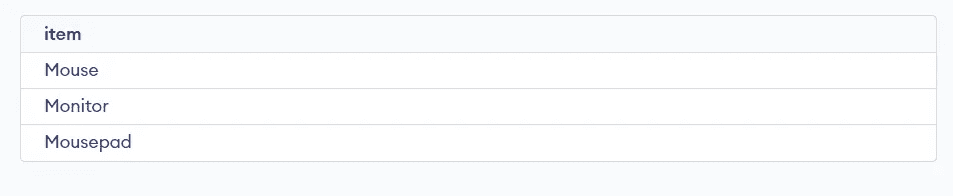
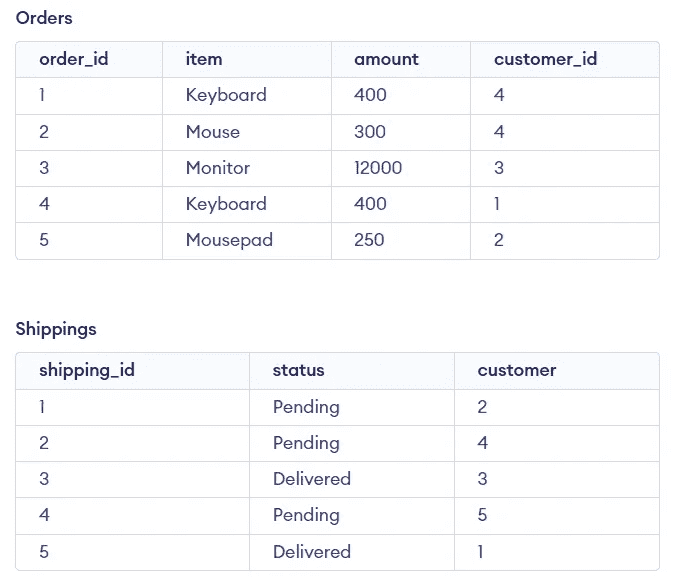
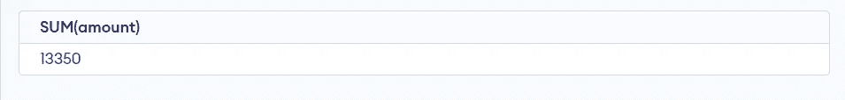
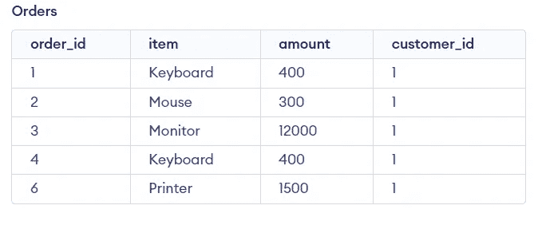

# 使用 SQL 进行数据操作

> 原文：<https://blog.devgenius.io/sql-for-data-manipulation-86994d2682d1?source=collection_archive---------4----------------------->


图片由[**Toptal**提供](https://www.toptal.com/database/database-design-bad-practices)

我相信你已经听过无数次了，如果你想做数据分析或数据科学，就要学习 T4 SQL。 It

****SQL(结构化查询语言)**是访问和操作数据库的标准语言。**

****RDBMS(关系数据库管理系统)**是 SQL 和所有现代数据库系统(如 MS SQL Server、IBM DB2、Oracle、MySQL 和 Microsoft Access)的基础。 **RDBMS** 中的数据存储在名为**表**的数据库对象中。一个**表**是**相关数据条目**的集合，由**列**和**行**组成。**

**既然我们已经完成了基本的介绍，以及它是什么和它在起什么作用，让我们来看看它能做的**数据操作**。**

# **SQL 查询执行表，**

**查询执行顺序意味着从数据库中优化搜索结果查询的过程。如果所有查询都出现在将首先执行的查询中，则它们的执行顺序。**

****

**查询执行表由 [**标量主题**](https://www.scaler.com/topics/sql/sql-query-execution-order/) 提供**

# **SQL 关键字表，**

**根据核心目标，出现在 **SQL** 中的**关键字**列表。**

****

**图片来自 [**LinkedIn**](https://www.linkedin.com/pulse/sql-keywords-kiran-kumar-matam/?trk=public_post-content_share-article)**

# ****创建表格，****

**所有的数据讨论都是好的，但我们需要实际拥有它，这时我们意识到我们需要创建数据表，所以我们向其中添加数据， **SQL** 有命令**创建表。****

**例如，在 **SQL** 中，**

```
CREATE TABLE Admins (
 AdminID int,
 accessLvl varchar(255)
);
```

****

**查询结果**

**在上面的查询示例中，**表**学生是用 **id** 和**名称**列创建的。**

# ****从所有列中检索数据，****

****SQL** 的一个最基本的查询用于显示表中的所有数据。**选择**选择元素， ***** (表示**所有列，**)表示从**表**中选择所有列。**

**例如，在 **SQL** 中，**

```
SELECT * FROM insects;
```

**在上面的查询示例中，**选择并显示了表**昆虫**的所有列**。**

# **从某些列中检索数据，**

**在上面的查询示例中，显示了表中昆虫的所有列，这并不总是需要的，我们不希望这个巨大的昆虫的名字总是困扰着我们。所以我们从表中选择并检索特定的列。**

**例如，在 **SQL** 中，**

```
SELECT id, native_place FROM insects;
```

**在上面的查询示例中，选择并显示了表**昆虫**的 **id** 和**籍贯**列。**

# **使用 WHERE 子句筛选数据，**

**现在向前迈进一步，增加了一个数据过滤元素，即**，其中**根据特定条件过滤列。**

**例如，在 **SQL** 中，**

```
SELECT id, native_place, color FROM insects WHERE color = black;
```

**在上面的示例查询中，选择了表**昆虫**的 **id、native_place、**和**颜色**列，并显示颜色为**黑色**的列。**

# **使用由 AND 运算符连接的条件过滤数据，**

**说实话，生活并不容易，我相信你也同意这些疑问。当你检索它们的时候，你不会只得到一个条件来排序，就像你去年得到的贷款列表一样。这时**和**操作员出现了。它让你根据两个条件过滤数据。**

**例如，在 **SQL** 中，**

```
SELECT id, native_place, color, name  FROM insects WHERE color = black AND name = 'beetle';
```

**在上面的查询示例中，选择了表**昆虫**的 **id、籍贯、颜色、**和**名称**列，将显示颜色为**黑色**以及名称为**甲虫**的列。**

# **使用 OR 运算符连接的条件筛选数据，**

****和**操作器只有在**和**两个条件都满足时才工作，但并不总是需要。有时候，满足一个条件也是必要的，比如买一件 t 恤而不是两件来管理你的奢侈品预算。**

**也就是说，当**或**操作符进入画面时，即使**满足一个**条件，它也会过滤数据。**

**例如，在 **SQL** 中，**

```
SELECT id, native_place, color, name  FROM insects WHERE color = black OR name = 'beetle';
```

**在上面的查询示例中，选择了表**昆虫**的 **id、籍贯、颜色、**和**名称**列，将显示颜色为**黑色**或名称为**甲虫**的列。**

# **使用 DISTINCT 检索不重复的记录，**

**好的，这是一个常见的问题，大多数时候我们想要**不同的**结果，比如是否有很多甲虫行，但是我们想要只检查是否有一个甲虫存在。这时候**明显的**出现了。它被放置在**选择**之后，每种类型的记录只有一个。**

**例如，在 **SQL** 中，**

```
SELECT DISTINCT item, customer_id from Orders;
```

****

**原始表**

****

**查询结果**

**在上面的查询示例中，选择了表 **Orders** 的 **item** 和 **customer_id** 列，并丢弃了具有相同 item 和 customer_id 的列。**

# **检索某一列中没有空值的数据，**

**没有人想要那种空虚的感觉，所以我确信你会对我说我们不想要空的列结果有同样的感觉。**不为空则使用**，然后返回其中存储有值的列。还有一个**是空的**，反之亦然。**

**例如，在 **SQL** 中，**

```
SELECT item from Orders WHERE customer_id IS NOT NULL;
```

****

**订单表**

****

**查询结果**

**在上面的示例查询中，将返回仅包含非空值的**项**列。**

# **根据一列对数据进行排序，**

**我们喜欢对我们的生活进行正确的排序，你一定看过那些卷轴，上面写着以这种心态开始你的生活。同样的事情也存在于带有****ORDER BY**命令的 SQL 中，它根据特定的列对数据进行排序。默认为**字母**，但是 **DESC** 和 **ASC** 可以分别用来对结果进行降序或升序排序。****

****例如，在 **SQL** 中，****

```
**SELECT  item FROM Orders ORDER BY amount ASC;**
```

********

****订单表****

********

****查询结果****

****在上面的查询示例中，**项目**列按照**金额**列按照**升序**排序。****

# ****根据多个列对数据进行排序，****

****有时我们需要**多个**列来对数据进行排序，它按照时间顺序工作**首先根据指定的第一列对数据进行排序，然后是它后面的列。******

******例如，在 **SQL** 中，******

```
**SELECT  item,order_id FROM Orders ORDER BY amount DESC, customer_id;**
```

********

****订单表****

********

****查询结果****

****在上面的查询示例中， **item** 和 **order_id** 列按照 **amount** 和 **customer_id** 列按照**升序**的方式(amount)排序。****

# ****搜索与特定模式匹配的值，****

****模式很有趣，它告诉我们许多数据分析的问题，我们可以在 **SQL** 中使用****LIKE**命令做同样的事情，该命令检索与某个**特定模式**匹配的数据。******

****例如，在 **SQL** 中，****

```
**SELECT item FROM Orders WHERE item LIKE '%m%';**
```

********

****订单表****

********

****查询结果****

****在上面的查询示例中，显示了包含字符串字符**“m”**的**条目**列。****

# ****将文本列中的值连接成一个字符串，****

****这也是数据操作中的常见应用之一。例如，大多数表格采用不同的名和姓，我们将它们组合在一起形成名字。这是使用 **SQL 中的 **CONCAT** 函数完成的。**但有时它在其他版本中不存在，我在这个特殊的例子中使用了 **|| ' ' ||** ，因为它在我的 SQL 版本中不受支持。****

**例如，在 **SQL** 中，**

```
SELECT CONCAT(first_name,' ',last_name) FROM Customers;
```

****

**客户表**

****

**查询结果(SELECT 名字|| ' ' ||姓氏 FROM 客户；)**

**在上面的查询示例中，表 **Customers** 中的 **first_name** 和 **last_name** 列被**连接起来**。**

# **使用数学运算符，**

**通常，在处理财务数据时，我们有必要进行类似于**“+”、“-”、“*”、**、**“/”的数学运算**。为此， **SQL** 内置了运算符，并允许在其中进行**数学运算**。**

**例如，在 **SQL** 中，**

```
SELECT customer_id, SUM(amount), COUNT(order_id) FROM Orders GROUP BY customer_id HAVING COUNT(customer_id) > 1
```

****

**订单表**

****

**查询结果**

**在上面的查询示例中，发生了很多事情。首先 **SUM** 函数用于**SUM**a**customer_id**根据**订单数量**必须支付的金额，订单数量**基于 **order_id** ，订单数量**来自基于 **customer_id** 的**分组**结果，其中 customer _ id 具有多于 **1 个订单**。**

# **添加不同表中的数据，**

**如果您熟悉外键和主键(我假设您熟悉)，我可以帮助您创建表之间的关系以及**数据分叉。**以为例，如果您有一个客户详细信息表，它有一个 **customer_id** 列，即该表中的**主键**，还有另一个表 order，它有 **order_id** (其主键)和 **customer_id** ，即**外键**，在这种情况下，它有助于您建立两者之间的关系。**

**虽然在表之间有一个**关系**来执行它们之间的数据相加并不重要，但是对于**数据操作**来说，这是一个**重要的话题**要被讨论和记住。**

**现在我们可以使用 **UNION ALL 连接不同表中的记录，**记录必须是**相同的数据类型**如果没有**重复**需要使用 **UNION** only **。****

**例如，在 **SQL** 中，**

```
SELECT customer_id FROM Customers UNION ALL SELECT customer_id FROM Orders;
```

****

**客户和订单表**

****

**查询结果(未完全显示)**

**在上面的查询示例中，**客户**和**订单**表中的 **customer_id** 列与 **UNION ALL** 命令组合在一起。**

# **找到数据集的交集，**

**如果你读过集合论，你就知道什么是交集。如果不是，那么它就是两个数据集之间的公共数据，即表中的公共实体。在 SQL 中， **INTERSECT** 返回两组数据的交集。**

**例如，在 **SQL** 中，**

```
SELECT customer_id FROM Orders INTERSECT SELECT customer FROM Shippings;
```

****

**订单和发货表**

****

**查询结果**

**在上面的查询示例中，从 **orders** 和**shipping**表中获取 **customer_id** 列，并显示两个表中的**公共值**(注意 5)。**

# **连接不同表中的数据，**

**集合论确实有帮助(如果你知道的话)。它的一些基本概念在这里起作用，就像在上述主题中提到的交集，但是就各种其他表而言，在这种情况下甚至包括 union。**

****

**[**作者 TDS**](https://towardsdatascience.com/take-your-sql-from-good-to-great-part-3-687d797d1ede) 提供**

****

**加入由 [**LearnSQL**](https://learnsql.com/) 提供**

**希望上面的可视化表示启发了您对 SQL 中连接的理解。**

**例如，在 **SQL** 中，**

```
SELECT Customers.last_name, Orders.item FROM Customers INNER JOIN Orders ON Customers.customer_id = Orders.customer_id;
```

****

**客户和订单表**

****

**查询结果**

**在上面的示例查询中，从 **customers** 和 **orders** 表中提取 **last_name** 和 **item** 列，并且通过上的**将两个表中的数据记录与连接条件进行匹配。在从两个表中匹配相同的值 **customer_id** 后，如果匹配将最终显示。****

# **使用表和列的别名，**

****别名**短版本是的，它们很好，因为你可以写得更少，老实说，这是一个很好的主意，当你不得不写长查询时，比如连接**

**例如，在 **SQL** 中，**

```
SELECT c.last_name AS lname, o.item AS items FROM Customers AS c INNER JOIN Orders AS o ON c.customer_id = o.customer_id;
```

****

**客户和订单表**

****

**查询结果**

**在上面的查询示例中，从 **customers** 和 **orders** 表中提取**last _ name(laname:Alias)**和 **item (items : Alias )** 列，并通过上的**将这两个表中的数据记录与连接条件进行匹配。在从两个表中匹配相同的值 **customer_id** 后，如果匹配将最终显示。****

# **计算表格中的行数，**

**有时，需要对已发生的客户或订单进行计数，给出已发生的订单或现有客户的数量。幸运的是 **SQL** 有一个内置函数，它为我们做了 **COUNT** 计算**行数**。**

**例如，在 **SQL** 中，**

```
SELECT COUNT(customer_id) FROM Customers;
```

****

**客户表**

****

**查询表**

**在上面的查询示例中，获取并显示了当前客户数量的**计数**。**

# **计算列中值的平均值，**

**像 **COUNT** 函数一样， **AVG** 也存在，它返回当前记录的平均值。**

**例如，在 **SQL** 中，**

```
SELECT AVG(amount) FROM orders;
```

****

**订单表**

****

**查询结果**

**在上面的查询示例中，获取并显示购买订单的 **AVG** 金额。**

# **计算列中值的总和，**

**与上面的函数一样， **SUM** 对一列中的值求和。**

**例如，在 **SQL** 中，**

```
SELECT SUM(amount) FROM orders;
```

****

**订单表**

****

**查询结果**

**在上面的查询示例中，获取并显示所有购买订单的 **SUM** 金额。**

# **找到一列中的最小值和最大值，**

**与上述函数一样， **MIN** 从列中查找**最小值**值，而 **MAX** 从列中查找**最大值**值。**

**例如，在 **SQL** 中，**

```
SELECT MIN(amount),MAX(amount) FROM orders;
```

****

**订单表**

****

**查询结果**

**在上面的查询示例中，获取并显示所有购买订单的**最小**和**最大**金额。**

# **计算记录组的合计值，**

**由于前面已经使用了 **GROUP BY** ，它将行分组以计算值。**

**例如，在 **SQL** 中，**

```
SELECT item, COUNT(order_id) FROM Orders GROUP BY amount;
```

****

**订单表**

****

**查询结果**

**在上面的查询示例中，提取了 **order_id** 列的 **item** 和 **COUNT** ，它们是根据表 **orders** 中产品的 **amount** (price】分组的。**

# ****使用集合函数过滤行，****

**无论是对班上的学生进行排名，还是对回头客进行分类，任何地方都需要某种过滤。这可以在 SQL 中使用具有函数的**来实现，该函数在使用 GROUP BY 计算每个组的值之后过滤记录(在下面的例子中)。****

**例如，在 **SQL** 中，**

```
SELECT item, AVG(amount) FROM Orders GROUP BY item HAVING AVG(amount) > 300;
```

****

**订单表**

****

**查询结果**

**在上面的查询示例中，取的是**金额**列的**项目**和 **AVG** ，按**平均金额> 300 的**订单**表的**项目**分组。****

# **从表中删除数据，**

**有时候我们已经受够了，想要从我们的生活中删除一些东西，而生活是另一个艰难的案例，需要很多麻烦和时间，但使用 **SQL** 就不是这样了，我们可以使用 **DELETE FROM** 命令来删除表格中的所有数据。**

**例如，在 **SQL** 中，**

```
DELETE FROM Customers;
```

****

**客户和订单表**

****

**查询结果**

**在上面的查询示例中，**客户**表被清空。**

# **从表中删除满足特定条件的记录，**

**如果记录满足**特定条件**，也可以使用**移除，其中**。**

**例如，在 **SQL** 中，**

```
DELETE FROM Orders WHERE order_id = 5;
```

****

**订单表**

****

**查询结果**

**在上面的查询示例中，删除了具有 **order_id = 5** 的 **Orders** 表实体。**

# **将数据插入表中，**

**有时需要向表中添加新值，在这种情况下，需要使用 **SQL** 命令 **INSERT INTO** 。**

**例如，在 **SQL** 中，**

```
INSERT INTO Orders(order_id, item, amount, customer_id ) VALUES(6, 'Printer', 1500, 5);
```

****

**订单表**

****

**查询结果**

**在上面的查询示例中， **Orders** 表被添加了 **INSERT INTO** ，列名为 **order_id、item、amount、**和 **customer_id** ，它们的值 **6、【打印机】、1500、5** 被相加。**

# **更新表中的列，**

**更新社会地位是困难的，但是在使用**更新**命令的 **SQL** 中的表格来**更新**表格并且**设置**来设置**新的**值。**

**例如，在 **SQL** 中，**

```
UPDATE Orders SET customer_id = 1;
```

****

**订单表**

****

**查询结果**

**在上面的查询示例中， **Orders** 表用****SET**命令更新，该命令为所有的 **order_id** 设置相同的值 **1******

# ****通过筛选记录来更新列，****

****向**更新**命令添加另一个元素，我们基于 **WHERE** 条件更新列。****

****例如，在 **SQL** 中，****

```
**UPDATE Orders SET item = 'Keyboard' WHERE customer_id = 2;**
```

********

****订单表****

********

****查询结果****

****在上面的查询示例中， **Orders** 表用****设置项目值**作为关键字**，其中 customer_id** 为 2。******

# ****删除表格，****

****删除一个表就像从数据库 **SQL** 中删除它一样，用 **DROP** 命令完成。****

****例如，在 **SQL** 中，****

```
**DROP TABLE Students;**
```

****在上面的查询示例中，**学生**表被删除。****

> ******参考文献******
> 
> ****[https://towards data science . com/take-your-SQL-from-good-to-great-part-3-687d 797 D1 ede](https://towardsdatascience.com/take-your-sql-from-good-to-great-part-3-687d797d1ede)****
> 
> ****[https://learnsql.com/blog/learn-and-practice-sql-joins/](https://learnsql.com/blog/learn-and-practice-sql-joins/)****

****下面我们连线**LinkedIn**:[https://www.linkedin.com/in/tripathiadityaprakash](https://www.linkedin.com/in/tripathiadityaprakash)****

****或者我的网站:****

 ****[## 特里帕蒂·阿迪蒂亚·普拉卡什

### 编辑描述

tripathiaditya.netlify.app](https://tripathiaditya.netlify.app/)****