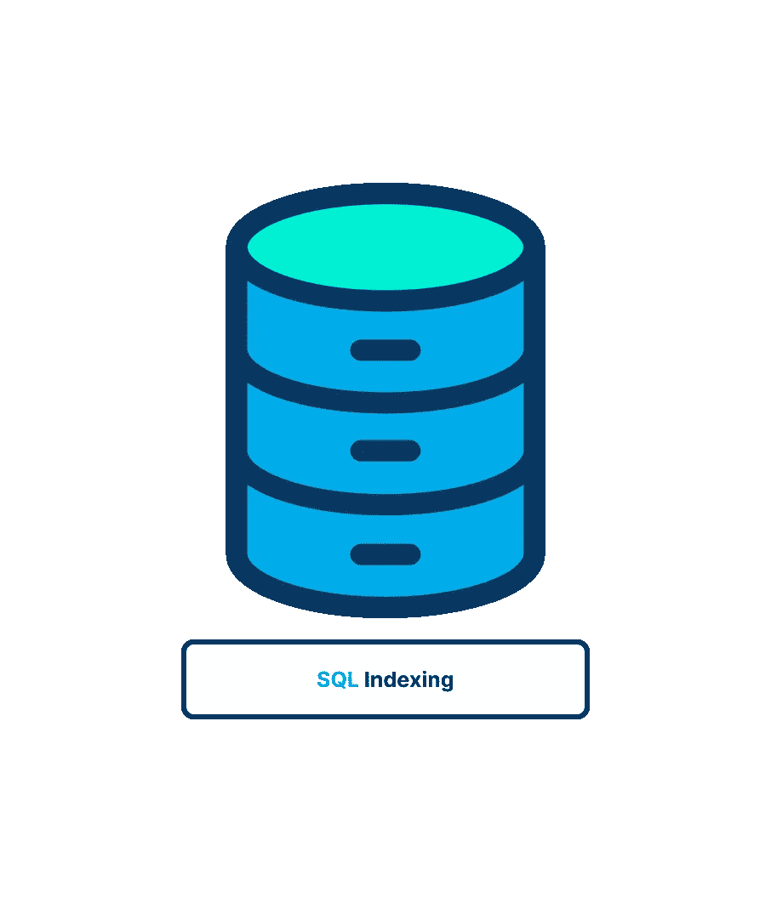

# SQL 索引简介

> 原文：<https://blog.devgenius.io/sql-indexes-2aca38b6cf0a?source=collection_archive---------9----------------------->

## 在本文中，我们将对 SQL 索引做一个“温和”的介绍👾

# 💭了解索引

索引用于对数据进行逻辑排序，以加快搜索和排序操作。想象一本书开头的索引，以便更好地理解索引。

假设你希望在本书中找到单词*奶酪蛋糕*的每个实例。最简单的方法是从第一页开始，扫描每一页的每一行寻找匹配。虽然这可行，但显然不是一个可行的选择。

虽然扫描几页文本是可能的，但扫描整本书是不可能的。随着要搜索的文本量的增长，查找所需信息所需的时间也在增长。

这就是图书索引存在的原因。*索引是按字母顺序排列的单词列表，包括它们在书中出现的位置的参考。要搜索*芝士蛋糕*，在**索引**中查找，看看它出现在哪些页面上。然后你去那些*特定页面*寻找你的匹配。*

## 🥸:指数是如何工作的？

简单的说，就是事实，就是正确的**排序**。在一本书里找单词的问题不是必须搜索的*内容*的数量；而是内容没有按单词排序。如果内容以字典的方式排序，则不需要索引(这就是字典没有索引的原因)。

*数据库索引*功能类似。主键数据总是按****排序**；这是 DBMS 为您执行的操作。因此，通过主键检索特定的行总是一个快速有效的操作。**

**但是，在其他列中搜索值通常效率很低。例如，如果您想检索居住在某个州的所有客户机，该怎么办呢？因为表不是按州排序的，所以 DBMS 必须读取表中的每一行(从第一行开始)来寻找匹配，就像您试图在一本没有索引的书中发现单词一样。**

**解决方案是使用一个**索引**。您可以在一个或多个列上创建一个索引，以保存一个排序的内容列表供您自己使用。定义索引后，DBMS 使用它的方式与使用图书索引的方式相同。它扫描已排序的索引以查找任何匹配，然后检索那些特定的行。**

# **🫥什么是索引？**

***索引是基于各种字段对大量记录进行排序的方法*。当您在表中的字段上构造索引时，您创建了另一个数据结构，它包含字段值以及指向与之相关的记录的指针。然后这个索引结构被排序，使得二进制搜索成为可能。**

> **井在“通用”索引中是一个`B-tree`或`Hash table`。**

**b 树是索引的最优选的数据结构，因为它们是时间高效的——查找、删除和插入都可以在对数时间内完成。B 树被更广泛使用的另一个重要原因是存储在 B 树中的数据可以被排序。通常，RDBMS 决定索引使用哪种数据结构。然而，使用一些 RDBMSs，您实际上可以在构建索引时选择希望数据库使用的任何数据结构。**

# **↔️指数类型**

1.  ****聚集**索引创建行的物理顺序(它只能是一行，通常也是一个主键——如果在数据库上创建一个主键，也要在那个表上构建一个聚集索引)。**
2.  ****非聚集**索引也是一个二叉树，但是它不创建行的物理顺序。所以非聚集索引的叶节点包含 PK(如果存在)或行索引。**
3.  ****唯一/非唯一**索引是一种通过确保表中没有两行数据具有相同键值来帮助维护数据完整性的索引。
    唯一索引确保索引键列中的值是唯一的。
    *一个漂亮的信息:(当一个 unique 约束被创建时，一个相应的 unique 索引被自动创建在列上。)***
4.  ****分区和非分区索引** *在分区表上构造非分区索引时，会创建一个* ***单索引对象*** *，使* ***引用*** *到表中的所有行。不管表数据分区是否跨越* ***几个*** *表空间，未分区的索引总是在单个***表空间中创建。****
5.  *****双向索引**允许正向和反向扫描。
    *当您在未指定任何关键字或 ASC 关键字的情况下对列构建索引时，数据库服务器会按升序保存键值。当指定 DESC 关键字时，数据库服务器按降序保存键值。****
6.  *****基于表达式的索引(**基于函数的索引)你可以创建一个包含表达式的索引。当 dbms 在相同的表达式上创建索引时，包含表达式的查询的性能会提高。
    *例如，您可以通过将函数 higher/lower 应用于 city 列来创建一个索引，以便快速、不区分大小写地查找城市名称。****

## ***👾例如，我们想要运行一个查询来查找位于'*约旦*'的任何学校的所有详细信息？***

******

## ***🤨让我们考虑一下如果没有索引会发生什么。***

***DBMS 必须检查学校数据库中的每一行，以确定该行的*位置*是否为“*约旦*”而且，因为我们希望每一行都有*位置* ' *约旦*'，所以我们不能在找到一行有*位置* ' *约旦*'时就停止查找，因为可能还有其他行有*位置约旦*。因此，必须搜索直到最后一行的每一行，这意味着数据库必须在这种情况下分析数千行，以发现具有*位置* ' *约旦*'的行这就是所谓的**全表扫描**。***

## ***😶‍🌫️What 到底包含在一个 db 索引里面？***

***现在您知道了数据库索引是在表中的一列上创建的，并且索引保存了该特定列中的值。然而，注意数据库索引**不存储同一个表的其他列中的值**是很重要的。例如，如果我们在*位置*列上建立一个索引，其他列的值将不会保存在索引中。如果我们简单地将所有其他列存储在索引中，这与复制整个表是一样的，会占用太多的空间，造成浪费。***

## ***😐数据库如何知道何时使用索引？***

***当执行类似“*SELECT * FROM School WHERE location = ' Jordan '”*的查询时，数据库将检查所请求的列上是否有索引。假设*位置*列有一个索引，数据库必须评估利用索引查找被搜索的值是否有意义——因为在某些情况下，使用数据库索引实际上不如简单地扫描整个表有效。***

# ***🫡创建指数***

***这是基本的创建索引命令。***

******

***您可以创建一个唯一索引**来防止重复值被添加到表中。*****

******

***您还可以创建一个**复合索引**(一个表的两列或更多列)。***

******

> ***索引是用`CREATE INDEX`语句创建的(从一个 DBMS 到另一个 DBMS 有很大的不同)，所以我建议查看您的 DBMS 文档来创建索引。***

# ***⚠️指数警告⚠️***

1.  ***索引提高了检索性能，同时降低了数据插入、修改和删除的性能。当执行这些操作时，DBMS 必须动态更新索引。***
2.  ***索引数据会占用大量存储空间。***
3.  ***并非所有数据都适合索引。不够唯一的数据(例如，州)不会像具有更多可能值(例如，名或姓)的数据那样从索引中受益。***
4.  ***索引用于数据过滤和排序。如果您经常以特定的顺序排列数据，该数据可能适合索引。***
5.  ***一个索引可以有多列(例如，地区和城市)。只有当数据按地区和城市分类时，这样的指数才有用。(如果你希望按城市排序，这个索引是没有用的。)***

> ***我希望你觉得这篇文章很有趣！❤️***