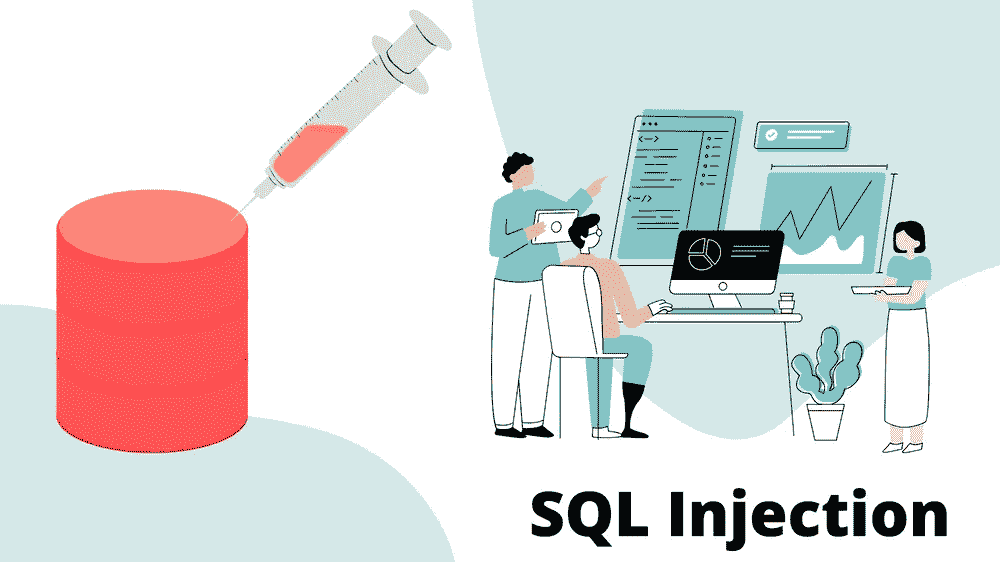
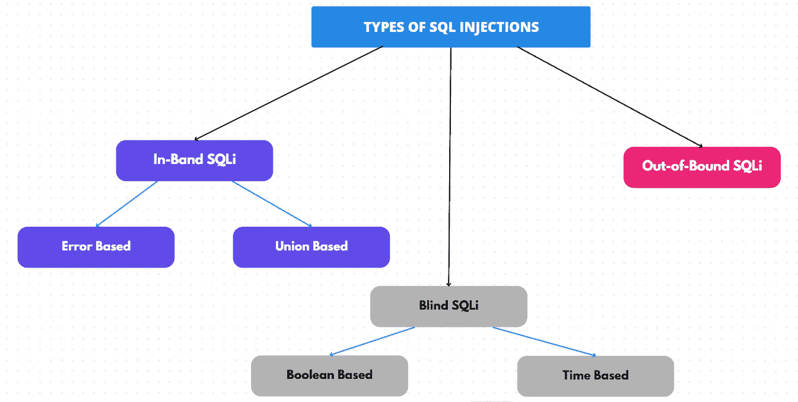

# SQL:注入攻击

> 原文：<https://blog.devgenius.io/sql-injection-attack-9d4e8077905?source=collection_archive---------5----------------------->



# **什么是 SQL 注入？**

> SQLi 是基于 web 的应用程序中的一种攻击，攻击者可以在网站的数据库中运行恶意查询。SQL 是一种用于执行恶意 SQL 语句的代码注入技术。

例如，如果您想登录网站，但忘记了用户名和密码，通过使用 SQLi 注入，我们可以在不知道密码的情况下登录或访问网页。

# **SQL 注入是如何工作的？**

SQL 注入包含在应用程序中通过来自客户端的输入数据插入或注入 SQL 查询。这些被注入到影响预定义 SQL 命令的数据平面中。

SQL 注入攻击的目标是动态 SQL 语句中的漏洞。将动态 SQL 语句想象成一个多元数学函数，它的参数是固定的，而结果是由独立变量中的值决定的。

类似地，动态 SQL 语句也由一组预定义的参数(如 web 表单)组成，只有当用户提供输入时，才会生成完整的语句。

请参见以下登录表单的 SQL 语句示例:

```
SELECT * FROM users WHERE username = '$username' AND password = bcrypt ('$password')
```

当用户输入用户名和密码时，语句完成。然后向服务器发送一个查询，从数据库中检索用户信息。

如果动态 SQL 语句中存在漏洞，攻击者可以在表单中输入复杂的脚本来破坏现有参数并改变整个语句的含义。

# **SQL 注入类型:**



**带内 SQLi:** 带内 SQL 注入是一种 SQL 注入，攻击者通过相同的通信信道接收结果作为直接响应。例如，如果攻击者通过她的 web 浏览器手动发起攻击，攻击的结果将显示在同一个 web 浏览器中。带内 SQL 注入也被称为传统 SQL 注入。

> 基于错误的 SQL 注入— 在这里，攻击者执行某些操作，导致数据库生成错误消息。您可以使用错误消息来确定正在使用的数据库、处理程序正在使用的服务器版本等。
> 
> **基于联合的 SQL 注入—** 由数据库生成的语句，用于获取单个 HTTP 响应。您可以在 URL 中构造查询，或者在输入字段中组合多个语句来尝试生成答案

**盲 SQLi :** 盲 SQL 注入是一种 SQL 注入，在这种情况下，攻击者不会从被攻击的数据库获得明确的响应，而是观察数据库服务器和应用程序的行为，以逐步重建数据库结构。盲人 SQL 注入也被称为推理 SQL 注入。

> 基于布尔的— 在这里，攻击者向数据库发送一个 SQL 查询，并根据查询返回的是真还是假，要求应用程序返回不同的结果。
> 
> 基于时间—在这种攻击中，攻击者向数据库提交 SQL 查询，并使数据库在共享结果之前等待指定的时间。响应时间有助于攻击者确定查询是真还是假。

**带外 SQLi:** 带外 SQL 注入(OOB SQLi)是一种 SQL 注入，在这种情况下，攻击者不会通过相同的通信信道收到来自被攻击应用程序的响应，但可以被诱骗向攻击者控制的远程端点发送数据。仅当您使用的服务器具有触发 DNS 或 HTTP 请求的命令时，带外 SQL 注入才是可能的。然而，这适用于所有流行的 SQL 服务器。

# **SQLi 的例子**


第一个例子非常简单。它展示了攻击者如何利用 SQL 注入漏洞绕过应用程序安全并以管理员身份进行身份验证。

以下脚本是在 web 服务器上执行的伪代码。这是一个使用用户名和密码进行身份验证的简单示例。示例数据库有一个名为`users`的表，包含以下几列:`username`和`password`。

```
# Define POST variables
uname = request.POST['username']
passwd = request.POST['password']

# SQL query vulnerable to SQLi
sql = “SELECT id FROM users WHERE username=’” + uname + “’ AND password=’” + passwd + “’”

# Execute the SQL statement
database.execute(sql)
```

这些输入字段容易受到 SQL 注入的攻击。攻击者可以在输入中使用 SQL 命令，从而改变数据库服务器执行的 SQL 语句。例如，他们可以使用包含单引号的技巧，将`passwd`字段设置为:

```
password' OR 1=1
```

因此，数据库服务器运行以下 SQL 查询:

```
SELECT id FROM users WHERE username='username' AND password='password' OR 1=1'
```

因为有了`OR 1=1`语句，不管`username`和`password`是什么，`WHERE`子句都从`users`表中返回第一个`id`。数据库中的第一个用户`id`通常是管理员。这样，攻击者不仅绕过了身份验证，还获得了管理员权限。他们还可以注释掉 SQL 语句的其余部分，以进一步控制 SQL 查询的执行:

```
-- MySQL, MSSQL, Oracle, PostgreSQL, SQLite
' OR '1'='1' --
' OR '1'='1' /*
-- MySQL
' OR '1'='1' #
-- Access (using null characters)
' OR '1'='1' %00
' OR '1'='1' %16
```

# **如何防止 SQL 注入？**


组织可以应用以下策略来防范 SQL 注入攻击。

1.  永远不要相信用户的输入。在动态 SQL 语句中使用它们之前，应该对它们进行清理。
    存储过程—允许您封装 SQL 语句并将所有输入视为参数。
2.  **准备好的语句—** 准备好的语句首先构建一条 SQL 语句，然后将提交的用户数据作为参数进行处理。这不会影响 SQL 语句的语法。
    正则表达式—可用于检测潜在的恶意代码，并在执行 SQL 语句之前将其删除。
3.  **数据库连接用户权限—** 用于连接数据库的帐户应仅被授予必要的权限。这有助于降低服务器上 SQL 语句的性能。
4.  **错误消息—** 这些消息不会泄露敏感信息或错误的确切位置。“抱歉，出现了技术错误。我已经联系了技术团队。稍后再试”而不是显示导致错误的 SQL 语句。

**防止 SQL 注入**攻击**的唯一方法是**设置**输入**验证。**这意味着**用户输入的输入应该**被监控和清理，以过滤掉**潜在的**恶意**代码。****

**这正是 web 应用防火墙(WAF)所做的。**分析**所有**用户输入到您的** web 应用**中的**与可疑**代码的匹配。****

**参考资料:**

**[https://learn . Microsoft . com/en-us/SQL/relational-databases/security/SQL-injection？view=sql-server-ver16](https://learn.microsoft.com/en-us/sql/relational-databases/security/sql-injection?view=sql-server-ver16)**

**[https://system weakness . com/SQL-injection-attacks-53e 942 ae1 f 8](https://systemweakness.com/sql-injection-attacks-53e942aae1f8)**

**[https://qawerk.com/blog/what-is-sql-injection/](https://qawerk.com/blog/what-is-sql-injection/)**

**[https://brightsec.com/blog/sql-injection-attack/](https://brightsec.com/blog/sql-injection-attack/)**

# ****也看看我的博客:****

**[](/comparison-inheritance-and-polymorphism-12064ce8a5aa) [## 比较遗传和多态性

### 继承:

blog.devgenius.io](/comparison-inheritance-and-polymorphism-12064ce8a5aa)**