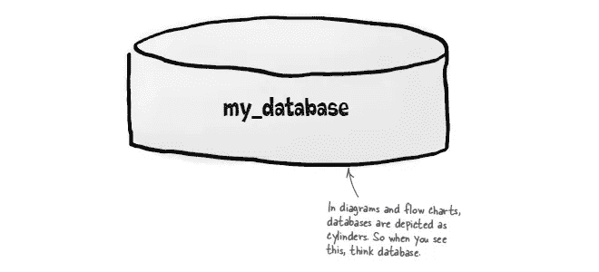
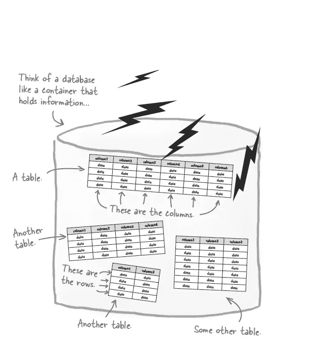
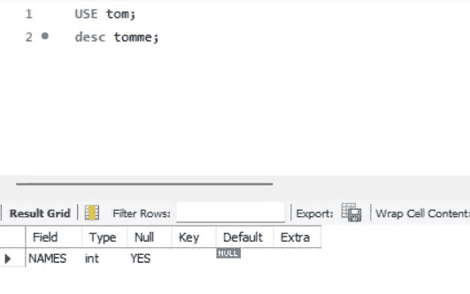
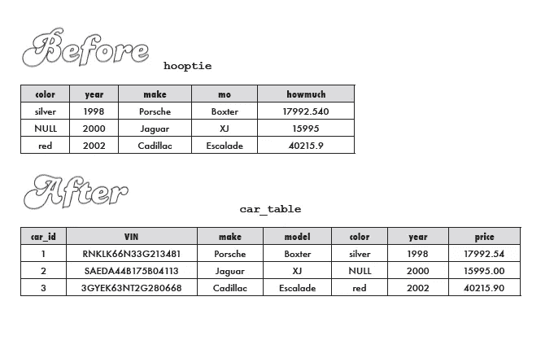

# SQL |插入、更新和删除

> 原文：<https://blog.devgenius.io/sql-insert-update-delete-e6cf88e1ddc6?source=collection_archive---------17----------------------->


扭转局势|来源:[吉菲](https://giphy.com/gifs/perfect-flip-table-5saWnCIJL7nmU)

在进入插入、更新和删除之前，让我们先定义一些东西

> **定义**

1.  **什么是数据库？**

*   保存表和与这些表相关的其他 SQL 结构的容器/圆柱体。
*   *数据库名称不应有空格，可以使用下划线。*
*   *无法重新创建现有数据库。*



数据库|来源:来源:Head First SQL:您的大脑在 SQL 上

**2。什么是查询？**

*   从数据库中询问信息被称为查询。

**3。什么是桌子？**

*   它是数据库内部的一种结构，由数据组成，按行和列组织。
*   表格由行和列组合而成。
*   数据库中的所有表都应该以某种方式连接起来。



数据库中的表| Source : Source : Head First SQL:您的大脑在 SQL 上

**4。什么是专栏？**

*   列/字段由存储在表中的一段数据组成。
*   列是指表中的特定类别。

**5。什么是行？**

*   行/记录是描述单个项目属性的一组列。

> **创建、插入、更新、删除&删除**

1.  **创建数据库**

`CREATE DATABASE database_name;`

*注意:不能重新创建现有的数据库。*

**2。使用数据库**

`USE database_name;`

*注:*

*   从现在开始，任何事情都发生在数据库内部。
*   SQL 要求所有的表都在一个数据库中。
*   SQL 是不区分大小写的，但是最好用它们各自的大小写敏感性来编写代码。

**3。创建表格**


创建* 5 |来源: [Giphy](https://giphy.com/gifs/consultingcup-create-consulting-cup-thkjYkt6nMYd0LY823)

```
CREATE TABLE table_name 
(column_name1 DATATYPE(SIZE),      
 column_name2 DATATYPE(SIZE));
```

**4。将数据插入表格**

*单引号适用于 CHAR、VARCHAR、DATE、BLOB，但不适用于 toe INT、DEC.*

```
INSERT INTO table_name 
(column_name1 DATATYPE(SIZE),      
column_name2 DATATYPE(SIZE)) 
VALUES('value1', 'value2');
```

变体 1:一次添加所有数据

```
INSERT INTO table_name 
(column_name1 DATATYPE(SIZE),      
column_name2 DATATYPE(SIZE)) 
VALUES('value1','value2','value3'), 
('valuex','valuey',valuez'), 
('valuea','valueb','valuec');
```

变体 2:更改列的顺序

```
INSERT INTO table_name 
(column_name2 DATATYPE(SIZE)      
column_name1 DATATYPE(SIZE)) 
VALUES ( 'value2','value1');
```

*注意:在更改列顺序的同时，我们还应该记住更改值的顺序。*

变体 3:省略列名

```
INSERT INTO table_name 
VALUES ( 'value2', 'value1' );
```

*注意:确保所有值的输入顺序与列的初始化顺序相同。*

变体 4:仅插入几个值

```
INSERT INTO table_name 
(column_name2 DATATYPE(SIZE)) 
VALUES ( 'value2' );
```

*注意:根据需要输入的值，这里必须提到列名。*

**5。控制表中某列的空值**

```
CREATE TABLE table_name 
(column_name1 DATATYPE(SIZE) NOT NULL,      
column_name2 DATATYPE(SIZE) NOT NULL);
```

**6。将默认值添加到表格中的一列**

```
CREATE TABLE table_name (      column_name1 DATATYPE(SIZE) NOT NULL,      column_name2 DATATYPE(SIZE) NOT NULL DEFAULT value_x );
```

*注:*

*   *如果指定了默认值，则每当创建新行时，该特定值将被添加到列中* ***当且仅当未指定其他值时*** *。*
*   *默认值应与所提供的数据类型相匹配。*

**7。描述一个表**

```
DESC table_name;  
DESCRIBE table_name;
```



表格描述如下所示

**8。从表**中删除一条记录

```
DELETE FROM table_name   
WHERE column_name1='value1';
```

*注:*

*   *在搜索时也可以用双引号给出值。*
*   *INT/DEC 值可以用引号引起来。这个特定的查询是不正确的，但是 RDBMS 是宽容的。*
*   *我们不能使用 DELETE 从单个列或列表中删除值。*
*   根据 WHERE 子句，我们可以使用 DELETE 删除单行或多行。
*   *我们可以使用* `*DELETE FROM table_name;*` *删除表中的所有行，但如果 SQL 在安全模式下运行，这种情况不会发生。*

# **现在让我们学习更新表中的记录**


坚持住学完会很好玩|来源: [Giphy](https://giphy.com/gifs/coffee-monday-first-SRr4hnysDxRQxhwfC9)

**9。更新表中的一条记录(而不是删除旧数据并添加新数据)**

```
UPDATE table_name   
SET column_name1 = 'value1'   
WHERE column_name2='value2'   
AND column_name3='value3';
```

*注:*

*   可以使用 Update 语句来代替删除已经存在的旧数据，然后更新新数据。
*   *SET 关键字告诉 RDBMS，它需要将等号前的列的名称改为等号后的值。*

**10。更新表中的多条记录**

```
SELECT table_name   
SET column_name1 = 'value1',   
column_name2 = 'value2';
```

**11。删除一个表格**

`DROP TABLE table_name;`


辛辛苦苦删了你的表？来源: [Giphy](https://giphy.com/gifs/black-and-white-jim-carrey-edited-vohOR29F78sGk)

使用 ALTER 子句可以进行各种可能的更改。请记住，更改数据类型可能会导致该列中现有数据的丢失。

**12。使用 ALTER 语句**添加新列

*   如果语句中没有提到 after，那么 SQL 会自动在表的末尾插入数据。
*   可以用来提及需要输入的新列的位置的关键字**第一个**和**在 your_column 之后，**在之前 **your_column** 和**最后，第二个**，第三个**在**等等。

```
ALTER TABLE table_name 
ADD COLUMN column_name datatype(size) DEFAULT(NULL/ NOT NULL), AFTER pre_existing_column_name; #Becareful while using alter because changing data type of an existing column can lead to loss of data
```

**13。重命名表格**

```
ALTER TABLE table_name 
RENAME TO new_table_name;
```

**14。重命名列**

```
ALTER TABLE table_name 
CHANGE COLUMN old_column_name1 new_column_name1 datatype(size) DEFAULT(NULL/NOT NULL) AUTO_INCREMENT(ifneeded), 
CHANGE COLUMN old_column_name2 new_column_name2 datatype(size) DEFAULT(NULL/NOT NULL) AUTO_INCREMENT(ifneeded), 
ADD PRIMARY KEY (new_column_name1);
```

*注:*

*   *auto _ increment 确保每输入一个数据，值就增加一个，因此它维护主键的规则，其中呈现一个不为空的唯一数字。*
*   每个表只能有一个 auto_increment 字段，它必须是整数，并且不能包含 null。
*   *添加主键表示系统认为这个特定的列应该被认为是新的主键列。*

15。更改列的数据类型

我们可以使用 ALTER-MODIFY 来代替对现有列使用 ALTER-CHANGE

```
ALTER TABLE table_name MODIFY COLUMN column_name datatype(size) DEFAULT(NULL/NOT NULL) AUTO_INCREMENT(ifneeded);
```

16。掉一列

```
ALTER TABLE table_name 
DROP COLUMN column_name;
```

**例子**



来源:Head First SQL:您的大脑在 SQL 上

```
ALTER TABLE hooptie
ADD COLUMN car_id INT NOT NULL AUTO_INCREMENT FIRST, 
ADD COLUMN VIN varchar(20) AFTER car_id,
MODIFY COLUMN make AFTER VIN,
CHANGE COLUMN  mo model varchar(20),
MODIFY COLUMN color AFTER model,
MODIFY COLUMN year SIXTH,
CHANGE COLUMN howmuch price DECIMAL(7,2)
RENAME TO car_table;
```

> **备忘单**

1.  ALTER-ADD:用于添加表的名称、数据类型或顺序。
2.  ALTER-CHANGE:用于更改表的名称、数据类型或顺序。
3.  ALTER-MODIFY:用于改变列的数据类型和顺序。
4.  ALTER-RENAME TO:用于更改表名。
5.  ALTER- DROP COLUMN:用于从表中删除任何列。
6.  第一，最后，第二，第三，第四，…，在 column_name 之后，在 column_name 之前可以用来指定列的顺序。

*请注意，在某些 RDBMS 中，我们只能在将列添加到表中时更改它们的顺序。

> **附加信息**

**要点**

1.  不能保证表中的最后一行是添加到表中的最新一行。

2.重复记录总是不好的，需要消除，因为随着表变得越来越大，它们会占用空间并降低 RDBMS 的速度。

3.可以在 INSERT 语句中省略列列表。但是，如果没有列出目标列，则必须插入到表中的所有列中，并注意值列表中值的顺序；您必须按照数据库响应选择查询时显示列的顺序来提供值。无论哪种方式，您都应该注意列约束，因为如果您不插入到每一列中，您将创建一个某些值为空的行。如果存在被约束为不接受空值的列，这可能会导致错误。

4.在分析所有可用数据后，应谨慎使用带有 where 子句的 Delete 语句。

5.如果对表不确定，请始终使用带有 where 子句的 select 语句，在该语句之后我们可以删除不需要的记录。

6.UPPER()和 LOWER()函数可用于将文本分别转换为大写和小写。

> **食谱中的例子**

```
#1.1 Creating a database, using it to create a table and insert values into itCREATE DATABASE learning;
USE learning;
CREATE TABLE emp
(
EMPNO int,
ENAME varchar(10),
JOB varchar(20),
MGR int,
HIREDATE varchar(20),
SAL int,
COMM int,
DEPTNO int
);
INSERT INTO emp
(
EMPNO,
ENAME,
JOB,
MGR,
HIREDATE,
SAL,
COMM,
DEPTNO
)
VALUES
(7369,'SMITH','CLERK',7902,'2005-12-17',800,NULL,20),
(749, 'ALLEN', 'SALESMAN' ,7698, '20-FEB-2006',1600,300,30),
(7521, 'WARD', 'SALESMAN', 7698,'22-FEB-2006', 1250, 500, 30),
(7566,'JONES','MANAGER', 7839, '02-APR-2006', 2975,NULL, 20),
(7654,'MARTIN', 'SALESMAN', 7698, '28-SEP-2006', 1250, 1400, 30),
(7698, 'BLAKE', 'MANAGER' ,7839, '01-MAY-2006', 2850,NULL, 30),
(7782, 'CLARK', 'MANAGER', 7566, '09-JUN-2006', 2450,NULL, 10),
(7788, 'SCOTT', 'ANALYST', 7839, '09-DEC-2007', 3000,NULL, 20),
(7839, 'KING', 'PRESIDENT', NULL, '17-NOV-2006', 5000,NULL, 10),
(7844, 'TURNER', 'SALESMAN' ,7698, '08-SEP-2006', 1500, 0, 30),
(7876, 'ADAMS', 'CLERK', 7788, '12-JAN-2008', 1100, NULL, 20),
(7900, 'JAMES', 'CLERK', 7698, '03-DEC-2006', 950,NULL, 30),
(7902, 'FORD', 'ANALYST', 7566, '03-DEC-2006', 3000, NULL, 20),
(7934, 'MILLER', 'CLERK', 7782, '23-JAN-2007', 1300, NULL, 10);
```

ℹ️可以在 INSERT 语句中省略列列表:但是，如果没有列出目标列，则必须插入到表中的所有列中，并注意值列表中值的顺序；您必须按照数据库响应 SELECT *查询时显示列的顺序来提供值。无论哪种方式，您都应该注意列约束，因为如果您不插入到每一列中，您将创建一个某些值为空的行。如果存在被约束为不接受空值的列，这可能会导致错误。

**1.2 将表初始化期间指定的默认值插入表中**

```
INSERT INTO dept
(
DEPTNO,
DNAME,
LOC
)
VALUES();

# This will enter the default values of all the columns that were declared while creating the table.
```

**1.3 将空值插入到已经用默认值初始化的列中**

```
 INSERT INTO dept
(
DEPTNO,
DNAME,
LOC
)
VALUES(null,'tom','c_block');

#This will enter a null value although there is a default that is specified for DEPTNO.
```

**1.4 创建具有相同结构的表，另一列的数据类型**

```
INSERT INTO dept_copy
SELECT *
FROM dept
WHERE 1=0;
```

**1.5 将数据/数据行从一个表复制到另一个表**

```
#1.5 Copying data/rows of data from one table to another table
INSERT INTO dept_east
SELECT deptno,dname,loc
FROM dept
WHERE loc='Newyork' OR loc='London';
```

**1.6 通过使用 create view 语句阻塞特定表中的插入**

```
CREATE VIEW dept_copy AS
SELECT empname,empid,loc
FROM dept

#By doing so and providing access to the dept_copy we can limit the users to only access the 3 columns in the table, it will be seen as followsINSERT INTO dept_copy
VALUES ('Tom','149','India')
#This above statment will be synonymous to
INSERT into dept
(empname, empid, loc)
VALUES ('Tom','149','India')
```

**2.1 更新表格中的值，以便所有工程师将获得 10%的加薪**

```
UPDATE dept
SET sal = sal*1.1
WHERE job = 'engineer';
```

**2.2 当更新值的条件在另一个表中时，使用算术运算符更新表中的值**

```
UPDATE dept
SET sal = sal*1.1
WHERE empid in (SELECT empid from bept_bonus_eligible);
```

**2.3 当更新值的条件在另一个表中时，更新一个表中的值**

```
UPDATE dept d
SET d.sal = b.sal
WHERE emp_id in (SELECT emp_id from bept_bonus_eligible b);UPDATE dept d, new_sal ns
SET d.sal = ns.sal
WHERE d.emp_id=ns.emp_id;
```

**3.1 从表格中删除所有记录**

```
#3.1 Delete all record from the table
DELETE from emp;

#`TRUNCATE` can be used to delete all the rows in the table and it is faster than the delete statement, but read more about it before using it for deleting tables.
```

**3.2 从表格中删除具体记录**

```
#3.2 Delete specific records from table
DELETE from emp WHERE dept_no =10;
```

**3.3 从一个表中删除另一个表中不存在的特定记录**

```
DELETE FROM emp WHERE NOT EXISTS( SELECT * FROM dept WHERE dept.dept_id = emp.deptid);

#or we can also use
DELETE FROM emp WHERE dept_id not in (SELECT dept_id FROM dept);

#MYsql users cannot reference the same table twice in a delete statement
```

**3.4 使用同一表格的序号删除表格中的重复项**

```
DELETE FROM emp
WHERE emp_id
NOT IN (SELECT MIN(serialno)
				FROM (SELECT serialno,emp_id FROM emp) temps
				GROUP BY emp_id);
```

**3.5 基于一个表中的记录多于另一个表中的 x 个计数的条件，删除一个表中的记录**

```
#Here the count is the number of accidents

DELETE FROM emp
WHERE dept_id
NOT IN (SELECT dept_id FROM (SELECT dept_id
				COUNT(*) as total
				FROM dept_accidents
				GROUP BY dept_id)
				WHERE	total>=3); DELETE FROM emp
WHERE dept_id
NOT IN  (SELECT dept_id
	 FROM dept_accidents
	 GROUP BY dept_id)
	 HAVING COUNT(*)>=3);
```