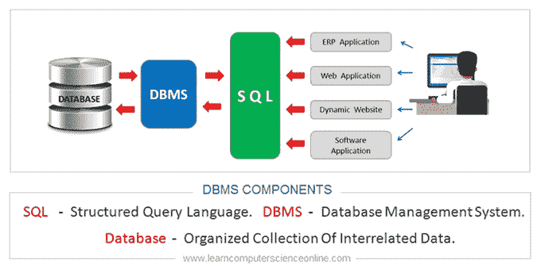
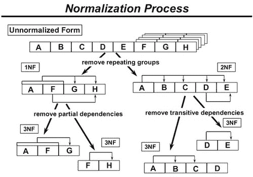
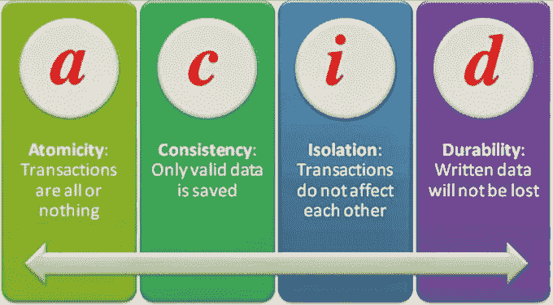
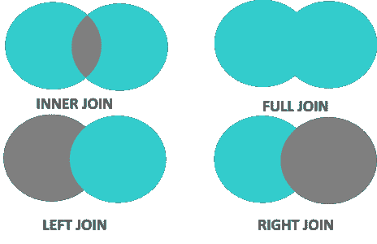
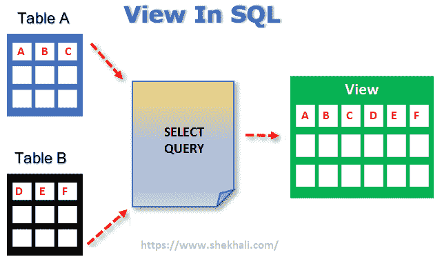

# 数据分析师的 SQL 面试问题

> 原文：<https://blog.devgenius.io/sql-interview-questions-for-data-analysts-ee7de9f65510?source=collection_archive---------6----------------------->

参加数据分析师面试时，对数据库部分有什么期望

问:你说的数据库管理系统是什么意思？

答:数据库管理系统(DBMS)是一个软件应用程序，它与用户、应用程序和数据库本身进行交互，以捕获和分析数据。存储在数据库中的数据可以修改、检索和删除。

问:什么是正常化？

答:标准化是组织数据以避免重复和冗余的过程。标准化有许多连续的层次。这些被称为范式。

问:什么是数据库中的 ACID 属性？

答:酸是原子性、一致性、隔离性和持久性的缩写。该属性在数据库中用于确保数据事务在系统中是否得到可靠处理。

问:有哪些不同类型的连接？

答:用于在表之间检索数据的各种类型的连接有内连接、左连接、右连接和全外连接。

问:什么是 SQL 视图？

答:视图是一个虚拟表，它的内容是从一个或多个现有的表中获取的，这些表称为基表。检索通过合并到视图中的 SQL 语句进行。视图本身不包含任何真实数据。

博客的 Tweet 线程版本:

关注更多！