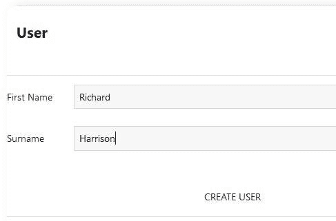
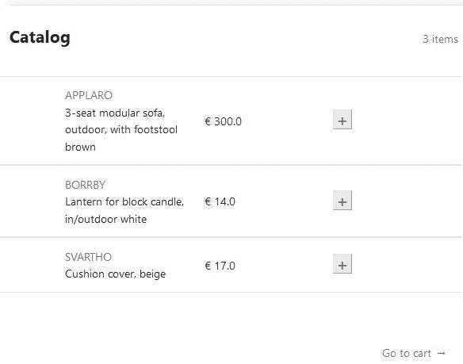
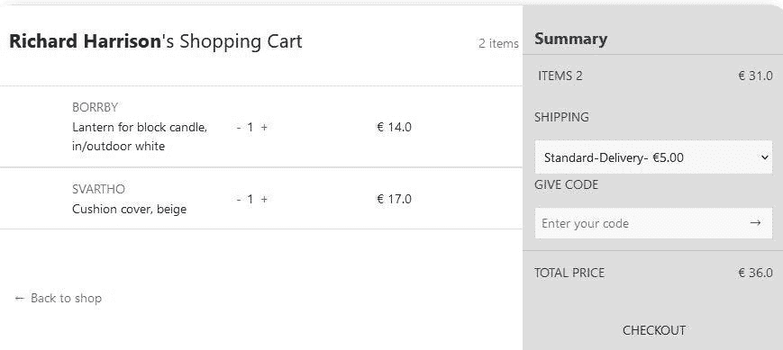
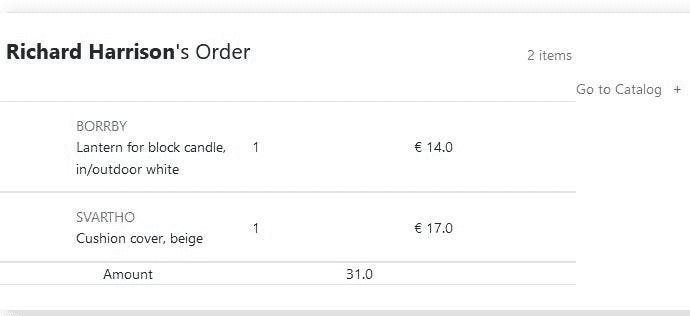
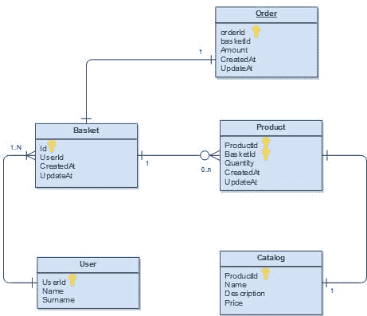
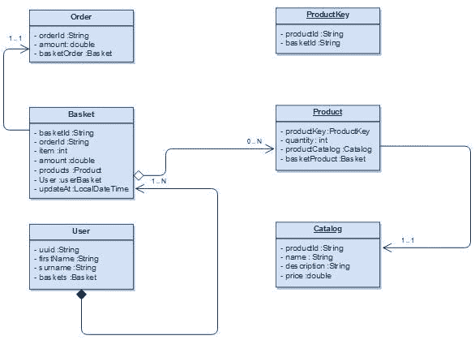
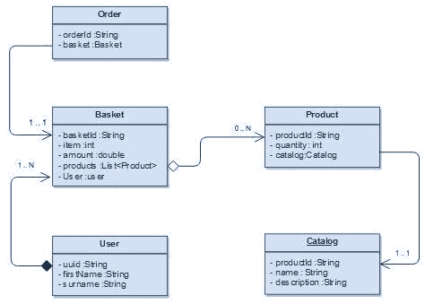
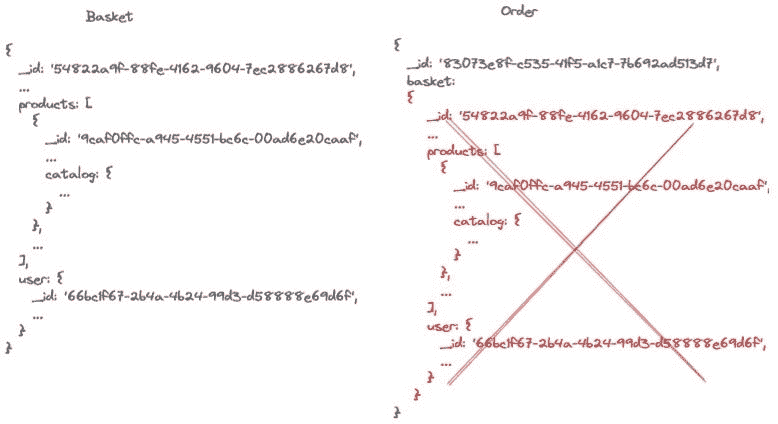

# Sql 还是 NoSql，这是个问题

> 原文：<https://blog.devgenius.io/sql-or-nosql-thats-the-question-788c7e255d38?source=collection_archive---------9----------------------->


尽管不可否认的是，多年来开发的大多数应用程序都使用 SQL 作为存储解决方案，但现在在开始开发新的应用程序之前，经常会面临在 SQL 或 NoSQL 持久性之间的选择。两种解决方案各有利弊，有时一种比另一种好得多。我来给你，通过一个真实的案例，我在这篇文章里的观点是什么。

在进入文章之前，为了避免浪费大家的时间，我先做一个小小的声明。
我不打算详细解释这两种技术的区别。这并不是因为不值得，而是您可以在互联网上找到大量解释这两种存储系统的资源。
同样，这不会是一篇经典的“X 对 Y”的文章，因为在这场假设的竞赛中没有绝对的赢家。
我的目的是阐明一些标准，以便做出更好的选择(反正没有最好的)。

## 电子商务项目

假设我们想要构建一个经典的电子商务解决方案(目录、购物篮、产品……)，并且我们在 SQL 和 NoSQL 实现之间苦苦挣扎。
描述用户体验，我们的第一步是创建用户和购物篮。



接下来，我们准备将目录中的产品放入购物篮。



一旦产品添加到购物篮中，我们就可以更新数量并进行结帐。



最后我们得到订单审查。



对于这些使用情形，哪种存储类型可以实现最佳效果？这可能是一个 SQL (Jpa)解决方案…

## Jpa 电子商务

假设我是一个非常传统的人，我喜欢 SQL 作为持久层，从数据开始，这是我的数据库 er 模式。



在这个图中没有什么特别的，我定义了表之间的关系以及主键和外键的最小子集，以保证数据的一致性和保持数据的规范化。

我的 MVC 应用程序中的代码层是基于 JPA (Jakarta Persistence Api)和 Hibernate 的。
同样，JPA 是一个规范和框架，Hibernate、EclipseLink(和其他)是实现。很多时候，我听到人们说他们在使用 JPA，当我问他们用哪个实现时，他们回答“不，不，我不用 Hibernate，而是 JPA”…

好了，一旦澄清了这个误解，让我们来看代码。我在本文末尾链接了完整的源代码，无论如何，为了更好地理解这个策略，看一看其中的某个部分是值得的。
这就是篮子实体，我的电子商务解决方案的核心。

```
@Entity
public class Basket {

  @Id
  private String basketId;

  @Column(name="orderId")
  private String orderId;

  @Transient
  private int item;

  @Transient
  private double amount;

  @OneToMany(mappedBy="basketProduct", fetch = FetchType.EAGER)
  private Set<Product> products;

  @ManyToOne
  @JoinColumn(name = "userId", nullable = false)
  private User userBasket;

  @Column(name="updatedAt")
  LocalDateTime localDateTime;    
  /*
  *
  * Getter and setter
  */
}
```

显然，这与产品实体有关系(一对多)

```
@Entity
public class Product implements Serializable{

  @EmbeddedId
  private ProductKey productKey;

  @Column(name="quantity")
  private int quantity;  

  @OneToOne
  @JoinColumn(name = "productId", nullable = false, 
              insertable = false, updatable = false)
  private Catalog productCatalog;

  @ManyToOne
  @JoinColumn(name = "basketId", nullable = false, 
              insertable = false, updatable = false)
  private Basket basketProduct;

 /*
  * Getter and setter
  */
}
```

看看 JPA 如何实现复合主键(ProductKey)很有意思。

```
@Embeddable
public class ProductKey implements Serializable{

  private String productId;
  private String basketId;
  /*
   * Getter and setter
   */
}
```

这样，productId 和 basketId 都构建了主键。

视图层通过最后一层中的 API 集与模型层对话，实现经典的 CRUD 接口:

```
@Repository
@Transactional
public class BasketDaoJPAImpl implements BasketDao {

  @PersistenceContext
  private EntityManager em;

  @Override
  public Basket getBasketDashboard(String basketId) {
    Basket basket = em.find(Basket.class, basketId);
    return basket;
  }

  @Override
  public String addProduct(String basketId, String productId) {
    /*
     * Get the basket
     */
    Basket basket = em.find(Basket.class, basketId);

    ProductKey pk = new ProductKey();
    pk.setBasketId(basketId);
    pk.setProductId(productId);
    /*
     * Get products
     */
    if (basket.getProducts().size() == 0) {
      /*
       * Create product
       */
      Product p = this.createProduct(basket, pk);

      em.persist(p);

    } else {

      Optional<Product> pOptional = this.getProductByKey(pk);      
      Product p = null;

      if (pOptional.isPresent())
      {
        p = pOptional.get();
        p.setQuantity(p.getQuantity() + 1);
      }
      else       
        p = this.createProduct(basket, pk);

      em.persist(p);
    }
    /*
     * Set update time
     */
    basket.setLocalDateTime(LocalDateTime.now());
    em.persist(basket);

    return "Success";
  }

  private Optional<Product> getProductByKey(ProductKey pk)
  {
    Product p = em.find(Product.class, pk);
    return p != null ? Optional.of(p) : Optional.empty();
  }

  private Product createProduct(Basket basket, ProductKey pk) {
    Product p = new Product();
    p.setProductKey(pk);
    p.setQuantity(1);
    p.setBasketProduct(basket);

    return p;
  }

  @Override
  public String delProduct(String basketId, String productId) {
    /*
     * Get the basket
     */
    Basket basket = em.find(Basket.class, basketId);
    /*
     * Get products
     */
    Optional<Product> productOptional = basket.getProducts().stream()
        .filter(p -> p.getProductKey()
               .getProductId().equals(productId)).findFirst();

    if (productOptional.isPresent()) {

      Product product = productOptional.get();

      if (product.getQuantity() > 1) {
        product.setQuantity(product.getQuantity() - 1);
        em.persist(product);
      } else {
        em.remove(product);
      }
    }    
    /*
     * Set update time
     */
    basket.setLocalDateTime(LocalDateTime.now());
    em.persist(basket);

    return "Success";
  }
}
```

我避免使用 Spring 数据接口，不是因为它不是一个好的解决方案，而是因为我觉得通过 EntityManager 类管理数据层更舒服。

完整的类 UML 模式是:



好吧，我知道我本可以做得更好，错过一些检查和缺少日志信息会使在生产环境中阅读这个应用程序变得非常不可能；关键是，我写这篇文章不是为了向你解释如何实现 MVC JPA 解决方案，我的目的是将这个解决方案与 NoSQL 进行比较。

## Mongo 电子商务

让我们看看 NoSQL 的模型层意味着什么。数据模型与 SQL 解决方案非常相似，除了文档 NoSQL 中提供的一个很棒的特性，它允许我们在嵌入或引用外部资源之间进行选择。



我的选择是保留一个名为 Basket 和嵌入式产品和目录文档的集合。我将订单作为外部参考，这是我的选择，以避免在订单文档中包含购物篮。

基本上，这就是我要得到的。这是嵌入了所有外部文档的购物篮集合。

```
{
  _id: '54822a9f-88fe-4162-9604-7ec2886267d8',
  item: 2,
  amount: 31,
  products: [
    {
      _id: '9caf0ffc-a945-4551-bc6c-00ad6e20caaf',
      quantity: 1,
      catalog: {
        _id: '9caf0ffc-a945-4551-bc6c-00ad6e20caaf',
        name: 'BORRBY',
        description: 'Lantern for block candle, in/outdoor white',
        price: 14,
        createdAt: ISODate('2022-05-09T11:49:15.111Z')
      }
    },
    {
      _id: 'd8a03eca-53af-4dee-a4e4-19081caa3ad6',
      quantity: 1,
      catalog: {
        _id: 'd8a03eca-53af-4dee-a4e4-19081caa3ad6',
        name: 'SVARTHO',
        description: 'Cushion cover, beige',
        price: 17,
        createdAt: ISODate('2022-05-09T11:49:15.111Z')
      }
    }
  ],
  user: {
    _id: '66bc1f67-2b4a-4b24-99d3-d58888e69d6f',
    firstName: 'Richard',
    surname: 'Harold'
  },
  _class: 'it.blog.sqlornosql.bean.Basket'
}
```

这是对购物篮进行外部引用的订单集合。

```
{
  _id: '83073e8f-c535-41f5-a1c7-7b692ad513d7',
  basket: DBRef('undefined', '54822a9f-88fe-4162-9604-7ec2886267d8'),
  _class: 'it.blog.sqlornosql.bean.Order'
}
```

让我们看看代码。
Basket 是模型层的核心文档。

```
@Document
public class Basket {

  @Id
  String basketId;
  int item;
  double amount;
  List<Product> products;

  User user;  
  /*
   * Getter and setter
   */
}
```

订单是内部声明了外部引用的文档。

```
@Document
public class Order {

  @Id
  String orderId;
  @DBRef
  Basket basket;
  /*
   * Getter and setter
   */
}
```

实现的 CRUD 接口是基于 mongoTemplate 的。同样，我并不反对 Spring Data Mongo 和 Crudrepository 接口，但是我想在这一层获得总的存储库控制。

```
@Component
public class BasketDaoMongoImpl implements BasketDao {

  @Autowired
  MongoTemplate mongoTemplate;

  @Autowired
  ProductDao productDao;

  @Override
  public Basket getBasketDashboard(String basketId) {
    /*
     * Get basket
     */
    List<Product> products = productDao.getProductWithCatalog(basketId);

    Basket currentBasket =  mongoTemplate.findById(basketId, Basket.class);
    /*
     * Set products with Catalog information
     */
    currentBasket.setProducts(products);

    return currentBasket;
  }

  @Override
  public String addProduct(String basketId, String productId) {
    /*
     * Get basket
     */
    Basket basket = mongoTemplate.findById(basketId, Basket.class);
    /*
     * Add product
     */
    Optional<Product> product = basket.getProducts().stream()
        .filter(p -> p.getProductId().equals(productId))
        .findFirst();

    if (product.isPresent()) {
      product.get().setQuantity(product.get().getQuantity() + 1);
    } else {

      Product newProduct = new Product();
      newProduct.setProductId(productId);
      newProduct.setQuantity(1);

      basket.getProducts().add(newProduct);
    }
    /*
     * Compute size
     */
    basket.setItem(this.getItemSize(basket));
    /*
     * Save basket
     */
    mongoTemplate.save(basket);

    return basketId;
  }

  @Override
  public String delProduct(String basketId, String productId) {
    /*
     * Get basket
     */
    Basket basket = mongoTemplate.findById(basketId, Basket.class);
    /*
     * Add product
     */
    Optional<Product> product = basket.getProducts().stream()
        .filter(p -> p.getProductId().equals(productId))
        .findFirst();

    if (product.isPresent())
      if (product.get().getQuantity() > 1)
        product.get().setQuantity(product.get().getQuantity() - 1);
      else
        basket.getProducts().remove(product.get());
    /*
     * Compute size
     */
    basket.setItem(this.getItemSize(basket));
    /*
     * Save basket
     */
    mongoTemplate.save(basket);

    return basketId;
  }

  private int getItemSize(Basket basket) {
    return basket.getProducts().size();
  }
}
```

太好了！既然我们都实现了解决方案，那么是时候分析两者的优缺点，以便做出选择了。
我将这篇评论分成几点，或者说问题，当我们需要持久化信息时，我们必须面对这些问题。在每一点上，我都试图描述这些存储如何面对这些挑战。

我将 MySQL 作为 SQL，将 MongoDB 作为 NoSQL 解决方案进行了比较。有些考虑对其他数据库无效。

**耐酸**

好吧，好吧，等一下，你可以在 Google 上找到很多文章，人们说甚至 MongoDB 也可以被认为是符合 ACID。
我想到了基于 ACID 兼容(原子性、一致性、隔离性、持久性)的纯数据库 RDBMS 解决方案，其中这些概念在其引擎中被强有力地定义，而没有任何变通方法来实现这一特性。
所以，MongoDB 不是值得信赖的数据库？我们考虑一下，MongoDB 已经非常接近完成 CAP 定理的所有特性了，虽然只是 CP(一致性和分区容忍度)。不幸的是，它不是高度可用的(A ),因为在主节点关闭的情况下，MongoDB 在分配新的主节点角色之前不能接受写入。如你所见，无论是使用 MySQL 还是 MongoDB 都可以保证数据的一致性，所以，我不会仅仅根据这一点来选择。

**存储过程和函数**

如果你和一个 T-SQL 开发人员一起工作，并且你要使用 MongoDB，那么，他在未来会有很多空闲时间。存储过程和函数属于 SQL 世界，在 NoSQL 解决方案中没有它们的空间，因为它们是来自关系数据库的表和其他功能之间的连接。
这可能是最终决策的优势，在某些解决方案中，SP 和强大的数据关系可能是成功的关键。

**交易**

事务属于关系数据库世界，而 MongoDB 虽然在这个特性上前进了一步，却不能管理复杂的事务。多个文档的事务)因此，请记住这一点。

这最后一点与前两点给你一个明确的忠告。不要试图使用 NoSQL 数据库作为 SQL 数据库。不管你有多擅长写代码或建模数据，这都是你能做的最糟糕的选择。
如果你的解决方案和用例可以从这三个主题中获益良多，那么，你已经选择了 SQL 数据库。

**可扩展性**

嗯，我认为 MongoDB 是这次比赛的世界冠军。一般来说，用分片方法横向扩展 MongoDB 比纵向扩展 MySQL 实例更容易。
通常，可扩展性涉及一些非技术方面，因为预算考虑到存储可以托管在云上。
因此，了解应用程序必须达到的容量和负载非常重要。

**内存使用量**

MongoDB 是一个饥渴的内存数据库，这并不是因为它的实现很差，而是因为它的架构设计倾向于高度使用系统内存。
同样，如果您打算在支付资源消耗费用的云上使用它，这是需要记住的一点。

**型号更新**

MongoDB 提供了一个非常灵活的数据模型，基本上，没有固定的模式，您可以在同一个集合中插入不同的 JSON 定义。
典型的模式是在 JSON 中包含一个版本号，以便识别模式版本。
在 NoSQL 环境中，添加、删除或更新字段非常容易且透明，因此，当采用 Ci/CD 方法时，这是一个很好的解决方案
不同的是，SQL 环境需要固定的模式，并且每次更新都可能需要停机或多步部署([Ci/CD 能适应数据库吗？](https://techannotation.wordpress.com/2022/01/28/can-ci-cd-get-on-with-databases/))。

当你打算搬到 NoSQL 或使用 SLQ 解决方案时，这是要记住的关键一点。如果您的应用程序会随着时间的推移而改变，那么灵活的模式是一个非常强大的价值。

在最后一个位置，我保留了我认为是 NoSQL 和 SQL 之间最重要的区别。SQL 以表格格式保存数据，在表中用主键和外键来建立它们之间的关系。
文档类型 NoSQL 将数据保存为文档(Json 格式)，并通过嵌入信息或使用外部引用来建立数据之间的关系。
虽然在 SQL 数据库中保持数据正常化是一种常见且良好的做法，但当您选择嵌入数据时，在 NoSQL 内部对数据进行非正常化并不罕见，也绝对不是一种不好的做法。

每次把 NoSQL 看做 Mongo，我都认为它是开发者建立的数据库，因为我个人不喜欢 ORM 和 DTO 对象。在 Mongo 中，你在代码中使用的内容就是你在数据库中存储的内容。

一般来说，当您要使用 NoSQL 解决方案时，这是一种很好的方法，可以根据应用程序使用情形和数据访问方式对存储内部的数据进行建模。
在我的电子商务示例中，我将产品文档放在购物篮中，因为在我的用例中，每次我获取购物篮内容时都需要产品，所以我不介意将它们作为外部引用。
另一方面，我选择在创建订单时创建外部购物篮引用，这是因为我想通过复制订单文档内的购物篮内容来避免数据重复。



## 结论

做出选择的许多因素可能会吓到任何人，所以，让我们试着用一条经验法则来总结所有这些因素。

在我看来，如果你不得不面对一个拥有大量数据(实时分析)的解决方案，或者一个模式会随着时间而改变的解决方案，NoSQL 可以胜任这项工作。
另外，如果您的应用程序必须满足强大的事务需求，并且能够从 SP 或 T-SQL 语言中获得巨大收益，那么，SQL 解决方案可以是您的选择。

在上述案例中，还有许多其他应用程序模型，SQL 和 NoSQL 以同样的方式适用。由你来决定哪些是有利的，哪些是不利的。

代码解决方案可从 [MarcoGhise/SqlorNoSql](https://github.com/MarcoGhise/SqlorNoSql) 获得。

## 参考

-[MongoDB 数据建模的完整方法论](https://www.youtube.com/watch?v=DUCvYbcgGsQ)(Daniel Coupal-Education，MongoDB)

- [高级模式设计模式](https://www.youtube.com/watch?v=bxw1AkH2aM4) (Justin LaBreck，Daniel Coupal)

*原载于 2022 年 5 月 12 日 http://techannotation.wordpress.com*[](https://techannotation.wordpress.com/2022/05/12/sql-or-nosql-thats-the-question/)**。**