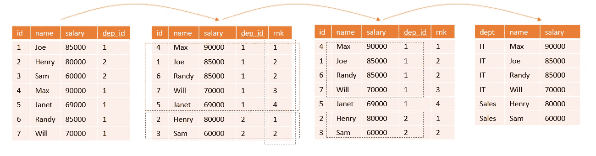
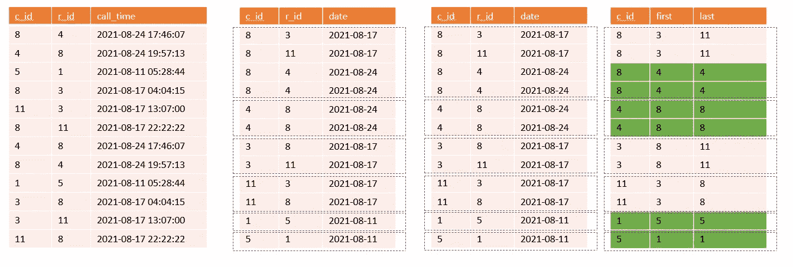
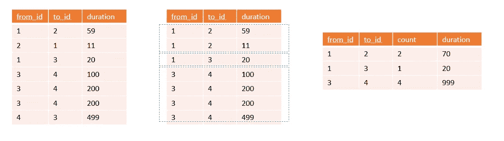

# SQL 练习题— #1

> 原文：<https://blog.devgenius.io/sql-practice-questions-1-800ed65d99b2?source=collection_archive---------3----------------------->

SQL 练习题的第一部分

解决任何 SQL 问题的步骤:

*   将结果可视化，并反向工作以找到如何实现结果
*   分解成小问题(如果有意义，就用 CTE 来解决)
*   记住执行顺序，并尽早过滤掉不需要的记录属性
*   比起内部联接，更喜欢窗口函数。
*   窗口函数非常方便

让我们解决一些问题。

点击此处查看[第二部](/sql-practice-questions-2-f1116b1f5402) [第三部](/sql-practice-questions-3-9fd3d6e56058) [第四部](/sql-practice-questions-4-e24a6bdb32d4) [第五部](/sql-practice-questions-5-456cfb41757a)

## 问题 1

一家公司的高管感兴趣的是，看看公司各个部门中谁赚的钱最多。一个部门中的**高收入者**是指其工资在该部门的**前三名中的员工。编写一个 SQL 查询来查找每个部门中的高收入者。以任意顺序返回结果表**。****

```
**Input:** 
Employee table:
+----+-------+--------+--------------+
| id | name  | salary | departmentId |
+----+-------+--------+--------------+
| 1  | Joe   | 85000  | 1            |
| 2  | Henry | 80000  | 2            |
| 3  | Sam   | 60000  | 2            |
| 4  | Max   | 90000  | 1            |
| 5  | Janet | 69000  | 1            |
| 6  | Randy | 85000  | 1            |
| 7  | Will  | 70000  | 1            |
+----+-------+--------+--------------+Department table:
+----+-------+
| id | name  |
+----+-------+
| 1  | IT    |
| 2  | Sales |
+----+-------+**Output:** 
+------------+----------+--------+
| Department | Employee | Salary |
+------------+----------+--------+
| IT         | Max      | 90000  |
| IT         | Joe      | 85000  |
| IT         | Randy    | 85000  |
| IT         | Will     | 70000  |
| Sales      | Henry    | 80000  |
| Sales      | Sam      | 60000  |
+------------+----------+--------+
```

****方法:**根据每个部门内的工资(从高到低)对员工记录进行排名。选择等级小于 4 的行。**

****

```
WITH agg as (
    SELECT departmentId, name, salary, 
    DENSE_RANK() OVER (
          PARTITION BY departmentId ORDER BY Salary desc
        ) as r
    FROM Employee
) 
select d.Name as "Department", a.Name as "Employee", a.Salary as "Salary"
from agg a 
join Department d on a.departmentId = d.Id
where a.r < 4
```

## **问题 2**

**编写一个 SQL 查询来报告用户的 id，这些用户在任何一天的第一个和最后一个电话是与同一个人的**进行的。无论是打电话的人还是接听电话的人，电话都会被计算在内。返回**任意顺序**中的结果表。****

```
**Input:** 
Calls table:
+-----------+--------------+---------------------+
| caller_id | recipient_id | call_time           |
+-----------+--------------+---------------------+
| 8         | 4            | 2021-08-24 17:46:07 |
| 4         | 8            | 2021-08-24 19:57:13 |
| 5         | 1            | 2021-08-11 05:28:44 |
| 8         | 3            | 2021-08-17 04:04:15 |
| 11        | 3            | 2021-08-17 13:07:00 |
| 8         | 11           | 2021-08-17 22:22:22 |
+-----------+--------------+---------------------+**Output:** 
+---------+
| user_id |
+---------+
| 1       |
| 4       |
| 5       |
| 8       |
+---------+**Explanation:** 
On 2021-08-24, the first and last call of this day for user 8 was with user 4\. User 8 should be included in the answer.
Similarly, user 4 on 2021-08-24 had their first and last call with user 8\. User 4 should be included in the answer.
On 2021-08-11, user 1 and 5 had a call. This call was the only call for both of them on this day. Since this call is the first and last call of the day for both of them, they should both be included in the answer.
```

****方法:**根据来电者和通话日期对表格进行分区。对于每个分区，检查第一行和最后一行是否有相同的接收者，然后该调用者应该在结果集中。在升序和降序中使用 FIRST_VAL 来查找所涉及的调用者的第一个和最后一个值。因为我们在这里进行配对，所以我们需要通过选择呼叫者和接收者的反序来进行配对。**

****

```
with cte as
(
    select user_id1,
        first_value(user_id2) over (
          partition by user_id1, date(call_time) order by call_time
        ) as first_call_recp,
        first_value(user_id2) over (
          partition by user_id1, date(call_time) order by call_time desc
        ) as last_call_recp
    from
        (
        select caller_id as user_id1, recipient_id as user_id2, call_time
        from Calls
        union
        select recipient_id as user_id1, caller_id as user_id2, call_time
        from Calls
    ) t
)
select distinct user_id1 as user_id
from cte
where first_call_recp = last_call_recp
```

## ****问题三****

**编写一个 SQL 查询来报告每对不同的人`(person1, person2)`之间的通话次数和总通话持续时间，其中`person1 < person2`。返回**任意顺序**中的结果表。**

```
**Input:** 
Calls table:
+---------+-------+----------+
| from_id | to_id | duration |
+---------+-------+----------+
| 1       | 2     | 59       |
| 2       | 1     | 11       |
| 1       | 3     | 20       |
| 3       | 4     | 100      |
| 3       | 4     | 200      |
| 3       | 4     | 200      |
| 4       | 3     | 499      |
+---------+-------+----------+**Output:** 
+---------+---------+------------+----------------+
| person1 | person2 | call_count | total_duration |
+---------+---------+------------+----------------+
| 1       | 2       | 2          | 70             |
| 1       | 3       | 1          | 20             |
| 3       | 4       | 4          | 999            |
+---------+---------+------------+----------------+
```

**方法:因为我们想要对(1，2 == 2，1)求和，所以我们需要根据条件选择值。我们假设该对的第一个数字小于第二个数字。使用 CASE 语句也可以达到同样的效果。**

****

```
with sorted_pair as (
 select case when from_id < to_id then from_id else to_id end as from_id,
     case when from_id < to_id then to_id else from_id end as to_id,
    duration
FROM Calls
)
select from_id as person1, to_id as person2, 
 count(1) as call_count, 
    SUM(duration) as total_duration 
from sorted_pair GROUP BY 1, 2
```

## **问题 4**

**树中的每个节点可以是以下三种类型之一:**

*   ****“叶”**:如果节点是叶节点。**
*   ****【根】**:如果节点是树根。**
*   ****“内”**:如果节点既不是叶节点也不是根节点。**

**给定一个包含节点及其父节点的表，编写一个 SQL 查询来报告树中每个节点的类型。按升序返回由`id` **排序**的结果表**。****

```
**Input:** 
Tree table:
+----+------+
| id | p_id |
+----+------+
| 1  | null |
| 2  | 1    |
| 3  | 1    |
| 4  | 2    |
| 5  | 2    |
+----+------+**Output:** 
+----+-------+
| id | type  |
+----+-------+
| 1  | Root  |
| 2  | Inner |
| 3  | Leaf  |
| 4  | Leaf  |
| 5  | Leaf  |
+----+-------+
```

**方法:我们使用 **CASE** 语句来查找类型。**

```
SELECT Node, 
    case 
        WHEN P is NULL THEN 'Root' 
        WHEN N NOT IN (select P from tree_nodes GROUP BY P) THEN 'Leaf'
        ELSE 'Inner'
    END
FROM tree_nodes
```

**查询愉快！！**