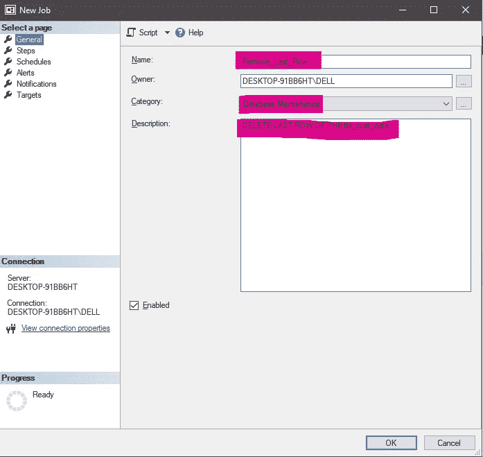

# SQL SERVER 代理

> 原文：<https://blog.devgenius.io/sql-seragent-81941e2e2057?source=collection_archive---------15----------------------->

代理人是被授权代表他人行事的人。

嗯，你所读到的代理人是你指定为你做这项工作的人，你一定听说过保险代理人、销售代理人等。

图一

同样，我们也有 SQL Server 代理，它是一种执行计划作业的服务。

您只需安排作业，输入正确的命令，SQL 代理就会确保它在后台代表您执行特定的任务。

问题是*你如何启用 SQL Server 代理？*

你如何开始使用它作为你的代理，让它代表你执行任务？

## 你必须开始把它当作你的援助之手。

图 2

首先，我们决定交给 SQL 代理的任务——

我们想在下午 5:15 之后从 **tbl_cust_data 中删除一个记录/行**

下面是原表。

图 3

现在，为了分配作业，我们右键单击 SQL Server 代理—新建—作业

图 4

你会看到一扇窗户打开了—

您必须给出该工作的名称、类别和描述。

图 5

在我们决定作业后，我们将决定作业的步骤，我们将单击“steps ”,当新窗口弹出时，我们将输入步骤、命令，并对其进行解析以确保其正常工作。

图 6

在我们解析它之后，我们看到了*作业步骤列表*中的步骤，如下所示——

图 7

我们将在“计划”选项卡中计划作业—

图 8

我们输入作业的名称、计划类型、频率、持续时间和描述。

在此之后，你会看到它在时间表列表中，这意味着你一直做得很好。

您可以随时添加警报、通知和目标，但我们现在不需要它。

图 9

如果成功的话，我们会在上面的图片中看到 jobs 下面的任务。

为了跟踪作业是否已成功执行，我们将在作业活动监视器中进行检查，在那里我们将找到有关作业的所有详细信息。

图 10

在所有这些都完成之后，工作代理你的助手将会在预定的时间完成工作，并在后台完成工作。

## SQL Server 代理(一种代理)将在您编写 SQL 查询和进行演示时代表您完成您的工作。所以确保你明智地使用它。

> *这篇文章就到这里，希望你喜欢。如果您能分享这篇文章，并留下您的想法、建议和推荐，我将不胜感激，希望您能不断进步、学习和成长。*
> 
> *下次见，*

# 保持警惕。保持好奇。

# 再见