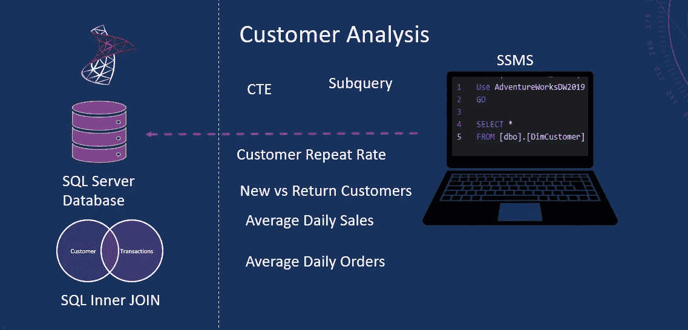

# SQL 系列:使用 SQL 进行客户和销售分析

> 原文：<https://blog.devgenius.io/sql-series-customer-and-sales-analysis-using-sql-c8ce71d29417?source=collection_archive---------1----------------------->



SQL 客户分析

客户和客户行为分析对业务发展至关重要。你应该熟悉你的客户的人口统计和他们的购买模式。这可以帮助你发展你的业务，并保持在股票的需求项目。吸引新客户只是故事的一部分。成功的关键是留住客户。这是一个关键指标，在商业成功中扮演着重要角色。因此，手头有客户保持指标是很重要的。我们将使用 SQL 计算客户保持指标和销售额。

如果你知道一个问题存在，那么解决它就很容易。如果您有明确定义的客户保持指标，那么它可以帮助您确定您的企业是否正在努力保持现有客户。有一个标识新客户和回头客的标志是很有帮助的。使用这个标志，我们可以计算客户保持率。

我们将关注以下关键业务方面。

*   找出有多少顾客进行了单次购买和重复购买。定义新客户与回头客标志？
*   我们的用户重复率是多少？
*   我们平均每天收到多少订单？
*   我们的平均日销售额是多少？

视频教程可以在 YouTube 上找到。

**新老客户 vs 回头客**

客户维系对于任何希望了解其客户的企业来说都至关重要，它可以帮助解释销售数字或营销活动的影响。计算这个指标的第一步是要有一个标识新客户和老客户的标志。或者单次和重复购买的客户。我们可以使用 SQL 计算这个列。我们根据客户的交易对客户进行分组。

```
with customers as (
select
CustomerKey,
ROW_NUMBER() Over (partition by CustomerKey Order by CustomerKey) as rown_number
FROM[dbo].[FactInternetSales] )
```

基于此，我们可以很容易地对新客户和老客户进行分类。我们可以根据“row_number”列进行筛选，当该列大于 1 时，我们将标记该回头客。这些是进行了不止一次购买的客户。类似地，我们可以从“repeat_buyers”中设置过滤器为“row_number <= 1” and we will assume these are the new customers with a single purchase.

```
repeat_buyers as (
select distinct
CustomerKey
FROM customers
where  row_number > 1), single_purchase as (
select distinct
CustomerKey
FROM customers
where  row_number <= 1)
```

Now we have the base to create a flag that identifies new and the repeat customers. We join the above CTE’s on the customer key. “Single_purchase” CTE contains all customers while “repeat_buyers” only includes customers with multiple orders. We check if the *CustomerKey* ，然后我们将“repeat_new”列设置为 repeat，否则，我们将其设置为 new。这给了我们新的 vs 回头客标志。此外，我们使用 count 函数计算客户数量。这显示了新客户和老客户的数量。

```
select
 case
  when r.CustomerKey IS NOT NULL
  then 'repeat'
  else 'new'
 end as repeat_new,
 count(*) as number_of_customer
FROM single_purchase f
left join  repeat_buyers r on f.CustomerKey = r.CustomerKey
group by
 case
  when r.CustomerKey IS NOT NULL
  then 'repeat'
  else 'new'
 end
```

来计算客户的留存率。我们用新客户和回头客数除以总客户数。我们借助于首字母“客户”CTE 的子查询来计算客户总数。这给了我们客户保持率。在这种情况下，保留率为 86.52%，这是非常好的。这是一个很好的指标，表明企业能够留住最大份额的客户，这是一个成功的秘诀。

```
FORMAT(cast(count(*) as decimal(18,2))/cast((select count(distinct customerkey) from customers) as decimal(18,2)), 'P') as repeat rate
```

议事日程上的下一项是检查我们每天收到多少订单。根据这些订单，每天的平均销售额是多少。我们可以从事实表中获得这两个指标。我们定义一个 CTE 来给我们一个唯一的订单数和总销售额。

```
with ave_sales_per_day as (
select OrderDate,
count(distinct SalesOrderNumber) as order_count,
sum(SalesAmount) as Sales
FROM  [dbo].[FactInternetSales]
group by OrderDate)
```

在 CTE 后面的选择中，我们对销售和订单计数列应用了 average 函数。这给了我们每天的平均销售额和平均订单。

```
select
avg(Sales) as avg_sales_day,
avg(order_count) avg_order_count
FROM avg_sales_per_day
```

就这样了，伙计们。我们成功地创建了一个标志来区分新客户和回头客。这反过来帮助我们计算客户保留率。我们计算了每日平均值，以检查每天的业务表现。暂时就这些了。

**结论**

*   我们已经确定并创建了关键业务指标，以帮助确定业务表现如何。
*   我们已经成功地创建了一个新的和回头客标志。
*   我们计算了客户保留率。
*   我们计算了每日平均值，以了解每天的业务表现。
*   完整的代码可以在[这里找到](https://github.com/hnawaz007/pythondataanalysis/tree/main/SQL)