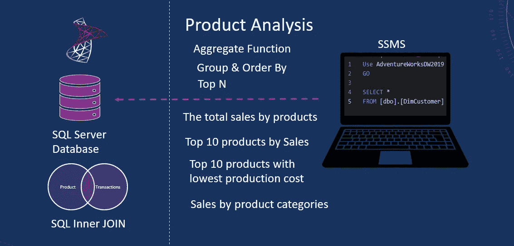
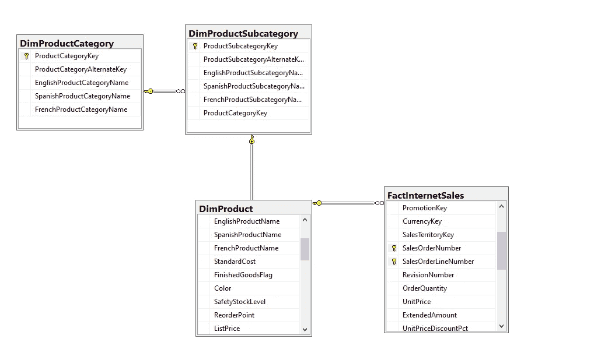

# SQL 系列:使用 SQL 执行产品销售分析|跟踪产品指标和性能

> 原文：<https://blog.devgenius.io/sql-series-perform-product-sales-analysis-using-sql-track-product-metrics-performance-f432358ad108?source=collection_archive---------4----------------------->

**使用 SQL**



使用 SQL 进行产品分析

产品销售分析有助于推动持续改进和增长。当我们分析产品销售数据并有效利用它时，整个团队就为成功做好了准备。分析产品销售数据至关重要，尤其是在提高产品性能和跟踪给定产品的预测时。它帮助我们确定表现最好的产品或功能，以及可能落后的产品或功能。花时间在你的数字上是至关重要的。它让我们能够定期找到提高产品销量的方法。它还能带来更准确的预测，这意味着我们的产品有更合适的规划和目标。

让我们用 *AdventureWorks* 用 SQL 进行产品销售分析。让我们定义几个业务问题来帮助我们分析产品:

*   按产品划分的总销售额。
*   收益好的 10 大产品。
*   生产成本最低的十大产品。
*   不同产品类别之间的销售额差异。

相关视频教程可在 [YouTube](https://www.youtube.com/watch?v=fJpzn8nDCnw) 上找到。

在本练习中，我们将重点关注产品表和销售表。让我们创建一个数据库图表来突出显示我们将使用的表。让我们选择产品表， *DimProduct* ， *DimProductCategory* ， *DimProductSubcategory* 。除了产品，让我们引入 *FactInternetSales* 。这包含我们产品的销售指标。



AdventureWorks 表概述

我们将在分析中加入这些表，以获得业务问题的答案。所以，我们的第一个问题是按产品显示总销售额。这将有助于我们确定每种产品的销售额。所以，我们先从产品表中选择。我们将 *DimProduct* 表连接到 *FactInternetSales* 以获得销售额。我们将利用内部连接，然后在 *ProductKey* 列上连接这些表。

```
Select
	p.EnglishProductName AS product_name,
	SUM(f.SalesAmount) AS sales_amount
from DimProduct p
inner join FactInternetSales f on p.ProductKey = f.ProductKey
Group By p.EnglishProductName
Order by SUM(f.SalesAmount) DESC
```

为了得到一个产品的总销售额，我们使用了一个名为 *SUM* 的聚合函数。聚合函数对一组值执行计算，并返回单个值。当我们使用聚合函数时，我们必须使用 group by。 *GROUP BY* 语句对产品名称行中具有相同值的行进行分组，例如，我们将得到一行“通用自行车架”产品以及销售额值。我们必须在 Group By 中列出没有聚合函数的列。我们使用实际的列名，而不是别名。

我们可以回答第二个问题，对这个查询稍加修改。要获得销售额最高的前十种产品，我们可以使用前十个子句。除此之外，我们还可以指定 order by 子句。我们将按照销售额列以降序对结果集进行排序。下降的关键词是 DESC。让我们运行查询，我们得到销售额最高的前十个产品。

```
Select top 10 
	p.EnglishProductName AS product_name,
	SUM(f.SalesAmount) AS sales_amount
from DimProduct p
inner join FactInternetSales f on p.ProductKey = f.ProductKey
Group By p.EnglishProductName
Order by SUM(f.SalesAmount) DESC
```

接下来是生产成本最低的十大产品。因此，我们可以保持该查询打开，并将销售额列与总产品成本交换。在这种情况下，我们需要成本最低的产品。因此，我们将使用关键字 ASC 按升序对 totalproductcost 查询进行排序

```
Select top 10 
	p.EnglishProductName AS product_name,
	SUM(f.TotalProductCost) AS sales_amount
from DimProduct p
inner join FactInternetSales f on p.ProductKey = f.ProductKey
Group By p.EnglishProductName
Order by SUM(f.TotalProductCost) ASC
```

这个查询给出了产品成本最低的前十种产品。

对于下一个问题，我们将从产品转移到类别表。这是一个高层次的产品分组。因此，我们将获得销售的高级视图。如果你在 BI 工具中制作一个可视化的东西，那么它将是一个完美的候选。不管怎样，让我们添加产品子类别表。你可能会说，等等，我们正试图按产品类别显示销售额，那么我们为什么要添加子类别表呢？这是一个合理的问题。但是,“产品”表连接到“产品”子类别，而“子类别”表连接到类别。因此，我们在 *ProductSubCategoryKey* 上连接产品表。然后，我们将产品类别表加入到 *ProductCategory* 键的子类别中。我们已经有了 FactInternetSales*T5。因此，我们将销售额列带回来。让我们删除*前十个*子句，通过*子句固定*顺序，并使其降序排列。*

```
Select 
	pc.EnglishProductCategoryName AS product_category,
        SUM(f.SalesAmount) AS total_sales
From DimProduct p
inner join DimProductSubcategory ps on p.ProductSubcategoryKey = ps.ProductSubcategoryKey
inner join DimProductCategory pc on ps.ProductCategoryKey = pc.ProductCategoryKey
inner join FactInternetSales f on f.ProductKey = p.ProductKey
Group by pc.EnglishProductCategoryName
Order by SUM(f.SalesAmount) DESC
```

就这样了，伙计们。我们已经成功地回答了业务问题，并使用 SQL 进行了产品销售分析。我们按产品计算了销售额，并展示了表现最佳的产品。此外，我们以最低的生产成本提供顶级产品。最后，我们探讨了产品类别的表现。暂时就这些了。

**结论**

*   我们使用 SQL 计算了产品的总销售额。
*   我们已经成功地展示了销售额最高、生产成本最低的产品。
*   我们计算了不同产品类别的销售额。
*   完整的代码可以在[这里](https://github.com/hnawaz007/pythondataanalysis/blob/main/SQL/Product%20Analysis%20using%20SQL.md)找到