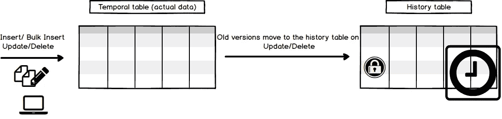
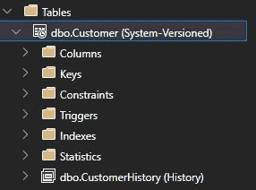
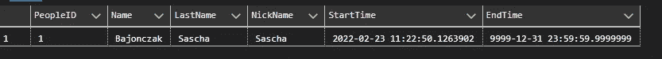
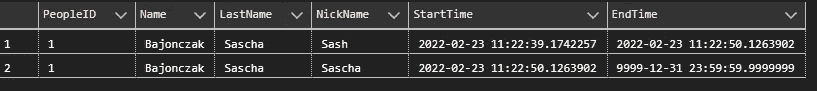
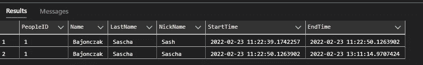
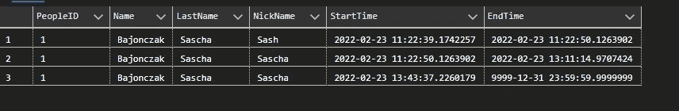
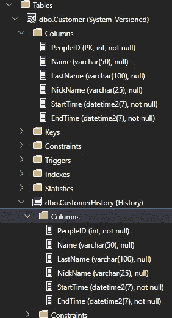
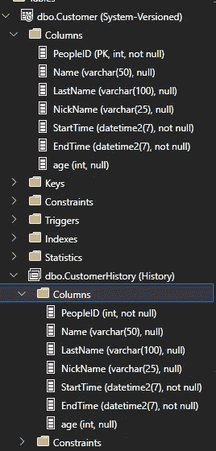

# SQL-Server 使用时态表自动审计数据

> 原文：<https://blog.devgenius.io/sql-server-automatically-auditing-data-with-temporal-tables-3e4fcd7468f5?source=collection_archive---------4----------------------->

处理历史数据很难维护。幸运的是，SQL Server 现在包含了一个自动存储历史数据的功能。这个特性被称为“时态表”。

这个特性可以看作是一个表，它存储了数据条目本身的每个状态，以及它活动时的给定时间跨度。审计数据将存储在一个单独的表中。



# 有什么要求

每个时态表必须有两个`datetime2`列。每当发生变化时，它们将用于记录每一行的有效期。

然后你必须定义一个表来存储最新的数据到一个`HistoryTable`为此，存在一个语句`on(HISTORY_TABLE={mytable})`。

# 展示脚本

让我们假设您有下面的表定义

这将定义默认的表结构，如 name 和 lastname 等等。然后在这之后，将创建两个日期时间列`StartTime` 和`EndTime`。

要定义该列用于有效期，必须使用`PERIOD FPR SYSTEM_TIME (startcol,endcol)`定义。您可以选择使用`ON(HISTORY_TABLE ={yourcustomtablename})`来定义创建的历史表。如果不这样做，将使用源表并在名称中添加时间戳。

我们的例子看起来像这样:



e

搞定了。您可以像正常方式一样使用该表，SQL Server 会自动将更改审计到历史表中。

# 使用表格

如果我执行这些命令

```
INSERT INTO dbo.Customer (PeopleID,Name,LastName,NickName) VALUES (1,'Bajonczak','Sascha','Sash')update Customer set Nickname ='Sascha' where PeopleID=1
```

它通常会在数据库中创建一个条目，然后昵称值会被更新。

当我们选择 Customer 表时，我们将只得到单个条目。



注意 StartTime 和 EndTime 的值，您将看到 StartTime 被设置为命令执行时的时间。结束时间将是 9999 年的值。这表明这是一个最新值。您可以在查看昵称字段时看到这一点

现在，让我们只查询历史表。当然，您现在可以选择 CustomerHistory 表本身，但是在应用程序中，您不能告诉 ORM mapper 何时使用哪个表。因此，SQL Server 提供了开箱即用的支持，可以同时查询这两个表。

然后，您将获得以下结果



您可以使用`FOR SYSTEM_TIME ALL` 子句获取所有历史值，而不是使用 between 子句。Between 仅选择两个时间戳之间的值。

因此，您现在可以看到数据行按时间顺序的变化。

请查看开始时间和结束时间列。您会注意到，一列来自常规表，另一列是旧的一列。

不，让我们删除该条目

```
delete from customers where Peopleid=1
```

像上面这样查询表格后，您将得到以下结果



之前结果的主要区别是最后一行中的 EndTime 值。将从删除命令的执行时间开始设置时间戳。

# 如何回滚上一次更改

在大多数情况下，您必须回滚一个数据条目，为此，您可以创建一个这样的数据库过程

现在，您可以像这样执行过程

```
sp_RepairRecord 1
```

这将修复 Id 为 1 的数据行。因此它将恢复最后一个 delete 语句，并将值重新插入到表中。使用上面的命令再次查询表后，您将看到这个更改集



最后一个元素是最近重新创建(回滚)的元素。因此，您会看到回滚并没有删除最后一个历史元素，因为删除是经过审计的，并且您不能修改历史表本身。然后，它在表中创建新条目，您将审计每个更改。

# 处理表格更改

有时，您会更改数据表结构，那么表和历史表会发生什么变化呢？

实际上，它会看起来像这样



历史表是主表的精确副本。现在让我们假设我们添加了一个名为`age.`的新列

```
alter table customer add age int null default(null)
```

现在让我们看看它的结构



嘭！新列现在也将被添加到历史表中。因此，平板电脑结构的更改也会自动应用到历史记录表中。删除列或更改数据类型时也会发生这种情况。

# 限制

有哪些考虑和限制？

*   INSERT 和 UPDATE 语句不能引用 SYSTEM_TIME period 列。将值直接插入这些列的尝试将被阻止。
*   当 SYSTEM_VERSIONING 打开时，不支持截断表
*   当前表上不允许使用 ON DELETE CASCADE 和 ON UPDATE CASCADE。换句话说，当时态表引用外键关系中的表(对应于 sys.foreign_keys 中的 *parent_object_id* )时，不允许级联选项。要解决此限制，请使用应用程序逻辑或 after 触发器来维护主键表中删除操作的一致性(对应于 sys.foreign_keys 中的 *referenced_object_id* )。如果主键表是时态的，而引用表是非时态的，则没有这种限制。
*   不允许在当前表或历史表上使用 INSTEAD OF 触发器，以避免 DML 逻辑失效。AFTER 触发器只允许在当前表上使用。它们在历史表上被阻止，以避免使 DML 逻辑无效。
*   复制技术的使用是有限的

# 最后的想法

因此，对于 SQL server 中的审计数据，时态表将是一个很好的解决方案。对于数据的每次更改，您都有系统定义的日志支持。此外，您还可以使用工具来查询历史数据，并利用回滚单个版本的优势。另一方面，它非常新，仅在 SQL Server 2016+上受支持，而不是任何旧版本。接下来你就不能再快速截断数据了，因为这是无法审计的。最后，你必须自己决定是否使用它。目前，实体框架支持现成的时态表，因此您可以为此使用 ORM 映射器。

```
**Want to Connect?**Say Hello on: [LinkedIn](https://www.linkedin.com/in/sascha-peter-bajonczak-32a17a2a/), [GitHub](https://github.com/sbajonczak), and [Blog](https://blog.bajonczak.com/).
```