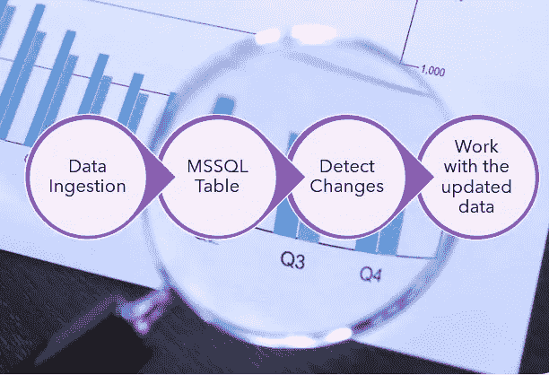
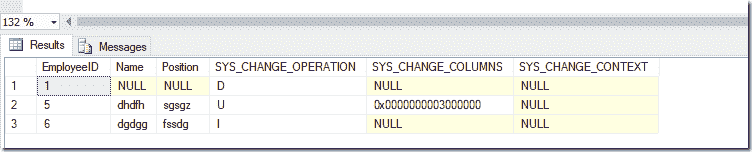
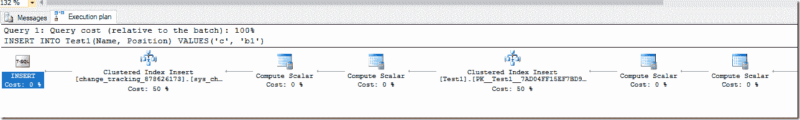
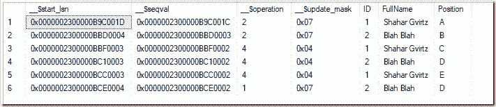
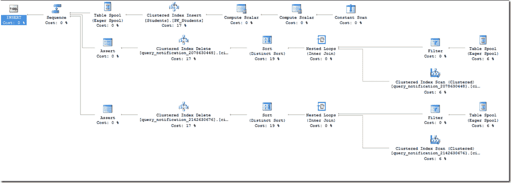

# SQL Server:不同更改跟踪方法概述

> 原文：<https://blog.devgenius.io/sql-server-overview-of-different-methods-for-change-tracking-69b168dc489a?source=collection_archive---------2----------------------->

开发人员和 DBA 通常需要设计一个解决方案来解决以下问题:有一个应用程序需要从 SQL Server 接收新的/更新的数据。这种需求可能会出现在很多场景中:需要接收最近更改的数据的 ETL 过程，等待新信息开始某个工作流的应用程序，等等。

通用 ETL 管道

当 SQL Server 是“事实的来源”时，很多时候，人们想到的直接解决方案是找到一种方法，将新数据从 MSSQL“分发”到需要它的其他应用程序。很多时候，这种解决方案是为了解决原始设计中的缺陷，原始设计中没有可用于通知其他服务应用程序中的事件的可扩展数据管道。

其他时候，这是策略的一部分，利用数据库作为最终的事实来源，而不是定义不同服务之间的契约(或使用消息代理，如 RabbitMQ 或 Kafka ),使用数据库本身作为信息的公共接口。

在本文中，我将介绍在 Microsoft SQL Server 数据库上实现变更跟踪的可用选项。我将回顾一些方法，并讨论每种方法的优缺点。

这篇文章不是关于 ETL 产品的。许多 ETL 产品可以用来实现这些方法(NiFi、SSIS、Informatica 等)。).这些产品通常基于我将在本文中介绍的概念之一。

当然，像任何其他设计问题一样，每种方法都有其优点和缺点，没有一种解决方案完全符合所有的要求。

# 爬行

我们的第一个方法很简单:对相关的表执行定期轮询，并询问“自从我上次轮询以来发生了什么变化”。通常，这将涉及跟踪一些列，并总是查询比我们已经有的值更大的值(并保持我们迄今为止看到的最新值的一些状态)。例如，如果我们想要跟踪“Id”列(假设它是自动递增的 int)，我们将总是选择 Id 大于我们在上一次运行中看到的 Id 的所有行。在完成数据处理后，我们将存储我们在这次迭代中看到的最高 Id，并在下次使用它作为我们的新基线。

## 要跟踪哪些列？

我们有几个共同的选择。如果我们只对新行(而不是更新的行)感兴趣，我们通常会跟踪以下内容之一:

*   **自动递增数字 Id 列**:很多时候它是我们的主键值，通常是一个标识列。在这种情况下，我们将存储(通常在不同的状态表或状态文件中)我们看到的最后一个 Id，并选择所有比它大的 Id。
    当然，当我们只关心新行时，这种方法很有效。这个方法无助于获取关于更新行的信息。
*   **“datetime created”列**(带有创建行的日期和时间):如果我们保存了创建行的日期和时间，我们就可以使用该值进行“爬行”。在这种情况下，我们将在状态表中保存开始从表中选择新数据的日期和时间。
    当然，我们需要考虑时间同步:我们需要确保应用程序使用的时间和我们的“爬虫进程”使用的时间之间没有时区差异。我们还需要考虑表中的值是何时创建的。例如，如果值是在应用程序中(而不是在数据库中)生成的，我们可能会由于竞争条件(crawler 进程和新插入的值之间)或由于两个时钟之间的时间差(假设时钟同步是不正确的)而丢失行。
    只有当时间是在数据库中生成的，或者如果我们采取一些“安全间隙”并选择我们可能已经选择的行(然后使用我们保存的一些状态过滤掉这些行)，我们才能安全地使用这种方法。

如何在这些选项中做出选择？如果其中一列(Id / RowDateCreated)是表的聚集索引的键列，那么最好使用它。这将帮助我们获得更好的性能，因为对范围查询使用聚集索引是最有效的方式(我们节省了键查找的额外成本)。如果我们使用聚集索引，那么选择新行将是一个非常廉价的操作，对性能没有任何影响。

当然，很多时候我们也想知道更新(以及删除，如果我们使用软删除技术，而不是实际的删除。我将在本文后面讨论实际的删除)。
我之前描述的专栏无助于了解更新，但是我们可以使用一组不同的专栏:

*   **DateTimeUpdated 列，包括行更新的日期和时间:**只有当我们有这个列时才相关，应用程序在每次更新时都会更新它。就个人而言，如果没有这样的专栏，我不会创建它并添加一个触发器来更新它。
    重要的是要记住，前面讨论的关于日期时间值以及如果使用不当会如何导致数据丢失的所有要点在这里也是相关的。
*   **Rowversion 列:**SQL Server 数据类型之一是 [rowversion](https://docs.microsoft.com/en-us/sql/t-sql/data-types/rowversion-transact-sql?view=sql-server-ver15) (又名时间戳)。每次对表进行更改时，rowversion 列都会自动更新，因此，如果我们更新了一个值(或添加了一个新值)，rowversion 值将比我们以前在该表中看到的任何 rowversion 数据都大。我们可以将 rowversion 值存储在状态表中，作为一个 varbinary(8)列，并跟踪比我们目前看到的最大 rowversion 值更大的值。

哪个选项更好？在这里，这比检测新行要稍微复杂一些。如果我们的表被频繁地更新，我们在这些列上创建的每个非聚集索引都将遭受严重的碎片问题。在频繁更新的表中，这可能会导致严重的性能问题。当然，强烈建议不要将这些列中的任何一列用作聚集索引键，这也意味着我们的执行计划还将涉及对每一行的键查找操作，以从聚集索引中获取所有值(如果我们在这些列上有非聚集索引)。

## 时态表

从 SQL Server 2016 开始，我们有了[个时态表](https://docs.microsoft.com/en-us/sql/relational-databases/tables/temporal-tables?view=sql-server-ver15)。如果我们要检查更新的表是一个时态表，我们可以结合使用这两种方法:使用表上的 Id / DateTimeCreated 列来获取新行，并通过搜索历史表来跟踪更新的行(在 SysEndTime 列上添加索引之后)。
我们通过搜索时态表得到的行将是旧版本(也就是说，在更新/删除过程中被替换的值)。但是，通过使用历史表中的主键，我们可以查询主表并获得更新的信息。
就我个人而言，我不会将一个非时态表变成一个时态表，但是如果它已经被定义为一个时态表，那么跟踪更新/删除也是一个不错的技巧。

# 性能考虑因素

对表进行“爬网”基本上就是从 SQL Server 数据库中不断轮询。也就是说，要知道发生了变化，我们需要运行查询来获得最新的变化。
根据经验，基于投票的方法通常是有问题的。它们通常涉及更高的性能成本。这是因为我们的表上有“忙等待”(因为如果没有非常频繁的更改，大多数时候我们的轮询查询将不会返回任何结果)。

但是，因为“爬行”方法易于实现，所以有时即使考虑到所涉及的成本，也选择它。

以下是一些经验法则，可以帮助您降低这种轮询对性能的影响:

*   **仔细选择运行跟踪查询的频率**:如果使用数据的服务需要获得更新，在你的业务案例中，每几个小时才更新一次——每秒执行两次轮询查询没有意义。
*   **确保您只运行廉价的查询:**轮询查询的性能成本应该是最小的，如果您非常频繁地运行这个查询，这一点甚至更重要。避免涉及大量 I/O 操作、并行性、假脱机等的查询。
*   **避免复杂的查询:**如上所述，为了确保你的爬行查询是廉价的，在那些查询中避免复杂的逻辑。该查询基本上应该类似于 SELET TOP X FROM Tbl WHERE ID><number>(在该示例中，当 ID 列上至少有一个惟一的非聚集索引时)。
    如果比这更复杂，您可能会遇到性能问题(如果不是现在，那么就是将来)。即使您向其发送数据的服务需要获得聚合数据，这个“爬行”查询也不适合这样做。
    即使你的非常复杂的查询现在运行得完美而快速，也不要指望它。未来稍有不同的执行计划可能会极大地改变这种情况，最终您将在一个循环中运行大量查询。
*   **想一想当你没有新数据时会发生什么:**如果你的查询包含 WHERE 谓词，它只选择符合某些标准的数据，但是对于小时/天/周没有符合这些标准的新行——你可能会发现自己的查询随着时间的推移变得越来越复杂，因为你没有在跟踪表中更新一个新的更大的 ID 作为起点(例如)。因此，您必须考虑如果没有新行会发生什么，以及它会如何影响查询的复杂性。
*   **考虑将轮询转移到 MSSQL 端:**想象一个非常标准的场景，其中有一个执行爬行的应用程序。一个简单的实现是使用一个带有 while(true)循环的线程，在每次迭代中从 MSSQL 中选择新数据。如果没有新行，它就开始该循环的另一次迭代。
    这种实现的缺点是最坏的情况:您在 MSSQL 端执行轮询查询，但在应用程序端也有忙等待。一个可能的解决方案是将一些轮询移到 MSSQL 端，如下所示:

*   这里有趣的部分是，如果没有新行(这可能是最常见的情况)，我们只需使用 WAITFOR 调用在 MSSQL 端“休眠”500ms，然后重试并检查是否有新行。如果 10 秒钟内没有新行，我们就完成查询，并进入应用程序端的另一个迭代。这种方法有利也有弊。主要的问题是，我们与 MSSQL 的连接持续了更长的时间，实际上我们做了更多的操作(在实际获取行之前，首先检查是否存在)。但是，仍然有一些非常重要的好处:
*   这里的额外开销非常小，尤其是如果您在表上有适当的索引(只对 EXISTS 进行查找操作)。
*   每次循环从应用程序端“更新”连接的成本可能很高，因为它涉及网络 I/O 开销(不仅仅是一次旅行)来执行运行查询所需的所有操作:从连接池中重置连接、执行查询以及获取结果。在这个建议的方法中，我们通过将一些忙等待移到 MSSQL 端来减少一些开销。
*   我们正在增加应用程序端的吞吐量。如果应用程序是使用异步 IO 编写的，我们不会“花费”CPU 时间和线程池线程来完成我们的忙等待所需的所有与 CPU 相关的操作。
*   **Us**[**e Read Committed Snapshot Isolation**](https://docs.microsoft.com/en-us/dotnet/framework/data/adonet/sql/snapshot-isolation-in-sql-server)避免因这种轮询查询而导致的读写方争用
*   **分批工作:**确保在查询中使用 TOP 来限制结果的数量，这样每个查询的成本和时间将更具确定性。

# 扳机

我猜任何 DBA 都知道什么是触发器。对于那些不熟悉的人来说，触发器让我们编写代码来响应 DB 上的不同事件。这可以是在更改服务器/模式对象后运行的 DDL 触发器，也可以是在数据操作(插入/更新/删除)操作后(或代替数据操作)运行的 DML 触发器。

使用触发器有一些您应该知道的属性:

*   触发器代码成为每个查询执行和每个事务不可或缺的一部分。这意味着，如果触发代码失败，事务将回滚。
*   触发器是事务的一部分，这意味着 DML 操作不会返回，直到触发器完成运行。也就是说，如果你的触发器很慢，你所有的 DML 操作都会变慢。
*   调试和发现由触发器引起的性能问题更加困难，因为它们不是查询的一部分，有时您可能会错过它们。
*   触发器不一定要运行:在某些情况下(例如，使用 BULK INSERT ),触发器是可选的(默认情况下不会运行)。

因此，在我们对触发器及其属性有了更多的了解之后，我们可以使用它作为一种机制来接收新查询的通知。

我们有不同的选择:

*   作为触发器的一部分执行我们的操作。也就是说，如果我们有一个在数据更改后想要执行的流程，我们可以在触发器中执行。很多时候这是一个坏主意，因为很多时候这意味着我们正在减慢我们在基表上进行的每个操作(即使我们为之进行所有这些操作的服务实际上需要最终一致性承诺，并且不是事务本身的一部分)。
*   将关于变更的信息添加到不同的表中:我们可以有一个不同的表，用作某种审计日志，记录所有发生的变更。在触发器中，我们可以用受影响行的主键值向该表插入新记录。这种方法与前面在原始表上描述的“爬行”方法相比并没有真正的好处。在这个方法中，我们无论如何都必须对审计表执行爬行方法，因此我们可以节省触发器的额外开销，只对原始表执行爬行。
*   使用 SQL CLR 将有关更改的信息写入消息代理(例如 RabbitMQ / Kafka):使用消息代理进行服务间的异步通信是一种很好的模式，但是从触发器写入代理并不是最好的方式。如果更改首先被写入消息代理，然后由每个需要它们的应用程序使用(如果需要的话，由一些将数据接收到数据库的服务使用)，那就更好了。
*   我们可以使用 [SQL Server 服务代理](https://docs.microsoft.com/en-us/sql/database-engine/configure-windows/sql-server-service-broker?view=sql-server-ver15)并从触发器代码中写入代理。我不推荐使用 SQL Service Broker。它与其他替代方案相比没有优势(除了它与 MSSQL 集成在一起)。但是，在这种情况下(通知其他服务 MSSQL 中发生的变化)，它可能是一个很好的选择。
    我还推荐看一看一个名为 [SqlTableDependency](https://github.com/christiandelbianco/monitor-table-change-with-sqltabledependency) 的开源项目，它提供了一个很好的触发器包装器 MSSQL service broker，并以一种基于事件的方式为您提供了一种从 MSSQL 代码中获取变更通知的简单方法。

管道性能在很大程度上取决于所选的解决方案。
如果我们选择拥有自己的审计表并在该表上使用爬行，我们将有额外的开销，从我们的触发器代码一行一行地写入这个审计表。
另一方面，如果我们选择使用外部消息代理，除了写入该代理的开销之外，我们还会有 SQL CLR 的开销。
写入 SQL Server Service Broker 的性能取决于各种因素，您可以在这里阅读关于[的内容。](https://docs.microsoft.com/en-us/previous-versions/sql/sql-server-2008/dd576261(v=sql.100)?redirectedfrom=MSDN)

就个人而言，由于基表上的每个 CRUD(插入/更新/删除)操作都有额外的开销，因此我不建议为此使用触发器。

# 变更跟踪和变更数据捕获

我想讨论的下两个选项是变更跟踪(又名 CT)和变更数据捕获(又名 CDC)。这两者的存在正是为了这个目的:允许您执行一个查询来回答“自从我上次检查以来，数据库中发生了什么变化”

更改跟踪成本更低(性能方面)，并且可以告诉我们哪些行已经更改(以及可选的哪些列)。它记录了发生变化的事实，但不是变化本身。我们将获得相关行的主键，然后使用 JOIN 检索整行。我们将只获得行的当前状态(因此，如果有 10 个更改，我们将知道有 10 个更改，但是我们只能获得行的当前状态)。
Change Data Capture 允许我们获得自上次查询以来行的任何状态(也就是说，如果行在两次查询之间更改了 10 次，我们将能够知道每次更改后的值)。

在这两种方法中，我们将使用轮询查询来获取信息。

## 更改跟踪

要启用变更跟踪，我们必须首先在数据库范围内启用它，然后在表范围内启用它。

之后，我们必须为每个表存储一个 bigint 值，指示我们看到的这个表的最后版本(这个数字在 DB 级别上是增加的，但是我们每次查询每个表的更改时都要使用它——所以我们必须存储每个表的最后版本号)。所以，基本流程大概是这样的:

1.  从状态表中选择我们看到的、要对其进行更改的表的最后版本号。让我们称这个数字为 x。
2.  获取当前版本号(使用函数 CHANGE _ TRACKING _ CURRENT _ VERSION)。我们称这个数字为 y。
3.  获取自版本 X 以来我们正在跟踪的表的更改
4.  做任何我们想做的改变
5.  用 y 更新“State”表中的相关行(包含最新版本号的行)

下面是一个代码示例(Test1 是我们跟踪的表，VersionTracking 是我们的状态表):

这是结果的一个例子:

更改跟踪:结果示例

请注意，在删除行的情况下(EmployeeID == 1)，我们显然没有该行的任何值(因为它已被删除)。还要记住，如果一行被修改了不止一次，我们将只能看到最新的版本。

变更跟踪还包括垃圾收集，以删除历史(基于我们决定的保留)。它还支持给出丢失更新的指示(例如，如果我们请求更改已经有一段时间了，而在此期间，垃圾收集已经清理了一些数据)。

请记住，这是一种基于轮询的方法，类似于上面描述的“爬行”方法，因此关于轮询的所有提示和信息也与这种方法相关。

如果您想知道变更跟踪是如何工作的，它基本上是使用一种类似触发器的机制将关于每个变更的信息添加到一个隐藏的审计表中。这可以在 INSERT query 的执行计划中清楚地看到:

启用了更改跟踪的表中 INSERT 语句的执行计划

## 变更数据捕获

变更跟踪真的很好，但是有时知道发生了变更是不够的，但是我们需要知道在我们每次请求增量之间发生的任何变更。如果是这种情况，我们可以使用变更数据捕获。

## 疾控中心是如何运作的？

CDC 为应用于表的每个 CDC 实例保存一个“更改表”。也就是说，从我们在一个表上打开 CDC 开始，就有一个进程在不同的表上运行并保存每个更改(包括更改的内容，而不仅仅是主键，这与更改跟踪不同)。

为了最小化性能影响，同时屏蔽这个更加异步的过程(因此表上的 CRUD 操作不会受到影响)，可以通过定期读取事务日志、提取关于启用 CDC 的表的相关信息，并将这些数据保存在相关的更改表中来完成。
读取事务日志和提取相关信息的进程以及管理数据保留的进程都是使用 SQL Server 代理作业运行的。

这一切对于那些曾经使用过事务复制的人来说都是非常熟悉的。这是因为 CDC 和事务复制日志读取器都使用相同的内部过程“解析”事务日志并提取相关的更改。

## 如何在表上设置变更数据捕获？

首先，我们必须在数据库级别上启用它，然后在桌面上启用。在下面的示例中，我们将在名为 test4 的 DB 上，在名为 TestCDC 的表上启用 CDC:

请注意以下参数:

*   capture_instance:我们可以给这个 CDC 实例一个特定的名称。一个表最多可以有两个实例。
*   support_net_changes:决定我们是否要将多个变更统一成一次变更。因此，如果我们要求对同一行进行 10 次更改，我们是希望获得所有 10 次更改，还是只获得这次的最后一次更改。
*   你可以阅读[文档](https://docs.microsoft.com/en-us/sql/relational-databases/system-stored-procedures/sys-sp-cdc-enable-table-transact-sql)获得关于所有参数的完整解释。

## 疾控中心:如何查询变更？

CDC 也是基于投票的。这里，我们跟踪的参数(我们的状态)是 LSN(日志序列号，每个事务日志记录的标识符)。我们可以查询两个 LSN 之间发生的每个变化。

这里，我们的“State”表通常有两列:InstanceName (varchar(250))和 LastLSN (binary(10))。要查询更改，我们将使用如下代码:

该查询的结果将类似于以下内容:

更改数据捕获(CDC)查询结果

我们可以知道导致新版本创建的确切操作(2== new row，4 == update，1== delete)并看到更改的值。要从 update_mask 中获取受影响的列，我们可以使用[fn _ CDC _ has _ column _ changed](https://docs.microsoft.com/en-us/sql/relational-databases/system-functions/sys-fn-cdc-has-column-changed-transact-sql)函数。也可以直接查询变更表。

使用 CDC 时，运行轮询查询以足够频繁地获取更改，以避免由于保留而导致的数据丢失，这一点很重要。

## CDC:性能考虑

*   在数据库上启用 CDC 后，在 CDC 进程完成之前，事务日志记录不会被删除(即使在简单恢复模式下)。如果日志截断因 CDC 而延迟，sys.databases 中的 log_reuse_wait_desc 列将显示复制。这意味着事务日志可能需要更多的空间，尤其是当您加载大量数据时。
*   启用 CDC 后，所有操作都将被完整记录(即使在简单/大容量日志恢复模式下，也不会有最小日志记录)。这意味着，将会有更多的事务日志写入，大量数据加载操作可能会变得更慢。发生这种情况是因为最小日志记录意味着相关操作的日志记录只记录页面分配信息，而为了使 CDC 正常工作，需要完整的数据值。
*   每个事务都涉及将更改写入“更改表”。所以，会有重复写。
*   CDC 是一个异步过程。但是，在运行时，它仍然会增加负载(IO 用于读取事务日志，CPU 用于处理数据，IO 用于将数据写入更改表)。
*   如果数据库繁忙，CDC 可能会出现明显的延迟。也就是说，CDC 表上的轮询查询将在实际发生后很久才得到更改。当服务器非常忙，而 CDC 跟不上变化时，就会发生这种情况。如果您的数据库不断加载或更改大量数据，CDC 可能不是您的最佳解决方案。
*   关于轮询的相同注意事项在这里也是相关的。
*   捕获作业会导致更改表上的锁和模式锁。这可能会影响数据库的整体性能，尤其是在运行大量索引维护作业的情况下(在大型数据库上)。
*   在使用 CDC 之前，强烈推荐阅读这篇关于微软制定的性能基准的[文章](https://technet.microsoft.com/en-us/library/dd266396(v=sql.100).aspx)。

## 关于 CDC 的一般说明

*   在捕获实例被重新创建之前，模式改变是不可用的，正如这里的[所解释的](https://www.mssqltips.com/sqlservertip/4096/understanding-how-dml-and-ddl-changes-impact-change-data-capture-in-sql-server/)。
*   从 CDC 获取数据时，检查我们是否因数据保留而丢失数据非常重要。我们可以通过将它与最小 lsn 进行比较来做到这一点。
*   CDC 要求运行 SQL Server 代理

# 查询通知

到目前为止，我们主要看到了基于轮询的方法。现在，我们将探索一种基于推送的解决方案—查询通知。它是一种集成到 MSSQL 和 ODBC 驱动程序中的机制，允许您执行以下操作:运行标准的 SELECT 语句，并获得结果。但是，除了初始结果之外，如果再次查询，结果集随时都会发生变化——我们将获得关于它的更新，再次运行查询，并获得更新的结果。

下面是一个 C#代码示例:

我们正在使用 [SqlDependency](https://msdn.microsoft.com/en-us/library/ms224872(v=vs.110).aspx) 对象，它实现了本文 e[中定义的契约，并让我们拥有来自 ADO.NET 的查询通知。](https://docs.microsoft.com/en-us/sql/relational-databases/native-client/features/working-with-query-notifications)

查询通知 d [不支持各种查询](https://msdn.microsoft.com/library/ms181122.aspx)。如果查询不能与查询通知一起使用，OnChanged 事件将被立即触发(不管对查询的任何更改)。

当我们使用查询通知时，查询中涉及的任何表都会得到某种“隐藏触发器”(实际上不是触发器，只是不同的机制)。通过检查对一个表(学生)的简单插入查询的执行计划，我们可以看到一个正在运行的查询通知:

查询通知:对当前运行的查询通知中涉及的表执行 INSERT 语句的执行计划

在应用程序端，应用程序实际上使用 SQL Server Service Broker 的 RECEIVE 命令，等待指示发生了更改并影响查询结果的更新。

因此，查询通知的流程如下所示:

1.  作为从应用程序端运行相关查询的结果，查询通知在 DB 级别初始化。
2.  对于表中的每个 CRUD 操作，都会向 service broker 写入一个通知。
3.  应用程序等待来自服务代理的通知
4.  当收到这样的通知时，应用程序知道发生了一些变化，并再次运行查询以获得更新的结果集。

使用一个查询通知可能不会显著影响您的性能，但是如果您计划使用多个查询通知，您应该检查对 CRUD 操作的性能影响。

# 改变您的数据管道设计

我之前讨论的所有方法都基于这样的假设，即 SQL Server 必须是事实的来源，也是数据管道中其他服务的更新来源。

我们已经讨论了许多方法，但是所有这些方法都有一个共同点:它们的伸缩性不好。其中许多方法非常适合小型表或大型“冷”表，但是当处理有大量更改(数据加载或更新)的表时，这些方法可能不是最佳解决方案。

这是因为所有的“内置”方法(CDC、CT、查询通知)大多是为数据库设计的，只有少量的更改，而其他方法(如爬行)不是内置的，所以它们需要额外的开销来管理它们，并确保它们都按预期工作(或为此使用外部工具)。

我的建议是，在处理大规模数据时，确保您的数据管道不依赖于 MSSQL 来更新其他来源的数据更改。

通常，对于将数据分发给不同消费者是主要需求的场景，我建议使用消息代理，比如 Kafka，作为事件中心，让不同的消费者根据他们的需求使用数据。例如，这些消费者之一可以是将数据写入数据库本身的消费者。

当然，这种方法有它自己的挑战(和解决方案)——但是这超出了本文的范围。

# 关闭

在这篇文章中，我们介绍了检测 MSSQL 表变化的不同方法，通常是为了将它分发给其他应用程序。

我们讨论了:

*   “爬行”表格
*   使用触发器
*   更改跟踪
*   变更数据捕获
*   查询通知
*   改变数据管道设计