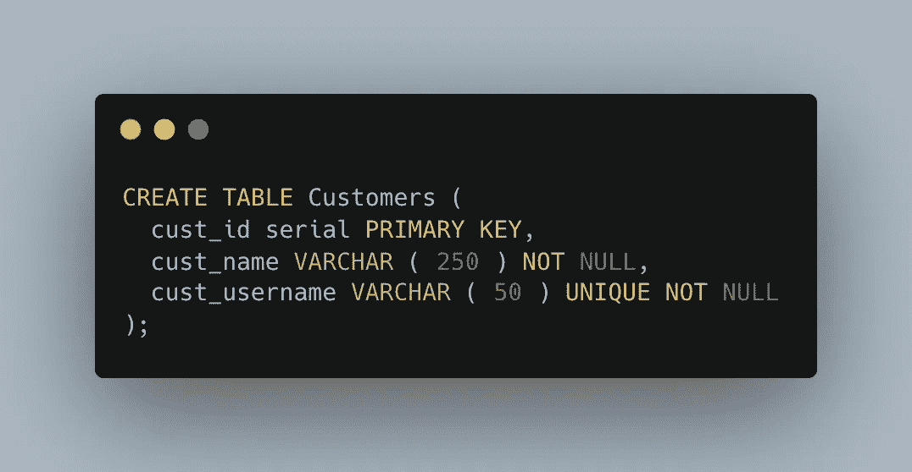
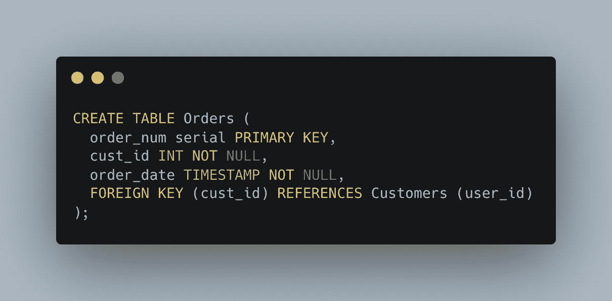
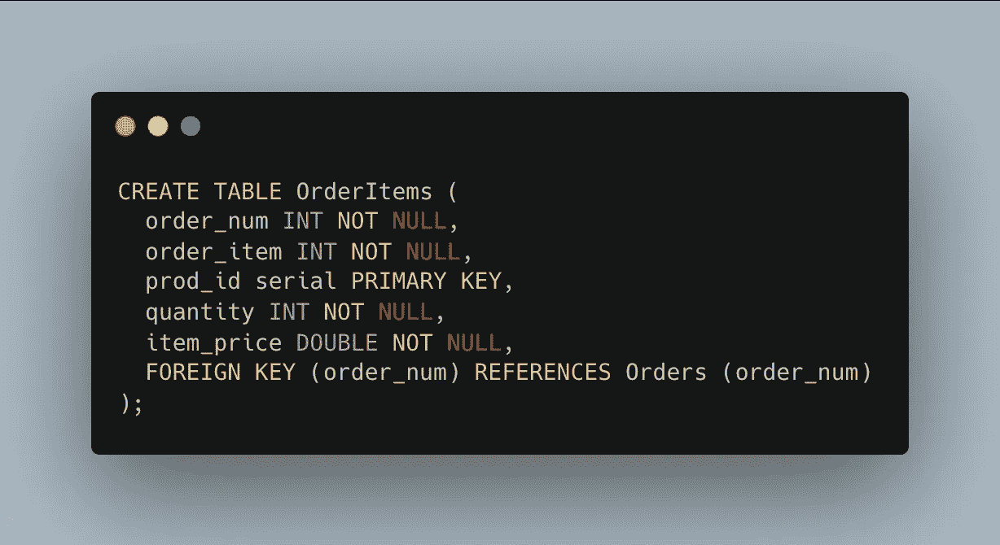
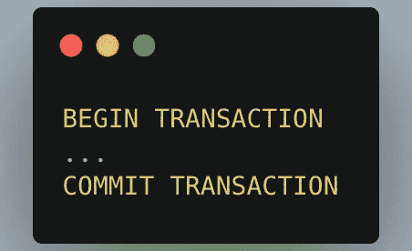
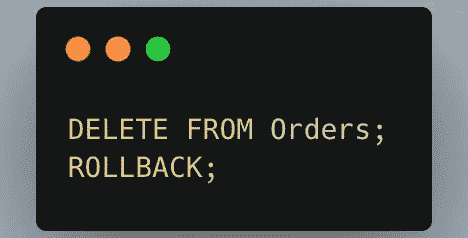
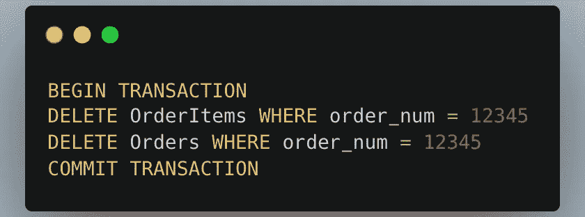
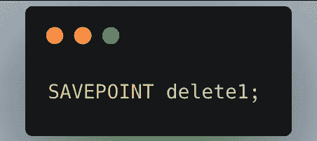
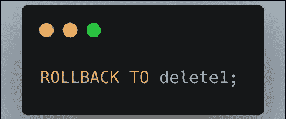
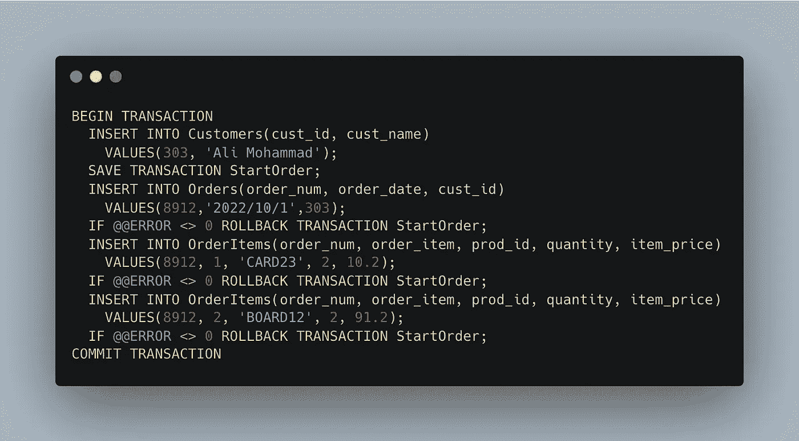

# SQL 事务软介绍

> 原文：<https://blog.devgenius.io/sql-transactions-150b99fafc14?source=collection_archive---------5----------------------->

在本文中，我们将探讨 SQL 事务的基础知识。

## 🤔首先，什么是事务处理？

通过确保批量 SQL 操作完全运行或根本不运行，事务处理用于保持数据库的完整性。

在继续之前，让我们假设我们有一个电子商务系统，其中有两个订单表(orders、OrderItems)和一个客户表。

客户表

订单表

订单项目表

订单表就是一个很好的例子。订单保存在两个表中:Orders 跟踪实际订单，而 OrderItems 跟踪订购的特定项目。使用称为主键的唯一 id，这两个表相互连接。这些表链接到包含客户和产品数据的其他表。

向系统添加订单涉及以下步骤:

1.  验证数据库，查看客户是否已经在那里。如果没有，请添加该人。
2.  获取客户的 ID。
3.  应该在 Orders 表中添加一行，将其链接到客户 ID。
4.  从 Orders 表中获取新分配的订单 ID。
5.  对于订购的每项商品，向 OrderItems 表添加一行，并使用检索到的 ID 将其链接到 Orders 表(通过产品 ID 链接到 Products 表)。

## 🥸什么是**交易处理**

*事务处理*是一种管理必须成组执行的 SQL 操作集的方法，确保数据库不会存储不完整操作的结果。使用事务处理，您可以确保操作集不会在过程中间停止处理；相反，它们要么完全完成处理，要么根本不完成处理(除非另有明确指示)。如果没有错误，整个语句集将被提交(写入)到数据库表中。如果确实发生了错误，可以执行回滚(撤消)来将数据库返回到已知的安全状态。

所以基本上:

1.  **事务**:一段 SQL 语句。
2.  **回滚**:撤销指定 SQL 语句的过程。
3.  **提交**:将未保存的 SQL 语句写入数据库表。
4.  **保存点**:事务集中的临时占位符，可以向其发出回滚命令(与回滚整个事务相反)。

您可以**回滚哪些语句？**

INSERT、UPDATE 和 DELETE 语句的管理使用事务处理。使用 SELECT 所做的语句是不可逆的。(无论如何，这样做没有什么意义。)创建和删除等操作无法撤消。这些语句可以在事务块中使用，但是如果您执行回滚，它们将不会被撤销。

因此，使用相同的示例，过程如下:

1.  验证客户是否已经在数据库中，如果没有，则添加他们。
2.  传递客户数据。
3.  获取客户的 ID。
4.  向 Orders 表中添加一行。
5.  如果将行添加到订单时出现问题，请回滚。
6.  从 Orders 表中获取新分配的订单 ID。
7.  对于每个订购的项目，在 OrderItems 表中添加一行。
8.  如果向 OrderItems 添加行时出现故障，则回滚所有已添加的 OrderItems 行和 Orders 行。

## 交易的🥳属性

事务的以下四个常见属性被称为 ACID，如下所示:

*   **原子性**——确保工作单元内的每个操作都是成功的；否则，事务将在故障点暂停，先前的操作将被撤消。
*   **一致性**—确保在成功提交事务后，数据库会相应地改变状态。
*   **隔离**—允许独立和透明的交易操作。
*   **持久性**确保在系统出现故障时，已提交交易的结果或影响仍然存在。

## **⚠️控制交易**

***注*** *:管理事务的关键在于将 SQL 语句分解成逻辑块，并明确说明数据何时应该回滚，何时不应该回滚。*

***注意*** *:有些 DBMSs 要求你显式标记事务块的开始和结束。*

## SQL Server

## Postgres

在这种情况下，在 BEGIN TRANSACTION 和 COMMIT TRANSACTION 语句之间执行的所有 SQL 都必须完成，否则无法使用。其他数据库管理系统使用上述内容的变体。您会发现大多数实现都没有明确的事务结束。相反，事务会继续进行，直到某个事件结束它，通常是回滚以撤销更改或提交以保存更改。

## **👾使用** `**ROLLBACK**`

SQL `ROLLBACK`命令用于回滚(撤销)SQL 语句，如下一条语句所示:

在此图中，执行了一个删除操作，然后使用 ROLLBACK 语句将其反转。尽管这不是最好的说明，但它确实表明删除操作——不同于插入和更新操作——在一个事务块中永远不是最终的。

## **🫡利用**

通常，SQL 语句被直接执行并写入数据库表。这被称为*隐式提交* —提交(写或保存)操作自动发生。

但是，在事务块中，提交可能不会隐式发生。这也是 DBMS 特有的。一些 DBMSs 将事务结束视为隐式提交；其他人没有。

要强制显式提交，可以使用`COMMIT`语句。下面是一个 SQL Server 示例:

在 SQL Server 示例中，订单编号 12345 已从数据库中完全删除。事务块用于确保订单不会被部分删除，因为这涉及到更新两个数据库表 Orders 和 OrderItems。如果没有错误，最终的 COMMIT 语句只写入更改。如果第一次删除成功，但第二次删除失败，则不会提交删除。

## **✅使用拯救点数**

简单的`ROLLBACK`和`COMMIT`语句使您能够编写或撤销整个事务。尽管这种方法适用于简单的事务，但更复杂的事务可能需要部分提交或回滚。

例如，前面描述的添加订单的过程是一个单一的事务。如果出现错误，您只想回滚到添加`Orders`行之前的点。您不希望回滚到`Customers`表的添加(如果有的话)。

为了支持部分事务的回滚，您必须能够在事务块中的关键位置放置占位符。然后，如果需要回滚，您可以回滚到其中一个占位符。

在 SQL 中，这些占位符被称为*保存点*。要在 MariaDB、MySQL 和 Oracle 中创建一个，可以使用`SAVEPOINT`语句，如下所示:

每个保存点都有一个唯一的名称来标识它，这样当您回滚时，DBMS 就知道您回滚到了哪里。要回滚到该保存点，请执行以下操作

## 🚧完整示例:

SQL Server 事务

这里，一个事务块包含四个 INSERT 语句。在第一次插入后，会建立一个保存点，这样，如果任何后续的插入操作失败，事务只会回滚到该点。如果操作失败，可以通过查看 SQL Server 中的@@ERROR 变量来检查。(其他 DBMSs 使用各种函数或变量返回此数据。)发生错误，如果@@ERROR 返回 0 以外的值，事务将回滚到保存点。如果整个事务成功，将发送一个提交来保存数据。

> *你可以在这里找到一个很棒的 Postgres 的例子*[*https://www . tutorialspoint . com/PostgreSQL/PostgreSQL _ transactions . htm*](https://www.tutorialspoint.com/postgresql/postgresql_transactions.htm)