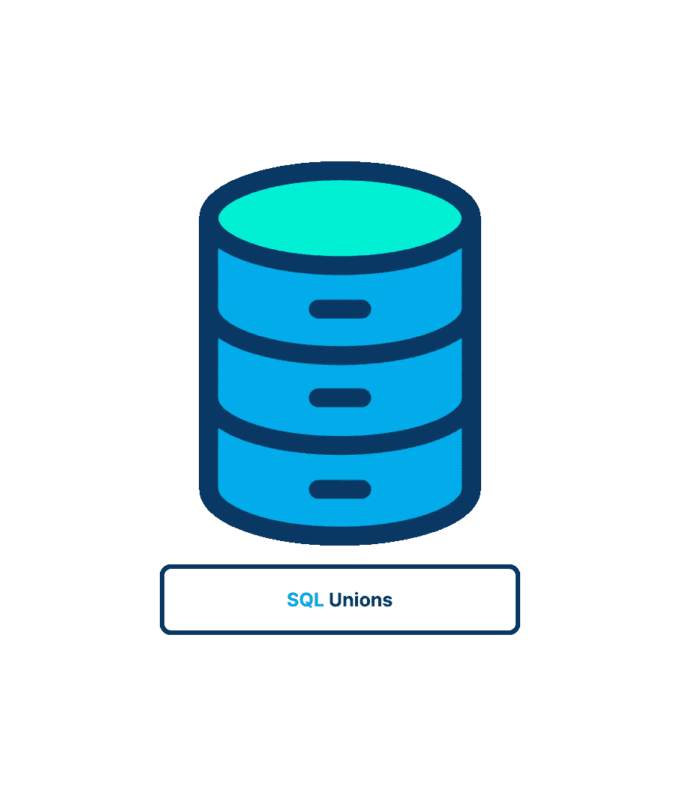
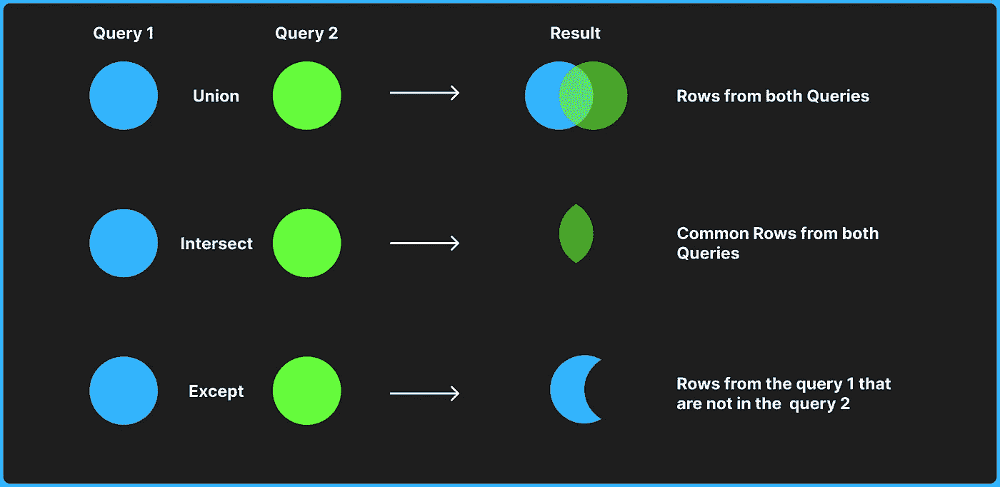
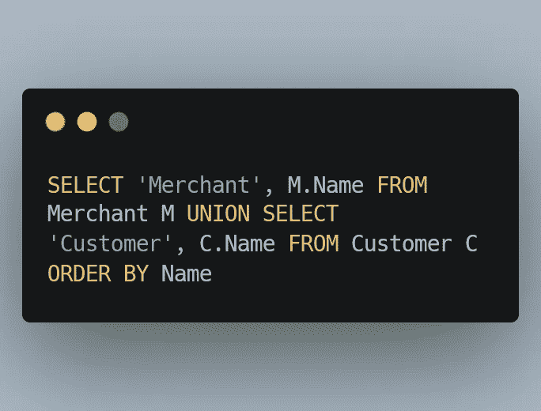
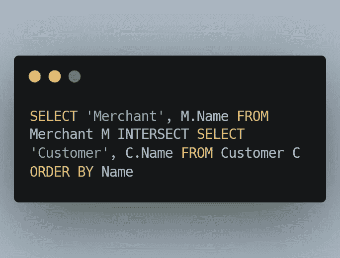
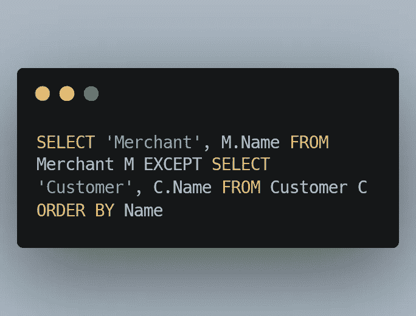

# SQL 联合的神奇世界

> 原文：<https://blog.devgenius.io/sql-union-d8da2536ddec?source=collection_archive---------12----------------------->

*在本文中，我们将讨论如何使用 UNION 操作符将多个 SELECT 查询合并成一个结果集，以及 UNION 的多种形式和 UNION 与 JOIN 之间的区别。*

**了解组合查询**

大多数 SQL 查询中都有一个单选择语句，它从一个或多个表中检索数据。使用 SQL 时，多个查询(许多 SELECT 语句)可以返回一个查询结果集。联合或复合查询是这些合并查询的传统名称。

对同一个表组合两个查询通常会获得与具有各种 WHERE 子句约束的单个查询相同的结果。换句话说，可以为任何包含多个 WHERE 子句的 SELECT 语句提供组合查询。

**创建组合查询**

使用`UNION`操作符组合 SQL 查询。使用`UNION`，您可以指定多个`SELECT`语句，它们的结果可以组合成一个结果集。

**为什么组合查询**

1.  在单个查询中从不同的表中返回结构相似的数据。
2.  对单个表执行多个查询，并将数据作为一个查询返回。

让我们直接开始吧！

## *联管节*操作员

`Union`操作符从两个表中返回行。如果单独使用，`UNION`将返回不同的行列表。使用`UNION ALL`，返回两个表中的所有行。当您希望将两个独立查询的结果排序为一个组合结果时，`UNION`非常有用。

## 交集运算符

使用 intersect 运算符返回两个表之间共有的行；它从左右查询中返回唯一的行。当您想要查找两个查询之间的共同结果时，此查询非常有用。

## Except 运算符

使用 EXCEPT 运算符只返回左侧查询中找到的行。它从左侧查询中返回右侧查询结果中没有的唯一行。当您希望查找一个集合中的行而不是另一个集合中的行时，此查询非常有用。例如，创建非客户的所有供应商的列表。

## `**UNION**` **规则**

1.  一个 UNION 必须由两个或多个 SELECT 语句组成，用关键字 UNION 分隔(例如，如果要组合四个 SELECT 语句，就要使用三个 UNION 关键字)。
2.  每个联合查询必须使用相同的列、表达式或聚合函数(一些 DBMSs 甚至要求列以相同的顺序列出)。
3.  列的数据类型必须兼容。它们不必具有相同的名称或类型，但必须是 DBMS 可以隐式转换的类型(例如，不同的数值类型或不同的日期类型)。

## **包含或消除重复行**

UNION 会自动删除查询结果集中的任何重复行(换句话说，它的行为就像单个 SELECT 中的多个 WHERE 子句条件一样)。

这是 UNION 的默认行为，但是如果您愿意，可以更改它。事实上，如果您希望返回所有匹配的所有事件，您可以使用 UNION ALL 而不是 UNION。

## **注** : **其他** `**UNION**` **类型**

一些 DBMSs 支持另外两种类型的联合。EXCEPT(也称为 MINUS)只能用于检索存在于第一个表中的行，而不能检索存在于第二个表中的行，而 INTERSECT 只能检索存在于两个表中的行。然而，在实践中，很少使用这些联合类型，因为联接可以获得相同的结果。

## **注**:

在实践中，当您需要组合来自多个表的数据时，`UNION`非常有用，甚至是那些列名不匹配的表，在这种情况下，您可以将`UNION`和别名组合起来检索一组结果。

## 连接和联合的区别

## 连接

1.  JOIN 根据多个表之间的匹配条件组合这些表中的数据。
2.  它将数据合并到新列中。
3.  从每个表中选择的列数可能不同。
4.  从每个表中选择的对应列的数据类型可以不同。
5.  它可能不会返回不同的列。

## 联盟

1.  SQL 组合了两个或多个 SELECT 语句的结果集。
2.  它将数据合并到新行中
3.  从每个表中选择的列数应该相同。
4.  从每个表中选择的对应列的数据类型应该相同。
5.  它返回不同的行。

## 我希望你觉得这篇文章有趣！