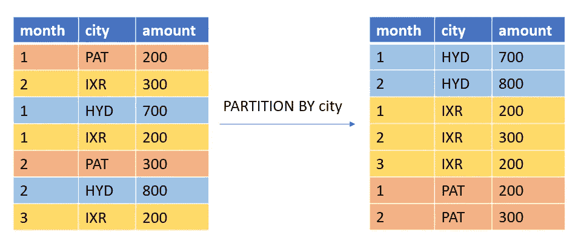
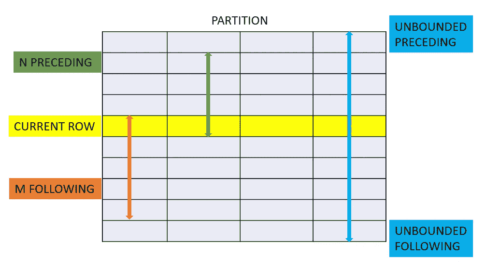
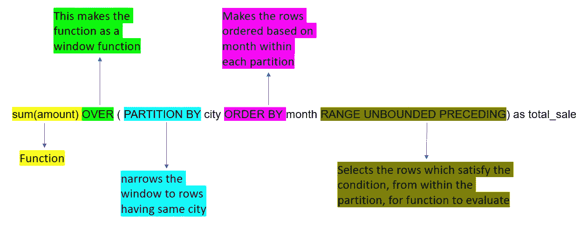
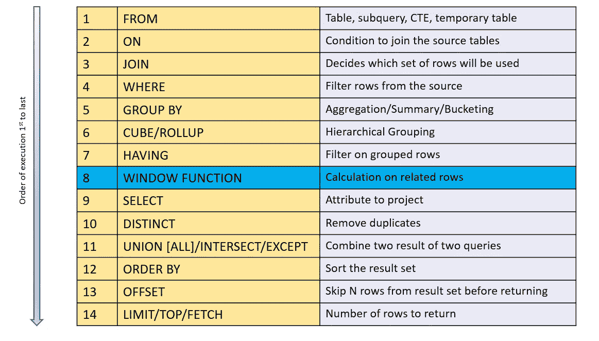
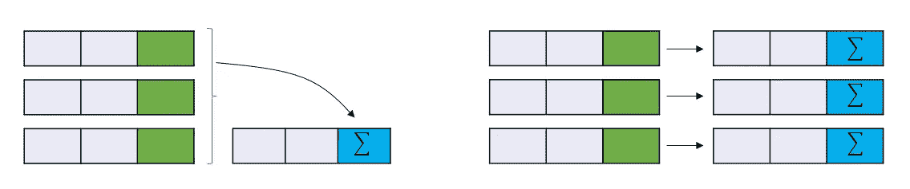

# SQL 窗口函数

> 原文：<https://blog.devgenius.io/sql-window-function-d39858e52784?source=collection_archive---------12----------------------->


[R 莫](https://unsplash.com/@mooo3721?utm_source=unsplash&utm_medium=referral&utm_content=creditCopyText)在 [Unsplash](https://unsplash.com/s/photos/window?utm_source=unsplash&utm_medium=referral&utm_content=creditCopyText) 上拍照

剖析窗口功能

窗口函数是 SQL 的一个强大功能，它允许用户对查询中的行集执行计算和分析。

窗口函数基于滑动窗口框架计算结果。窗口框架是与当前行相关的一组行。这种关系是，对于窗口定义中由**子句**划分的所有项，所有行都具有相同的**值**。在每个**分区**内单独评估窗框。Partition By 子句将行细分为多个组。



划分依据



窗口和范围

## 句法

```
SELECT <column list>,
    **<window_function> OVER (
        PARTITION BY <>
        ORDER BY <>
        <window_frame>
    ) window_alias**
FROM <table_name>ORSELECT <column list> **OVER <window_definition_name>**
FROM <table_name>
**WINDOW window_definition_name AS (
    PARTITION BY <>
    ORDER BY <>
    <window_frame>
)**
```

## 例子

```
SELECT city, month,
    SUM(amount) OVER (
        PARTITION BY city
        ORDER BY month
        RANGE UNBOUNDED PRECEDING
    ) as total_sale
FROM Sales;ORSELECT city, month, SUM(amount) OVER window_definition_name
FROM Sales
WINDOW window_definition_name AS (
    PARTITION BY city
    ORDER BY month
    RANGE UNBOUNDED PRECEDING
)
```

上述窗口功能理解如下:



窗口函数在运算符整体逻辑顺序中的位置:



运算符的逻辑顺序

因此，从上面我们知道，窗口函数是在 select 部分运行之前应用的。此时，数据库服务器已经完成了评估查询所需的所有步骤，包括连接、过滤、分组和排序，并且结果集已经完成，可以返回给调用者。当结果集仍保存在内存中时，窗口函数将应用于该结果集。

与聚合函数不同，窗口函数不会折叠行。



在窗口规范中，我们可以提供三种不同的框架条款:

> **之间的行—与分区
> **范围**中的当前行相距 N 的行—基于其与当前行相比的值的行。
> **组** —统计窗口内所有绑定行的组数(在 Postgres 中)**

***【无界】前|当前行|【无界】后***

**我们可以使用以下窗口功能:**

## **聚合函数**

**计数、最大值、最小值、总和、AVG**

## **排名功能**

**行数，等级，密度等级**

## **分布函数**

**DIST CUME 的百分排名**

## **位置函数**

**提前期、延迟期、第 n 个值、第一个值、最后一个值**

**超前/滞后函数的语法。**

**`LEAD | LAG ( expression, offset, deafult_value) OVER`**

**这两个函数在进行 YoY 和 QoQ 比较时非常有用。**

## **分析函数**

**恩蒂莱**

> ***注意:我们不能在 where 子句中使用窗口函数来过滤数据。***

# **问题**

**185。部门前三名薪资**

****员工表****

```
+--------------+---------+
| Column Name  | Type    |
+--------------+---------+
| id           | int     |
| name         | varchar |
| salary       | int     |
| departmentId | int     |
+--------------+---------+
```

****部门表****

```
+-------------+---------+
| Column Name | Type    |
+-------------+---------+
| id          | int     |
| name        | varchar |
+-------------+---------+
```

**一家公司的高管感兴趣的是，看看公司各个部门中谁赚的钱最多。一个部门的**高收入者**是指在该部门的**前三名中拥有独特**薪水的员工。编写一个 SQL 查询来查找每个部门中**的高收入者**的雇员。以任意顺序返回结果表**。****

****例子****

```
****Input:** 
Employee table:
+----+-------+--------+--------------+
| id | name  | salary | departmentId |
+----+-------+--------+--------------+
| 1  | Joe   | 85000  | 1            |
| 2  | Henry | 80000  | 2            |
| 3  | Sam   | 60000  | 2            |
| 4  | Max   | 90000  | 1            |
| 5  | Janet | 69000  | 1            |
| 6  | Randy | 85000  | 1            |
| 7  | Will  | 70000  | 1            |
+----+-------+--------+--------------+
Department table:
+----+-------+
| id | name  |
+----+-------+
| 1  | IT    |
| 2  | Sales |
+----+-------+
**Output:** 
+------------+----------+--------+
| Department | Employee | Salary |
+------------+----------+--------+
| IT         | Max      | 90000  |
| IT         | Joe      | 85000  |
| IT         | Randy    | 85000  |
| IT         | Will     | 70000  |
| Sales      | Henry    | 80000  |
| Sales      | Sam      | 60000  |
+------------+----------+--------+
**Explanation:** 
In the IT department:
- Max earns the highest unique salary
- Both Randy and Joe earn the second-highest unique salary
- Will earns the third-highest unique salary

In the Sales department:
- Henry earns the highest salary
- Sam earns the second-highest salary
- There is no third-highest salary as there are only two employees**
```

****解决方案:****

****我们首先给部门内的所有工资分配一个等级。我们通过使用如下窗口函数来实现这一点:****

```
**SELECT 
    departmentId, name, salary, 
    DENSE_RANK() OVER (PARTITION BY departmentId ORDER BY Salary desc) as r
FROM Employee**
```

****上述查询的输出如下:****

```
**+--------------+-------+--------+----+
| departmentId | name  | salary | r  |
+--------------+-------+--------+----+
| 1            | Max   | 90000  | 1  |
| 1            | Joe   | 85000  | 2  |
| 1            | Randy | 60000  | 2  |
| 1            | Will  | 90000  | 3  |
| 1            | Janet | 69000  | 4  |
| 2            | Henry | 85000  | 1  |
| 2            | Sam   | 70000  | 2  |
+--------------+-------+--------+----+**
```

****一旦我们有了这个结果，我们就过滤掉等级< 4 (1，2，3)的行。****

```
**WITH ranked_salary_for_each_dept AS (
    SELECT departmentId, name, salary, **DENSE_RANK() OVER (PARTITION BY departmentId ORDER BY Salary desc)** as r
    FROM Employee
) 
select d.Name as "Department", a.Name as "Employee", a.Salary as "Salary"
from ranked_salary_for_each_dept a 
join Department d on a.departmentId = d.Id
where a.r < 4**
```

****快乐开窗！！****