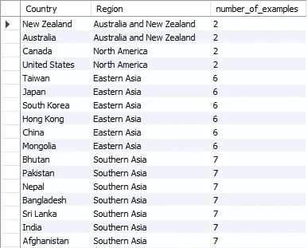

# SQL 窗口函数翻译成熊猫

> 原文：<https://blog.devgenius.io/sql-window-functions-translated-into-pandas-2d0f5090f38a?source=collection_archive---------11----------------------->

我们将首先描述窗口函数的抽象逻辑，然后看看它们是如何在 SQL 和 pandas 中实现的。如果您想将 SQL 知识扩展到 pandas，或者相反，这篇文章可以帮助您。在 pandas 中，SQL 中的每个命令后面都会跟有类似的操作。


照片由 [Unsplash](https://unsplash.com?utm_source=medium&utm_medium=referral) 上的 [Sunder Muthukumaran](https://unsplash.com/fr/@sunder_2k25?utm_source=medium&utm_medium=referral) 拍摄

我们将使用[世界幸福报告](https://www.kaggle.com/datasets/unsdsn/world-happiness?resource=download)作为我们的数据集。你可以阅读[我的文章](/import-excel-spreadsheets-to-database-with-pandas-2d7af5faee4f)如何快速扭转你的。csv 文件导入到数据库表中。

## 什么是 SQL 窗口函数

GROUP BY 语句返回每个组的聚合值。窗口函数也返回聚合值，但是它们为表中的每一行赋值。

## 对分区中的示例进行计数的 SQL 窗口函数

我们会将每个地区的示例数量添加到每个记录中。我们将使用 **PARTITION BY** 表达式，它类似于 **GROUP BY** 确定我们对数据分组的值。

```
SELECT Country, Region,
count(*) OVER(PARTITION BY Region) as number_of_examples
FROM test.world_happiness; 
```

我们使用 **COUNT** 聚合函数来获取示例的数量。其他聚合函数如 **AVG、总和、最小值、最大值**等也适用。下面的结果显示，同一分区中的每个示例都具有相同的聚合值。



窗口函数的 MySQL 结果

## 熊猫变换函数分组计数示例

**SQL** 不允许 **GROUP BY** 语句和窗口函数出现在同一个查询中。在 pandas 窗口中，操作遵循分组功能。 [**。变换**后使用](https://pandas.pydata.org/docs/reference/api/pandas.DataFrame.transform.html)功能**。groupby** 确保为每一行计算一个值。我们在转换中使用了 len 函数。

```
number_of_examples = df.groupby("Region")["Region"].transform(len)
df.loc[:, ["Country", "Region"]].assign(number_of_examples=number_of_examples)
```

其他聚合函数如 **sum、max、min** 和可定制的 [**lambda 函数**](https://realpython.com/python-lambda/) 也适用。


熊猫分组结果—转化

## 在 SQL 中对分区内的行进行排序

我们将使用 **SQL** **RANK** 函数来确定一个国家在他们所在地区内的特定指标(如自由度)的排名。

```
SELECT Country, Region, Freedom,
rank() OVER(PARTITION BY Region ORDER BY Freedom DESC) as freedom_rank
FROM test.world_happiness;
```

在划分之后，我们需要使用 **ORDER BY** 来确定度量及其方向，在我们的例子中是降序。


使用 RANK 的窗口函数的 MySQL 结果

另一种选择是过滤掉在各自分区中排名前 3 的所有国家。我们需要使用嵌套查询来完成这项工作，因为直接过滤窗口函数的结果是不可能的。

```
SELECT Country, Region, Freedom, freedom_rank from
(SELECT Country, Region, Freedom,
rank() OVER(PARTITION BY Region ORDER BY Freedom DESC) as freedom_rank
FROM test.world_happiness) as window_table
WHERE freedom_rank <=3;
```


使用 RANK 的窗口函数的 MySQL 结果(过滤)

## 使用熊猫在组内排列行

[**。rank()**](https://pandas.pydata.org/docs/reference/api/pandas.DataFrame.rank.html) 函数在 **groupby** 之后应用，并返回每行在各自组中的排名。

```
freedom_rank = df.groupby("Region")["Freedom"].rank()
df.loc[:,["Region", "Country"]].assign(freedom_rank=freedom_rank)
```

默认顺序与 SQL 中的顺序略有不同，但是我们可以很容易地对其进行排序，并过滤出每个地区的前 3 名。

```
df.loc[:,["Region", "Country"]]\
  .assign(freedom_rank=freedom_rank)\
  .query("freedom_rank<=3")\
  .sort_values(by=["Region", "freedom_rank"])
```


大熊猫分组结果—排名

## 结论

我们希望您对 SQL 窗口函数及其在 pandas 中的对应项有了更好的理解。另一篇使用时间排序数据的窗口函数的文章将很快发布。

谢谢你读了这个故事！