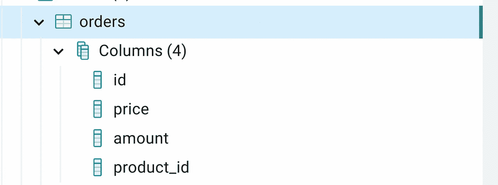

# SQLAlchemy 教程第 1 部分

> 原文：<https://blog.devgenius.io/sqlalchemy-tutorial-pt-1-a5d0967eeb07?source=collection_archive---------7----------------------->

QLAlchemy 是一个包，它能够以**python**的方式使用 SQL。SQLAlchemy 最大的优点是你**不需要处理不同方言的 SQL** (Postgres，MySQL，Oracle 等)。)而是用 **Python 对象**。

有 4 个启动级别:

SQLAlchemy 结构

我将解释最高级的 **SQLAlchemy — ORM** (对象关系映射器—将面向对象的类与数据库表相关联的过程)的基础知识。

在本文中，您将了解到:

*   如何使用 declarative_base 创建表
*   如何使用引擎/会话
*   简单的数据查询
*   将查询结果存储为熊猫数据帧

## 创建订单表

进口清单。

进口

为了开始工作，我们需要创建能够与数据库建立连接的 **url** ，我将使用 **Postgres** ，但是 url 模式对于所有方言来说看起来完全相同**。**当我们有 url 时，我们需要创建**引擎**对象，该对象能够处理所有交易，因此:

引擎创建

让我们创建类:订单。这个类将成为我们数据库中的表。为了创建它，**declarative _ Base**被使用并存储在变量 **Base** 中(类订单继承自它)。稍后我们将回到基地。

创建订单类别

**__tablename__** 是将在数据库中创建的表的名称。

**Order** 类中的属性将是表中相应的列(Column、Integer、String 和 Float 是从 sqlalchemy 导入的类)

*   id —整数，主键(主键)
*   价格浮动
*   金额—整数
*   产品标识-整数

**__repr__** 可选。

让我们看看下面的笔记本片段:

笔记本 1

在上面的笔记本中，名为**的 python 对象订单**已创建，但数据库尚未被触及！如果我们查看模式，我们可以看到表并不存在:

数据库视图

上面声明的**基**现在将用于在数据库中创建表**订单**。

让我们将**上下文管理器**(这超出了本文的范围，但为了简单起见，让我们将上下文管理器视为负责为您打开/关闭与数据库的连接的对象)与**引擎对象**-方法一起使用。开始提交交易。

在这种情况下，我们**只创建了一个表——orders**,但是如果我们创建更多继承自 **Base** 的类，那么这些类的相应表也将在我们的数据库中变成活动的。

现在，表已在数据库中创建:

数据库中的表格订单

但它是空的，所以现在让我们看看如何添加之前创建的**订单对象**。

Sessionmaker 将用于创建会话对象。Sessionmaker 是一种协调层。它使用之前创建的**引擎**，并负责连接、提交和释放与该引擎的连接。

让我们来看看这个笔记本片段:

笔记本 2

很少有事情发生:

*   订单已添加至进程
*   会话已提交

当我们查看数据库中的订单表时，我们将看到以下内容:

添加订单后的订单表

当然，我们可以在那时向表中添加多个对象。下面的笔记本片段解释了如何做到这一点:

重要的是当我们使用**时。在会话 it 上提交**方法**会使所有数据**无效—当我们查看会话**时。提交后新建**它**应该为空**。

新订单已添加到订单表中，所以现在看起来是这样的:

添加多条记录后的订单表

## 询问

这个笔记本片段展示了如何在 SQLAlchemy 中查询数据

简单查询

## 为熊猫干杯

到熊猫数据框

## 哪里走得更远？

*   SQLAlchemy 文档是杰出的！下面是 ORM 快速入门部分[链接](https://docs.sqlalchemy.org/en/14/orm/quickstart.html)
*   Mike Bayer 解释了如何使用 SQLAlchemy。太神奇了 youtube 教程[链接](https://www.youtube.com/watch?v=sO7FFPNvX2s&t=9355s&ab_channel=SixFeetUp)

请继续关注下一篇文章，在那篇文章中，我将解释与 ORM 相关的更高级的东西。

回购代码:[此处](https://github.com/Cloudy17g35/sql-alchemy-tutorial-medium/tree/main)