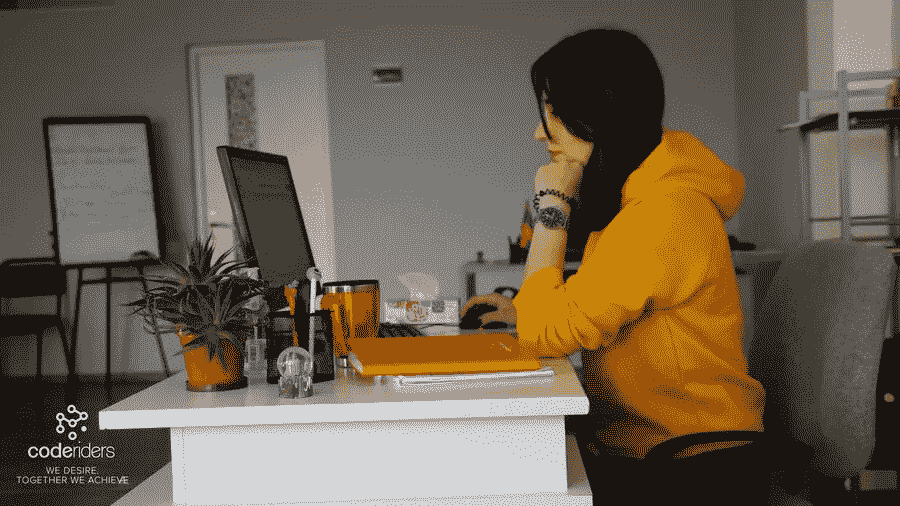

# CodeRiders 的 Srbuhi Avetisyan:即使你很少在同一个工作环境中，如何与你的团队有效沟通

> 原文：<https://blog.devgenius.io/srbuhi-avetisyan-of-coderiders-how-to-communicate-with-your-team-effectively-even-if-you-are-79d9946a8355?source=collection_archive---------6----------------------->

关注促进远程工作的数字解决方案。如今，由于机器学习、人工智能、虚拟现实等所有奇妙的数字工具和机会，远程工作变得更加灵活和容易。不把它们用在你喜欢的地方是没有意义的。不幸的是，在 2020 年新冠肺炎封锁期间，许多企业破产，其中一个最大的原因是没有为远程工作做好准备，没有能力管理团队，也没有提出替代方案。相比之下，那些克服了这些挑战的人甚至发现了做生意的新方法。 *— Srbuhi Avetisyan，* [*CodeRiders 软件开发公司*](https://www.coderiders.am/) 业务开发专员

在开始采访之前，我们先简单介绍一下权威杂志和 Srbuhi Avetisyan 的背景信息。

***关于权威杂志:***

[*权威杂志*](https://medium.com/authority-magazine) *旨在分享有趣的“思想领袖访谈系列”，以技术、流行文化、商业、健康、社会影响方面的权威人士为特色。它引出了既有力量又有可操作性的故事。*

***关于 Srbuhi Avetisyan:***

Srbuhi 拥有新闻、跨文化交流、旅游和酒店方面的背景。Srbuhi 负责公司的数字营销活动。她为国际媒体(Clutch，The Entrepreneur)撰写关于 IT 行业的文章，并分享成功规划和管理软件外包公司的技巧。

在空闲时间，Srbuhi 喜欢冬季运动，了解不同的文化、国家/民族传统和地理。

在我们开始之前，我们的读者希望能更好地“了解你”。你能告诉我们一些关于你的“背景故事”和你是如何开始的吗？

我在亚美尼亚的一个小镇长大，从我记事起，我就想自己去发现这个世界。我的家人非常支持我。所以，从高中开始，我就高度专注于我的教育和事业。为了获得更好的教育，我在 15 岁的时候离开了家乡，先是去了邻国，然后去了美国。我 17 岁回到亚美尼亚，搬到了首都埃里温，在那里我学习了英语语言学、新闻学和跨文化交流。我从学习的早期就开始工作了。在我职业生涯的开始，我做过英语和法语老师、记者、当地一家现代画廊的画廊导游、入境旅游专家，然后最终进入了 IT 行业。

目前，我在 CodeRiders 软件外包公司担任业务开发专员。说实话，和许多其他“非技术”专业人士一样，我对进入 IT 行业有点害怕。我认为和技术人员一起工作对我来说很有挑战性，在他们面前我会感到尴尬。所以，这个决定对我来说并不容易，尤其是当我在旅游业做得很好，并取得显著成功的时候。然而，我发现“数字世界”的愿望更强烈了。现在，我为做出这样的决定而自豪，我认为我每天都在接近我的目标。我喜欢 IT 行业的一点是，你永远不会感到无聊，停滞不前的可能性也更小。

在 [CodeRiders](https://www.coderiders.am/company-why-us) ，我们重视团队精神和友好的氛围。这种方法带来了更好的结果，提高了投资回报率，并对员工的生产力、积极性和对工作的投入产生了积极的影响。我们认为时间是宝贵的，数字化应该节约时间。所以，看到我成功的根源和果实只会让我更有动力，推动我学习更多。

**你能分享一下你从业以来发生在你身上最有趣的故事吗？**

当我刚开始与东方国家建立商业伙伴关系时，我有点困惑。在国际会议和展览期间，我积极开展销售线索挖掘工作，并会见我的同事。我习惯了西方的商业交流方式，即寻找合适的合作伙伴，讨论是否有合作的可能性，分享案例研究，组织讨论，最后决定我们是否应该合作。在大多数欧洲、美国、澳大利亚国家，问私人问题是不道德的。与西方不同，东方国家也重视个人交流。他们想确定他们未来的伴侣是一个既专业又好沟通的人。

对于习惯于冷冰冰的商务交流的人来说，这似乎很有挑战性；其实不然。你需要做的只是了解他们的商业文化，并以一种对他们来说方便的方式为讨论做好准备，因为毕竟你是服务提供商。

不幸的是，那时我还没有做任何研究，当我们见面时，首席执行官和商业领袖们会开玩笑，谈论他们的爱好，他们对商业计划的期望，但语气非常随意，我不知道如何反应才能不显得太严肃或不老练。最终，我开始了解他们的文化，我明白了与中东国家分享你对非商业事务的看法，谈论爱好是完全没问题的。

我们亚美尼亚人没有任何严格的观念，所以在这种事情上我们非常灵活。因此，我很快建立了有利可图的伙伴关系。从那以后，在研究客户所在国家的商业道德之前，我从来不会约见他/她。例如，如果我们的潜在客户来自丹麦，而丹麦在欧洲，这并不重要，我会继续研究“丹麦的商业伦理”。

你能说出你最喜欢的“人生格言”吗？你能分享一下这和你的生活有什么关系吗？

*没有留下什么值得说的话。如果冰雹嘎嘎作响，就让花朵被压碎——森林中庄严的橡树将抬起头来面对天空和风暴，高耸而毫发无损*。——梅恩·里德的《奥西奥拉，塞米诺族的领袖》。

这本书是一个杰出的例子，体现了斗争、毅力、为你的权利而战的重要性以及保持高尚的道德。接受“不太好”的现实并努力按照你的意愿塑造它的重要性。我随机注意到这句话在危急情况下浮现在我脑海中。

这句话引自电影《女权主义者》*我的价值不比你多，也不比你少。我们会赢的*”对我来说也很有力量。女权运动是我最喜欢的电影之一。我甚至写了一篇关于这部电影的文章。这部电影经常与女权主义联系在一起。我不是女权主义者，我认为这部电影不仅仅是一个洗衣女工为女性投票权而战的故事。这是捍卫自己权利的勇气，确保人们得到平等和公平的对待——无论是种族、性别、健康和经济状况、家庭背景，还是任何其他歧视。

没有人能够在前进的道路上获得成功。有没有一个特别让你感激的人帮助你走到了今天？你能分享一个关于这个的故事吗？

当然了。我努力让自己周围都是鼓励我、传播正能量的人，和他们在一起我可以不断进步。所以，要指出一个具体的人有点难。我感谢我的父母，他们给了我追求目标的机会，也感谢一直支持我的家人。我感谢自己有勇往直前的勇气，感谢身边所有无条件帮助我、相信我的人。我也很感激那些“不太好”的人，他们教会了我生活中的“该做什么，不该做什么”。它们也是我成为更好的人和专业人士的动力。

好极了。现在让我们转移到我们采访的主要焦点。疫情改变了我们很多行为方式。其中之一当然是我们如何工作以及如何在工作中交流。许多团队已经开始远程工作。远程工作与在你面前的团队工作有很大的不同。这提供了巨大的机遇，但也带来了独特的挑战。首先，你能为我们的读者清楚地说明团队在一起的几个主要好处吗？

如果一个问题有两个解决方案，当然每个解决方案都会有利弊。我们的工作是能够将双方放在平等的平台上，权衡我们的利益和损失，做出正确的决定。我分享了以下优势，但老实说，我会注意到这些优势在数字世界中也有替代方案。所以，内部工作:

*●* 加速并促进适应同事工作风格的过程。当我们在办公室时，我们大部分时间都和同事在一起。我们总不能一直坐在电脑前做生意吧？我们需要时间来吃茶点、喝咖啡、吃午餐和进行简短的谈话，以分散我们对令人疲惫的任务的注意力，并使我们的头脑恢复活力。我们可能没有注意到，但是这些日常活动帮助我们更好地理解我们的同事和他们的价值观，并最终变得更加自在。

*●* 在头脑风暴方面更加灵活。一次简单的团队聚会可以变成一个独特想法的诞生。例如，在 CodeRiders，我们喜欢在下班后组织小型聚会。我们可以坐下来无休止地讨论各种话题。每个人都会分享他/她的随机想法，这些想法可能会形成很棒的东西。

*●* 有助于控制和跟踪员工的生产力和工作时间。尽管我们管理员工的方法略有不同，也没有那么多问题，但许多公司肯定在努力提高员工的生产率。对于团队领导来说，进入房间并检查所有团队成员是否都在场要比使用持续跟踪系统在线查看更容易。

*●* 将误解的风险降至最低。如果你在办公室工作，有一个令人不安的问题，去找合适的专业人士，讨论你关心的问题会更容易。这个过程花费的时间更少，误解的几率也降到了最低。不过这一点有点争议。一些专业人士对这个问题有不同的看法，我不介意。他们坚持认为，数字讨论可以保存书面回答、视频电话录音，并帮助员工回顾过去的讨论，以防他们错过了什么。

**另一方面，你能为我们的读者阐明当一个团队不在同一个空间时会出现的一些主要挑战吗？**

*●* 实时面对面互动的运气，尤其是如果办公室气氛友好的话。

*●* 工作中的误解风险。这可能是由于沟通不畅和无法面对面讨论造成的。

*●* 心理崩溃和孤独的感觉。在一天结束的时候，我们都是人，我们需要实时互动，我们需要出去玩，走出我们的房子。缺乏这种类型的交流会带来消极的想法、不存在的问题和孤独感。

*●* 缺乏自律，在家分心。如果员工有一个大家庭，有时在家集中精力工作会变得很困难。所以，你应该采取一定的策略，让你的工作环境变得方便和有利。当然，对于独居或小家庭的人来说，这个问题不那么突出。

**妙极了。下面是我们采访的主要问题。根据您的经验，我们可以做些什么来应对这些挑战呢？即使你们很少在同一个物理空间，为了有效地与团队沟通，你需要知道的 5 件事是什么？**(请分别分享一个故事或例子。)

1.保持劳逸结合。因为新冠肺炎疫情，我们在 2020 年变得遥远。虽然我们只与国际公司合作，并且习惯于与客户进行远程交流，但在封锁期间，我处理了一些个人挑战。与你的客户和同事远程工作是两件稍微不同的事情。例如，软件外包是一个非常清晰的过程。开发人员从客户那里接受他们的任务，列出截止日期，创建代码，测试它，如果一切顺利，他们继续下一个任务。在我们的小型企业开发团队中，我们设定一些明确的目标，遵循特定的工作方式，定义长期和短期的业务战略。我们可以进行无休止的讨论，不断提出新的想法。我有时会发现自己精疲力尽，或者在一张“特大号”的待办事项清单上搞砸了。这无疑也对其他团队成员的工作产生了负面影响。你混淆了截止日期，留下一些未完成的任务。幸运的是，在这段时间里，我在工作和个人生活之间保持了平衡。

2.做好孤独和寂寞的心理准备。我听说很多人在封锁期间感到极度孤独和悲伤。我不会夸大我的经历。是的，我感到孤独和孤立，但并不经常，我找到了克服这些负面情绪的方法。我觉得这个要看某个人的性格，工作性质，职业。例如，不断进行面对面谈判的人肯定会比内容作者或软件外包公司的员工面临更多的挑战；这是可以的。为了解决这个问题，我开始在一张纸上写下我的负面感受，并寻求解决方案。人类的大脑是非常微妙的。我们可以指导我们的大脑积极向上，赶走消极的想法。你的心理状况直接影响到你的工作质量和与同事的有效沟通。所以，我们应该确保我们在一个健康的地方。

3.关注促进远程工作的数字解决方案。如今，由于机器学习、人工智能、虚拟现实等所有奇妙的数字工具和机会，远程工作变得更加灵活和容易。不把它们用在你喜欢的地方是没有意义的。不幸的是，在 2020 年新冠肺炎封锁期间，许多企业破产，其中一个最大的原因是没有为远程工作做好准备，没有能力管理团队，也没有提出替代方案。相比之下，那些克服了这些挑战的人甚至发现了做生意的新方法。例如，旅行社开始组织虚拟旅游，教育机构实施学习管理系统、虚拟教室、电子考试系统、创作系统，活动组织者致力于虚拟会议和展览，健身和健康行业专家提供虚拟课程和咨询，各种行业工作者创建他们的库存、工作管理系统等等。在 CodeRiders 的博客关闭期间，我聚集了一些行业，谈论了他们的数字解决方案。所以，如果你对这个话题感兴趣，我推荐[查看我们的博客](https://www.coderiders.am/blog)。

4.远程工作并不意味着团队建设活动的结束。你仍然可以通过 Zoom 或 Google Hangouts 和你的同事一起喝 15 分钟的咖啡。我们遵循这些原则。在工作日结束之前和之后，我们有两个强制性的电话。从那以后，每当我们需要交流、喝咖啡休息或者工作相关的讨论时，我们都会在 Google Hangouts 上“见面”。我们也总是可以在 Slack 上快速赶上进度，在 Asana 和 Trello 上进行任务和工作管理。我们还试图在下班后或周末组织面对面的会议，比如看电影、在埃里温市中心散步等等。

5.留点自我发展的空间。远程工作节省时间。早上为工作、交通和其他类似的事情所做的准备耗费了我们的时间和精力，限制了我们关注自身和进化的能力。逃避这些日常活动可以腾出时间来学习新的课程、个人成长、爱好、和家人在一起。

6.(加分)你花更多的时间陪伴家人和爱人。你还节省了汽油、火车票和午餐的费用。雇主们还节省了办公室租金和每月水电费。

**在疫情期间，您的公司是否遇到过与在家工作的员工沟通的挑战？例如，你的公司允许员工使用他们自己的手机还是他们使用公司的电话线工作？你能分享一下出现的其他问题吗？**

幸运的是，我们在疫情期间没有遇到任何严重的问题。在 CodeRiders，我们的理念非常注重员工的福祉和满意度。我们都是朋友，有些人有家庭关系，有些人是童年的朋友，学校/大学的朋友，等等。我们不强迫我们的员工遵守某些规则，反之亦然，我们让我们的员工带着满意、投入和动力去完成任务。我们是一家小公司，我知道这种投入和业务方法对我们来说是有回报的，但这对其他人来说可能是一种挑战。因此，每家公司都应该灵活行事，制定自己的方法。

我们担心沟通不畅和缺乏动力，但幸运的是，我们也发现了这一点。

让我们放大一点。已经开发了许多工具来帮助团队相互协调和交流。在你的个人经历中，哪些工具最有效地帮助复制了同处一室的好处？

这个问题的答案很主观。有数以百万计的开源工具，每个公司都选择一个最适合自己工作风格的。通常，对于这个问题有两种标准的方法。

1.查找并下载最适合您公司的开源软件

2.[雇佣软件开发人员](https://www.coderiders.am/contact-us)来开发你定制的软件

这里没有选择的对错。我们采用了这两种方法。对我们 Slack 来说，Google Hangouts、Asana、Trello、Skype、TeamViewer、AnyDesk 和吉拉开源工具就足够了。然而，因为我们在密码管理方面有一个小问题，我们的开发人员为我们创建了一个数字平台来保存和共享我们的帐户、密码和其他相关资料。

在 CodeRiders 的博客上阅读采访的其余部分。

 [## CodeRiders 的 Srbuhi Avetisyan:如何有效地与团队沟通，即使你是…

### 关注促进远程工作的数字解决方案。如今远程办公更加灵活，而且…

www.coderiders.am](https://www.coderiders.am/blog/srbuhi-avetisyan-of-coderiders-how-to-communicate-with-your-team-effectively-even-if-you-are-rarely-in-the-same-physical-space)