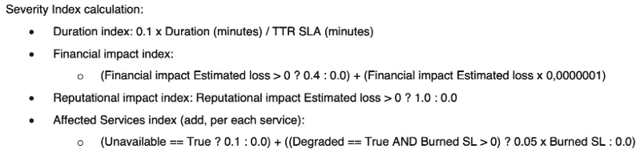
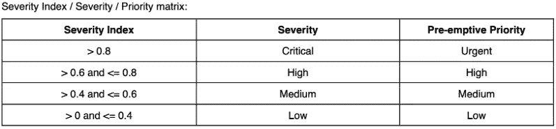

# SRE —严重性问题:从持续缓解到全面修复

> 原文：<https://blog.devgenius.io/sre-severity-matters-moving-from-continuous-mitigation-to-complete-fix-bd5c684f20a5?source=collection_archive---------25----------------------->

这是一系列关于思想、实验和任何其他种类的“如果”和“不”的文章中的第三篇。这里没有什么是防弹的或刻在石头上的——只是简单的话题和提示，以帮助每个人走在路上。

你开始衡量失败并提取一些指标了吗？如果你还没有，请阅读本系列的第二篇文章[剖析可靠性工程的失败](https://medium.com/@ricjcosme/sre-dissecting-failure-on-reliability-engineering-3bf6d3808862)。

那我们就开始吧。

# 持续缓解

我敢肯定，你们中的许多人，像我一样，已经发现(或目前发现)自己处于一种恶性循环的两难境地，我通常称之为“**持续缓解**”。顾名思义，持续缓解是指**缓解问题(已知问题)的永久状态，无论问题何时出现，但从不实际修复它**。
除了其他几个方面，它还包括:

*   对于任何开发团队来说，这都是一个令人痛苦的沮丧和消极的来源
*   辛劳、遗产、技术债务(在此使用您最喜欢的术语)…
*   一个“敏捷的变通方法，直到……”(是的，以前听过这个)
*   一个异常，一个团队待办事项中反复出现的条目
*   当然，这不是工程师想要的工作方式，也不是任何公司的最佳方式
*   对业务连续性的迫在眉睫的威胁(缓解只会起作用，直到它不起作用的那一天……)
*   最终，阻止一家公司赚钱的最好方法之一(让我们记住，当一家公司不赚钱时，它就是在赔钱)

以下是一些教科书中关于“持续缓解行动”的例子(我们都经历过，对吧？):

*   手动或以一定的频率重启服务或服务器(cron 作业，例如)将其重置回工作状态
*   扩展基础架构以“应对”相同(有时甚至更少)的负载

奇怪的是，这种“持续缓解”的报应就像某个团队待办事项列表中的一个条目一样简单，无优先级，一遍又一遍…
顺便说一下:**永远不要相信其变更日志不包含任何修复的产品**:)

现在我想到了几个问题:

为什么会对业务产生如此恶劣影响的事情会被搁置这么长时间，让人们依靠“**不断应用变通方法**来解决问题？

还记得“*缓解只会起作用，直到它不起作用的那一天……*”吗？当那一天到来时会发生什么？[还要记住:这不是“如果”的问题，而是“当”失败发生的问题](https://medium.com/@ricjcosme/sre-morphing-into-site-or-systems-reliability-engineering-316ebf78e036)。

让我们通过将前两个问题混合到以下一个问题中来推断所需的可操作问题:

> 当产品开发不断争夺相同的资源(也就是工程师的时间)时，如何提高 bug 和缺陷修复的优先级？

是的，这确实是需要我们注意的真正问题。

# 严重性很重要

我记得我在 SEV-*事件严重性指定方面工作了很长时间，直到有一天我后退一步，意识到:

*   这个 SEV-*是对标志、监控警报、人类描述等的解释…，但是… **仍然是一种解释**。一个**特别分类决策**让合适的人员尽快缓解事故；
*   当事件得到缓解时，压力和蒸汽释放的典型人性，让每个人都觉得:“完成了——我们现在可以**回到我们正在做的事情**。在某种程度上，这种压力下降的感觉在我们的头脑中瞬间减弱了事件的严重性和影响；
*   势头不再；
*   我们需要知道事件的真正严重性是什么；

事故的根本原因和促成因素最终将在事后分析中确定，一些后续行动/修复措施将被扔进几个产品开发团队的积压工作中，就是这样。所有这些都假设你已经在你的组织中做了事后分析和后续活动。

这是需要做更多工作的时间点**。可靠性工程原则必须发挥作用。为此，我们需要回到事后分析，找出事件的真正严重性——因为真正的严重性**是**将推动不同**产品开发团队**的后续业务优先级**的严重性。****

# 人体受冲击的剧烈程度指数

几年前，需要知道任何事件的真实严重性，并以这种方式建立修复优先级，这促使我启动了一种"**严重性指数计算** " —一种数据驱动的方法，不仅基于事后收集的信息对事件的严重性进行分类**，而且还对**跟进/ bug 修复/缺陷纠正措施优先级进行分类**。**

事不宜迟，让我和你们分享一下反映这种严重性指数方法的验尸模板的最后版本，以及用于计算它的所有信息:[https://github.com/ricjcosme/postmortem](https://github.com/ricjcosme/postmortem)。选择一个有特色的 docx / pdf 并随意使用(顺便提一下，欢迎 PRs 等建议)。

长话短说(不想把你累坏，而且，你已经在模板上把整件事彻底解释清楚了)或者 ***如何计算一个事件的真实严重程度*** :

所需信息:

*   事件的持续时间
*   财务影响(是的，这是真的:不止一种类型的影响——有运营、财务和声誉方面的影响——我可能会在以后的帖子中再次讨论这个话题)
*   声誉影响
*   受影响的服务

计算方法如下:

注:财务影响指数的乘数 0.0000001 应根据您的业务/组织规模和财务表现进行调整。如果你在这方面有困难，请记住“根据 Gartner ，许多组织报告停机时间每小时的成本超过 30 万美元,[”——这是在 2014 年。](https://blogs.gartner.com/andrew-lerner/2014/07/16/the-cost-of-downtime/)

这是基于严重性指数的严重性/跟进(又称先发制人)优先级矩阵:

如果我们以此事后分析模板为例，我们可以看到事件的严重性为**危急**，因为严重性指数为> 0.8，使得所有以下优先事项**紧急。**

(我不会在此赘述——如果您对计算或使用的术语有任何不理解的地方，请给我留言)。

好吧，那么这到底意味着什么？
**这意味着企业及其决策者现在已经被告知，某个事件的严重性和影响非常严重，足以让他们做出明智的决策，并在必要时改变产品交付路线图(如暂停或延迟)或其他工程分配时间，以解决所需的 bug 或缺陷修复**。

这将通过消除已知责任带来业务连续性安全，并防止对任何业务造成重大灾难性后果，因为这些业务正努力从持续缓解转变为完全修复思维。

希望这对某人有所帮助。敬请期待下一集:)