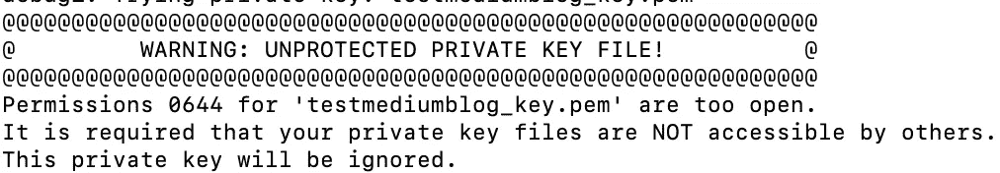
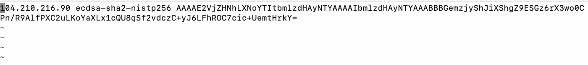

# 宋承宪:不要做什么？

> 原文：<https://blog.devgenius.io/ssh-what-not-to-do-92c266ca430f?source=collection_archive---------9----------------------->


远程登录变得简单

**等级——初学者**

连接到远程服务器的最传统的协议— **SSH(安全外壳)**通过 internet/intranet 上的不安全网络提供安全连接。SSH 使用端口 **22** ，它既是一个 [**TCP**](https://en.wikipedia.org/wiki/Transmission_Control_Protocol) 又是一个 [**UDP**](https://en.wikipedia.org/wiki/User_Datagram_Protocol) 端口。

SSH 通常用在以下用例中，用于调试生产/非生产服务器、传输文件和远程代码执行。对于高级用例，ssh 可以用于 [**隧道**](https://en.wikipedia.org/wiki/Tunneling_protocol) 和[**端口转发**](https://en.wikipedia.org/wiki/Port_forwarding) 用例(我们可能会在后面的博客中讨论)

该命令可以在两种模式下运行:

i) **密码-** 用户需要使用 **-S** 选项输入他/她的密码。这通常不是首选选项，因为可能会将密码暴露为**明文**。

ii) **无密码-** 在这种方法中，用户必须通过密钥而不是密码来验证远程服务器。使用的认证机制是**非对称**，其中任一用户将他/她的公钥上传到 **~/。** **远程服务器上的 ssh/authorized_keys** 文件夹或者使用一个公钥，该公钥一般由云厂商发布，如 **AWS、Azure、GCP** 等。

这个博客主要讨论初学者在尝试使用 ssh 时可能出现的常见故障排除错误:

使用-v 选项运行时，日志可以帮助您更好地调试命令:

```
**ssh** -v -i ** keyfile-name <user-name>@Public-IP**
```

i) **关键文件权限问题:**默认情况下，当您从云提供商下载 **pem** 文件时，该文件上的文件权限是打开的( **0644** )。如果您尝试使用相同级别的密钥权限直接 ssh，您可能会得到以下错误。



**具有打开文件权限的密钥文件**

要解决此问题，密钥文件所需的最低权限是 400，修复该问题的命令是:

```
***chmod 400 <key-filename>.pem***
```

ii) **远程服务器上的 authorized_key 缺少公钥:**由于 ssh 工作在非对称认证上，在这种情况下，文件 *~/。ssh/authorized_keys* 在远程服务器上损坏或者公钥丢失，您可能会得到以下错误


**没有更多的验证方法可以尝试**

iii) **客户端服务器上 ssh 私有密钥的定制路径:**与远程服务器一样，密钥可能在本地客户端(即您的 **mac/linux** 中丢失，或者出现在默认定制路径之外的其他位置。错误将与 ii)中的相同，但是，要修复相同的错误，请使用以下命令

```
**ssh** -i **/**path**/**to**/**id_rsa user**@**server.nixcraft.com
```

iv) **其他常见错误:**

位于(**/Users/<local-MAC-account/)的 **known_hosts** 文件。ssh/** )可能不包含您尝试连接的主机 IP 的条目。尝试查找与下面类似的条目，以查找试图 ssh 到的 IP



**已知主机文件中的主机 IP 条目**

注意: [**scp**](https://en.wikipedia.org/wiki/Secure_copy_protocol) 命令的工作方式类似于 ssh 命令，其中的大多数错误也可以在那里使用。