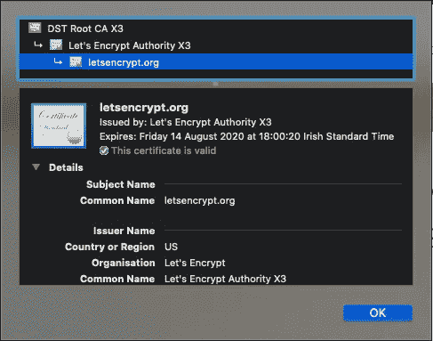

# SSL 证书:工作原理

> 原文：<https://blog.devgenius.io/ssl-certificates-how-it-works-c646f9d05ba8?source=collection_archive---------24----------------------->


照片由 [Jiroe](https://unsplash.com/@iamjiroe?utm_source=medium&utm_medium=referral) 在 [Unsplash](https://unsplash.com?utm_source=medium&utm_medium=referral) 上拍摄

简单快速地解释 SSL 证书是如何工作的。这不是一个如何生成生产就绪证书的教程，但是希望在本文的结尾创建一个证书会更容易。

# 私钥

私钥用于敏感内容的加密和解密。它不应该与错误的人共享，因为它可以用来解密用它加密的任何内容。

如何使用`openssl`创建私钥:

```
openssl genrsa -out privatekey.pem 2048
```

该命令将生成一个带有私钥的文件`privatekey.pem`。

# 生成自签名证书

自签名证书用于测试或在受控环境中，它提供了一种快速的方法使您的 web 服务器通过 HTTPS 进行响应。这不应该在生产中使用，因为它不是由证书颁发机构签名的(下一节将说明为什么这很重要)。

如何使用`openssl`生成证书:

```
openssl req -key privatekey.pem -new -x509 -days 365 -out certificate.crt
```

使用私钥，`openssl`将生成一个包含证书内容的文件`certificate.crt`。这个证书可以在你的网络服务器上使用，但是它会显示一个不安全的连接。

# 认证机构(CA)

证书颁发机构负责验证和颁发证书，做这项工作的公司/组织的一个例子是 [Letsencrypt](https://letsencrypt.org/) 。

需要创建证书签名请求(CSR)来颁发新证书，CSR 将由证书颁发机构验证(或拒绝)。

如何使用`openssl`生成 CSR:

```
openssl req -new -key privatekey.pem -out certificaterequest.csr
```

运行该命令后，将会询问您关于您的域和公司的重要信息。

**PS:每个证书颁发机构都有不同的审批流程，所以不要担心 CSR 将如何被批准。**

# 证书链

证书链是用于相互认证的证书的有序列表，所有需要的证书都将由 CA 返回，因此需要理解概念并在适当的位置设置证书文件。


证书链

*   **SSL 证书**



*   **中级证书(CA 证书)**


*   **根证书**


# 应用概念

使用[数字海洋](https://www.digitalocean.com/)的负载平衡器 SSL 配置，这就是我们如何应用已经生成的所有内容:


**名字**:不重要，只是为了保存在数字海洋里

**证书** : `certificate.crt`的内容(使用自签名，否则将由 CA 发送)

**私钥** : `privatekey.pem`的内容(使用自签名，否则将由 CA 发送)

**证书链**:将由 CA 发送(如果自签名，则留空)

# 参考和重要链接

*   [Acme.sh](https://github.com/acmesh-official/acme.sh) : awesome CLI 发布新证书，它使用 Letsencrypt 发布证书，并且可以与几个 DNS 提供商集成(DNS 配置是验证您确实是域所有者的最佳方式之一)。
*   [https://www . digital ocean . com/community/tutorials/OpenSSL-essentials-working-with-SSL-certificates-private-keys-and-CSRs # convert-certificate-formats](https://www.digitalocean.com/community/tutorials/openssl-essentials-working-with-ssl-certificates-private-keys-and-csrs#convert-certificate-formats)
*   [OpenSSL](https://www.openssl.org/)
*   [https://en.wikipedia.org/wiki/Chain_of_trust](https://en.wikipedia.org/wiki/Chain_of_trust)