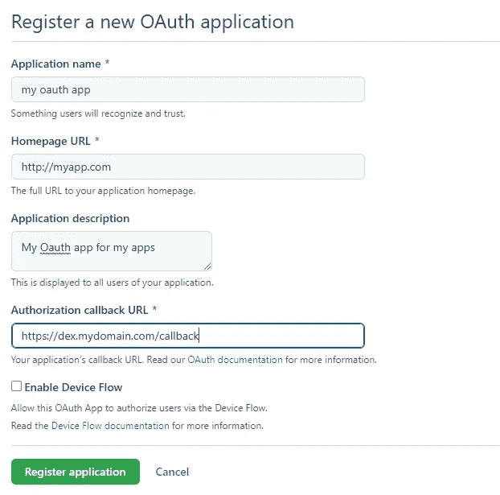
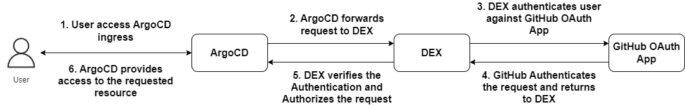
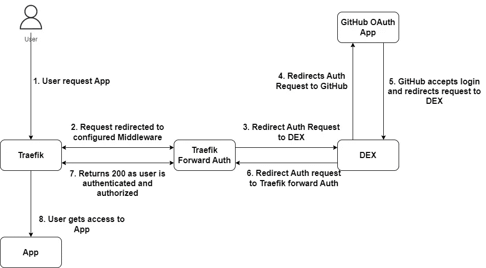
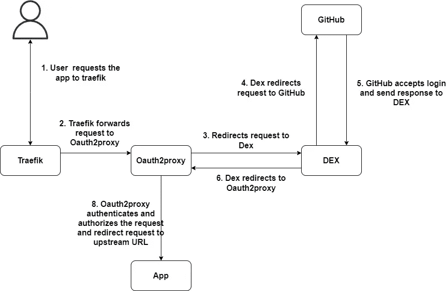

# Kubernetes 中应用程序的 SSO 认证

> 原文：<https://blog.devgenius.io/sso-authentication-for-applications-in-kubernetes-aedc3c189d89?source=collection_archive---------2----------------------->


对 unsplash.com 的礼貌

# 介绍

这篇文章是关于使用 SSO 认证和授权来保护应用程序和入口的。入口可以用用户名和密码保护。如果许多团队在一个有许多应用程序的集群上工作，最好使用带 RBAC(基于角色的访问控制)的 SSO 认证机制。这使得生活更加轻松，因为允许/拒绝访问的组可以轻松配置。

# 当前设置

我有一个 Traefik 入口控制器，有很多入口。我想使用 GitHub 作为 OIDC 提供商。

# 先决条件

为了理解和遵循本文档，我假设读者对使用`helm`部署应用程序有所了解，并且当对应用程序的`values.yaml`文件进行更改时，假设图表版本使用新值进行了升级。

# DEX 作为 OIDC 提供商

有许多可用的 OIDC 提供商，但我选择了 Dex，因为

*   它与 Kubernetes 无关，我可以使用 Dex 来保护我的应用程序或所有入侵。
*   其功能丰富
*   它有许多插件，可以与许多 OIDC 提供商集成，并可以像一个中心一样在集群中进行身份验证和授权。

因此，我将使用 Dex 作为集群内的 OIDC 提供者，并在 Dex 上为 OIDC 配置 GitHub 插件，而不是直接使用 GitHub 进行 OIDC 配置。

对于可以直接与 OIDC 提供者通信的应用程序，可以通过在应用程序配置本身中添加 OIDC 配置来进行保护。这太酷了。但是不酷的是不支持 OIDC 配置的入口或应用程序。所以让我们来看看如何做到这一点。

# 创建 GitHub OAuth 应用程序

重要的事情先来

进入 github.com >你的个人资料>设置>开发者设置> OAuth 应用>新建 OAuth 应用



这个`Application Name`、`Homepage URL`、`Application Description`可以是任何东西。重要的是`Authorization callback URL`。这应该是将要部署的 Dex 的 url。

当注册应用程序时，会生成一个`ClientID`和一个`ClientSecret`。在一个安全的地方拷贝这个。

现在让我们在 Kubernetes 中创建一个秘密来存储 Dex 将使用的凭证

dex-github-secret.yaml

并在集群中应用它

```
kubectl apply -f dex-github-secret.yaml
```

# Dex 是 OIDC 的应用提供商，可以与 OIDC 对话

我的集群中有 GitOps 的 ArgoCD。ArgoCD 可以直接与 OIDC 提供商对话。因此，我将配置 ArgoCD 以使用 Dex 作为 OIDC。授权工作流是这样的



支持 OIDC 的应用程序的 DEX 工作流

1.  用户请求应用程序 ArgoCD
2.  ArgoCD 将 auth 请求转发给已配置的 OIDC 提供程序，即 Dex。
3.  Dex 将检查令牌是否已经存在。因为没有，所以它会将请求发送到已配置的 OIDC 连接器。
4.  GitHub OAuth 应用程序对请求中的用户进行身份验证，并将反馈返回给 OAuth 应用程序中配置的`Authorization Callback URL`,即 Dex url
5.  Dex 验证响应，并为通过`staticClients`中配置的`RedirectURI`请求的客户端创建签名的 ID 令牌。
6.  ArgoCD 现在将转发使用有效令牌验证的请求资源

这是用简单的术语解释的工作流程。在现实中，有很多事情正在发生，如认证和签名的 ID 令牌或 JWT 令牌的创建等等。为此，我建议多了解一下 OIDC 认证是如何工作的。或者等我写一篇关于它的文章；)

现在让我们部署 Dex。由于我使用 Kubernetes，我会更喜欢通过头盔图部署。所以我的`values.yaml`会是这样的:

`storage`部分提到在哪里存储令牌，我使用 kubernetes 集群进行存储。并使用 Github 连接器。

如果`loadAllGroups`为`true`，那么任何登录 GitHub 的人都可以通过授权。这里我告诉 Dex 只授权来自`myorg`的用户以及属于团队`myteam1`和`myteam2`的用户。如果我不提供团队配置，那么组织`myteam`的任何成员都可以被授权。

> 需要注意的一点是，如果这个 Oauth 应用程序是个人用户创建的，那么这个应用程序应该由组织授权。首次使用时，Github 会要求您向组织发送请求以批准请求。

在`staticClients`部分，我为 ArgoCD 添加了一个。`id`和`secret`分别作为`oidc.config` 中的`clientID`和`clientSecret`

关于 Github 连接器的更多配置，请点击查看

让我们部署 Dex

```
kubectl apply -f dex-github-secret.yamlhelm repo add dex [https://charts.dexidp.io](https://charts.dexidp.io)
helm install --generate-name --wait dex/dex -n dex -f values.yaml 
```

当 Dex 准备就绪时，配置 ArgoCD 配置以添加 OIDC 提供程序。我在这里就不解释了。一个 TL；DR；编辑配置图`argocd-cm`，添加 OIDC 配置并尝试登录。如果配置正确，那么 OIDC 配置应该可以工作。

# Dex 作为 OIDC 供应商提供不能与 OIDC 对话的应用程序

现在，让我们看看如何在不支持 OIDC 的应用程序中使用 Dex。我们有两个选择。

## 选项 1: Traefik 转发授权

Traefik Forward Auth 是一个简单的 SSO/Oauth 身份验证工具，用于 Traefik 作为入口控制器。

请求工作流将如下所示:



1.  用户对 Traefik 入口控制器应用程序的请求
2.  Traefik 通过在 Traefik 上配置的中间件将请求重定向到 Traefik Forward Auth
3.  Traefik Forward Auth 将请求转发给 Dex
4.  Dex 将重定向请求转发给 GitHub
5.  GitHub 接受登录并将 auth 请求发送给 Dex
6.  Dex 将请求重定向到 Traefik Forward Auth
7.  Traefik Forward Auth 检查来自 Dex 的响应，并根据响应发送 200/403
8.  然后，Traefik 将用户请求发送到请求的资源或应用程序。

## 配置 Traefik 转发授权

在创建 Traefik Forward Auth 之前，我们需要在 Dex 中添加一个静态客户端部分。我们已经为 ArgoCD 做了同样的事情。因此，将以下内容附加到 Dex 的`values.yaml`文件的`staticClients`部分:

```
- id: traefik-fwd-auth
  name: Traefik Forward Auth OIDC Dex App
  redirectURIs:
  - [https://auth.mydomain.com/_oauth](https://auth.verdictcyber.com/_oauth)
  secret: random-secret
```

`redirectURIs`应该是 Traefik Forward Auth 的入口 url，它将很快配置。

Traefik Forward Auth helm 图表的值如下:

所以我在这里设定

*   `default` oidc 提供商
*   `oidc`一节包含了 OIDC 的信息传递经过。`issuerUrl`是配置好的 Dex 应用 URL。此处添加了`clientID`和`clientSecret`，这应该与您在`staticClients`部分提供的完全相同
*   `cookie.insecure`到`true`，以便允许来自非 https 域的 cookie，因为我在 traefik 上有 ssl 终端。这里可以提供一个随机的`secret`。这将作为秘密存储在安装 Traefik Forward Auth 的名称空间中。`domain`应该是域的值
*   `authHost`很重要，因为这是 Traefik Forward Auth 为验证而配置的主机名
*   `middleware.enabled`设置为`true`将自动创建一个中间件。这个中间件包含关于授权 url 和指向的服务的信息。
*   一个用于 Traefik 转发授权的`ingress`

> 最初的舵图在安装时可能会有问题，因为我有一些问题。所以最好复制这个图表，并根据您的要求修改它。对我来说，问题在于入口配置，因为我使用的是最新的 kubernetes 版本，而这个版本已经过时了。

## 部署 Traefik 转发授权

```
helm repo add itscontained [https://charts.itscontained.io](https://charts.itscontained.io)
helm install itscontained/traefik-forward-auth -n traefik -f values.yaml
```

安装后，通过添加注释来修改未经身份验证的入口:

```
traefik.ingress.kubernetes.io/router.middlewares: traefik-traefik-forward-auth@kubernetescrd
```

注释的值将采用格式`<namespace>-traefik-forward-auth@kubernetescrd`。如果命名空间或`kubernetescrd`被省略，那么这个 auth 将不起作用。

尝试登录，如果一切正常，那么你应该通过 Dex 重定向到 GitHub，如果认证有效，那么你将被授权访问入口

## 选项 2:oauth 2-代理

Oauth2-Proxy 是一个反向代理，它使用提供商(Google、GitHub 和其他提供商)提供身份验证，通过电子邮件、域或组来验证帐户。

Oauth2-Proxy 的身份验证工作流如下所示:



1.  用户请求应用程序跟踪
2.  Traefik 将请求转发到请求的入口，即 Oauth2 代理
3.  oauth 2-代理将请求重定向到其 OIDC 提供商 Dex
4.  Dex 将请求重定向到其 OIDC 提供商 GitHub
5.  GitHub 接受登录并通过回调 URL 将请求转发给 Dex
6.  Dex 通过重定向 URL 将请求转发给 Oauth2-Proxy
7.  oauth 2-代理授权请求并将请求发送到配置的上游 URL

Traefik Forward Auth 和 Oauth2-Proxy 之间的区别在于，Traefik Forward Auth 和应用程序入口的入口是分开的。在 Oauth2-Proxy 中，应用入口指向 Oauth2-Proxy，因为它充当应用的代理

## 配置 oauth 2-代理

首先是 DEX 上的静态客户端。因此，在`staticClients`部分添加以下内容作为索引`values.yaml`

```
- id: oauth2-proxy-oidc
  name: Oauth2-Proxy OIDC Dex App
  redirectURIs:
  - https://myapp.mydomain.com/oauth2/callback
  secret: random-secret
```

示例应用程序的 Oauth2-Proxy 的值为:

所以有:

*   OIDC 配置的`config`部分，在 Dex `staticClients`部分提供
*   `ingress`带 tls 配置。请注意，我使用的是通配符 dns 证书，作为秘密存储在所有名称空间中。
*   `extraArgs`，添加更多配置。像`oidc-issuer-url`、`redirect-url`、`allowed-group`、`upstream`。在`upstream`中，我们配置如果 auth 成功，将请求发送到哪里。这里它指向一个名为`myapp`的 kubernetes `service`，运行在端口`8080`的`default`名称空间中

## 部署 oauth 2-代理

```
helm repo add oauth2-proxy https://oauth2-proxy.github.io/manifests
helm install my-release oauth2-proxy/oauth2-proxy -n default -f values.yaml
```

如果一切正常，那么 url `[https://myapp.mydomain.com](https://myapp.mydomain.com)`将显示 Oauth2-Proxy 的屏幕，然后重定向到 Dex，Dex 将重定向到 GitHub，然后重定向到应用程序。

# 重要的问题是。Traefik Forward Auth 或 Oauth2-Proxy？

让我们看看为什么 Oauth2-Proxy 在这种情况下不理想。当有多个入口需要保护时，您将需要相同数量的 Oauth2 代理舵图表，这不是一个好主意，因为这样将会到处都是 Oauth2 代理。

虽然 Oauth2-Proxy 可以用作所有入口的中央身份验证系统，这意味着一个实例可以用于所有身份验证。当你有 **NGINX** 作为你的入口控制器时，这将非常好的工作。然后正常部署 Oauth2-Proxy，将`reverse-proxy`设置为`false` ，然后移除`upstream`参数，并从上面的配置中设置类似于`oauth.mydomain.com`的主机名。也将它部署在类似`security`的名称空间中

然后在应用入口添加以下注释

```
apiVersion: networking.k8s.io/v1
kind: Ingress
metadata:
  name: myapp
  annotations:
    kubernetes.io/ingress.class: nginx
    nginx.ingress.kubernetes.io/auth-signin: [https://oauth.mydomain.com/oauth2/start](https://oauth.example.com/oauth2/start)
    nginx.ingress.kubernetes.io/auth-url: [http://oauth2-proxy.security.svc.cluster.local/oauth2/auth](http://oauth2-proxy.security.svc.cluster.local/oauth2/auth)
...
```

*   `auth-sigin`将任何需要的登录重定向到 oauth 2-代理入口。
*   `auth-url`注释可以通过其服务在内部访问 Oauth2-Proxy 来验证提交的令牌

遗憾的是，此注释不能用于 Traefik 入口控制器。这就是为什么 Traefik Forward Auth 在这种情况下是最好的。

# 我们可以两个都用吗？

是的，两者兼而有之很好，因为会有这样的用例。例如，您是平台工程团队的一员，您创建了 Traefik Forward Auth，以便客户使用此中间件来保护他们的入口，并且只允许客户提供的组进行访问。现在，在这个集群中，如果您作为团队的一员需要部署某个东西，例如 Prometheus，并通过您自己的组(而不是客户组)暴露入口并保护它，那么 Oauth2-Proxy 的一个实例将在这里完成这个任务，而没有太多的复杂性

此外，在集群中运行 3 到 5 个以上的 Oauth2-Proxy 实例也是不明智的，除非这对您合适。对我来说，这将是一个丑陋的解决方案

# 结论

作为 OIDC 提供商，Dex 是一个非常酷的工具。可以将所有 OIDC 提供商集成到集群中的一个中心，并使用每个提供商特定的配置进行身份验证。使用 Traefik Forward Auth 或 Oauth2-Proxy 为不支持内置 OIDC 配置的入口或应用程序增加了更多的安全性。这里的最佳选择是 Traefik Forward Auth，因为在我的设置中，我将 Traefik 作为入口控制器。还应该注意的是，如果我使用 NGINX 入口控制器，我将根本无法使用 Traefik Forward Auth，因为由于中间件配置的原因，它需要 Traefik。

我希望你喜欢这篇文章，并理解在你的设置中使用它的概念

让我知道你的意见，如果你有其他的选择，我会很乐意尝试，并记录下来！！