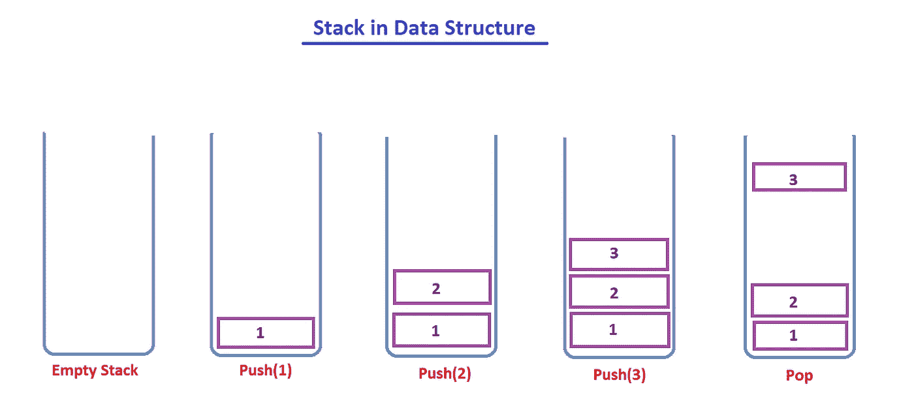

# 堆栈数据结构及其实现

> 原文：<https://blog.devgenius.io/stack-data-structure-and-its-implementation-65b093044409?source=collection_archive---------16----------------------->

## 易于理解的堆栈数据结构及其实现

堆栈是用于存储数据的简单数据结构。在堆栈中，数据到达的顺序很重要。自助餐厅里的一堆盘子就是一堆的好例子。清洗后，盘子被添加到堆叠中，并被放置在顶部。当需要一个盘子时，从盘子堆的顶部取出。放在堆叠上的第一个板是最后使用的板。

**定义:**栈是在一端完成插入和删除的有序列表，称为 top。最后插入的元素是第一个被删除的元素。因此，它被称为**后进先出(LIFO)** 或**后进先出(FILO)列表。**

可以对堆栈进行的两种更改有专门的名称。当一个元素被插入堆栈时，这个概念叫做 push，当一个元素被从堆栈中移除时，这个概念叫做 pop。试图弹出一个空堆栈被称为**下溢**，试图推入一个满堆栈中的元素被称为**上溢**。一般来说，我们将它们视为例外。

堆栈数据结构

**如何使用堆栈:**

考虑在办公室工作一天。让我们假设一个开发人员正在从事一个长期项目。然后，经理给开发人员一个更重要的新任务。开发人员将长期项目放在一边，开始新任务的工作。电话铃响了，这是最重要的事情，因为必须立即接听。开发人员将当前任务推入等待托盘，并接听电话。

当呼叫完成时，放弃接听电话的任务将从待处理托盘中检索出来，工作将继续进行。再接一个调用，可能必须以同样的方式处理，但最终新任务会完成，开发人员可以从待定托盘中取出长期项目并继续进行。

**直接应用:-**
符号平衡
中缀到后缀转换
后缀表达式求值
实现函数调用(包括递归)
Web 浏览器中的页面访问历史【后退按钮】
在文本编辑器中撤消序列
匹配 HTML 和 XML 中的标签
**间接应用:-**
其他算法的辅助数据结构(例如:树遍历算法)

# 堆栈的实现

实现堆栈的方法有很多，下面是常用的方法。

基于简单数组的实现
基于动态数组的实现
链表实现

stack ADT 的这个实现使用了一个数组。在数组中，我们从左到右添加元素，并使用一个变量来跟踪顶部元素的索引。存储堆栈元素的数组可能会变满。推送操作将抛出一个全栈异常。类似地，如果我们试图从空堆栈中删除一个元素，它将抛出 stack empty 异常。

在本文中，我们看到了使用简单数组实现堆栈。所以为了实现一个栈，我们使用类的概念，你也可以声明结构。首先创建一个名为“Stack”的类。我们知道，在堆栈中遍历有一个成员变量是“top”。声明栈顶的数据成员。

写完上面的代码后，我们必须给这段代码添加更多的功能，就像声明数组的大小，为什么是数组？因为我们使用数组来实现堆栈。在数组中我们插入和删除元素，在堆栈中也有相同的操作，但是我们称之为插入元素的 push 和删除元素的 pop。

现在我们讨论关于推送操作。推送操作意味着在堆栈上插入一个元素。在插入一个元素之前，我们必须检查堆栈是否已满，如果堆栈已满，那么就没有机会插入一个元素，所以可能会抛出一个异常。为了检查堆栈溢出，我们使用 isFull()函数，如果堆栈已满，该函数返回 true 值，否则返回 false。在栈顶插入元素之前，它首先增加栈顶，因为我们将 top 值初始化为“-1”，你也可以将 top 值声明为“0”。**让我们看看推送操作的代码片段:**

上面的代码显示 push()函数从用户那里获取一个参数，这个参数就是你想要添加到堆栈中的值。Pop()操作不接受任何参数，因为它是一个删除操作，它从栈顶删除元素。在执行删除操作后，它递减 top 的值。在执行删除操作之前，我们必须检查堆栈是否为空，如果为空，则是下溢的情况，在这种情况下，如果我们从堆栈顶部删除一个元素。**让我们看看 pop 操作的代码片段:**

现在我们看到函数 peek。Peek 只是返回元素的顶部，所以我们可以看到上次插入的值。Size 函数返回堆栈的当前大小，表示你插入了多少个元素。是时候看看完整的代码了:

**空间复杂度(针对 n 次推送操作):-**O(n)
**Push 的时间复杂度():-**O(1)
**Pop 的时间复杂度():-**O(1)
**Size 的时间复杂度():-**O(1)
**peek 的时间复杂度():-** O(1)

我们定义了一个宏，即容量，它代表堆栈的容量。

**限制:-**
必须首先定义堆栈的最大大小，并且不能更改。尝试将新元素推入完整的堆栈会导致特定于实现的异常。同样，在 pop 操作中，我们看到我们实际上并没有删除元素，我们只是减少了顶部的元素。